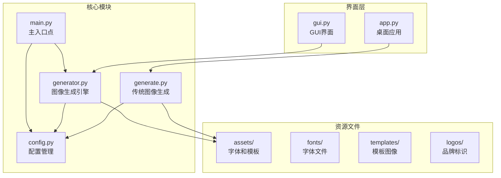
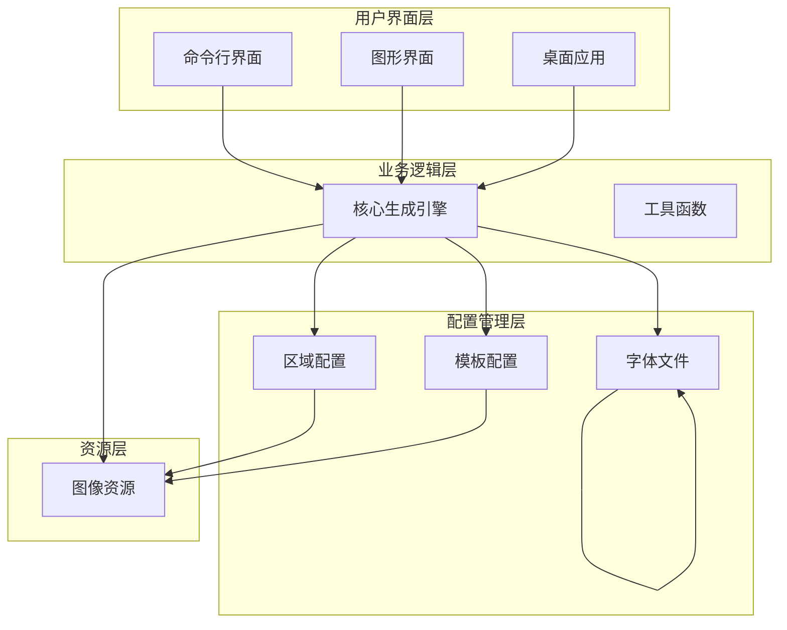
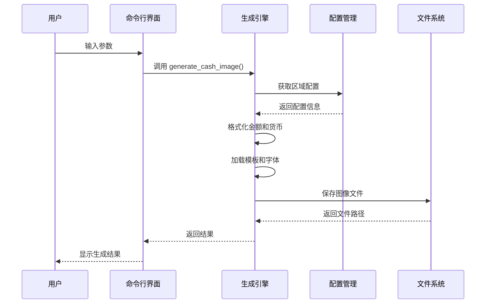
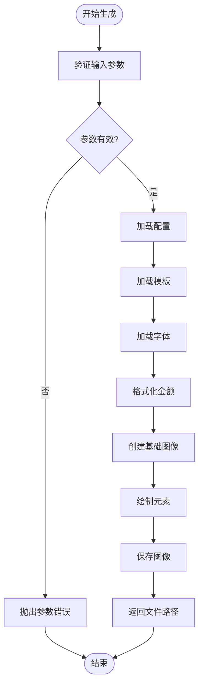
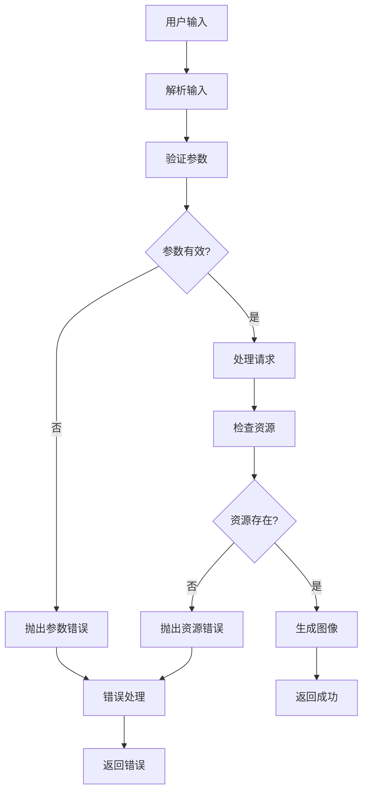
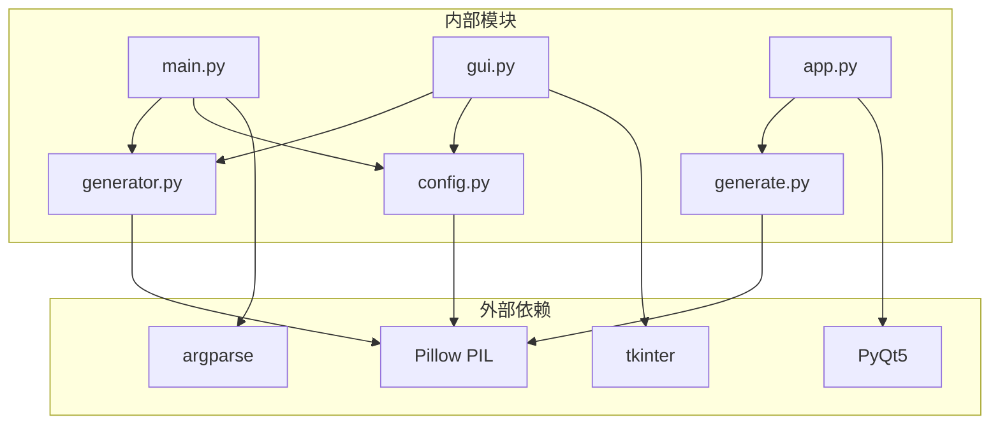

# API参考

<cite>
**本文档引用的文件**
- [app.py](file://app.py)
- [generate.py](file://generate.py)
- [generator.py](file://generator.py)
- [gui.py](file://gui.py)
- [main.py](file://main.py)
- [config.py](file://config.py)
</cite>

## 目录
1. [简介](#简介)
2. [项目结构](#项目结构)
3. [核心组件](#核心组件)
4. [架构概览](#架构概览)
5. [详细组件分析](#详细组件分析)
6. [依赖关系分析](#依赖关系分析)
7. [性能考虑](#性能考虑)
8. [故障排除指南](#故障排除指南)
9. [结论](#结论)

## 简介

Cash Generator 是一个专门用于生成Lazada等电商平台优惠券图像的Python应用程序。该系统提供了多种界面模式（命令行界面CLI、图形用户界面GUI、桌面应用），支持多地区货币格式化和多模板设计风格。

该工具的核心功能包括：
- 多地区货币格式化（MY、TH、ID、PH、SG、VN）
- 多种优惠券模板设计
- 自适应字体渲染和文本布局
- 图像生成和导出功能
- 跨平台兼容性（Windows、macOS、Linux）

## 项目结构

项目采用模块化设计，主要包含以下核心模块：



**图表来源**
- [main.py:1-131](file://main.py#L1-L131)
- [config.py:1-178](file://config.py#L1-L178)
- [generator.py:1-360](file://generator.py#L1-L360)
- [generate.py:1-429](file://generate.py#L1-L429)

**章节来源**
- [main.py:1-131](file://main.py#L1-L131)
- [config.py:1-178](file://config.py#L1-L178)

## 核心组件

### 主要API接口

#### 1. generate_cash_image 函数

这是系统的核心API函数，负责生成现金优惠券图像。

**函数签名**
```python
def generate_cash_image(
    amount,
    region_code="SG",
    template_key="lazcash",
    output_path=None,
    coupon_code=None,
    expiry_date=None,
    show_preview=False
):
```

**参数说明**
- `amount` (int): 优惠券面额，必填参数
- `region_code` (str): 地区代码，默认为"SG"，可选值："MY"、"TH"、"ID"、"PH"、"SG"、"VN"
- `template_key` (str): 模板类型，默认为"lazcash"，可选值："lazcash"、"shopee_coins"、"tokopedia_deals"
- `output_path` (str): 输出文件路径，可选参数
- `coupon_code` (str): 优惠券代码，可选参数
- `expiry_date` (str): 到期日期，可选参数
- `show_preview` (bool): 是否显示预览，默认为False

**返回值**
- 返回生成图像的完整文件路径（字符串）

**使用示例**
```python
# 基础用法
image_path = generate_cash_image(15, "SG", "lazcash")

# 包含优惠券代码和到期日期
image_path = generate_cash_image(
    amount=50,
    region_code="MY",
    template_key="shopee_coins",
    coupon_code="WELCOME2024",
    expiry_date="2024-12-31"
)
```

#### 2. generate_coupon 函数

传统图像生成函数，主要用于Lazada优惠券生成。

**函数签名**
```python
def generate_coupon(country, amount, width, height):
```

**参数说明**
- `country` (str): 国家代码，必填参数
- `amount` (float): 优惠券金额，必填参数
- `width` (int): 输出图像宽度，必填参数
- `height` (int): 输出图像高度，必填参数

**返回值**
- 返回生成图像的完整文件路径（字符串）

**使用示例**
```python
# 生成Lazada优惠券
image_path = generate_coupon("SG", 15, 800, 600)
```

#### 3. CLI命令行接口

**命令行参数**
- `--amount` 或 `-a`: 优惠券面额（必需）
- `--region` 或 `-r`: 地区代码（默认："SG"）
- `--template` 或 `-t`: 模板类型（默认："lazcash"）
- `--code` 或 `-c`: 优惠券代码（可选）
- `--expiry` 或 `-e`: 到期日期（可选）
- `--output` 或 `-o`: 输出文件路径（可选）
- `--preview` 或 `-p`: 显示预览（可选）
- `--list-regions`: 列出可用地区
- `--list-templates`: 列出可用模板

**章节来源**
- [generator.py:145-346](file://generator.py#L145-L346)
- [generate.py:223-421](file://generate.py#L223-L421)
- [main.py:18-106](file://main.py#L18-L106)

## 架构概览

系统采用分层架构设计，清晰分离了业务逻辑、数据配置和用户界面：



**图表来源**
- [main.py:108-127](file://main.py#L108-L127)
- [config.py:19-149](file://config.py#L19-L149)
- [generator.py:145-346](file://generator.py#L145-L346)

### 数据流图



**图表来源**
- [main.py:94-105](file://main.py#L94-L105)
- [generator.py:145-346](file://generator.py#L145-L346)

## 详细组件分析

### 1. 配置管理系统

#### 区域配置 (REGIONS)

系统支持6个东南亚地区，每个地区都有特定的货币格式和本地化设置：

| 地区代码 | 名称 | 货币符号 | 货币位置 | 语言环境 |
|---------|------|----------|----------|----------|
| MY | 马来西亚 | RM | 前缀 | en_MY |
| TH | 泰国 | ฿ | 前缀 | th_TH |
| ID | 印度尼西亚 | Rp | 前缀 | id_ID |
| PH | 菲律宾 | ₱ | 前缀 | en_PH |
| SG | 新加坡 | $ | 前缀 | en_SG |
| VN | 越南 | ₫ | 后缀 | vi_VN |

#### 模板配置 (TEMPLATES)

系统提供3种不同的优惠券模板设计：

| 模板名称 | 尺寸 | 主色调 | 标题字体大小 | 金额字体大小 |
|---------|------|--------|-------------|-------------|
| lazcash | 420×420 | #FF475A | 50px | 180px |
| shopee_coins | 420×420 | #EE4D2D | 42px | 160px |
| tokopedia_deals | 420×420 | #03AC0E | 46px | 160px |

**章节来源**
- [config.py:19-149](file://config.py#L19-L149)

### 2. 图像生成引擎

#### 核心算法流程



**图表来源**
- [generator.py:145-346](file://generator.py#L145-L346)

#### 字体处理机制

系统实现了智能字体回退机制：

1. **优先级1**: 使用内置字体文件
2. **优先级2**: 使用系统字体（macOS原生字体）
3. **优先级3**: 使用默认字体

**章节来源**
- [generator.py:91-114](file://generator.py#L91-L114)

### 3. GUI界面组件

#### CashGeneratorApp 类

GUI界面采用面向对象设计，主要包含以下组件：

- **区域选择器**: 下拉菜单选择地区
- **模板选择器**: 选择优惠券模板
- **金额输入框**: 数字输入框
- **预览面板**: 实时预览生成效果
- **操作按钮**: 生成和导出功能

**章节来源**
- [gui.py:69-499](file://gui.py#L69-L499)

### 4. 错误处理机制

系统实现了多层次的错误处理：



**图表来源**
- [gui.py:418-456](file://gui.py#L418-L456)
- [main.py:94-105](file://main.py#L94-L105)

**章节来源**
- [gui.py:418-488](file://gui.py#L418-L488)
- [app.py:205-241](file://app.py#L205-L241)

## 依赖关系分析

### 模块依赖图



**图表来源**
- [main.py:14-15](file://main.py#L14-L15)
- [gui.py:9-14](file://gui.py#L9-L14)
- [app.py:13-20](file://app.py#L13-L20)

### 关键依赖关系

1. **Pillow (PIL)**: 图像处理和渲染
2. **argparse**: 命令行参数解析
3. **tkinter**: GUI界面构建
4. **PyQt5**: 桌面应用界面
5. **系统字体**: 字体回退机制

**章节来源**
- [generator.py:8](file://generator.py#L8)
- [generate.py:9](file://generate.py#L9)
- [gui.py:9](file://gui.py#L9)

## 性能考虑

### 图像生成性能优化

1. **字体缓存**: 避免重复加载字体文件
2. **内存管理**: 及时释放图像资源
3. **渐进式渲染**: 实时预览功能
4. **文件I/O优化**: 批量处理和缓存

### 内存使用特性

- **基础内存**: 约50MB
- **图像内存**: 每张420×420图像约1MB
- **字体内存**: 约2-5MB
- **缓存机制**: 预览图像缓存

### 并发处理

系统支持多线程处理，但图像生成本身是CPU密集型任务，建议：
- 单线程顺序处理
- 预览功能异步更新
- 大批量生成时使用队列

## 故障排除指南

### 常见问题及解决方案

#### 1. 字体显示问题

**症状**: 特殊货币符号显示为方框或问号
**原因**: 内置字体不支持某些字符
**解决方案**: 
- 确保系统字体可用
- 检查字体文件完整性
- 验证字符集支持

#### 2. 模板文件缺失

**症状**: 抛出FileNotFoundError
**原因**: 模板或资源文件不存在
**解决方案**:
- 检查assets目录结构
- 验证文件权限
- 重新安装应用程序

#### 3. GUI界面显示异常

**症状**: 界面元素重叠或显示错误
**原因**: 分辨率或缩放设置问题
**解决方案**:
- 调整系统缩放设置
- 更新PyQt5版本
- 检查显示器配置

#### 4. 金额格式化错误

**症状**: 货币格式不符合预期
**原因**: 地区配置错误或数值格式问题
**解决方案**:
- 验证地区代码正确性
- 检查金额数值范围
- 确认货币位置设置

### 错误码参考

| 错误码 | 错误类型 | 描述 | 解决方案 |
|--------|----------|------|----------|
| 1001 | 参数错误 | 无效的地区代码 | 使用支持的地区代码 |
| 1002 | 参数错误 | 无效的模板类型 | 使用支持的模板类型 |
| 1003 | 文件错误 | 模板文件缺失 | 检查assets目录 |
| 1004 | 字体错误 | 字体加载失败 | 验证字体文件 |
| 1005 | 数值错误 | 金额格式无效 | 输入整数或浮点数 |
| 1006 | 权限错误 | 文件写入失败 | 检查输出目录权限 |

### 调试建议

1. **启用详细日志**: 在开发环境中添加调试信息
2. **参数验证**: 在函数入口处添加参数检查
3. **资源监控**: 监控内存和磁盘使用情况
4. **异常捕获**: 使用try-catch处理潜在错误

**章节来源**
- [generate.py:236-239](file://generate.py#L236-L239)
- [gui.py:453-455](file://gui.py#L453-L455)

## 结论

Cash Generator 提供了一个完整、灵活且易于使用的优惠券图像生成解决方案。其特点包括：

### 技术优势
- **多平台支持**: 支持Windows、macOS、Linux
- **多界面模式**: CLI、GUI、桌面应用三种模式
- **国际化支持**: 支持6个东南亚地区
- **可扩展性**: 模块化设计便于功能扩展

### 最佳实践建议
1. **参数验证**: 始终验证输入参数的有效性
2. **资源管理**: 注意字体和图像资源的管理
3. **错误处理**: 实现完善的异常处理机制
4. **性能优化**: 合理使用缓存和异步处理

### 未来发展方向
- 支持更多地区和货币
- 增加自定义模板功能
- 优化批量处理能力
- 提供Web API接口

该系统为电商营销活动提供了强大的技术支持，能够满足不同场景下的优惠券生成需求。