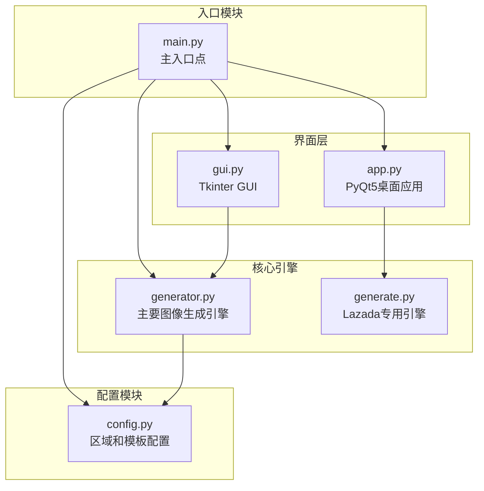
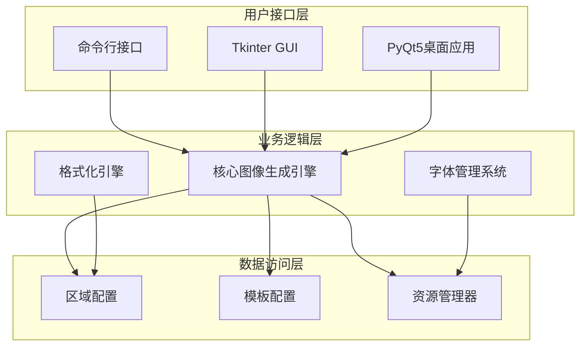
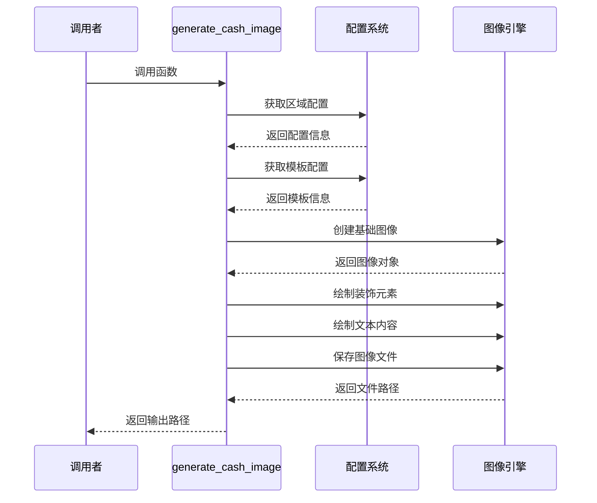
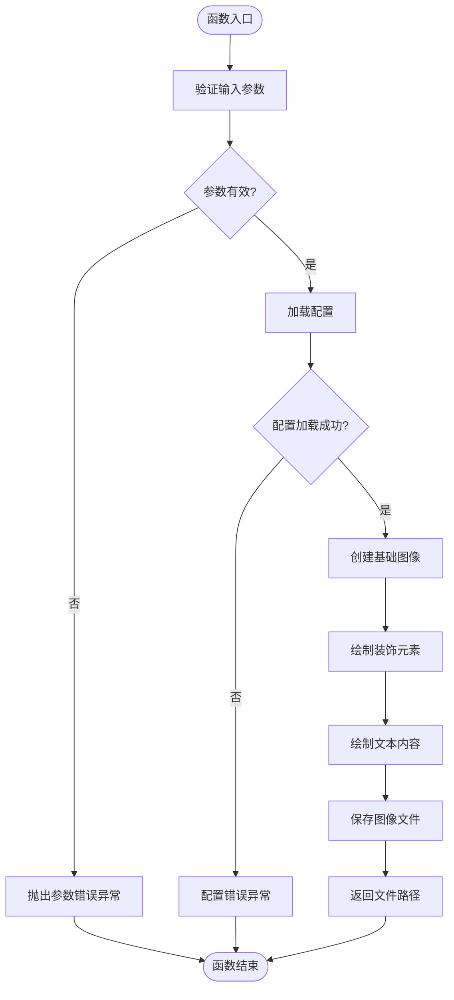
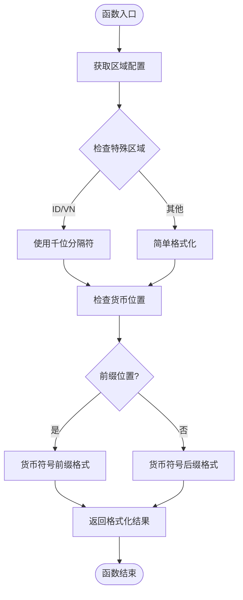
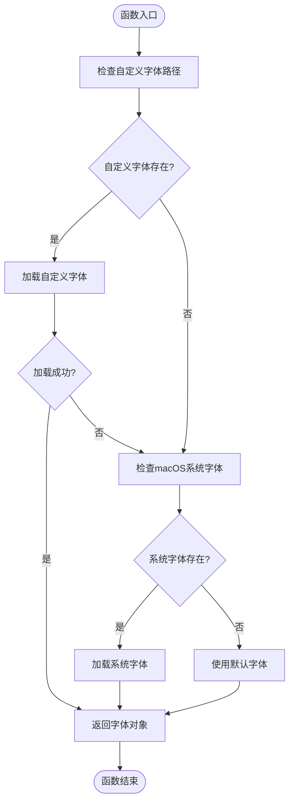
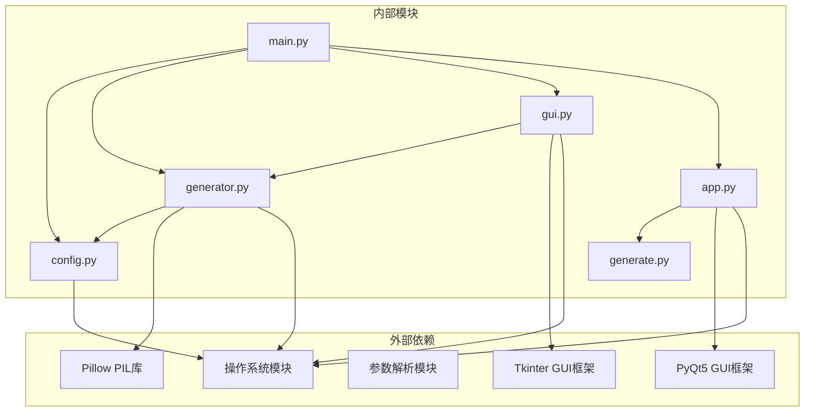

# API接口参考

<cite>
**本文档引用的文件**
- [main.py](file://src/main.py)
- [config.py](file://src/config.py)
- [generator.py](file://src/generator.py)
- [gui.py](file://src/gui.py)
- [app.py](file://src/app.py)
- [generate.py](file://src/generate.py)
</cite>

## 目录
1. [简介](#简介)
2. [项目结构](#项目结构)
3. [核心组件](#核心组件)
4. [架构概览](#架构概览)
5. [详细组件分析](#详细组件分析)
6. [依赖关系分析](#依赖关系分析)
7. [性能考虑](#性能考虑)
8. [故障排除指南](#故障排除指南)
9. [结论](#结论)
10. [附录](#附录)

## 简介

Cash Coupon Generator 是一个多功能的现金券图像生成工具，支持多个东南亚电商平台的促销券生成。该工具提供了多种界面模式（命令行、GUI、桌面应用），支持多地区货币格式化、自定义模板和丰富的视觉效果。

## 项目结构

项目采用模块化设计，主要包含以下核心模块：



**图表来源**
- [main.py:1-131](file://src/main.py#L1-L131)
- [config.py:1-178](file://src/config.py#L1-L178)
- [generator.py:1-360](file://src/generator.py#L1-L360)
- [generate.py:1-429](file://src/generate.py#L1-L429)

**章节来源**
- [main.py:1-131](file://src/main.py#L1-L131)
- [config.py:1-178](file://src/config.py#L1-L178)

## 核心组件

### 主要API函数

系统提供了两个主要的图像生成API：

1. **generate_cash_image()** - 主要的现金券生成函数
2. **generate_coupon()** - Lazada专用的优惠券生成函数

### 配置管理

系统通过config.py集中管理所有配置信息，包括：
- 区域设置（货币、语言、颜色方案）
- 模板配置（尺寸、颜色、字体设置）
- 输出设置（目录、格式、质量）

**章节来源**
- [generator.py:145-346](file://src/generator.py#L145-L346)
- [generate.py:223-421](file://src/generate.py#L223-L421)
- [config.py:16-178](file://src/config.py#L16-L178)

## 架构概览

系统采用分层架构设计，实现了清晰的关注点分离：



**图表来源**
- [main.py:18-127](file://src/main.py#L18-L127)
- [generator.py:145-346](file://src/generator.py#L145-L346)
- [config.py:16-178](file://src/config.py#L16-L178)

## 详细组件分析

### generate_cash_image 函数详解

#### 函数签名和参数



**图表来源**
- [generator.py:145-346](file://src/generator.py#L145-L346)

#### 参数详细说明

| 参数名 | 类型 | 必需 | 默认值 | 描述 |
|--------|------|------|--------|------|
| amount | int | 是 | 无 | 折扣金额数值 |
| region_code | str | 否 | "SG" | 区域代码（MY, TH, ID, PH, SG, VN） |
| template_key | str | 否 | "lazcash" | 模板样式键值 |
| output_path | str | 否 | None | 输出文件路径 |
| coupon_code | str | 否 | None | 可选的优惠券代码 |
| expiry_date | str | 否 | None | 可选的有效期文本 |
| show_preview | bool | 否 | False | 是否显示预览 |

#### 返回值规范

- **类型**: str
- **内容**: 生成图像文件的完整路径
- **格式**: PNG文件路径

#### 异常处理机制

函数实现了多层次的异常处理：



**图表来源**
- [generator.py:145-346](file://src/generator.py#L145-L346)

**章节来源**
- [generator.py:145-346](file://src/generator.py#L145-L346)

### format_amount 函数详解

#### 功能概述

format_amount 函数负责根据指定区域格式化货币金额，支持多种货币位置和千位分隔符。

#### 格式化逻辑



**图表来源**
- [generator.py:126-143](file://src/generator.py#L126-L143)

#### 特殊区域处理

| 区域代码 | 货币符号 | 千位分隔符 | 货币位置 | 特殊规则 |
|----------|----------|------------|----------|----------|
| ID | Rp | "." | 前缀 | 使用千位分隔符 |
| VN | ₫ | "." | 后缀 | 使用千位分隔符 |
| MY | RM | "," | 前缀 | 标准格式 |
| TH | ฿ | "," | 前缀 | 标准格式 |
| PH | ₱ | "," | 前缀 | 标准格式 |
| SG | $ | "," | 前缀 | 标准格式 |

**章节来源**
- [generator.py:126-143](file://src/generator.py#L126-L143)

### get_font 函数详解

#### 字体加载策略

get_font 函数实现了智能的字体加载策略，确保在不同环境下都能正确显示文本：



**图表来源**
- [generator.py:91-115](file://src/generator.py#L91-L115)

#### 字体优先级

1. **自定义字体** - 优先使用配置中指定的字体路径
2. **macOS系统字体** - 依次尝试 Arial Bold、Helvetica、PingFang等
3. **默认字体** - 最终回退到PIL默认字体

**章节来源**
- [generator.py:91-115](file://src/generator.py#L91-L115)

### 辅助函数详解

#### 颜色处理函数

##### hex_to_rgb 函数
- **功能**: 将十六进制颜色值转换为RGB元组
- **输入**: "#RRGGBB" 格式的字符串
- **输出**: (R, G, B) 元组
- **用途**: 颜色值的统一处理

##### interpolate_color 函数
- **功能**: 在两个RGB颜色之间进行插值
- **输入**: 起始颜色、结束颜色、插值因子
- **输出**: 插值后的RGB颜色
- **用途**: 渐变色生成的基础算法

#### 图形绘制函数

##### create_gradient 函数
- **功能**: 创建线性渐变图像
- **输入**: 宽度、高度、起始颜色、结束颜色、角度
- **输出**: 渐变图像对象
- **算法**: 基于角度投影的线性插值

##### draw_rounded_rectangle 函数
- **功能**: 绘制圆角矩形
- **输入**: 绘图对象、坐标、半径、填充色、描边色
- **输出**: 绘制完成的图形
- **算法**: 结合矩形主体和圆弧边缘

**章节来源**
- [generator.py:14-115](file://src/generator.py#L14-L115)

## 依赖关系分析

系统采用松耦合的设计，主要依赖关系如下：



**图表来源**
- [main.py:14-15](file://src/main.py#L14-L15)
- [generator.py:8](file://src/generator.py#L8)
- [gui.py:9-11](file://src/gui.py#L9-L11)
- [app.py:13-18](file://src/app.py#L13-L18)

**章节来源**
- [main.py:14-15](file://src/main.py#L14-L15)
- [generator.py:8](file://src/generator.py#L8)

## 性能考虑

### 图像生成性能

1. **字体缓存**: 字体对象在内存中缓存，避免重复加载
2. **渐变优化**: 使用高效的像素级渐变算法
3. **内存管理**: 及时释放中间图像对象，防止内存泄漏
4. **批量处理**: 支持命令行批量生成模式

### 字体加载优化

1. **延迟加载**: 仅在需要时加载字体文件
2. **优先级策略**: 按优先级顺序尝试字体源
3. **错误恢复**: 快速失败和优雅降级

### 内存使用优化

- **图像尺寸控制**: 自动调整图像尺寸以适应目标区域
- **渐变遮罩**: 使用遮罩技术减少内存占用
- **临时文件管理**: 合理管理预览和临时文件

## 故障排除指南

### 常见问题及解决方案

#### 字体显示问题

**症状**: 文本显示为方块或问号
**原因**: 系统缺少特定字体或字体损坏
**解决方案**:
1. 检查字体文件是否存在
2. 验证字体文件完整性
3. 使用系统字体作为回退选项

#### 图像生成失败

**症状**: 生成过程中抛出异常
**可能原因**:
- 缺少必要的配置文件
- 权限不足导致无法写入输出目录
- 内存不足

**解决步骤**:
1. 验证配置文件完整性
2. 检查输出目录权限
3. 关闭其他占用内存的应用程序

#### GUI界面问题

**症状**: 界面显示异常或响应缓慢
**原因**: 
- 颜色主题不匹配
- 字体渲染问题
- 系统兼容性问题

**修复方法**:
1. 更新系统字体
2. 调整颜色主题设置
3. 重新安装应用程序

**章节来源**
- [gui.py:17-29](file://src/gui.py#L17-L29)
- [generator.py:91-115](file://src/generator.py#L91-L115)

## 结论

Cash Coupon Generator 提供了一个功能完整、易于使用的现金券图像生成解决方案。其模块化设计使得功能扩展变得简单，而完善的异常处理机制确保了系统的稳定性。

该工具的主要优势包括：
- 多平台支持（macOS、Windows、Linux）
- 多区域货币格式化
- 灵活的模板系统
- 多种用户界面选项
- 良好的性能表现

## 附录

### API版本兼容性

系统遵循向后兼容原则，主要版本变更包括：

- **版本1.x**: 初始发布，支持基本功能
- **版本2.x**: 增加多模板支持和改进的GUI
- **版本3.x**: 新增Lazada专用引擎和增强的字体处理

### 迁移指南

#### 从1.x到2.x迁移

1. 更新导入语句，使用新的模块结构
2. 检查配置文件格式变化
3. 验证新模板的使用方式

#### 从2.x到3.x迁移

1. 新增对Lazada专用函数的支持
2. 更新字体加载策略
3. 检查API参数的微小变化

### 使用示例

#### 基本命令行使用

```bash
# 生成默认设置的现金券
python main.py --amount 15 --region SG

# 生成带优惠券代码的现金券
python main.py --amount 50 --region MY --code WELCOME2024

# 使用自定义模板
python main.py --amount 100 --template shopee_coins
```

#### Python API使用

```python
from src.generator import generate_cash_image

# 生成标准现金券
path = generate_cash_image(
    amount=25,
    region_code="SG",
    template_key="lazcash"
)

# 生成带额外信息的现金券
path = generate_cash_image(
    amount=50,
    region_code="VN",
    template_key="tokopedia_deals",
    coupon_code="SAVE2024",
    expiry_date="2024-12-31"
)
```