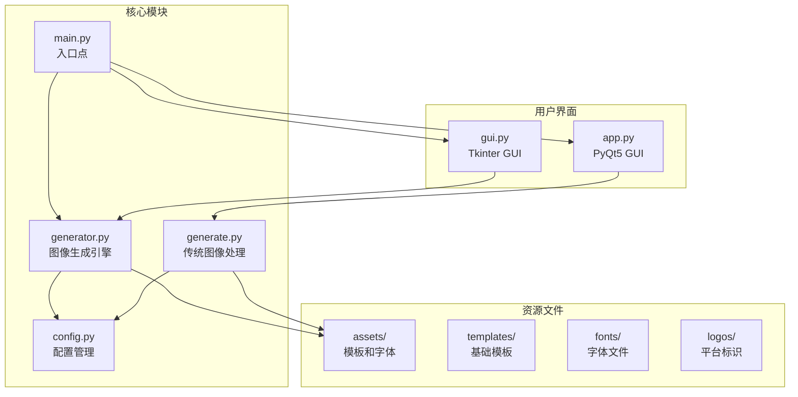
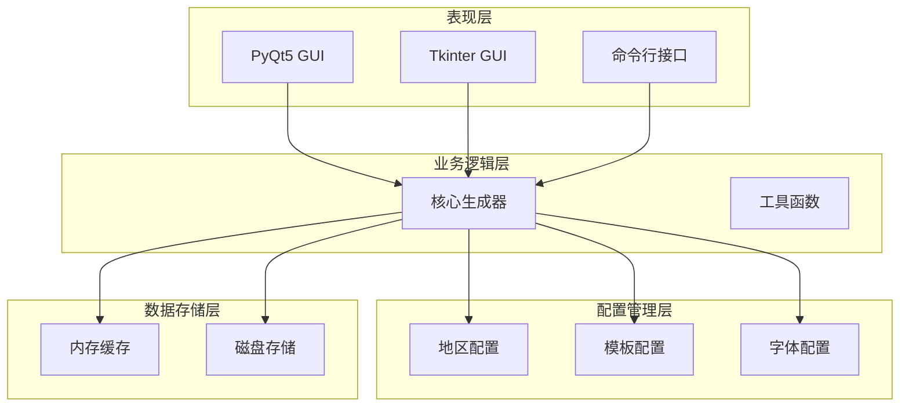
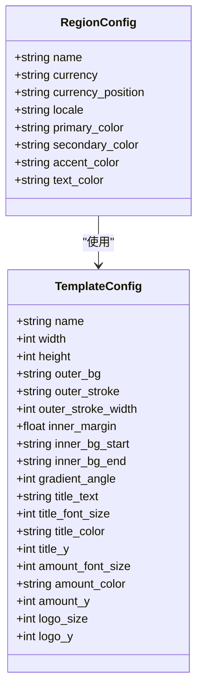
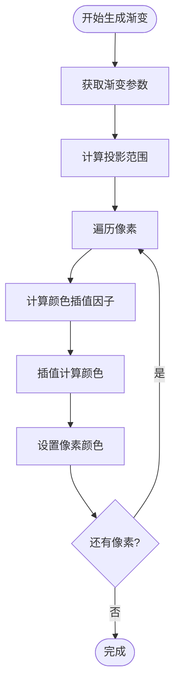
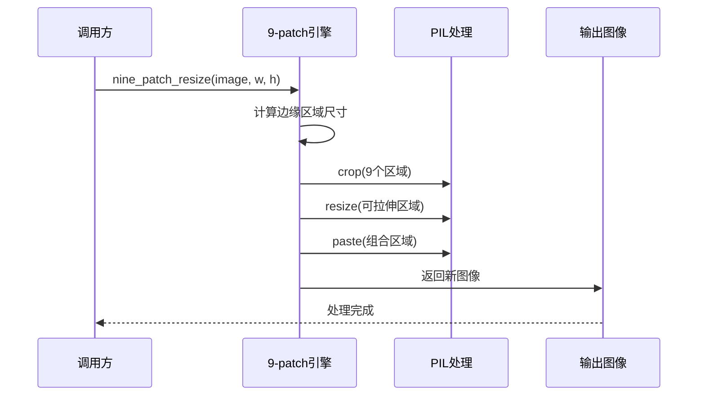
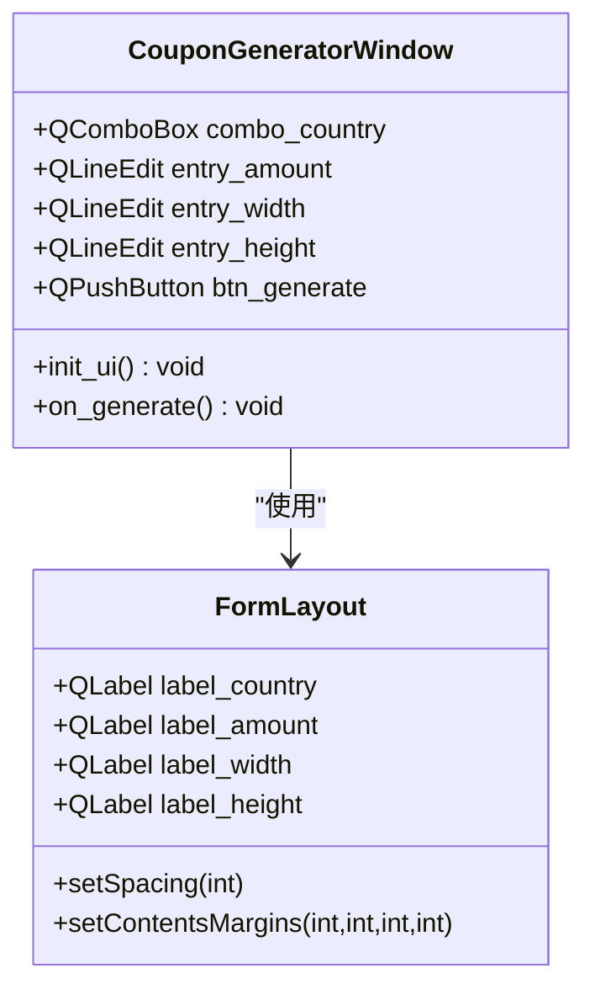
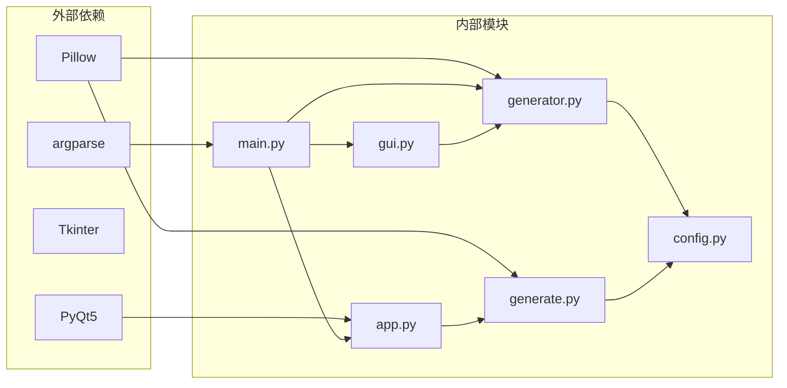

# 开发者指南

<cite>
**本文档引用的文件**
- [app.py](file://src/app.py)
- [config.py](file://src/config.py)
- [generate.py](file://src/generate.py)
- [generator.py](file://src/generator.py)
- [gui.py](file://src/gui.py)
- [main.py](file://src/main.py)
</cite>

## 目录
1. [简介](#简介)
2. [项目结构](#项目结构)
3. [核心组件](#核心组件)
4. [架构概览](#架构概览)
5. [详细组件分析](#详细组件分析)
6. [依赖关系分析](#依赖关系分析)
7. [性能考虑](#性能考虑)
8. [故障排除指南](#故障排除指南)
9. [结论](#结论)
10. [附录](#附录)

## 简介

这是一个多地区现金券生成器项目，支持多个电商平台的优惠券模板生成。项目提供了三种不同的实现方式：基于PyQt5的现代化GUI界面、基于Tkinter的传统GUI界面，以及命令行接口。该系统能够根据不同的地区配置生成符合当地货币格式和视觉风格的优惠券图像。

## 项目结构

项目采用模块化设计，主要包含以下核心模块：

**图表来源**
- [main.py:1-131](file://src/main.py#L1-L131)
- [config.py:1-178](file://src/config.py#L1-L178)

**章节来源**
- [main.py:1-131](file://src/main.py#L1-L131)
- [config.py:1-178](file://src/config.py#L1-L178)

## 核心组件

### 配置管理系统

配置系统负责管理多地区的货币格式、模板参数和字体设置：

- **地区配置**：支持马来西亚(MY)、泰国(TH)、印度尼西亚(ID)、菲律宾(PH)、新加坡(SG)、越南(VN)
- **模板配置**：提供LazCash、Shopee Coins、Tokopedia Deals三种模板
- **字体管理**：自动检测系统字体并提供回退机制

### 图像生成引擎

系统包含两个主要的图像生成引擎：

1. **现代引擎** (`generator.py`)：基于PIL的完整图像合成系统
2. **传统引擎** (`generate.py`)：基于9-patch缩放的简化版本

### 用户界面层

提供两种用户界面选项：
- **PyQt5界面**：现代化跨平台GUI
- **Tkinter界面**：传统但稳定的桌面应用

**章节来源**
- [config.py:15-178](file://src/config.py#L15-L178)
- [generator.py:145-346](file://src/generator.py#L145-L346)
- [generate.py:223-421](file://src/generate.py#L223-L421)

## 架构概览

系统采用分层架构设计，清晰分离了配置管理、业务逻辑和用户界面：

**图表来源**
- [main.py:108-127](file://src/main.py#L108-L127)
- [generator.py:14-115](file://src/generator.py#L14-L115)

## 详细组件分析

### 配置管理模块 (config.py)

配置模块是整个系统的基础设施，负责管理所有静态配置信息：

#### 地区配置结构

**图表来源**
- [config.py:19-80](file://src/config.py#L19-L80)
- [config.py:85-149](file://src/config.py#L85-L149)

#### 字体管理策略
配置系统实现了多层次的字体加载策略：
1. 应用内字体资源
2. 系统字体检测
3. 回退字体机制

**章节来源**
- [config.py:154-171](file://src/config.py#L154-L171)

### 图像生成引擎 (generator.py)

现代图像生成引擎提供了完整的图像合成功能：

#### 渐变背景生成算法

**图表来源**
- [generator.py:28-60](file://src/generator.py#L28-L60)

#### 圆角矩形绘制算法
引擎实现了自定义的圆角矩形绘制函数，支持复杂的轮廓效果：

**章节来源**
- [generator.py:63-89](file://src/generator.py#L63-L89)
- [generator.py:28-60](file://src/generator.py#L28-L60)

### 传统图像处理引擎 (generate.py)

传统引擎专注于特定的9-patch缩放和文本布局：

#### 9-patch缩放算法

**图表来源**
- [generate.py:155-214](file://src/generate.py#L155-L214)

#### 自适应字体大小算法
引擎实现了二分搜索算法来找到最佳的字体大小：

**章节来源**
- [generate.py:281-324](file://src/generate.py#L281-L324)
- [generate.py:155-214](file://src/generate.py#L155-L214)

### PyQt5 GUI界面 (app.py)

PyQt5界面提供了现代化的用户体验：

#### 主窗口架构

**图表来源**
- [app.py:23-242](file://src/app.py#L23-L242)

#### 事件处理流程
界面通过信号槽机制处理用户交互：

**章节来源**
- [app.py:205-242](file://src/app.py#L205-L242)

### Tkinter GUI界面 (gui.py)

Tkinter界面提供了跨平台兼容性：

#### 动态主题切换
界面支持macOS原生暗黑/明亮模式自动检测：

**章节来源**
- [gui.py:17-66](file://src/gui.py#L17-L66)

## 依赖关系分析

系统采用松耦合的设计，主要依赖关系如下：

**图表来源**
- [main.py:7-15](file://src/main.py#L7-L15)
- [generator.py:8-11](file://src/generator.py#L8-L11)

### 模块间交互模式

系统采用了多种设计模式：

#### 工厂模式
配置模块使用工厂模式来管理不同地区的配置：

#### 策略模式
图像生成引擎支持多种模板策略：

#### 观察者模式
GUI界面使用事件驱动的更新机制：

**章节来源**
- [config.py:19-80](file://src/config.py#L19-L80)
- [generator.py:145-346](file://src/generator.py#L145-L346)

## 性能考虑

### 图像处理优化

1. **内存管理**：及时释放PIL图像对象，避免内存泄漏
2. **缓存策略**：字体和模板图像的内存缓存
3. **批处理**：批量生成时复用资源

### 算法复杂度分析

- **9-patch缩放**：时间复杂度 O(w×h)，空间复杂度 O(w×h)
- **渐变生成**：时间复杂度 O(w×h)，空间复杂度 O(w×h)
- **字体适配**：二分搜索 O(log n)，其中 n 为字体大小范围

### 缓存机制

系统实现了多层次的缓存策略：
- 字体缓存：避免重复加载字体文件
- 模板缓存：重用已生成的模板图像
- 预览缓存：减少频繁的重新生成

## 故障排除指南

### 常见问题及解决方案

#### 字体加载失败
**症状**：特殊字符显示为方框
**解决方案**：检查系统字体安装，确保回退字体可用

#### 图像生成异常
**症状**：生成的图像质量差或显示不完整
**解决方案**：验证模板文件完整性，检查PIL版本兼容性

#### GUI界面显示问题
**症状**：界面元素显示异常或响应缓慢
**解决方案**：检查PyQt5/Tkinter安装，验证系统主题设置

### 调试技巧

1. **日志记录**：使用Python内置logging模块
2. **内存监控**：使用memory_profiler分析内存使用
3. **性能分析**：使用cProfile分析热点函数

**章节来源**
- [generate.py:228-241](file://src/generate.py#L228-L241)
- [gui.py:453-455](file://src/gui.py#L453-L455)

## 结论

这个现金券生成器项目展现了良好的软件工程实践，具有以下特点：

1. **模块化设计**：清晰的职责分离和接口定义
2. **多平台支持**：同时支持PyQt5和Tkinter界面
3. **国际化支持**：完整的多地区货币和语言支持
4. **性能优化**：高效的图像处理算法和缓存策略
5. **可扩展性**：灵活的配置系统和模板机制

项目为后续的功能扩展提供了坚实的基础，包括新的模板支持、更多地区配置、高级图像效果等。

## 附录

### 开发环境搭建

1. **Python版本**：推荐使用Python 3.8+
2. **依赖安装**：`pip install Pillow PyQt5`
3. **字体准备**：确保系统安装了必要的字体文件

### 扩展开发指南

#### 添加新地区支持
1. 在配置文件中添加地区配置
2. 准备相应的货币符号和格式规则
3. 测试本地化的显示效果

#### 添加新模板
1. 设计模板布局和视觉元素
2. 配置模板参数和颜色方案
3. 验证在不同分辨率下的显示效果

#### 性能优化建议
1. 实现更高效的图像处理算法
2. 添加异步处理支持
3. 优化内存使用和垃圾回收