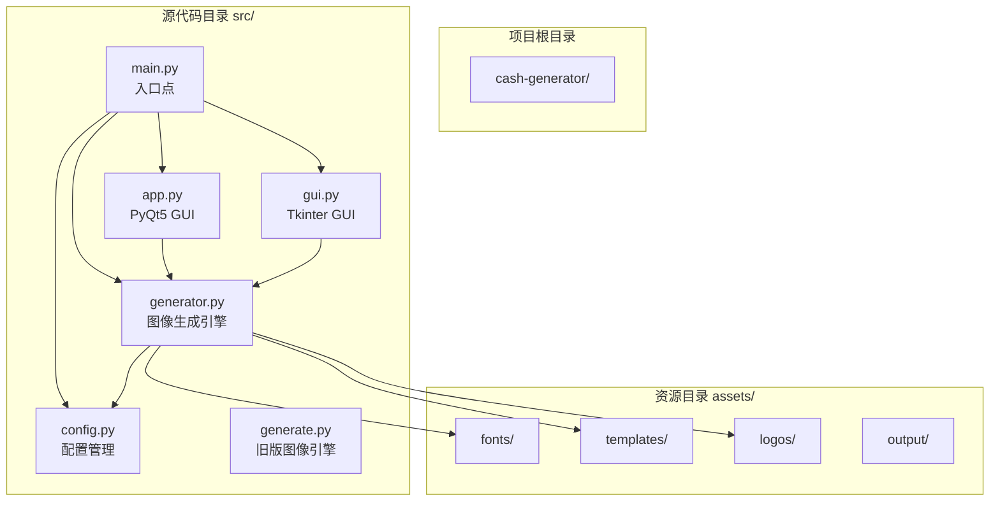
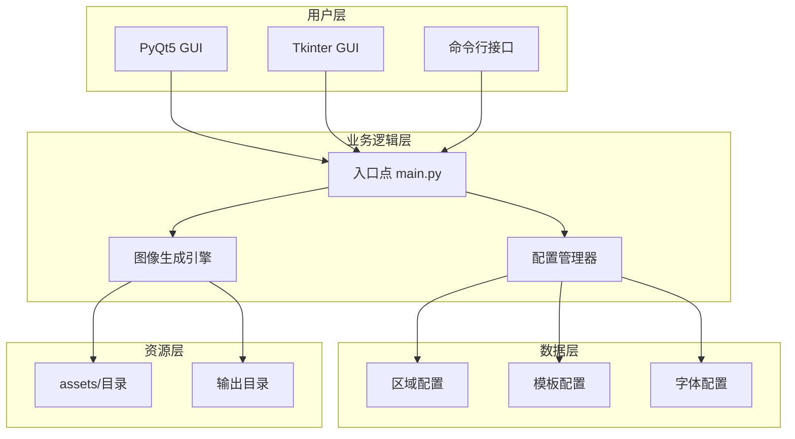
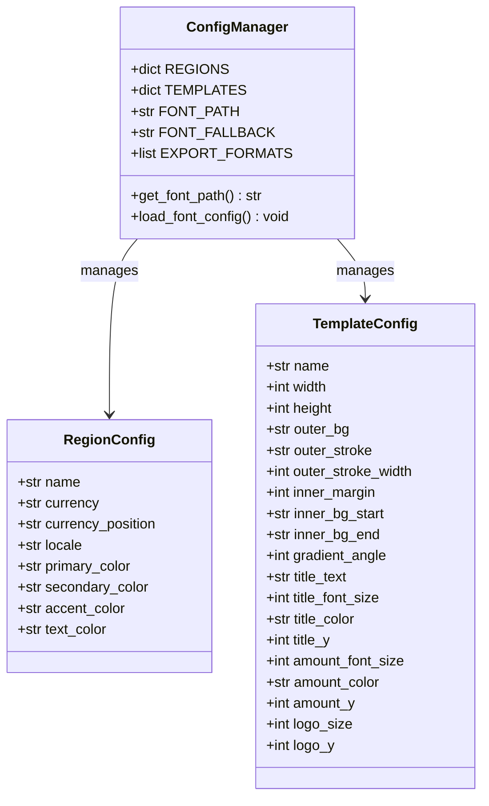
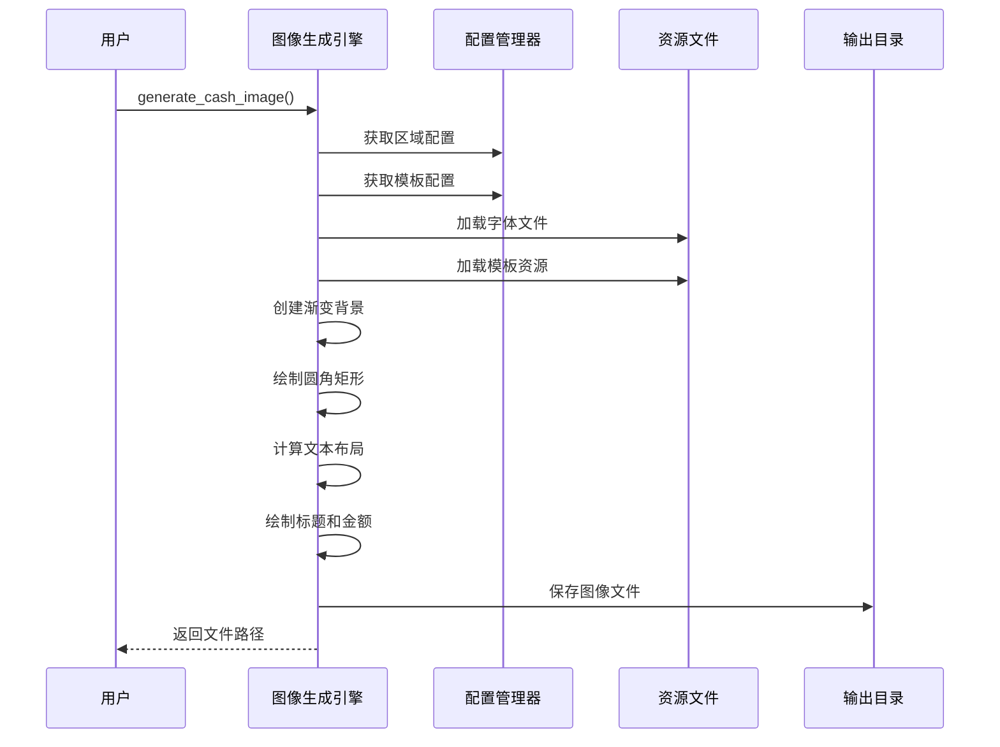
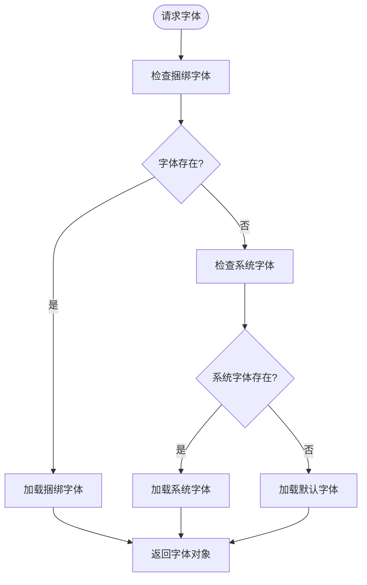
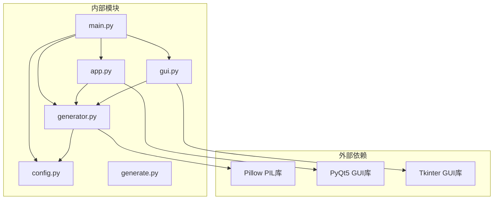

# 扩展开发指南

<cite>
**本文档引用的文件**
- [app.py](file://src/app.py)
- [config.py](file://src/config.py)
- [generate.py](file://src/generate.py)
- [generator.py](file://src/generator.py)
- [gui.py](file://src/gui.py)
- [main.py](file://src/main.py)
</cite>

## 目录
1. [简介](#简介)
2. [项目结构](#项目结构)
3. [核心组件](#核心组件)
4. [架构概览](#架构概览)
5. [详细组件分析](#详细组件分析)
6. [扩展开发指南](#扩展开发指南)
7. [依赖关系分析](#依赖关系分析)
8. [性能考虑](#性能考虑)
9. [故障排除指南](#故障排除指南)
10. [结论](#结论)

## 简介

这是一个多地区现金券生成器项目，支持多个东南亚电商平台的现金券模板生成。该项目提供了完整的扩展开发框架，允许开发者轻松添加新的区域支持、自定义模板、字体配置和图像生成引擎的扩展。

项目采用模块化设计，包含以下主要功能：
- 多区域货币格式化支持（MY、TH、ID、PH、SG、VN）
- 多模板样式支持（LazCash、Shopee Coins、Tokopedia Deals）
- 图像生成引擎，支持自适应缩放和字体渲染
- 跨平台GUI界面（PyQt5和Tkinter两种实现）
- 命令行接口支持

## 项目结构



**图表来源**
- [main.py:1-131](file://src/main.py#L1-L131)
- [config.py:1-178](file://src/config.py#L1-L178)

**章节来源**
- [main.py:1-131](file://src/main.py#L1-L131)
- [config.py:1-178](file://src/config.py#L1-L178)

## 核心组件

### 配置管理系统

配置系统是整个应用的核心，负责管理区域设置、模板配置和字体设置。

**关键特性：**
- 区域配置：支持6个东南亚国家的货币格式、语言环境和视觉样式
- 模板配置：定义不同品牌模板的尺寸规格和颜色方案
- 字体配置：提供字体文件路径和回退机制

**章节来源**
- [config.py:16-178](file://src/config.py#L16-L178)

### 图像生成引擎

图像生成引擎负责创建最终的现金券图像，支持多种模板样式和自适应布局。

**核心功能：**
- 渐变背景生成
- 圆角矩形绘制
- 自适应文本布局
- 多种模板样式支持

**章节来源**
- [generator.py:145-346](file://src/generator.py#L145-L346)

### 用户界面系统

提供两种不同的用户界面实现：

1. **PyQt5 GUI** (`app.py`)
   - 现代化的桌面应用程序界面
   - 支持macOS原生外观
   - 实时预览功能

2. **Tkinter GUI** (`gui.py`)
   - 跨平台桌面应用程序
   - 深色/浅色模式自动检测
   - 快速金额按钮

**章节来源**
- [app.py:23-269](file://src/app.py#L23-L269)
- [gui.py:69-499](file://src/gui.py#L69-L499)

## 架构概览



**图表来源**
- [main.py:18-127](file://src/main.py#L18-L127)
- [config.py:16-178](file://src/config.py#L16-L178)
- [generator.py:145-346](file://src/generator.py#L145-L346)

## 详细组件分析

### 配置系统架构



**图表来源**
- [config.py:19-149](file://src/config.py#L19-L149)

**章节来源**
- [config.py:19-149](file://src/config.py#L19-L149)

### 图像生成流程



**图表来源**
- [generator.py:145-346](file://src/generator.py#L145-L346)
- [config.py:16-178](file://src/config.py#L16-L178)

**章节来源**
- [generator.py:145-346](file://src/generator.py#L145-L346)

## 扩展开发指南

### 添加新的区域支持

要添加新的区域支持，需要在配置文件中更新`REGIONS`字典。

#### 步骤1：定义区域配置

在`config.py`的`REGIONS`字典中添加新的区域：

```python
"NEW_REGION_CODE": {
    "name": "New Region Name",
    "currency": "Currency Symbol",
    "currency_position": "prefix",  # 或 "suffix"
    "locale": "language_REGION",
    "primary_color": "#HEX_COLOR",
    "secondary_color": "#HEX_COLOR",
    "accent_color": "#HEX_COLOR",
    "text_color": "#HEX_COLOR",
}
```

#### 步骤2：货币格式化配置

在`generate.py`的`COUNTRY_CONFIG`字典中添加相应的货币格式化规则：

```python
"NEW_REGION_CODE": {
    "currency": "Currency Symbol",
    "prefix": "Prefix Text",
    "suffix": "Suffix Text", 
    "separator": ",",  # 千位分隔符
    "threshold_rb": None  # 特殊格式阈值
}
```

#### 步骤3：创建区域特定资源

在`assets/logos/`目录下添加对应区域的logo文件：
```
assets/logos/logo_NEW_REGION_CODE.png
```

**章节来源**
- [config.py:19-80](file://src/config.py#L19-L80)
- [generate.py:15-22](file://src/generate.py#L15-L22)

### 创建自定义模板

模板系统允许创建具有不同视觉风格的现金券模板。

#### 模板参数定义

在`config.py`的`TEMPLATES`字典中添加新模板：

```python
"template_key": {
    "name": "Template Name",
    "width": 420,           # 模板宽度
    "height": 420,          # 模板高度
    "outer_bg": "#FF475A",   # 外层背景色
    "outer_stroke": "#FFE8E9", # 外层描边色
    "outer_stroke_width": 4,  # 外层描边宽度
    "inner_margin": 25.51,   # 内部边距
    "inner_bg_start": "#FFFFFF", # 内部渐变起始色
    "inner_bg_end": "#FFE2E4",   # 内部渐变结束色
    "gradient_angle": 143,   # 渐变角度
    "title_text": "Title",   # 标题文本
    "title_font_size": 50,   # 标题字体大小
    "title_color": "#902531", # 标题颜色
    "title_y": 60,           # 标题垂直位置
    "amount_font_size": 180, # 金额字体大小
    "amount_color": "#D32637", # 金额颜色
    "amount_y": 136,         # 金额垂直位置
    "logo_size": 80,         # Logo尺寸
    "logo_y": 0              # Logo垂直位置
}
```

#### 尺寸规格配置

模板的尺寸规格决定了图像的整体布局和元素位置。关键参数包括：
- `width` 和 `height`: 模板的基础尺寸
- `inner_margin`: 内容区域的边距
- `logo_size`: Logo图标尺寸
- 各元素的相对位置坐标

#### 颜色方案配置

颜色方案通过十六进制颜色值进行配置：
- `primary_color`: 主色调
- `secondary_color`: 次色调  
- `accent_color`: 强调色
- `text_color`: 文本颜色

**章节来源**
- [config.py:85-149](file://src/config.py#L85-L149)
- [generator.py:145-346](file://src/generator.py#L145-L346)

### 字体扩展指南

字体系统提供了灵活的字体加载和回退机制。

#### 字体文件格式要求

支持的字体格式：
- **TrueType (.ttf)**: 最常用格式
- **OpenType (.otf)**: 高质量矢量字体
- **系统字体**: macOS系统字体文件

#### 字体路径配置

字体路径配置位于`config.py`中：

```python
def get_font_path():
    """查找合适的粗体字体路径"""
    candidates = [
        "/System/Library/Fonts/Supplemental/Arial Bold.ttf",
        "/System/Library/Fonts/Supplemental/Arial Bold Italic.ttf",
        "/System/Library/Fonts/Helvetica.ttc",
        "/System/Library/Fonts/PingFang.ttc",
        "/Library/Fonts/Arial Bold.ttf",
        "/usr/share/fonts/truetype/dejavu/DejaVuSans-Bold.ttf",
    ]
    for path in candidates:
        if os.path.exists(path):
            return path
    return None

FONT_PATH = get_font_path()
FONT_FALLBACK = "arial.ttf"
```

#### 回退机制实现

字体回退机制确保在字体不可用时能够正常工作：



**图表来源**
- [config.py:154-170](file://src/config.py#L154-L170)
- [generate.py:73-121](file://src/generate.py#L73-L121)

**章节来源**
- [config.py:154-170](file://src/config.py#L154-L170)
- [generate.py:73-121](file://src/generate.py#L73-L121)

### 图像生成引擎扩展

图像生成引擎提供了多个扩展点，允许开发者集成新的算法和优化性能。

#### 新算法集成

##### 渐变背景算法

```python
def create_gradient(width, height, color_start, color_end, angle_deg):
    """创建线性渐变图像"""
    img = Image.new('RGB', (width, height))
    draw = ImageDraw.Draw(img)
    
    angle_rad = math.radians(angle_deg)
    cos_a = math.cos(angle_rad)
    sin_a = math.sin(angle_rad)
    
    # 计算投影范围
    corners = [(0, 0), (width, 0), (0, height), (width, height)]
    projections = [x * cos_a + y * sin_a for x, y in corners]
    min_p = min(projections)
    max_p = max(projections)
    p_range = max_p - min_p if max_p != min_p else 1
    
    c1 = hex_to_rgb(color_start)
    c2 = hex_to_rgb(color_end)
    
    # 逐像素计算颜色
    for y in range(height):
        for x in range(width):
            p = x * cos_a + y * sin_a
            factor = (p - min_p) / p_range
            factor = max(0.0, min(1.0, factor))
            color = interpolate_color(c1, c2, factor)
            draw.point((x, y), fill=color)
    
    return img
```

##### 圆角矩形绘制算法

```python
def draw_rounded_rectangle(draw, xy, radius, fill=None, outline=None, width=1):
    """绘制圆角矩形"""
    x1, y1, x2, y2 = xy
    r = radius
    
    # 绘制主体矩形
    if fill:
        draw.rectangle([x1 + r, y1, x2 - r, y2], fill=fill)
        draw.rectangle([x1, y1 + r, x2, y2 - r], fill=fill)
        # 绘制四个角落的圆弧
        draw.pieslice([x1, y1, x1 + 2*r, y1 + 2*r], 180, 270, fill=fill)
        draw.pieslice([x2 - 2*r, y1, x2, y1 + 2*r], 270, 360, fill=fill)
        draw.pieslice([x1, y2 - 2*r, x1 + 2*r, y2], 90, 180, fill=fill)
        draw.pieslice([x2 - 2*r, y2 - 2*r, x2, y2], 0, 90, fill=fill)
    
    # 绘制轮廓
    if outline and width > 0:
        for w in range(width):
            offset = w
            draw.arc([x1 + offset, y1 + offset, x1 + 2*r - offset, y1 + 2*r - offset], 180, 270, fill=outline)
            draw.arc([x2 - 2*r + offset, y1 + offset, x2 - offset, y1 + 2*r - offset], 270, 360, fill=outline)
            draw.arc([x1 + offset, y2 - 2*r + offset, x1 + 2*r - offset, y2 - offset], 90, 180, fill=outline)
            draw.arc([x2 - 2*r + offset, y2 - 2*r + offset, x2 - offset, y2 - offset], 0, 90, fill=outline)
            draw.line([x1 + r, y1 + offset, x2 - r, y1 + offset], fill=outline)
            draw.line([x1 + r, y2 - offset, x2 - r, y2 - offset], fill=outline)
            draw.line([x1 + offset, y1 + r, x1 + offset, y2 - r], fill=outline)
            draw.line([x2 - offset, y1 + r, x2 - offset, y2 - r], fill=outline)
```

#### 性能优化策略

##### 字体缓存机制

```python
# 字体缓存字典
_font_cache = {}

def get_font_cached(size, bold=True):
    """带缓存的字体加载"""
    cache_key = (size, bold)
    if cache_key not in _font_cache:
        _font_cache[cache_key] = get_font(size, bold)
    return _font_cache[cache_key]
```

##### 图像缩放优化

使用高质量的插值算法：
- `Image.LANCZOS`: 最高质量的重采样
- `Image.BICUBIC`: 高质量但更快
- `Image.BILINEAR`: 中等质量和速度

##### 内存管理

```python
def generate_optimized(width, height, ...):
    """优化的图像生成流程"""
    # 使用with语句确保资源正确释放
    with Image.new('RGB', (width, height)) as img:
        # 图像操作...
        pass
    # 自动清理内存
```

#### 兼容性考虑

##### 跨平台字体支持

```python
def get_platform_font_fallback():
    """跨平台字体回退"""
    platform_fonts = {
        'darwin': ['/System/Library/Fonts/Helvetica.ttc', '/System/Library/Fonts/PingFang.ttc'],
        'win32': ['C:/Windows/Fonts/arial.ttf', 'C:/Windows/Fonts/calibri.ttf'],
        'linux': ['/usr/share/fonts/truetype/dejavu/DejaVuSans.ttf']
    }
    
    platform = sys.platform
    if platform in platform_fonts:
        for font_path in platform_fonts[platform]:
            if os.path.exists(font_path):
                return font_path
    return None
```

##### 错误处理机制

```python
def robust_font_loading(font_path, size):
    """健壮的字体加载"""
    try:
        return ImageFont.truetype(font_path, size)
    except Exception as e:
        print(f"字体加载失败: {e}")
        # 尝试其他字体
        return fallback_font_loading(size)
```

**章节来源**
- [generator.py:28-90](file://src/generator.py#L28-L90)
- [generator.py:145-346](file://src/generator.py#L145-L346)

## 依赖关系分析



**图表来源**
- [main.py:14-15](file://src/main.py#L14-L15)
- [generator.py:8-11](file://src/generator.py#L8-L11)
- [app.py:13-18](file://src/app.py#L13-L18)
- [gui.py:9-11](file://src/gui.py#L9-L11)

**章节来源**
- [main.py:14-15](file://src/main.py#L14-L15)
- [generator.py:8-11](file://src/generator.py#L8-L11)

## 性能考虑

### 内存优化

1. **及时释放资源**: 使用上下文管理器确保图像对象正确释放
2. **字体缓存**: 缓存常用的字体对象避免重复加载
3. **批量处理**: 对于大量图像生成，考虑使用队列和异步处理

### 处理速度优化

1. **预计算布局**: 在生成前计算好所有布局参数
2. **减少文件I/O**: 将频繁使用的资源缓存在内存中
3. **并行处理**: 利用多核CPU进行并行图像处理

### 内存使用监控

```python
import psutil
import os

def monitor_memory_usage():
    """监控内存使用情况"""
    process = psutil.Process(os.getpid())
    memory_info = process.memory_info()
    print(f"内存使用: {memory_info.rss / 1024 / 1024:.2f} MB")
```

## 故障排除指南

### 常见问题及解决方案

#### 字体加载失败

**问题**: 字体无法加载导致文本渲染异常

**解决方案**:
1. 检查字体文件路径是否正确
2. 验证字体文件完整性
3. 使用系统字体作为回退

#### 图像生成错误

**问题**: 生成的图像出现变形或显示异常

**解决方案**:
1. 检查模板尺寸配置
2. 验证颜色值格式
3. 确认资源文件存在

#### GUI界面问题

**问题**: 界面显示异常或响应缓慢

**解决方案**:
1. 检查系统字体可用性
2. 验证颜色配置的可访问性
3. 确认窗口尺寸设置合理

**章节来源**
- [app.py:205-242](file://src/app.py#L205-L242)
- [gui.py:453-456](file://src/gui.py#L453-L456)

## 结论

本扩展开发指南提供了完整的多区域现金券生成器扩展框架。通过遵循本文档的指导，开发者可以：

1. **轻松添加新区域**: 通过配置文件扩展支持新的东南亚市场
2. **创建自定义模板**: 设计独特的视觉风格和布局
3. **管理字体资源**: 实现跨平台的字体加载和回退机制
4. **优化图像生成**: 集成新的算法和性能优化策略

项目的设计充分考虑了可扩展性和维护性，为未来的功能增强提供了坚实的基础。建议在扩展开发过程中遵循模块化原则，确保新功能与现有系统的兼容性。