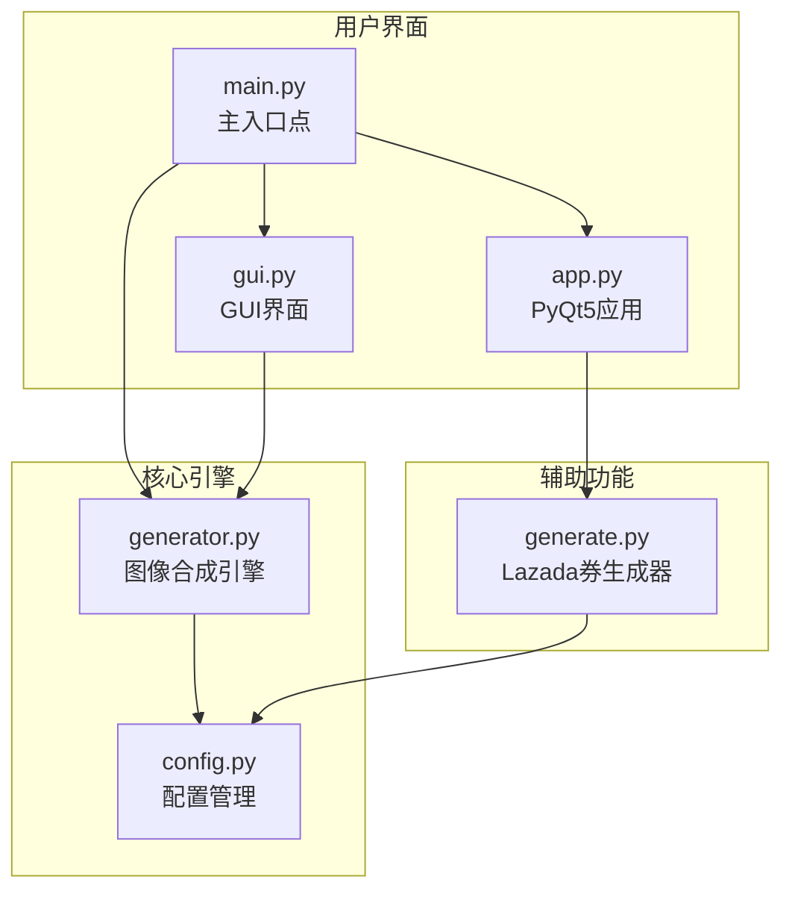
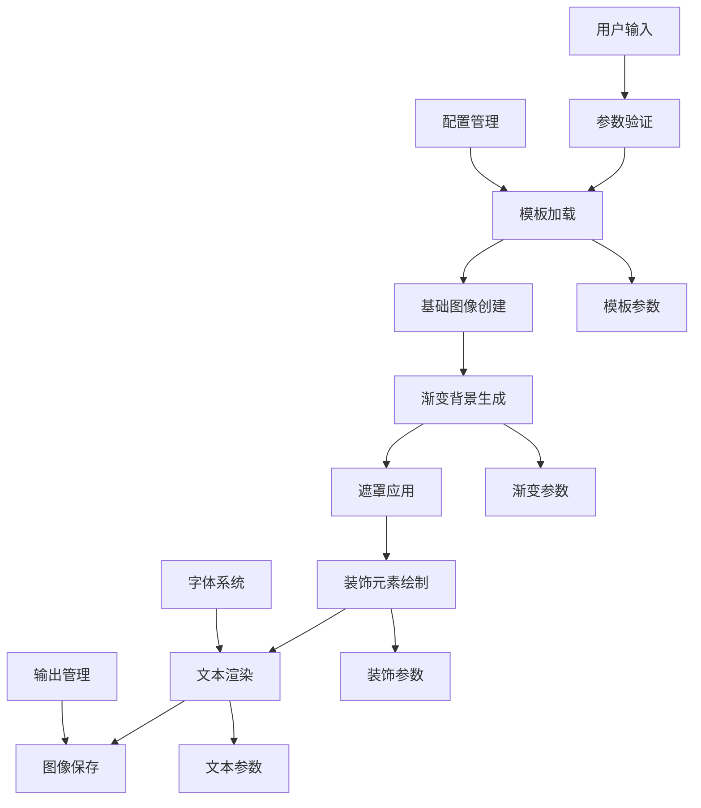
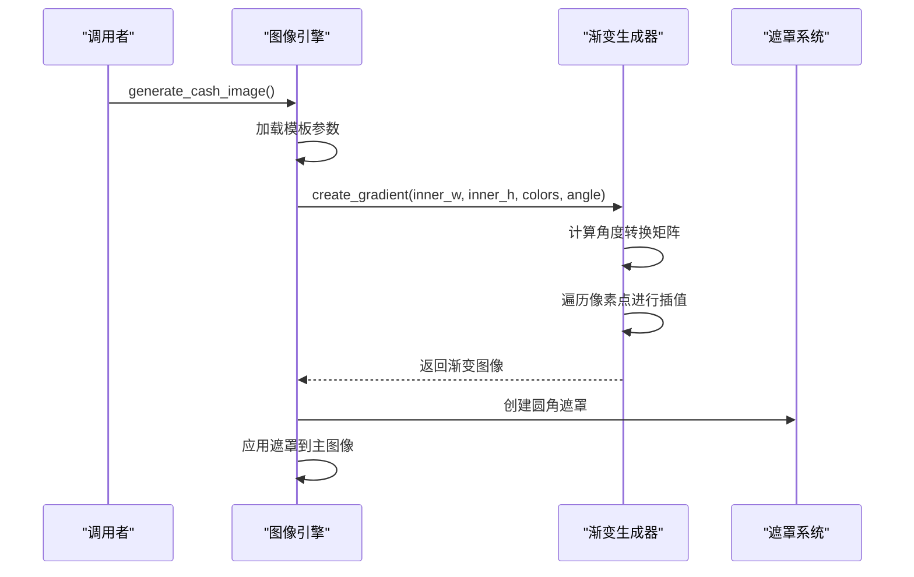
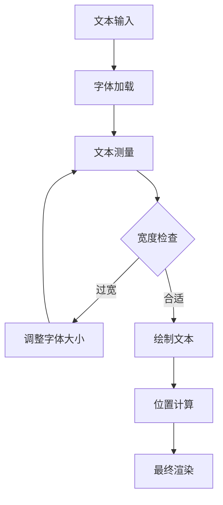
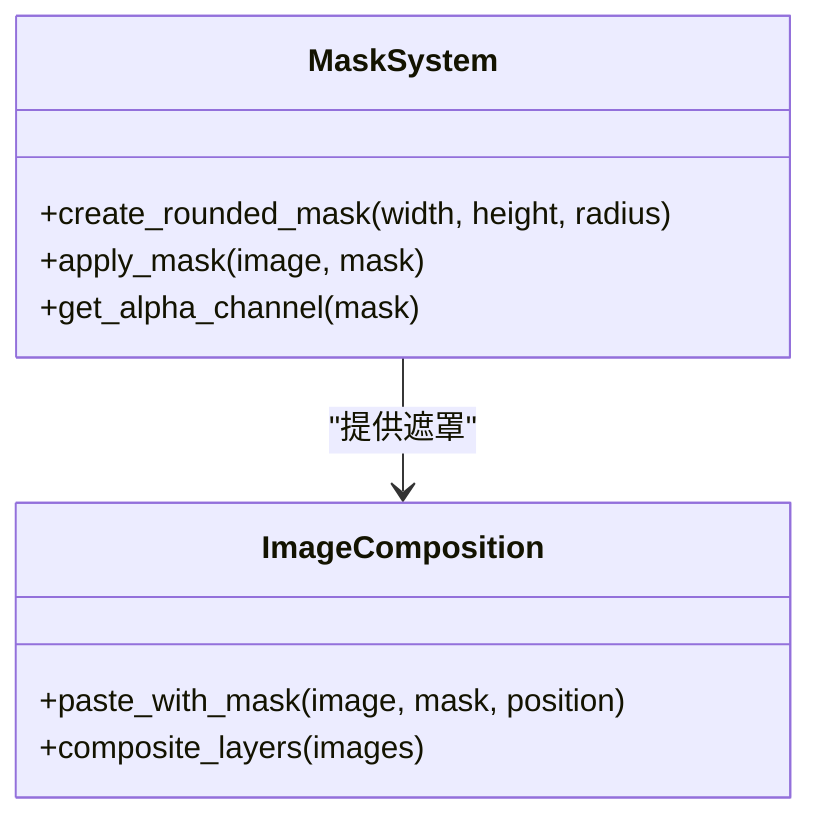
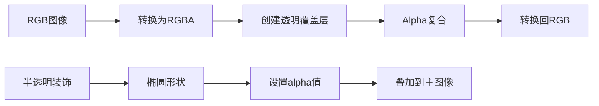
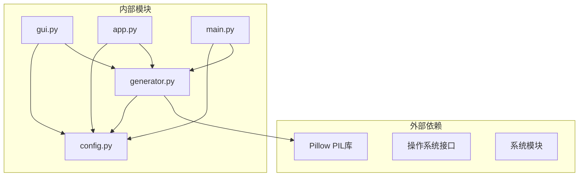
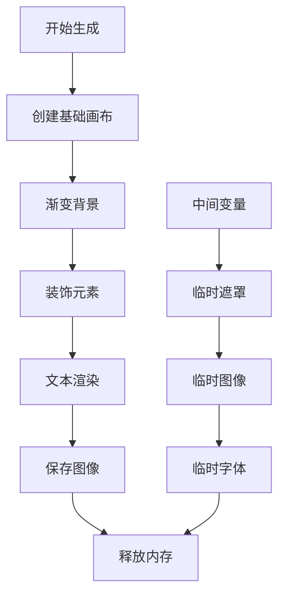

# 图像合成引擎

<cite>
**本文档引用的文件**
- [generator.py](file://generator.py)
- [generate.py](file://generate.py)
- [config.py](file://config.py)
- [gui.py](file://gui.py)
- [app.py](file://app.py)
- [main.py](file://main.py)
</cite>

## 目录
1. [简介](#简介)
2. [项目结构](#项目结构)
3. [核心组件](#核心组件)
4. [架构概览](#架构概览)
5. [详细组件分析](#详细组件分析)
6. [依赖关系分析](#依赖关系分析)
7. [性能考虑](#性能考虑)
8. [故障排除指南](#故障排除指南)
9. [结论](#结论)

## 简介

本项目是一个多地区现金券图像生成器，专注于图像合成和渲染引擎的设计与实现。该系统提供了灵活的模板系统、多区域货币支持、渐变背景创建、装饰元素绘制和文本渲染功能。核心引擎位于 `generator.py` 文件中，实现了高效的图像合成流程，支持多种输出格式和质量控制。

## 项目结构

项目采用模块化设计，主要包含以下核心文件：

**图表来源**
- [generator.py:1-360](file://generator.py#L1-L360)
- [config.py:1-178](file://config.py#L1-L178)
- [gui.py:1-499](file://gui.py#L1-L499)
- [app.py:1-269](file://app.py#L1-L269)
- [generate.py:1-429](file://generate.py#L1-L429)

**章节来源**
- [generator.py:1-360](file://generator.py#L1-L360)
- [config.py:1-178](file://config.py#L1-L178)
- [gui.py:1-499](file://gui.py#L1-L499)

## 核心组件

### 图像合成引擎核心功能

图像合成引擎主要由以下核心组件构成：

1. **模板管理系统** - 支持多模板风格切换
2. **渐变背景生成器** - 实现角度可调的线性渐变效果
3. **遮罩系统** - 提供精确的图像裁剪和透明度控制
4. **文本渲染引擎** - 支持自适应字体大小和多语言字符
5. **装饰元素绘制器** - 实现半透明装饰图形和圆形徽标

### 配置管理系统

系统通过集中化的配置管理支持：
- 多地区货币格式化（前缀/后缀货币符号）
- 模板参数定制（尺寸、颜色、字体）
- 输出目录和格式设置
- 字体路径自动检测

**章节来源**
- [generator.py:145-346](file://generator.py#L145-L346)
- [config.py:19-178](file://config.py#L19-L178)

## 架构概览

系统采用分层架构设计，确保了良好的模块分离和可维护性：

**图表来源**
- [generator.py:145-346](file://generator.py#L145-L346)
- [config.py:85-149](file://config.py#L85-L149)

## 详细组件分析

### generate_cash_image 主函数工作流程

`generate_cash_image` 是整个图像合成引擎的核心函数，负责协调所有渲染步骤：

#### 初始化阶段
1. **模板参数加载** - 从配置系统获取模板设置
2. **基础画布创建** - 初始化RGB画布和绘图对象
3. **外框绘制** - 创建带描边的圆角矩形容器

#### 渐变背景创建

**图表来源**
- [generator.py:202-221](file://generator.py#L202-L221)
- [generator.py:28-60](file://generator.py#L28-L60)

#### 装饰元素绘制
系统实现了多层次的装饰效果：

1. **半透明装饰圆** - 在右上角和左下角添加椭圆形装饰
2. **透明度混合** - 使用RGBA模式进行透明度叠加
3. **颜色层次** - 通过alpha通道实现视觉深度

#### 文本渲染系统

**图表来源**
- [generator.py:287-333](file://generator.py#L287-L333)
- [generator.py:117-123](file://generator.py#L117-L123)

#### 最终图像保存
系统支持自动文件名生成和手动指定输出路径两种模式。

**章节来源**
- [generator.py:145-346](file://generator.py#L145-L346)

### 图像遮罩技术应用

遮罩系统是实现精确图像裁剪的关键技术：

#### 圆角遮罩实现

**图表来源**
- [generator.py:212-218](file://generator.py#L212-L218)

遮罩技术的优势：
- **精确裁剪** - 实现完美的圆角效果
- **性能优化** - 减少不必要的像素处理
- **内存效率** - 遮罩仅存储alpha值

### 透明度混合处理

系统实现了多层次的透明度混合策略：

#### RGBA模式转换

**图表来源**
- [generator.py:236-238](file://generator.py#L236-L238)

#### 混合算法特点
- **预乘Alpha** - 确保颜色混合的准确性
- **边缘平滑** - 避免圆角处的锯齿效应
- **性能平衡** - 在质量与速度间找到最佳平衡点

### 多层合成实现细节

系统的多层合成遵循严格的层次顺序：

#### 层次结构
1. **基础层** - 外框圆角矩形
2. **渐变背景层** - 内部渐变填充
3. **装饰层** - 半透明装饰元素
4. **徽标层** - 圆形徽标和图标
5. **文本层** - 标题、金额、辅助文本

#### 合成策略
- **顺序合成** - 按层次顺序依次合成
- **遮罩应用** - 确保每层正确裁剪
- **颜色一致性** - 统一的颜色空间管理

**章节来源**
- [generator.py:241-333](file://generator.py#L241-L333)

## 依赖关系分析

系统采用松耦合的设计模式，主要依赖关系如下：

**图表来源**
- [generator.py:6-11](file://generator.py#L6-L11)
- [config.py:6-14](file://config.py#L6-L14)

### 关键依赖特性

1. **PIL集成** - 全面利用Pillow的强大图像处理能力
2. **配置驱动** - 所有视觉参数都来自集中配置
3. **平台兼容** - 支持多操作系统字体和路径
4. **资源管理** - 自动化的字体和模板资源查找

**章节来源**
- [generator.py:9-11](file://generator.py#L9-L11)
- [config.py:8-14](file://config.py#L8-L14)

## 性能考虑

### 内存管理策略

系统实施了多项内存优化措施：

#### 对象生命周期管理
- **及时释放** - 处理完的临时图像立即释放
- **批量操作** - 避免重复创建相同尺寸的对象
- **缓存策略** - 字体对象按需创建和复用

#### 图像缓冲区管理

**图表来源**
- [generator.py:176-178](file://generator.py#L176-L178)

### 性能优化技术

1. **像素级优化** - 直接像素操作避免不必要的函数调用
2. **算法复杂度控制** - 渐变生成采用O(W×H)复杂度
3. **内存池管理** - 大图像使用就地修改减少内存分配
4. **延迟加载** - 字体和模板按需加载

### 缓冲区管理最佳实践

- **尺寸预估** - 根据模板参数预估内存需求
- **渐进式渲染** - 分步骤渲染避免峰值内存占用
- **垃圾回收** - 定期触发Python垃圾回收机制

## 故障排除指南

### 常见问题及解决方案

#### 字体加载失败
**症状**: 文本渲染异常或使用默认字体
**原因**: 字体文件缺失或权限问题
**解决**: 
- 检查字体文件路径
- 验证文件存在性和可读权限
- 确认字体格式兼容性

#### 渐变渲染异常
**症状**: 渐变方向不正确或颜色过渡异常
**原因**: 角度计算错误或颜色值越界
**解决**:
- 验证角度参数范围(0-360度)
- 检查RGB颜色值范围(0-255)
- 确认像素坐标有效性

#### 内存不足错误
**症状**: 大图像生成时崩溃
**原因**: 内存分配不足
**解决**:
- 减小图像尺寸
- 优化模板参数
- 增加系统内存或使用64位版本

#### 预览显示问题
**症状**: GUI界面预览不显示或显示异常
**原因**: Pillow版本兼容性问题
**解决**:
- 更新到最新Pillow版本
- 检查图像格式支持
- 验证系统图形库安装

**章节来源**
- [generator.py:91-114](file://generator.py#L91-L114)
- [gui.py:418-456](file://gui.py#L418-L456)

## 结论

本图像合成引擎展现了优秀的工程实践，通过精心设计的架构实现了高效、可扩展的图像生成系统。核心优势包括：

1. **模块化设计** - 清晰的功能分离便于维护和扩展
2. **配置驱动** - 灵活的模板系统支持多地区多风格
3. **性能优化** - 有效的内存管理和算法优化
4. **跨平台兼容** - 支持多种操作系统和字体环境

该系统为电商促销图像生成提供了完整的解决方案，既满足了商业应用的需求，又保持了良好的开发体验。通过持续的优化和扩展，可以进一步提升性能和功能完整性。