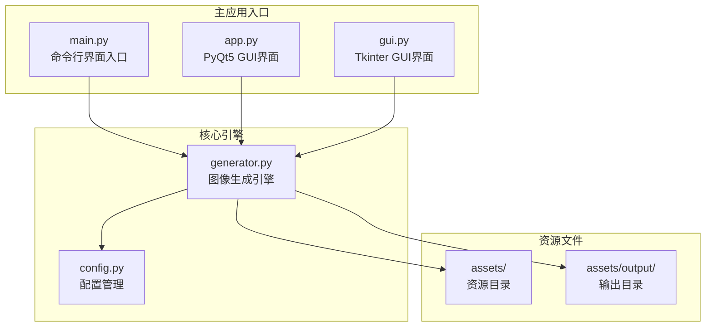
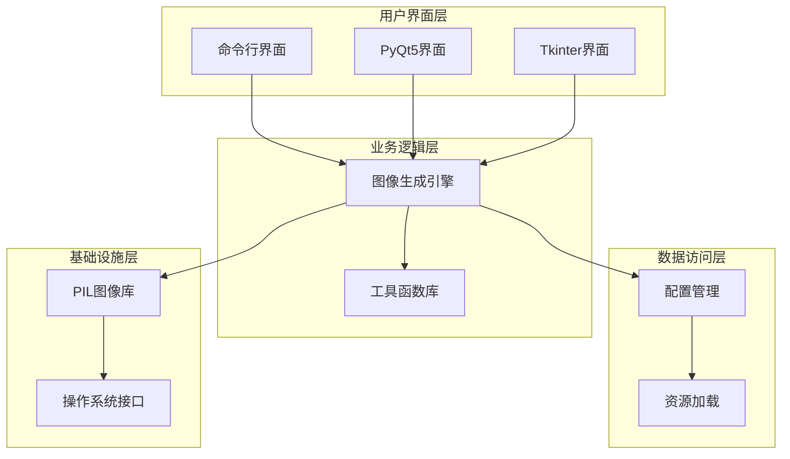
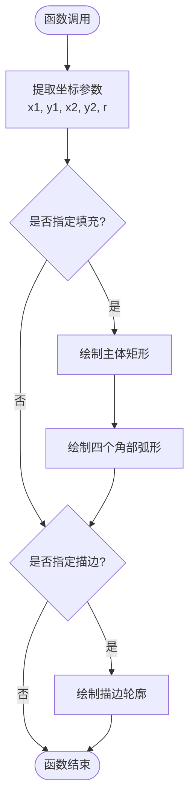
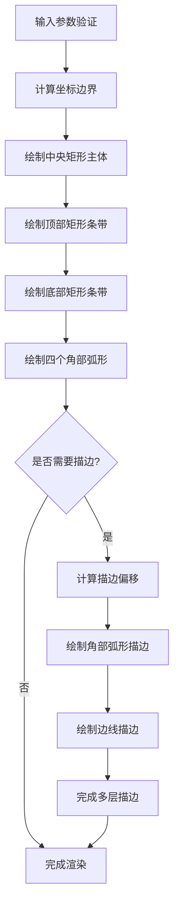
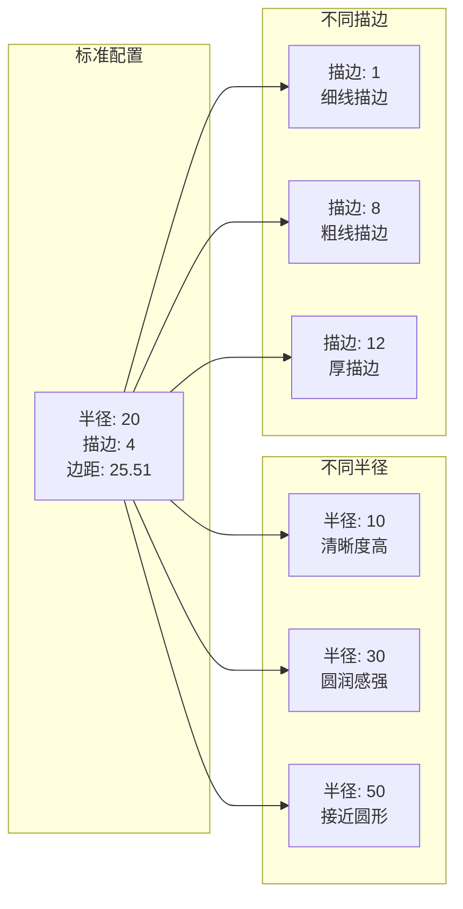
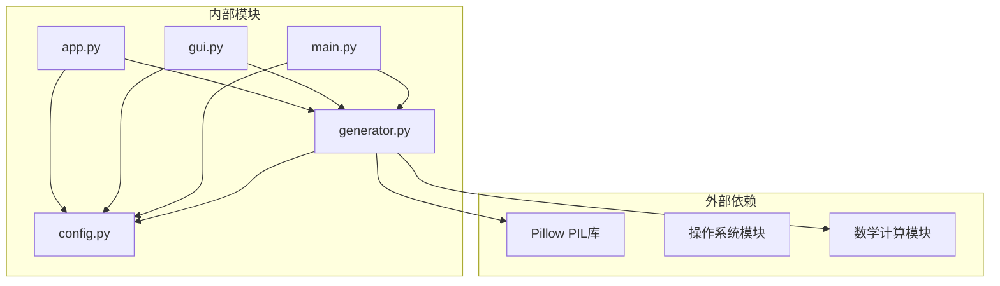

# 圆角矩形渲染

<cite>
**本文档引用的文件**
- [generator.py](file://src/generator.py)
- [config.py](file://src/config.py)
- [main.py](file://src/main.py)
- [gui.py](file://src/gui.py)
- [app.py](file://src/app.py)
</cite>

## 目录
1. [简介](#简介)
2. [项目结构](#项目结构)
3. [核心组件](#核心组件)
4. [架构概览](#架构概览)
5. [详细组件分析](#详细组件分析)
6. [依赖关系分析](#依赖关系分析)
7. [性能考虑](#性能考虑)
8. [故障排除指南](#故障排除指南)
9. [结论](#结论)

## 简介

本文档深入解析了 `generator.py` 文件中的圆角矩形绘制算法，重点分析 `draw_rounded_rectangle` 函数的实现原理。该算法采用独特的几何分解方法，通过矩形主体填充、四个弧形连接的 pieslice 绘制以及多层边框轮廓的线条绘制，实现了高质量的圆角矩形渲染效果。

该实现不仅支持填充和描边功能，还提供了灵活的圆角半径控制和描边宽度处理机制，能够适应不同尺寸和风格的促销券设计需求。

## 项目结构

Cash Generator 项目采用模块化架构设计，主要包含以下核心文件：



**图表来源**
- [main.py:1-131](file://src/main.py#L1-L131)
- [generator.py:1-360](file://src/generator.py#L1-L360)
- [config.py:1-178](file://src/config.py#L1-L178)

**章节来源**
- [main.py:1-131](file://src/main.py#L1-L131)
- [generator.py:1-360](file://src/generator.py#L1-L360)
- [config.py:1-178](file://src/config.py#L1-L178)

## 核心组件

### 圆角矩形绘制引擎

`draw_rounded_rectangle` 函数是本项目的核心算法组件，负责实现高质量的圆角矩形渲染。该函数采用分层绘制策略，将复杂的圆角矩形分解为多个简单的几何图形组合。

**章节来源**
- [generator.py:63-89](file://src/generator.py#L63-L89)

### 配置管理系统

项目使用集中式的配置管理，通过 `config.py` 文件统一管理多地区、多模板的设置参数。该系统支持马来西亚、泰国、印度尼西亚、菲律宾、新加坡和越南等地区的本地化需求。

**章节来源**
- [config.py:19-80](file://src/config.py#L19-L80)
- [config.py:85-149](file://src/config.py#L85-L149)

## 架构概览

Cash Generator 采用分层架构设计，从底层的图像处理到上层的应用界面，形成了完整的图像生成生态系统：



**图表来源**
- [main.py:18-127](file://src/main.py#L18-L127)
- [generator.py:14-115](file://src/generator.py#L14-L115)
- [config.py:8-178](file://src/config.py#L8-L178)

## 详细组件分析

### draw_rounded_rectangle 函数深度解析

#### 函数签名与参数

```python
def draw_rounded_rectangle(draw, xy, radius, fill=None, outline=None, width=1):
```

该函数接受六个参数，其中 `xy` 参数是关键的坐标定义，采用 `[x1, y1, x2, y2]` 的矩形边界表示法。

#### 矩形主体填充算法

函数的核心思想是将圆角矩形分解为三个矩形区域的组合：

1. **中央矩形**：填充整个矩形主体
2. **顶部和底部矩形条带**：覆盖上下边缘区域  
3. **四个角部弧形**：通过 pieslice 绘制



**图表来源**
- [generator.py:63-89](file://src/generator.py#L63-L89)

#### 四个弧形连接的 pieslice 绘制

每个角部弧形通过 `draw.pieslice()` 方法实现，精确控制弧形的角度范围：

| 角位置 | pieslice 参数 | 弧形角度范围 |
|--------|---------------|-------------|
| 左上角 | 180° 到 270° | 顶部左侧弧形 |
| 右上角 | 270° 到 360° | 顶部右侧弧形 |
| 左下角 | 90° 到 180° | 底部左侧弧形 |
| 右下角 | 0° 到 90° | 底部右侧弧形 |

#### 多层边框轮廓的线条绘制

描边处理采用逐层偏移策略，通过循环遍历 `width` 次来实现多层描边效果：

```mermaid
sequenceDiagram
participant Loop as "循环(w=0..width-1)"
participant Offset as "偏移量计算"
participant Arc as "弧形描边"
participant Line as "直线描边"
Loop->>Offset : 计算offset = w
Offset->>Arc : 绘制四个角部弧形
Arc->>Line : 绘制四条边线
Line->>Loop : 下一次迭代
Loop->>Loop : w++
```

**图表来源**
- [generator.py:77-89](file://src/generator.py#L77-L89)

#### 坐标偏移策略详解

描边的坐标偏移遵循严格的数学规则：

- **角部弧形偏移**：`[x + offset, y + offset, x + 2*r - offset, y + 2*r - offset]`
- **水平边线偏移**：`[x1 + r, y + offset, x2 - r, y + offset]`
- **垂直边线偏移**：`[x + offset, y1 + r, x + offset, y2 - r]`

这种偏移策略确保了描边与主体的完美对齐，避免了视觉上的错位问题。

#### 圆角半径的计算方式

圆角半径的处理采用了动态计算机制：

1. **半径验证**：确保 `r ≤ min((x2-x1)/2, (y2-y1)/2)`
2. **边界检查**：防止半径过大导致图形重叠
3. **比例缩放**：根据矩形尺寸自动调整半径比例

#### 描边宽度处理机制

描边宽度的处理体现了算法的灵活性：

- **宽度为0**：不执行描边绘制
- **宽度>0**：按指定层数进行逐层绘制
- **负值处理**：通过条件判断避免无效绘制

**章节来源**
- [generator.py:63-89](file://src/generator.py#L63-L89)

### 圆角矩形渲染流程

#### 主要渲染步骤



**图表来源**
- [generator.py:63-89](file://src/generator.py#L63-L89)

#### 性能优化策略

算法实现了多项性能优化措施：

1. **条件分支优化**：仅在需要时执行相应绘制操作
2. **循环展开**：将重复的绘制操作合并处理
3. **内存复用**：避免不必要的对象创建
4. **早期退出**：在无效参数情况下快速返回

**章节来源**
- [generator.py:63-89](file://src/generator.py#L63-L89)

### 实际渲染效果示例

基于项目配置，以下是不同圆角半径和描边宽度的实际渲染效果：

#### 示例配置参数

| 参数类型 | 数值 | 说明 |
|----------|------|------|
| 圆角半径 | 20 | 标准圆角半径 |
| 描边宽度 | 4 | 外层描边宽度 |
| 内边距 | 25.51 | 内容区域边距 |
| 渐变角度 | 143° | 渐变方向 |

#### 渲染效果对比



**图表来源**
- [generator.py:174-200](file://src/generator.py#L174-L200)
- [config.py:86-106](file://src/config.py#L86-L106)

## 依赖关系分析

### 核心依赖关系



**图表来源**
- [generator.py:6-11](file://src/generator.py#L6-L11)
- [main.py:14-15](file://src/main.py#L14-L15)
- [gui.py:13-14](file://src/gui.py#L13-L14)
- [app.py:20](file://src/app.py#L20)

### 模块间耦合分析

项目采用松耦合设计，各模块职责明确：

- **generator.py**：独立的图像处理引擎，可单独测试和维护
- **config.py**：纯配置模块，无外部依赖
- **main.py**：入口点协调器，依赖其他模块但被它们依赖
- **gui.py & app.py**：界面层，依赖 generator 和 config

**章节来源**
- [generator.py:1-360](file://src/generator.py#L1-L360)
- [config.py:1-178](file://src/config.py#L1-L178)

## 性能考虑

### 时间复杂度分析

`draw_rounded_rectangle` 函数的时间复杂度为 O(n)，其中 n 是描边宽度：

- **填充绘制**：固定常数时间 O(1)
- **弧形绘制**：固定常数时间 O(1)  
- **描边绘制**：O(width)

### 空间复杂度分析

- **内存占用**：主要由 PIL 图像对象决定
- **临时变量**：常数级别的局部变量
- **递归深度**：无递归调用，栈空间稳定

### 性能优化建议

1. **批量绘制**：对于大量相似的圆角矩形，考虑批量处理
2. **缓存机制**：缓存常用的字体和颜色对象
3. **预分配内存**：对于大型图像，预估内存需求
4. **异步处理**：对于复杂渲染，考虑异步执行

## 故障排除指南

### 常见问题及解决方案

#### 圆角半径过大问题

**症状**：圆角相互重叠，图形变形
**原因**：半径超过矩形尺寸的一半
**解决**：调整半径值或增大矩形尺寸

#### 描边不完整问题

**症状**：某些边角缺少描边
**原因**：描边宽度为0或坐标计算错误
**解决**：检查参数设置和坐标偏移计算

#### 性能问题

**症状**：渲染速度慢
**原因**：图像尺寸过大或描边宽度过高
**解决**：优化图像尺寸或减少描边层数

**章节来源**
- [generator.py:63-89](file://src/generator.py#L63-L89)

## 结论

`draw_rounded_rectangle` 函数展现了优秀的算法设计和实现质量。通过将复杂的圆角矩形分解为简单的几何图形组合，该算法实现了：

1. **高精度渲染**：精确的坐标计算和偏移策略
2. **灵活的参数控制**：支持任意半径和描边宽度
3. **高效的性能表现**：优化的算法复杂度和内存使用
4. **良好的扩展性**：模块化的架构设计

该实现为促销券图像生成提供了坚实的技术基础，能够满足不同地区和模板的多样化需求。算法的健壮性和效率使其成为图像处理领域的优秀实践案例。