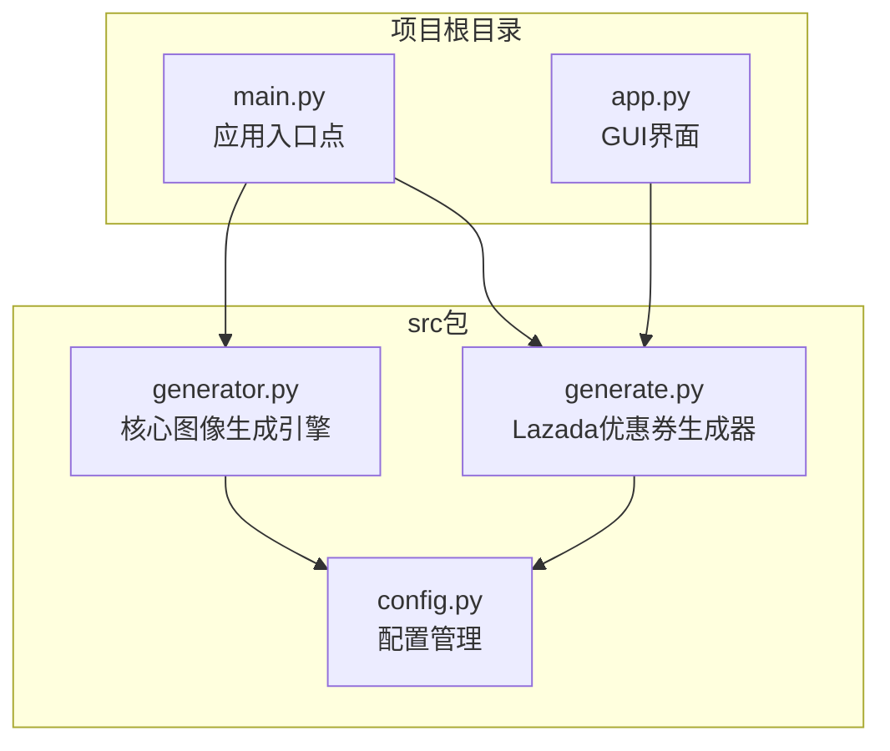
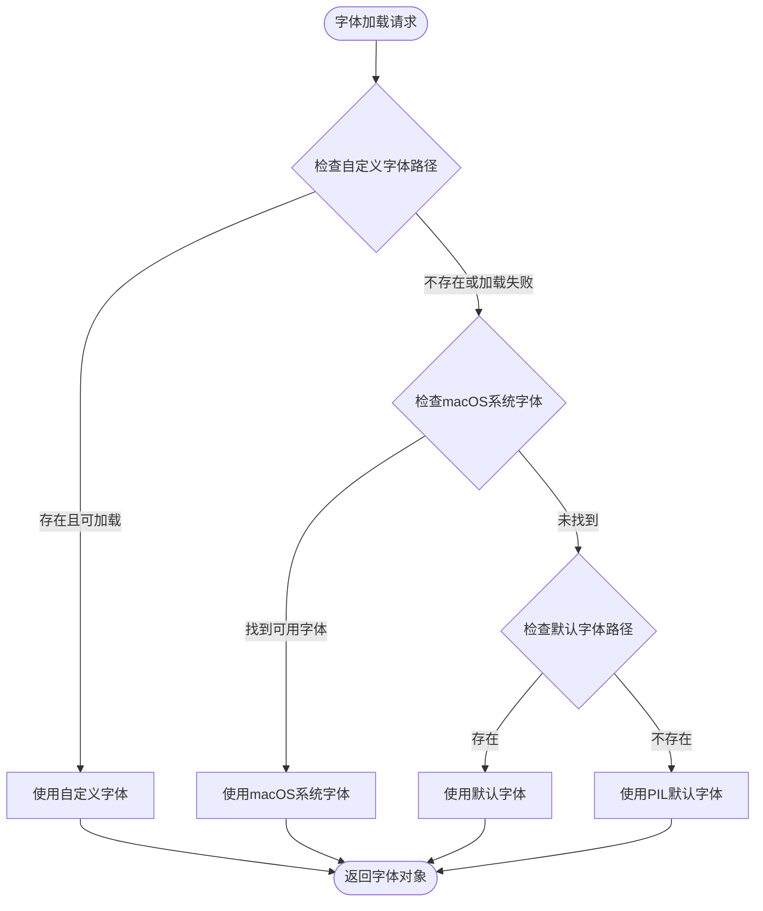
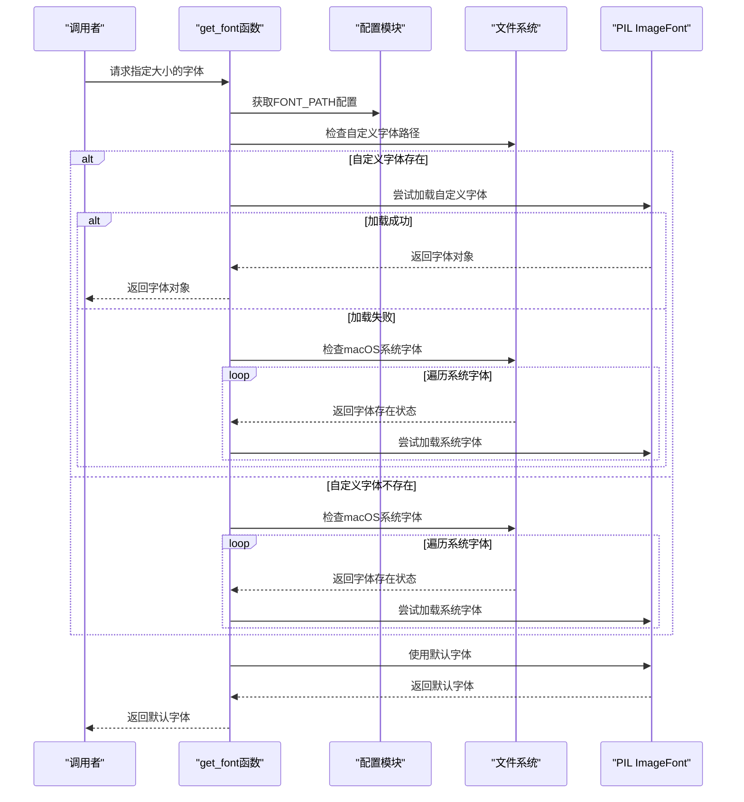
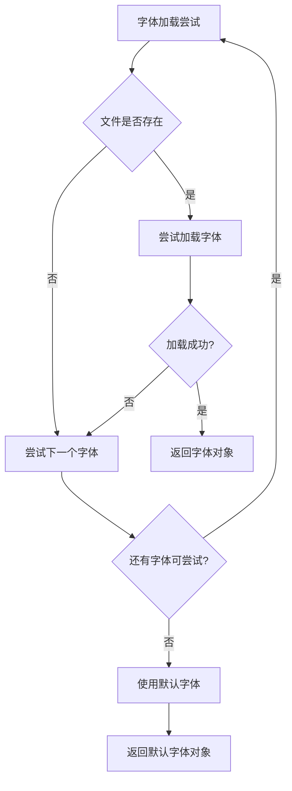
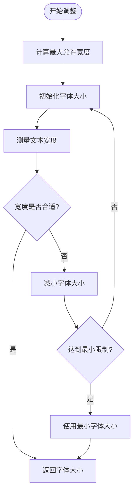
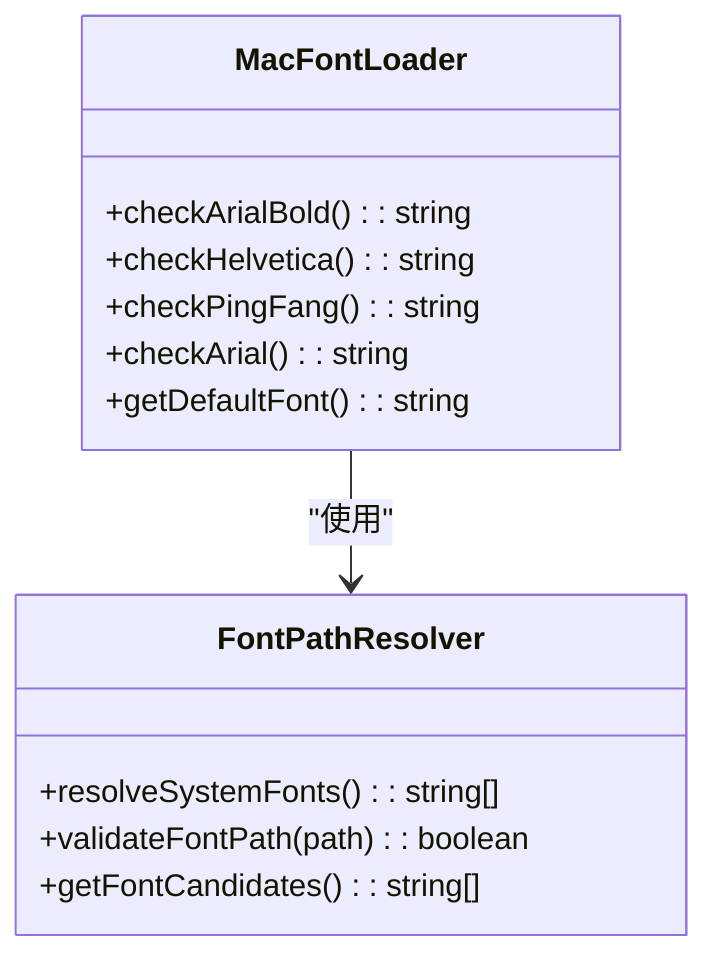
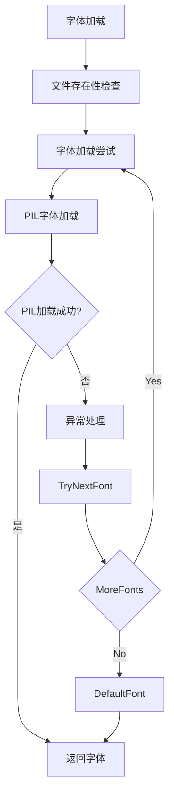
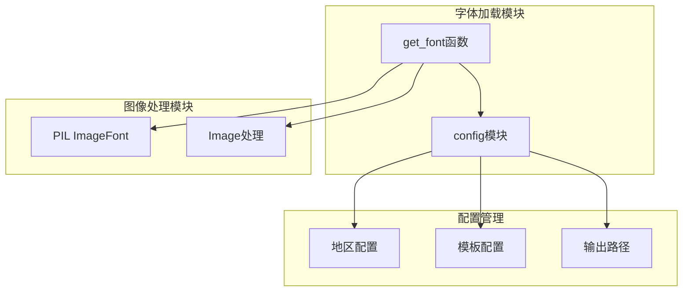

# 字体加载系统

<cite>
**本文档引用的文件**
- [generator.py](file://generator.py)
- [generate.py](file://generate.py)
- [config.py](file://config.py)
- [main.py](file://main.py)
- [app.py](file://app.py)
</cite>

## 目录
1. [简介](#简介)
2. [项目结构](#项目结构)
3. [核心组件](#核心组件)
4. [架构概览](#架构概览)
5. [详细组件分析](#详细组件分析)
6. [依赖关系分析](#依赖关系分析)
7. [性能考虑](#性能考虑)
8. [故障排除指南](#故障排除指南)
9. [结论](#结论)

## 简介

本文档深入分析了Cash Generator项目中的字体加载和管理系统，重点关注generator.py中的字体加载机制。该系统实现了多层字体加载策略，包括自定义字体优先级、系统字体回退机制和跨平台兼容性处理。文档详细解释了get_font函数的字体路径解析策略、字体文件加载失败时的异常处理和默认字体降级策略、字体大小适配算法以及字体缓存机制，并提供了跨平台字体兼容性解决方案和常见字体加载问题的调试方法。

## 项目结构

Cash Generator项目采用模块化设计，主要包含以下核心文件：



**图表来源**
- [main.py:1-131](file://main.py#L1-L131)
- [generator.py:1-360](file://generator.py#L1-L360)
- [generate.py:1-429](file://generate.py#L1-L429)
- [config.py:1-178](file://config.py#L1-L178)

**章节来源**
- [main.py:1-131](file://main.py#L1-L131)
- [generator.py:1-360](file://generator.py#L1-L360)
- [generate.py:1-429](file://generate.py#L1-L429)
- [config.py:1-178](file://config.py#L1-L178)

## 核心组件

### 字体加载系统概述

项目中的字体加载系统主要由两个核心组件构成：

1. **generator.py中的get_font函数** - 处理Cash券模板的字体加载
2. **generate.py中的load_font系列函数** - 处理Lazada优惠券的字体加载

这两个系统虽然功能相似，但采用了不同的实现策略和优化方案。

**章节来源**
- [generator.py:91-115](file://generator.py#L91-L115)
- [generate.py:73-109](file://generate.py#L73-L109)

## 架构概览

字体加载系统采用分层架构设计，实现了从自定义字体到系统字体的渐进式回退机制：



**图表来源**
- [generator.py:91-115](file://generator.py#L91-L115)
- [config.py:154-170](file://config.py#L154-L170)

## 详细组件分析

### get_font函数分析

get_font函数是Cash券模板字体加载的核心实现，具有以下特点：

#### 字体路径解析策略



**图表来源**
- [generator.py:91-115](file://generator.py#L91-L115)
- [config.py:154-170](file://config.py#L154-L170)

#### 自定义字体优先级

get_font函数实现了严格的自定义字体优先级策略：

1. **配置字体路径优先**：首先检查config.py中通过get_font_path()函数确定的字体路径
2. **macOS系统字体回退**：如果配置字体不可用，尝试多个常见的macOS系统字体
3. **默认降级**：最后使用PIL的默认字体

#### 异常处理和降级策略

系统采用"失败即跳过"的异常处理策略：



**图表来源**
- [generator.py:91-115](file://generator.py#L91-L115)

**章节来源**
- [generator.py:91-115](file://generator.py#L91-L115)
- [config.py:154-170](file://config.py#L154-L170)

### 字体大小适配算法

Cash券生成器实现了动态字体大小调整算法，确保文本在限定区域内完美显示：

#### 动态调整流程



**图表来源**
- [generator.py:293-302](file://generator.py#L293-L302)

#### 适配算法特点

1. **自适应宽度约束**：根据模板宽度和边距计算最大允许文本宽度
2. **迭代优化**：通过循环调整字体大小直到满足约束条件
3. **最小限制保护**：防止字体过小影响可读性
4. **实时重测量**：每次调整后重新测量文本边界框

**章节来源**
- [generator.py:293-302](file://generator.py#L293-L302)

### 字体缓存机制

当前的字体加载系统采用按需加载策略，没有实现显式的字体缓存机制。每个字体请求都会触发文件系统检查和PIL字体加载过程。

#### 缓存优化建议

基于现有实现，可以考虑以下缓存策略：

1. **内存缓存**：缓存最近使用的字体对象，避免重复加载
2. **LRU缓存**：实现基于最近使用频率的字体缓存
3. **大小感知缓存**：为不同字体大小维护独立缓存

**章节来源**
- [generator.py:91-115](file://generator.py#L91-L115)

### 跨平台字体兼容性

系统针对不同平台实现了专门的字体处理策略：

#### macOS特定处理



**图表来源**
- [generator.py:99-111](file://generator.py#L99-L111)
- [config.py:154-167](file://config.py#L154-L167)

#### Linux兼容性

系统通过DejaVu字体提供Linux平台的字体支持：

**章节来源**
- [config.py:162](file://config.py#L162)

### 字体加载异常处理

系统实现了多层次的异常处理机制：



**图表来源**
- [generator.py:93-97](file://generator.py#L93-L97)

**章节来源**
- [generator.py:93-97](file://generator.py#L93-L97)

## 依赖关系分析

字体加载系统与其他模块的依赖关系如下：



**图表来源**
- [generator.py:9-11](file://generator.py#L9-L11)
- [config.py:8-14](file://config.py#L8-L14)

**章节来源**
- [generator.py:9-11](file://generator.py#L9-L11)
- [config.py:8-14](file://config.py#L8-L14)

## 性能考虑

### 加载性能优化

1. **延迟加载**：仅在需要时加载字体，减少启动时间
2. **文件系统缓存**：操作系统会缓存文件元数据，提高多次检查的效率
3. **PIL优化**：PIL内部对字体文件有优化处理

### 内存使用优化

1. **按需分配**：字体对象只在需要时创建
2. **垃圾回收**：Python自动管理字体对象的内存释放
3. **对象复用**：建议实现字体对象缓存以减少重复创建

## 故障排除指南

### 常见字体加载问题

#### 问题1：字体文件路径错误

**症状**：字体加载失败，使用默认字体

**诊断步骤**：
1. 检查config.py中的FONT_PATH配置
2. 验证字体文件的实际存在性
3. 确认文件权限正确

**解决方法**：
```python
# 在config.py中添加调试输出
def get_font_path():
    candidates = [
        "/System/Library/Fonts/Supplemental/Arial Bold.ttf",
        "/System/Library/Fonts/Helvetica.ttc",
        "/System/Library/Fonts/PingFang.ttc",
        "/Library/Fonts/Arial.ttf",
        "/usr/share/fonts/truetype/dejavu/DejaVuSans-Bold.ttf",
    ]
    for path in candidates:
        print(f"检查字体路径: {path}")  # 调试输出
        if os.path.exists(path):
            print(f"找到可用字体: {path}")  # 调试输出
            return path
    return None
```

#### 问题2：字体格式不支持

**症状**：PIL加载字体时抛出异常

**诊断步骤**：
1. 检查字体文件格式（TTF/OTF）
2. 验证字体文件完整性
3. 确认字体文件未损坏

**解决方法**：
```python
# 在get_font函数中添加详细的异常信息
def get_font(size, bold=True):
    try:
        if FONT_PATH and os.path.exists(FONT_PATH):
            try:
                return ImageFont.truetype(FONT_PATH, size)
            except Exception as e:
                print(f"自定义字体加载失败: {e}")  # 调试输出
                pass
    except Exception as e:
        print(f"字体加载异常: {e}")  # 调试输出
    return ImageFont.load_default()
```

#### 问题3：跨平台兼容性问题

**症状**：在不同操作系统上字体显示不一致

**诊断步骤**：
1. 检查目标系统的字体安装情况
2. 验证字体路径在不同平台上的差异
3. 确认字体回退机制正常工作

**解决方法**：
```python
# 添加平台检测和特定处理
import platform
system = platform.system()

if system == "Darwin":  # macOS
    mac_fonts = [
        "/System/Library/Fonts/Supplemental/Arial Bold.ttf",
        "/System/Library/Fonts/Helvetica.ttc",
        "/System/Library/Fonts/PingFang.ttc",
        "/Library/Fonts/Arial.ttf",
    ]
elif system == "Linux":
    linux_fonts = [
        "/usr/share/fonts/truetype/dejavu/DejaVuSans-Bold.ttf",
        "/usr/share/fonts/truetype/liberation/LiberationSans-Bold.ttf",
    ]
```

### 调试工具和方法

#### 字体路径验证工具

```python
def debug_font_paths():
    """调试字体路径问题"""
    print("=== 字体路径调试信息 ===")
    
    # 检查配置字体路径
    print(f"配置字体路径: {config.FONT_PATH}")
    if config.FONT_PATH:
        print(f"路径存在: {os.path.exists(config.FONT_PATH)}")
    
    # 检查macOS字体候选路径
    mac_fonts = [
        "/System/Library/Fonts/Supplemental/Arial Bold.ttf",
        "/System/Library/Fonts/Helvetica.ttc",
        "/System/Library/Fonts/PingFang.ttc",
        "/Library/Fonts/Arial.ttf",
    ]
    
    print("\nmacOS字体候选路径:")
    for path in mac_fonts:
        exists = os.path.exists(path)
        print(f"  {path}: {'✓' if exists else '✗'}")
    
    # 检查默认字体
    try:
        default_font = ImageFont.load_default()
        print(f"\n默认字体加载: ✓")
    except Exception as e:
        print(f"默认字体加载失败: ✗ ({e})")

# 使用方法
debug_font_paths()
```

#### 字体加载性能监控

```python
import time

def timed_get_font(size, bold=True):
    """带性能监控的字体加载"""
    start_time = time.time()
    font = get_font(size, bold)
    end_time = time.time()
    
    print(f"字体加载耗时: {(end_time - start_time) * 1000:.2f}ms")
    return font
```

**章节来源**
- [generator.py:91-115](file://generator.py#L91-L115)
- [config.py:154-170](file://config.py#L154-L170)

## 结论

Cash Generator项目的字体加载系统展现了良好的跨平台兼容性和健壮的异常处理机制。通过多层回退策略，系统能够在各种环境下确保字体的可用性。主要优势包括：

1. **完善的回退机制**：从自定义字体到系统字体再到默认字体的完整链路
2. **跨平台支持**：针对macOS和Linux平台的专门优化
3. **动态适配**：智能的字体大小调整算法
4. **错误容错**：优雅的异常处理和降级策略

**改进建议**：
1. 实现字体对象缓存以提升性能
2. 添加更详细的日志记录用于调试
3. 考虑实现字体预加载机制
4. 增加字体质量检测功能

该系统为类似的图像生成应用提供了优秀的字体管理范例，其设计理念和实现方式值得其他项目借鉴。