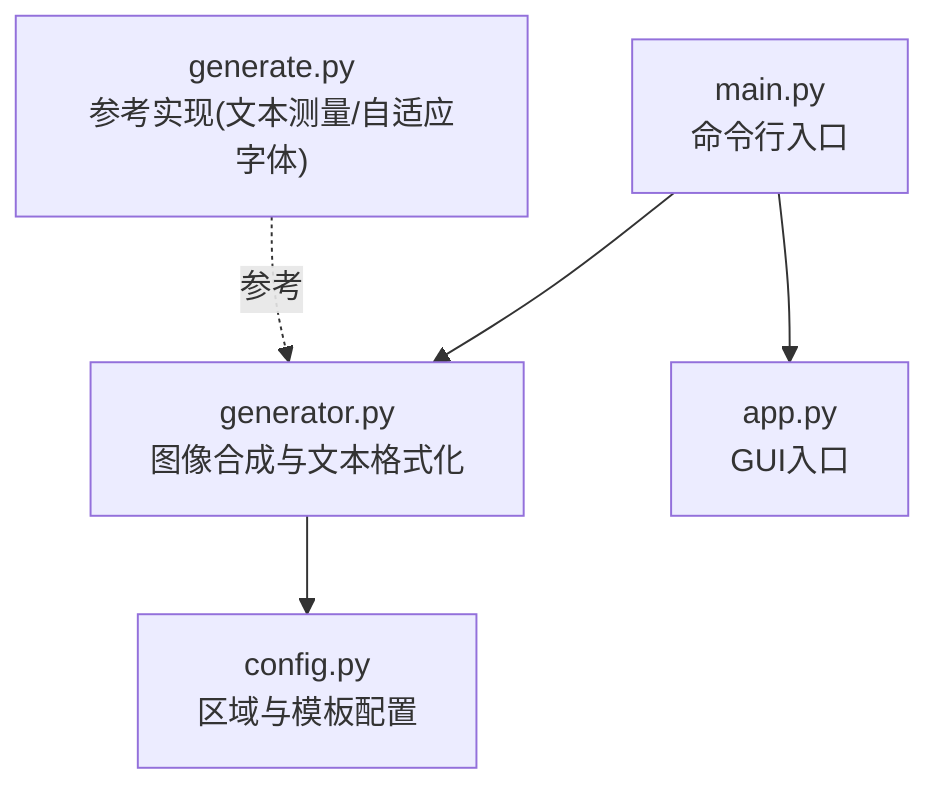
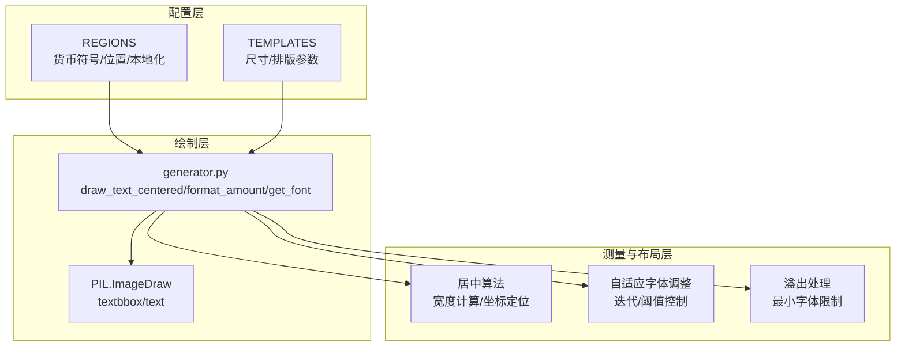
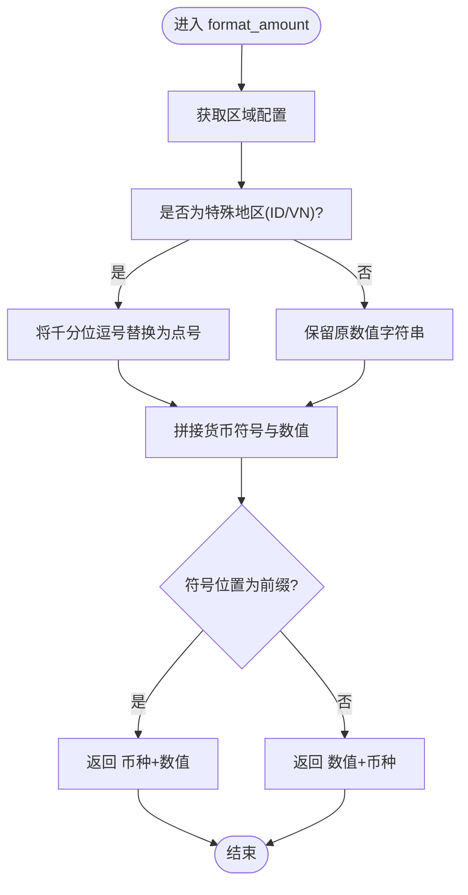
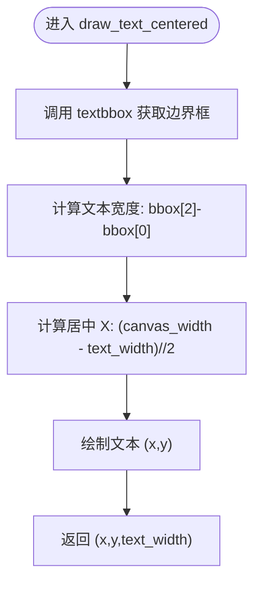
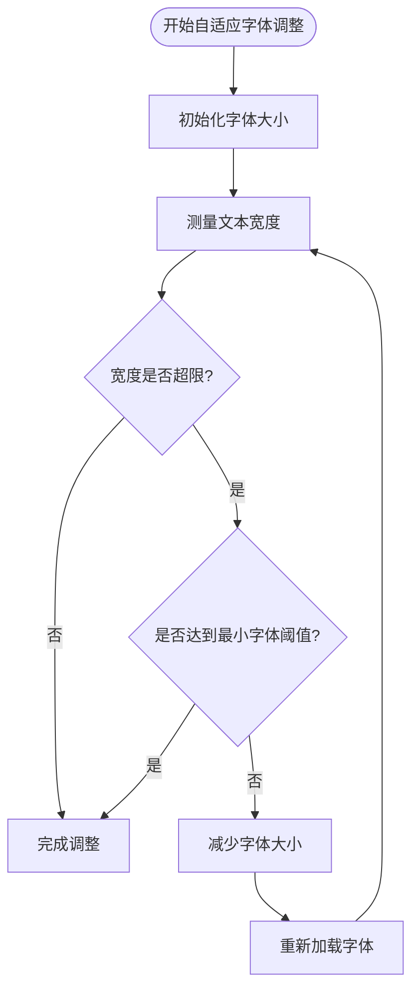
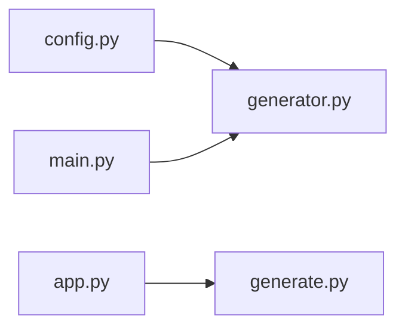

# 文本格式化系统

<cite>
**本文引用的文件**
- [generator.py](file://generator.py)
- [generate.py](file://generate.py)
- [config.py](file://config.py)
- [main.py](file://main.py)
- [app.py](file://app.py)
</cite>

## 目录
1. [简介](#简介)
2. [项目结构](#项目结构)
3. [核心组件](#核心组件)
4. [架构总览](#架构总览)
5. [详细组件分析](#详细组件分析)
6. [依赖关系分析](#依赖关系分析)
7. [性能考量](#性能考量)
8. [故障排查指南](#故障排查指南)
9. [结论](#结论)
10. [附录](#附录)

## 简介
本文件聚焦于文本格式化与布局系统，深入解析以下关键能力：
- 多地区货币格式化：format_amount 函数如何根据区域配置进行千分位分隔符、货币符号位置以及特殊地区格式规则的处理
- 文本测量与居中：draw_text_centered 函数如何通过 textbbox 获取文本边界框并进行水平居中定位
- 自适应字体调整：在固定画布宽度约束下，如何动态调整字体大小以避免文本溢出
- 文本溢出处理策略：当文本过宽时的降级与限制逻辑
- 多语言与多货币格式化最佳实践：结合现有实现总结可复用的设计模式与注意事项

## 项目结构
该仓库采用“功能模块化 + 配置驱动”的组织方式：
- generator.py：核心图像合成引擎，包含文本格式化、布局与渲染
- generate.py：参考实现（Lazada风格），包含更复杂的自适应字体与文本测量
- config.py：区域与模板配置，提供多地区货币符号、位置与模板参数
- main.py：命令行入口，调用生成器
- app.py：GUI入口，基于PyQt5的界面

图表来源
- [main.py:14-16](file://main.py#L14-L16)
- [generator.py:145-346](file://generator.py#L145-L346)
- [config.py:19-80](file://config.py#L19-L80)
- [app.py:20](file://app.py#L20)

章节来源
- [main.py:14-16](file://main.py#L14-L16)
- [generator.py:145-346](file://generator.py#L145-L346)
- [config.py:19-80](file://config.py#L19-L80)
- [app.py:20](file://app.py#L20)

## 核心组件
- 文本格式化与货币符号位置控制：format_amount
- 文本测量与居中：draw_text_centered
- 自适应字体调整：在生成流程中对金额文本进行宽度测量与字体大小迭代
- 区域配置：REGIONS 提供货币符号、位置与本地化参数
- 参考实现对比：generate.py 展示了更精细的文本测量与二分搜索自适应字体策略

章节来源
- [generator.py:126-143](file://generator.py#L126-L143)
- [generator.py:117-123](file://generator.py#L117-L123)
- [generator.py:287-310](file://generator.py#L287-L310)
- [config.py:19-80](file://config.py#L19-L80)

## 架构总览
文本格式化系统由“配置驱动 + 图像绘制 + 测量与布局”三层组成：
- 配置层：REGIONS 提供区域货币符号与位置；TEMPLATES 提供模板尺寸与排版参数
- 绘制层：ImageDraw 提供 textbbox 与 text 绘制；get_font 提供字体加载
- 测量与布局层：居中算法、自适应字体调整、溢出处理

图表来源
- [config.py:19-80](file://config.py#L19-L80)
- [config.py:85-149](file://config.py#L85-L149)
- [generator.py:117-143](file://generator.py#L117-L143)
- [generator.py:287-310](file://generator.py#L287-L310)

## 详细组件分析

### format_amount 函数：多地区货币格式化
- 功能概述
  - 根据区域代码获取货币符号与符号位置
  - 对特定地区（如印尼、越南）使用千分位分隔符替换策略
  - 根据位置参数决定符号前缀或后缀
- 关键实现要点
  - 从 REGIONS 获取区域配置，若不存在则回退到默认区域
  - 特殊地区处理：印尼与越南将逗号替换为点号以符合当地习惯
  - 符号位置控制：prefix 或 suffix 决定拼接顺序
- 复杂度与性能
  - 时间复杂度：O(1)，仅字符串拼接与条件判断
  - 空间复杂度：O(1)，不引入额外数据结构
- 错误处理与健壮性
  - 若区域未配置，默认回退至 SG，保证可用性
  - 千分位替换仅作用于指定地区，避免影响其他区域
- 最佳实践建议
  - 在新增区域时，明确 currency、currency_position 与分隔符规则
  - 对于需要“缩写”或“单位”（如 rb）的地区，建议扩展 format_amount 的分支逻辑

图表来源
- [generator.py:126-143](file://generator.py#L126-L143)
- [config.py:19-80](file://config.py#L19-L80)

章节来源
- [generator.py:126-143](file://generator.py#L126-L143)
- [config.py:19-80](file://config.py#L19-L80)

### draw_text_centered 函数：文本测量与居中算法
- 功能概述
  - 使用 PIL 的 textbbox 获取文本边界框
  - 计算文本宽度并基于画布宽度进行水平居中定位
  - 返回绘制坐标与文本宽度，便于后续布局
- 关键实现要点
  - 通过 draw.textbbox((0,0), text, font=font) 获取边界框
  - 宽度计算：bbox[2] - bbox[0]
  - 水平居中：x = (canvas_width - text_width) // 2
  - 垂直位置由调用方传入 y 参数控制
- 复杂度与性能
  - 时间复杂度：O(1)，仅一次边界框计算与简单算术
  - 空间复杂度：O(1)，不引入额外数据结构
- 错误处理与健壮性
  - 依赖 PIL 的 textbbox，若字体不可用可能抛出异常，需在调用处捕获
  - 建议在调用前确保字体加载成功
- 最佳实践建议
  - 在绘制前先测量文本宽度，再进行居中定位
  - 对于多行文本，建议逐行测量并累加高度，统一基线对齐

图表来源
- [generator.py:117-123](file://generator.py#L117-L123)

章节来源
- [generator.py:117-123](file://generator.py#L117-L123)

### 自适应字体调整机制与文本溢出处理
- 机制概述
  - 在固定画布宽度约束下，对金额文本进行自适应字体调整
  - 通过多次测量文本宽度，逐步降低字体大小直至满足宽度要求
  - 设置最小字体阈值，防止过度缩小导致可读性问题
- 关键实现要点
  - 初始字体大小来自模板配置
  - 循环测量文本宽度，若超过最大允许宽度则减小字体大小并重新加载字体
  - 当字体大小低于阈值时停止调整
- 复杂度与性能
  - 时间复杂度：O(k)，k 为迭代次数，通常很小
  - 空间复杂度：O(1)，仅保存当前字体大小与测量结果
- 错误处理与健壮性
  - 需要确保字体加载失败时有回退策略
  - 建议在循环外设置安全上限，避免无限循环
- 最佳实践建议
  - 将最大宽度阈值与模板内边距、装饰元素占用空间综合考虑
  - 对于包含货币符号的文本，建议先拆分符号与数字分别测量，再合并计算总宽度

图表来源
- [generator.py:293-301](file://generator.py#L293-L301)
- [generator.py:295-298](file://generator.py#L295-L298)

章节来源
- [generator.py:293-301](file://generator.py#L293-L301)
- [generator.py:295-298](file://generator.py#L295-L298)

### 多语言与多货币格式化的最佳实践
- 区域配置优先：通过 REGIONS 统一管理货币符号、位置与本地化参数
- 分隔符策略：针对不同地区的千分位分隔符差异，采用条件替换
- 字体加载与回退：优先使用系统字体，确保特殊字符（如货币符号）正确渲染
- 自适应布局：在固定画布约束下，通过测量与迭代调整实现稳定布局
- 参考实现对比：generate.py 提供了更精细的二分搜索自适应字体策略，可作为扩展参考

章节来源
- [config.py:19-80](file://config.py#L19-L80)
- [generator.py:91-114](file://generator.py#L91-L114)
- [generate.py:112-121](file://generate.py#L112-L121)
- [generate.py:281-324](file://generate.py#L281-L324)

## 依赖关系分析
- generator.py 依赖 config.py 提供的区域与模板配置
- main.py 作为入口，调用 generator.py 的生成函数
- app.py 作为 GUI 入口，调用 generate.py 的生成函数（参考实现）

图表来源
- [config.py:19-80](file://config.py#L19-L80)
- [generator.py:145-346](file://generator.py#L145-L346)
- [main.py:14-16](file://main.py#L14-L16)
- [app.py:20](file://app.py#L20)

章节来源
- [config.py:19-80](file://config.py#L19-L80)
- [generator.py:145-346](file://generator.py#L145-L346)
- [main.py:14-16](file://main.py#L14-L16)
- [app.py:20](file://app.py#L20)

## 性能考量
- 文本测量成本低：textbbox 与简单算术运算，开销可忽略
- 字体加载成本：每次调整字体大小都会重新加载字体，建议在循环外复用已加载字体
- 迭代次数有限：最小字体阈值与循环上限确保不会无限执行
- 建议优化
  - 将字体对象缓存到局部变量，避免重复加载
  - 对于大量生成任务，预加载常用字体并复用

[本节为通用性能讨论，无需特定文件来源]

## 故障排查指南
- 文本无法正确渲染或出现占位符
  - 检查字体加载是否成功，必要时启用系统字体回退
  - 对包含特殊货币符号的文本，使用针对字符的字体加载策略
- 文本溢出或布局错乱
  - 检查最大宽度阈值与模板内边距设置
  - 确保最小字体阈值合理，避免过度缩小
- 货币格式不符合预期
  - 核对 REGIONS 中对应区域的 currency_position 与分隔符设置
  - 对于需要“单位缩写”的地区，扩展 format_amount 的分支逻辑

章节来源
- [generator.py:91-114](file://generator.py#L91-L114)
- [generator.py:117-123](file://generator.py#L117-L123)
- [generator.py:126-143](file://generator.py#L126-L143)
- [config.py:19-80](file://config.py#L19-L80)

## 结论
本文围绕 generator.py 的文本格式化与布局系统进行了深入解析，重点覆盖：
- 多地区货币格式化：通过区域配置与条件处理实现千分位分隔符与符号位置控制
- 文本测量与居中：利用 textbbox 获取边界框并进行精确居中定位
- 自适应字体调整：在固定画布约束下动态调整字体大小，避免文本溢出
- 最佳实践：统一配置、字体回退、稳健的阈值控制与可扩展的格式规则

这些设计使得系统在多地区、多货币场景下具备良好的一致性与可维护性。

[本节为总结性内容，无需特定文件来源]

## 附录
- 相关实现路径
  - [format_amount:126-143](file://generator.py#L126-L143)
  - [draw_text_centered:117-123](file://generator.py#L117-L123)
  - [自适应字体调整:293-301](file://generator.py#L293-L301)
  - [区域配置:19-80](file://config.py#L19-L80)
  - [模板配置:85-149](file://config.py#L85-L149)
  - [参考实现(文本测量/自适应字体):281-324](file://generate.py#L281-L324)

[本节为补充信息，无需特定文件来源]