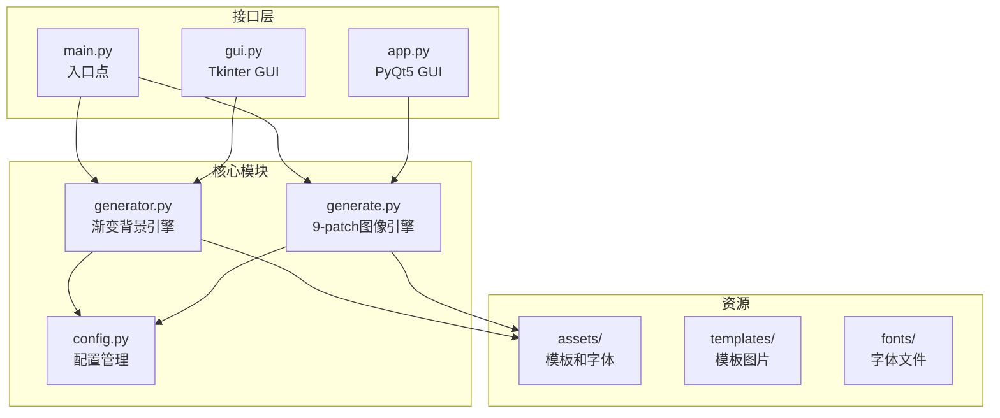
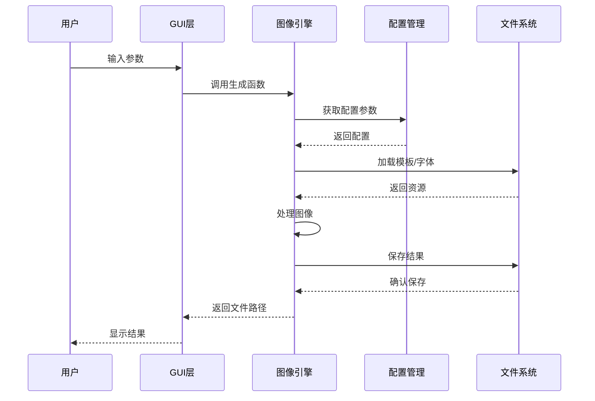
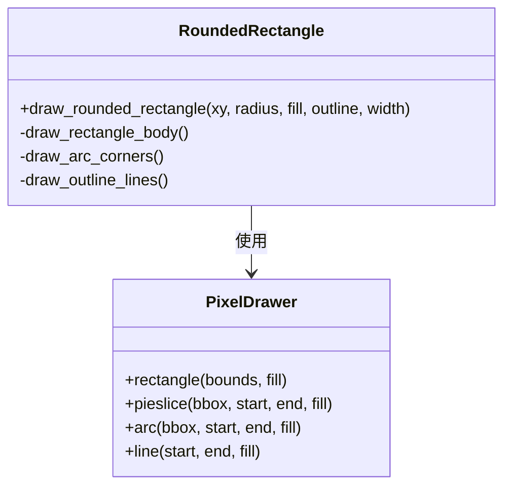
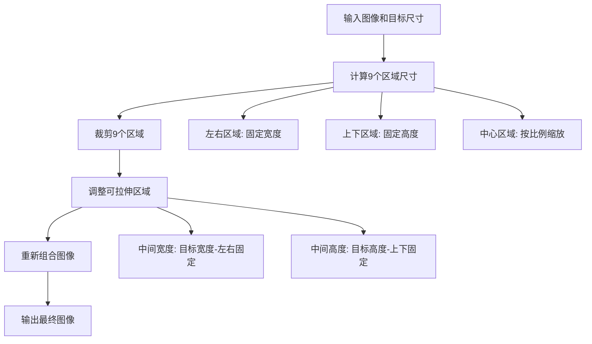
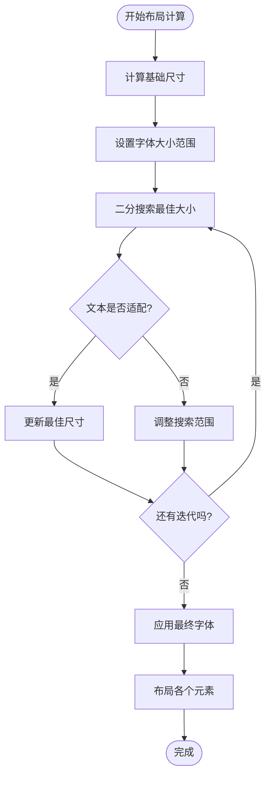
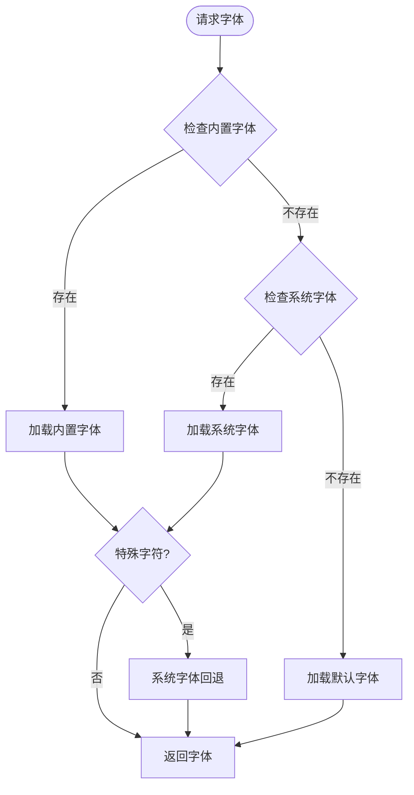
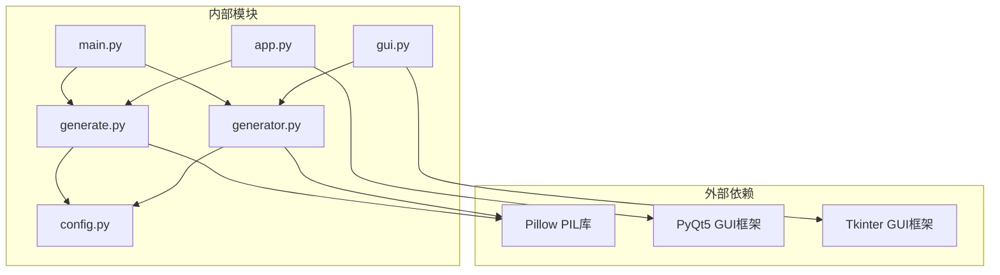

# 核心模块详解

<cite>
**本文档引用的文件**
- [generator.py](file://generator.py)
- [generate.py](file://generate.py)
- [config.py](file://config.py)
- [app.py](file://app.py)
- [gui.py](file://gui.py)
- [main.py](file://main.py)
</cite>

## 目录
1. [简介](#简介)
2. [项目结构](#项目结构)
3. [核心组件](#核心组件)
4. [架构概览](#架构概览)
5. [详细组件分析](#详细组件分析)
6. [依赖关系分析](#依赖关系分析)
7. [性能考虑](#性能考虑)
8. [故障排除指南](#故障排除指南)
9. [结论](#结论)

## 简介

这是一个多地区电子优惠券生成器项目，提供了两种不同的图像生成引擎实现。该项目支持多个东南亚地区的货币格式化、多种模板风格，并提供了命令行界面和图形用户界面两种使用方式。

项目的核心功能包括：
- 渐变背景创建和圆角矩形绘制
- 自适应字体加载和文本布局算法
- 9-patch缩放技术
- 多地区货币格式化
- 跨平台GUI支持

## 项目结构

项目采用模块化设计，主要包含以下核心文件：



**图表来源**
- [generator.py:1-360](file://generator.py#L1-L360)
- [generate.py:1-429](file://generate.py#L1-L429)
- [config.py:1-178](file://config.py#L1-L178)

**章节来源**
- [generator.py:1-360](file://generator.py#L1-L360)
- [generate.py:1-429](file://generate.py#L1-L429)
- [config.py:1-178](file://config.py#L1-L178)

## 核心组件

### 图像生成引擎 (generator.py)

这是项目的主要图像生成引擎，专注于渐变背景和圆角矩形绘制。核心功能包括：

- **颜色系统**: 支持十六进制颜色转换和RGB插值
- **渐变渲染**: 实现线性渐变背景创建
- **形状绘制**: 提供圆角矩形绘制功能
- **文本处理**: 支持自适应字体大小和文本居中
- **模板系统**: 基于配置的多模板支持

### 9-patch图像引擎 (generate.py)

专门用于处理模板图像的9-patch缩放，确保边缘保持不变而中间区域可以自由拉伸：

- **区域分割**: 将图像分为9个区域进行独立处理
- **智能缩放**: 中间区域按比例缩放，边缘保持固定像素
- **字体系统**: 支持多语言字体加载和回退机制
- **布局算法**: 实现自适应文本布局和对齐

### 配置管理系统 (config.py)

集中管理所有配置参数：

- **区域配置**: 支持6个东南亚国家的货币和格式设置
- **模板配置**: 定义不同模板的视觉属性
- **资源路径**: 管理字体和输出目录的路径配置

**章节来源**
- [generator.py:14-360](file://generator.py#L14-L360)
- [generate.py:15-429](file://generate.py#L15-L429)
- [config.py:1-178](file://config.py#L1-L178)

## 架构概览

项目采用分层架构设计，清晰分离了业务逻辑、数据处理和用户界面：



**图表来源**
- [main.py:18-106](file://main.py#L18-L106)
- [app.py:205-242](file://app.py#L205-L242)
- [gui.py:418-456](file://gui.py#L418-L456)

## 详细组件分析

### 渐变背景引擎 (generator.py)

#### 颜色插值算法

渐变背景的实现基于线性插值算法，通过计算每个像素在角度方向上的投影位置来确定颜色值：

```mermaid
flowchart TD
Start([开始渐变计算]) --> CalcAngle[计算角度弧度]
CalcAngle --> GetCorners[获取四个角落坐标]
GetCorners --> ProjCalc[计算投影范围]
ProjCalc --> LoopPixels[遍历每个像素]
LoopPixels --> CalcProj[计算像素投影位置]
CalcProj --> Normalize[归一化到[0,1]]
Normalize --> Interpolate[颜色插值]
Interpolate --> SetPixel[设置像素颜色]
SetPixel --> NextPixel{还有像素?}
NextPixel --> |是| LoopPixels
NextPixel --> |否| End([完成])
```

**图表来源**
- [generator.py:28-60](file://generator.py#L28-L60)

#### 圆角矩形绘制算法

圆角矩形通过组合矩形主体和四分之一圆弧实现：



**图表来源**
- [generator.py:63-89](file://generator.py#L63-L89)

**章节来源**
- [generator.py:14-60](file://generator.py#L14-L60)
- [generator.py:63-89](file://generator.py#L63-L89)

### 9-patch图像引擎 (generate.py)

#### 9-patch缩放算法

9-patch缩放将图像分为9个区域，确保边缘保持固定像素而中间区域可以自由缩放：



**图表来源**
- [generate.py:155-214](file://generate.py#L155-L214)

#### 自适应布局算法

布局算法采用二分搜索来找到最佳字体大小，确保文本在指定区域内完美适配：



**图表来源**
- [generate.py:281-324](file://generate.py#L281-L324)

**章节来源**
- [generate.py:155-214](file://generate.py#L155-L214)
- [generate.py:281-324](file://generate.py#L281-L324)

### 字体加载机制

#### 多级字体加载策略

字体加载实现了三级回退机制，确保在各种环境下都能正确显示文本：



**图表来源**
- [generate.py:73-89](file://generate.py#L73-L89)
- [generator.py:91-114](file://generator.py#L91-L114)

**章节来源**
- [generate.py:73-121](file://generate.py#L73-L121)
- [generator.py:91-123](file://generator.py#L91-L123)

## 依赖关系分析

项目采用松耦合的设计，各模块之间通过清晰的接口进行通信：



**图表来源**
- [generator.py:6-11](file://generator.py#L6-L11)
- [generate.py:6-9](file://generate.py#L6-L9)
- [app.py:13-21](file://app.py#L13-L21)
- [gui.py:6-11](file://gui.py#L6-L11)

**章节来源**
- [generator.py:6-11](file://generator.py#L6-L11)
- [generate.py:6-9](file://generate.py#L6-L9)
- [app.py:13-21](file://app.py#L13-L21)
- [gui.py:6-11](file://gui.py#L6-L11)

## 性能考虑

### 图像处理优化

1. **内存管理**: 使用PIL的延迟加载机制，避免不必要的内存占用
2. **缓存策略**: 对已生成的预览图进行缓存，减少重复计算
3. **批量操作**: 合并多次绘制操作，减少CPU开销

### 字体渲染优化

1. **字体缓存**: 缓存已加载的字体对象，避免重复加载
2. **回退机制**: 智能选择最适合的字体，减少渲染失败
3. **尺寸预计算**: 预先计算文本边界框，避免重复测量

### 用户界面优化

1. **延迟更新**: 使用定时器合并频繁的UI更新
2. **异步处理**: 在后台线程中处理图像生成，保持界面响应
3. **资源清理**: 及时释放不再使用的图像和字体资源

## 故障排除指南

### 常见问题及解决方案

#### 字体加载失败
- **症状**: 文本显示为方块或缺失字符
- **原因**: 字体文件损坏或路径错误
- **解决**: 检查字体文件是否存在，确认路径配置正确

#### 图像生成错误
- **症状**: 生成过程中出现异常或图像质量差
- **原因**: 内存不足或磁盘空间不够
- **解决**: 关闭其他程序释放内存，清理磁盘空间

#### GUI界面问题
- **症状**: 界面显示异常或响应缓慢
- **原因**: GUI框架版本不兼容
- **解决**: 更新到最新版本的PyQt5或Tkinter

**章节来源**
- [app.py:228-241](file://app.py#L228-L241)
- [gui.py:453-456](file://gui.py#L453-L456)

## 结论

这个图像生成器项目展示了如何构建一个功能完整、跨平台的多地区优惠券生成系统。通过精心设计的模块架构和优化的算法实现，项目在保证功能完整性的同时，也注重了性能和用户体验。

主要特点包括：
- **模块化设计**: 清晰的功能分离和接口定义
- **跨平台支持**: 同时支持命令行和图形界面
- **国际化支持**: 完整的多地区货币和语言支持
- **性能优化**: 智能的缓存和资源管理策略
- **错误处理**: 完善的异常处理和回退机制

这个项目为开发者提供了一个优秀的参考实现，展示了现代Python图像处理应用的最佳实践。