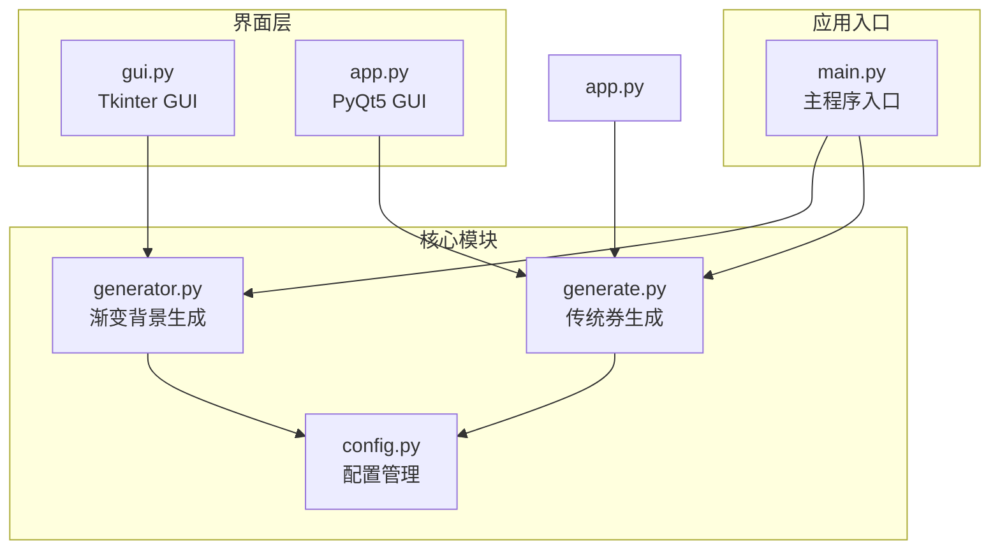
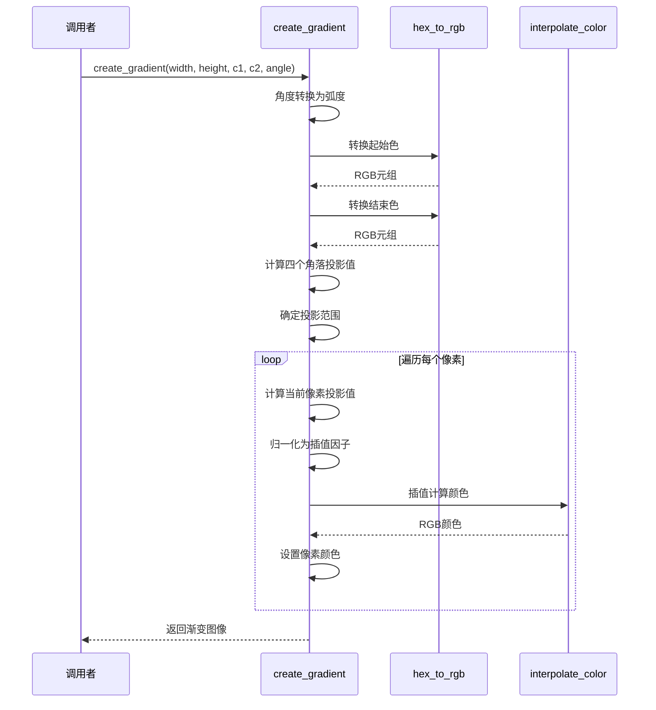
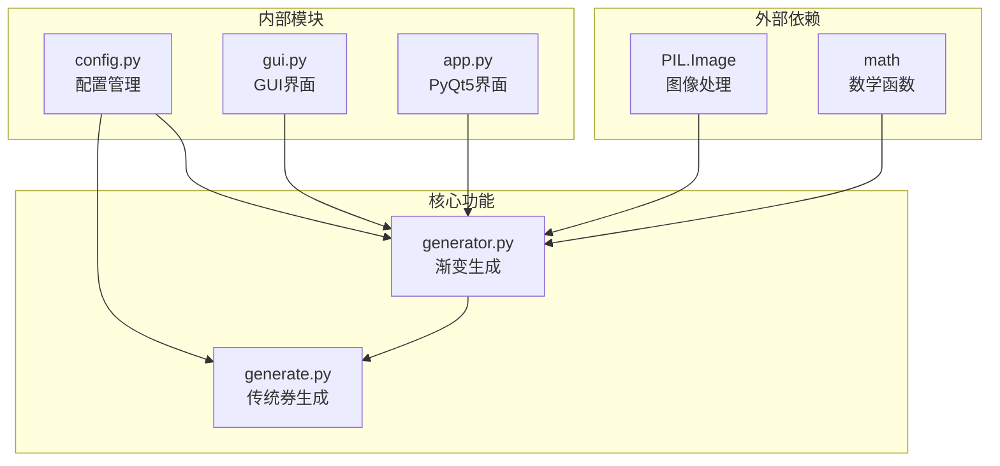

# 渐变背景系统

<cite>
**本文档引用的文件**
- [generator.py](file://generator.py)
- [config.py](file://config.py)
- [generate.py](file://generate.py)
- [gui.py](file://gui.py)
- [app.py](file://app.py)
</cite>

## 目录
1. [简介](#简介)
2. [项目结构](#项目结构)
3. [核心组件](#核心组件)
4. [架构概览](#架构概览)
5. [详细组件分析](#详细组件分析)
6. [依赖分析](#依赖分析)
7. [性能考虑](#性能考虑)
8. [故障排除指南](#故障排除指南)
9. [结论](#结论)

## 简介

本文档深入解析了Cash Generator项目中的渐变背景生成系统，重点分析`generator.py`文件中的`create_gradient`函数实现。该系统实现了高质量的线性渐变背景生成，支持任意角度的渐变效果，并提供了完整的色彩插值算法。

渐变背景系统是现代UI设计中的重要元素，能够为促销券、优惠券等视觉内容提供专业的视觉层次感。本系统通过数学投影理论实现了精确的渐变效果，确保在不同尺寸和角度下的视觉一致性。

## 项目结构

Cash Generator项目采用模块化设计，主要包含以下核心模块：



**图表来源**
- [generator.py:1-360](file://generator.py#L1-L360)
- [config.py:1-178](file://config.py#L1-L178)

**章节来源**
- [generator.py:1-360](file://generator.py#L1-L360)
- [config.py:1-178](file://config.py#L1-L178)

## 核心组件

渐变背景系统的核心由三个关键函数组成：

### 主要函数概览

1. **`create_gradient`** - 主要的线性渐变生成函数
2. **`hex_to_rgb`** - 十六进制颜色到RGB的转换函数  
3. **`interpolate_color`** - RGB颜色插值函数

这些函数协同工作，实现了从数学投影到像素渲染的完整流程。

**章节来源**
- [generator.py:28-60](file://generator.py#L28-L60)
- [generator.py:14-25](file://generator.py#L14-L25)

## 架构概览

渐变背景生成系统的整体架构遵循"数学建模-数据转换-像素渲染"的设计模式：

```mermaid
flowchart TD
A[输入参数<br/>宽度, 高度, 起始色, 结束色, 角度] --> B[角度转换<br/>度数到弧度]
B --> C[投影计算<br/>计算四个角落的投影值]
C --> D[范围确定<br/>找到最小值和最大值]
D --> E[边界处理<br/>确保范围不为零]
E --> F[颜色转换<br/>十六进制到RGB]
F --> G[逐像素处理<br/>遍历每个像素点]
G --> H[投影计算<br/>计算当前像素的投影值]
H --> I[因子计算<br/>归一化到[0,1]范围]
I --> J[边界约束<br/>确保因子在有效范围内]
J --> K[颜色插值<br/>线性插值计算最终颜色]
K --> L[像素着色<br/>设置RGB值]
L --> M[输出图像<br/>PIL Image对象]
```

**图表来源**
- [generator.py:28-60](file://generator.py#L28-L60)
- [generator.py:14-25](file://generator.py#L14-L25)

## 详细组件分析

### create_gradient函数详解

`create_gradient`函数是整个渐变系统的核心，实现了完整的线性渐变算法。

#### 数学原理

线性渐变基于**正交投影**理论，将二维平面上的点投影到一维空间：

**投影公式**：
```
p(x,y) = x * cos(θ) + y * sin(θ)
```

其中：
- `(x,y)` 是像素坐标
- `θ` 是渐变角度（弧度）
- `p(x,y)` 是投影值，决定了颜色插值因子

**投影范围计算**：
1. 计算四个角落的投影值
2. 找到最小值和最大值
3. 确保投影范围不为零以避免除零错误

#### 角度转换机制

```mermaid
flowchart LR
A[输入角度<br/>度数] --> B[转换函数<br/>math.radians]
B --> C[输出角度<br/>弧度]
C --> D[三角函数<br/>cos(θ), sin(θ)]
D --> E[投影系数<br/>用于计算投影值]
```

**图表来源**
- [generator.py:33-35](file://generator.py#L33-L35)

#### 坐标系变换分析

渐变系统通过**正交投影**实现了二维到一维的空间映射：

```mermaid
graph LR
subgraph "原始坐标系"
A[x轴]
B[y轴]
C[原点(0,0)]
end
subgraph "投影坐标系"
D[p轴<br/>投影值]
E[原点(0,0)]
end
A --> D
B --> D
C --> E
F[投影方向<br/>角度θ] --> D
```

**图表来源**
- [generator.py:33-47](file://generator.py#L33-L47)

#### 边界值处理机制

系统实现了多重边界保护机制：

1. **投影范围保护**：确保`max_p != min_p`，避免除零错误
2. **因子范围约束**：使用`max(0.0, min(1.0, factor))`确保插值因子在[0,1]范围内
3. **颜色值保护**：RGB分量自动约束在[0,255]范围内

**章节来源**
- [generator.py:47-57](file://generator.py#L47-L57)

### hex_to_rgb辅助函数

该函数负责将十六进制颜色字符串转换为RGB元组：

**转换算法**：
```
RGB(r,g,b) = hex_to_rgb("#RRGGBB")
- r = int(hex[0:2], 16)
- g = int(hex[2:4], 16)  
- b = int(hex[4:6], 16)
```

**实现特点**：
- 自动去除`#`前缀
- 支持标准HTML颜色格式
- 返回元组形式的RGB值

**章节来源**
- [generator.py:14-17](file://generator.py#L14-L17)

### interpolate_color辅助函数

RGB颜色插值函数实现了线性颜色混合：

**插值公式**：
```
C(factor) = C1 + (C2 - C1) * factor
```

其中：
- `C1` 和 `C2` 分别是起始色和结束色
- `factor` 是插值因子，范围[0,1]
- `C(factor)` 是最终颜色

**数学推导过程**：
1. 对每个RGB分量独立进行插值
2. 使用线性插值公式：`value = start + (end - start) * factor`
3. 结果取整数，确保合法的RGB值

**章节来源**
- [generator.py:20-25](file://generator.py#L20-L25)

### 完整算法流程



**图表来源**
- [generator.py:28-60](file://generator.py#L28-L60)
- [generator.py:14-25](file://generator.py#L14-L25)

## 依赖分析

渐变背景系统与其他模块的依赖关系：



**图表来源**
- [generator.py:6-11](file://generator.py#L6-L11)
- [config.py:1-178](file://config.py#L1-L178)

**章节来源**
- [generator.py:6-11](file://generator.py#L6-L11)
- [config.py:1-178](file://config.py#L1-L178)

## 性能考虑

### 时间复杂度分析

渐变生成算法的时间复杂度为O(W×H)，其中W和H分别是图像的宽度和高度：

- **外层循环**：遍历高度方向的像素（H次）
- **内层循环**：遍历宽度方向的像素（W次）
- **每次迭代**：执行常数时间的数学运算

总时间复杂度：O(W×H)

### 空间复杂度分析

空间复杂度为O(1)，因为：
- 只使用固定数量的变量存储中间结果
- 图像直接在内存中生成，不需要额外的缓存
- 投影计算是就地进行的

### 性能优化建议

1. **批量处理**：对于大量相似渐变，可以考虑缓存计算结果
2. **向量化操作**：使用NumPy等库进行向量化计算
3. **多线程处理**：将不同行的像素处理分配到不同线程
4. **内存管理**：及时释放不再使用的图像对象

## 故障排除指南

### 常见问题及解决方案

#### 1. 渐变角度不正确

**问题表现**：渐变方向与预期不符
**可能原因**：
- 角度单位错误（度数vs弧度）
- 坐标系方向理解错误

**解决方法**：
- 确认角度输入为度数
- 理解正角度的几何含义

#### 2. 颜色边界问题

**问题表现**：渐变边缘出现颜色溢出
**可能原因**：
- RGB值超出[0,255]范围
- 插值因子未正确约束

**解决方法**：
- 检查插值因子的边界处理
- 验证颜色转换函数的正确性

#### 3. 性能问题

**问题表现**：大图像生成速度慢
**可能原因**：
- 像素级循环效率低
- 缺少适当的优化

**解决方法**：
- 考虑使用更高效的图像处理库
- 实现适当的缓存机制

**章节来源**
- [generator.py:56](file://generator.py#L56)

## 结论

Cash Generator项目的渐变背景生成系统展现了优秀的工程实践：

### 技术亮点

1. **数学严谨性**：基于正交投影理论的精确算法
2. **实现简洁性**：清晰的代码结构和明确的函数职责
3. **扩展性强**：模块化的函数设计便于维护和扩展
4. **性能合理**：在可接受的时间复杂度内提供高质量效果

### 系统优势

- **准确性**：数学投影确保渐变效果的物理意义
- **稳定性**：完善的边界值处理机制
- **兼容性**：支持多种颜色格式和角度设置
- **可维护性**：清晰的代码结构和注释

### 应用价值

该渐变系统不仅适用于优惠券生成，还可广泛应用于：
- UI设计工具
- 图形编辑软件
- 数据可视化应用
- 移动端界面设计

通过深入理解其数学原理和实现细节，开发者可以更好地利用这一系统，或在此基础上进行进一步的功能扩展和性能优化。