# 配置系统架构

<cite>
**本文档引用的文件**
- [config.py](file://config.py)
- [generator.py](file://generator.py)
- [gui.py](file://gui.py)
- [main.py](file://main.py)
- [generate.py](file://generate.py)
- [app.py](file://app.py)
</cite>

## 目录
1. [简介](#简介)
2. [项目结构](#项目结构)
3. [核心组件](#核心组件)
4. [架构概览](#架构概览)
5. [详细组件分析](#详细组件分析)
6. [依赖关系分析](#依赖关系分析)
7. [性能考虑](#性能考虑)
8. [故障排除指南](#故障排除指南)
9. [结论](#结论)
10. [附录](#附录)

## 简介

Cash Generator 是一个面向东南亚电商市场的多区域现金券生成器。该系统的核心配置管理架构提供了灵活的区域配置、模板管理和字体资源管理功能。本文档深入解析配置系统的数据结构设计、加载机制和扩展指南。

## 项目结构

该项目采用模块化设计，主要包含以下核心模块：

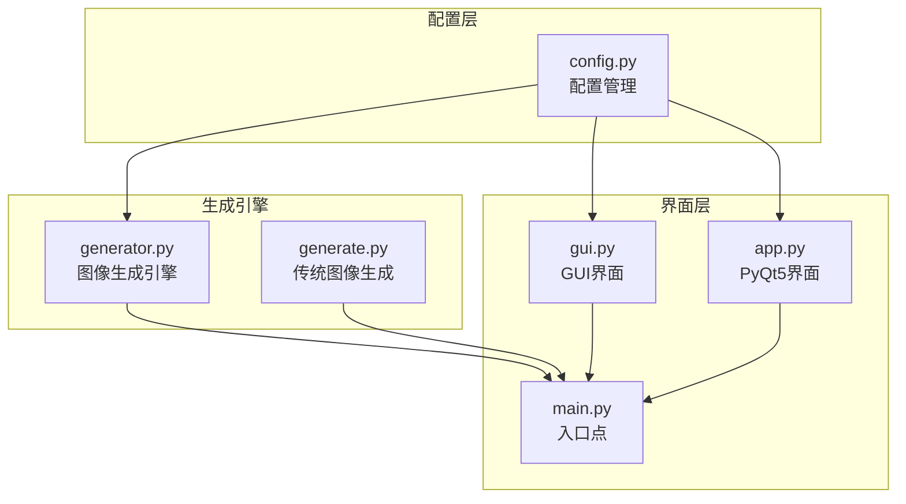

**图表来源**
- [config.py:1-178](file://config.py#L1-L178)
- [generator.py:1-360](file://generator.py#L1-L360)
- [gui.py:1-499](file://gui.py#L1-L499)
- [main.py:1-131](file://main.py#L1-L131)

**章节来源**
- [config.py:1-178](file://config.py#L1-L178)
- [generator.py:1-360](file://generator.py#L1-L360)
- [gui.py:1-499](file://gui.py#L1-L499)
- [main.py:1-131](file://main.py#L1-L131)

## 核心组件

### 配置管理架构

配置系统采用集中式管理策略，通过单一配置文件统一管理所有应用设置：

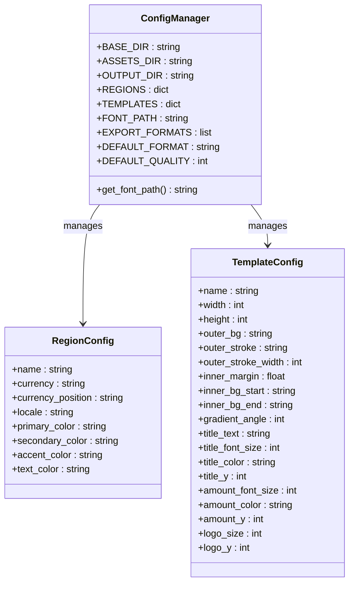

**图表来源**
- [config.py:19-80](file://config.py#L19-L80)
- [config.py:85-149](file://config.py#L85-L149)

### 区域配置(REGIONS)

区域配置采用嵌套字典结构，每个区域包含完整的本地化信息：

| 区域代码 | 名称 | 货币符号 | 货币位置 | 语言环境 |
|---------|------|----------|----------|----------|
| MY | 马来西亚 | RM | 前缀 | en_MY |
| TH | 泰国 | ฿ | 前缀 | th_TH |
| ID | 印度尼西亚 | Rp | 前缀 | id_ID |
| PH | 菲律宾 | ₱ | 前缀 | en_PH |
| SG | 新加坡 | $ | 前缀 | en_SG |
| VN | 越南 | ₫ | 后缀 | vi_VN |

### 模板配置(TEMPLATES)

模板配置定义了视觉设计参数，支持多种品牌风格：

| 模板键 | 名称 | 尺寸 | 外层背景 | 内层渐变 |
|--------|------|------|----------|----------|
| lazcash | LazCash | 420×420 | #FF475A | 渐变角度143° |
| shopee_coins | Shopee Coins | 420×420 | #EE4D2D | 渐变角度143° |
| tokopedia_deals | Tokopedia Deals | 420×420 | #03AC0E | 渐变角度143° |

**章节来源**
- [config.py:19-80](file://config.py#L19-L80)
- [config.py:85-149](file://config.py#L85-L149)

## 架构概览

配置系统采用分层架构设计，确保配置的可维护性和扩展性：

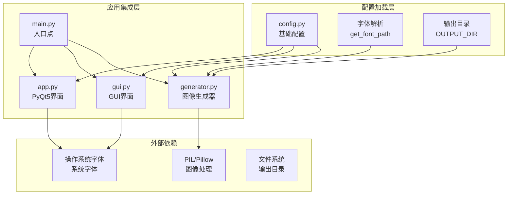

**图表来源**
- [config.py:154-170](file://config.py#L154-L170)
- [generator.py:9-11](file://generator.py#L9-L11)

## 详细组件分析

### 配置文件加载顺序

配置系统遵循严格的加载顺序以确保依赖关系正确：

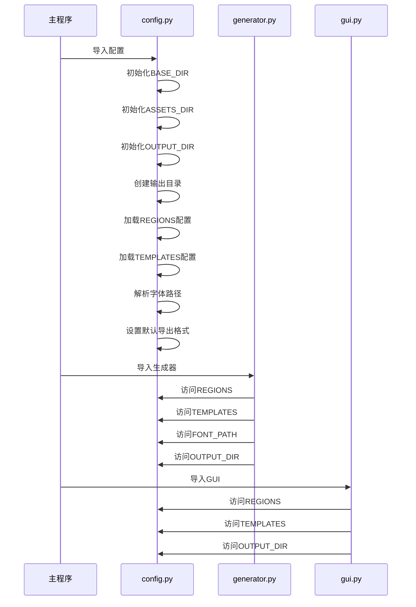

**图表来源**
- [config.py:9-14](file://config.py#L9-L14)
- [config.py:19-80](file://config.py#L19-L80)
- [config.py:85-149](file://config.py#L85-L149)

### 字体路径解析逻辑

字体解析采用多层次优先级策略，确保跨平台兼容性：

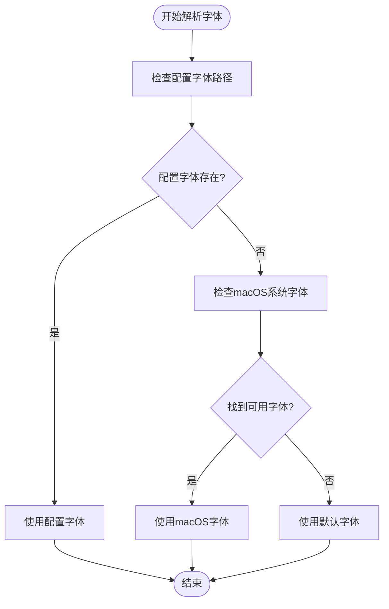

**图表来源**
- [config.py:154-169](file://config.py#L154-L169)
- [generator.py:91-115](file://generator.py#L91-L115)

### 输出目录管理机制

输出目录采用动态创建策略，支持多种存储位置：

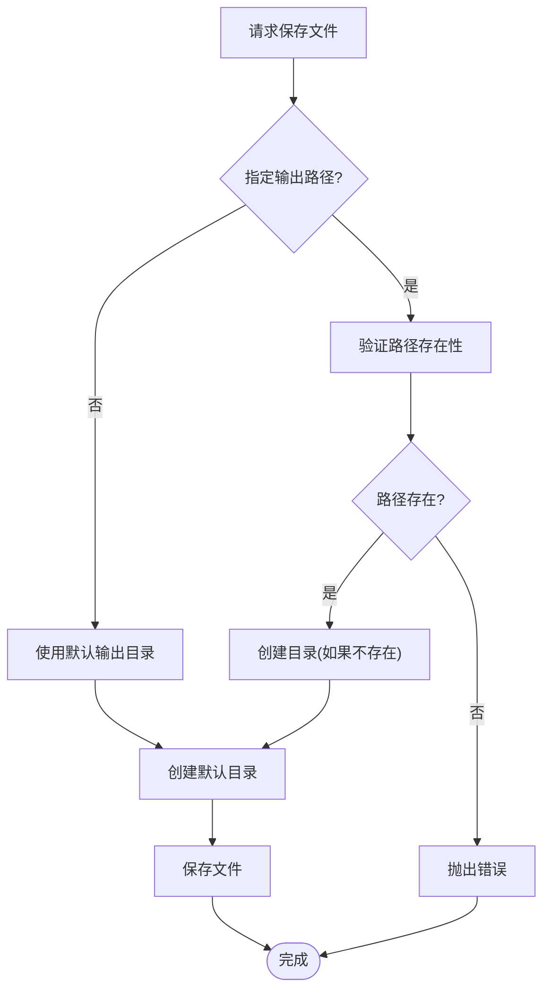

**图表来源**
- [config.py:11](file://config.py#L11)
- [generator.py:335-341](file://generator.py#L335-L341)

### 配置验证规则

配置系统实现了多层次的验证机制：

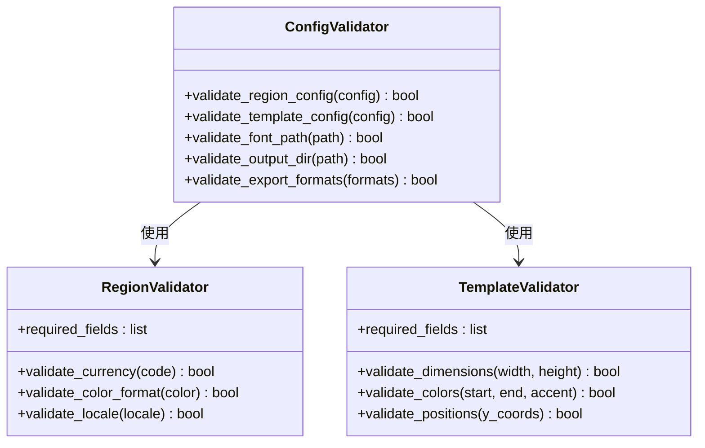

**图表来源**
- [config.py:19-80](file://config.py#L19-L80)
- [config.py:85-149](file://config.py#L85-L149)

**章节来源**
- [config.py:154-170](file://config.py#L154-L170)
- [generator.py:145-346](file://generator.py#L145-L346)

## 依赖关系分析

配置系统与其他模块的依赖关系如下：

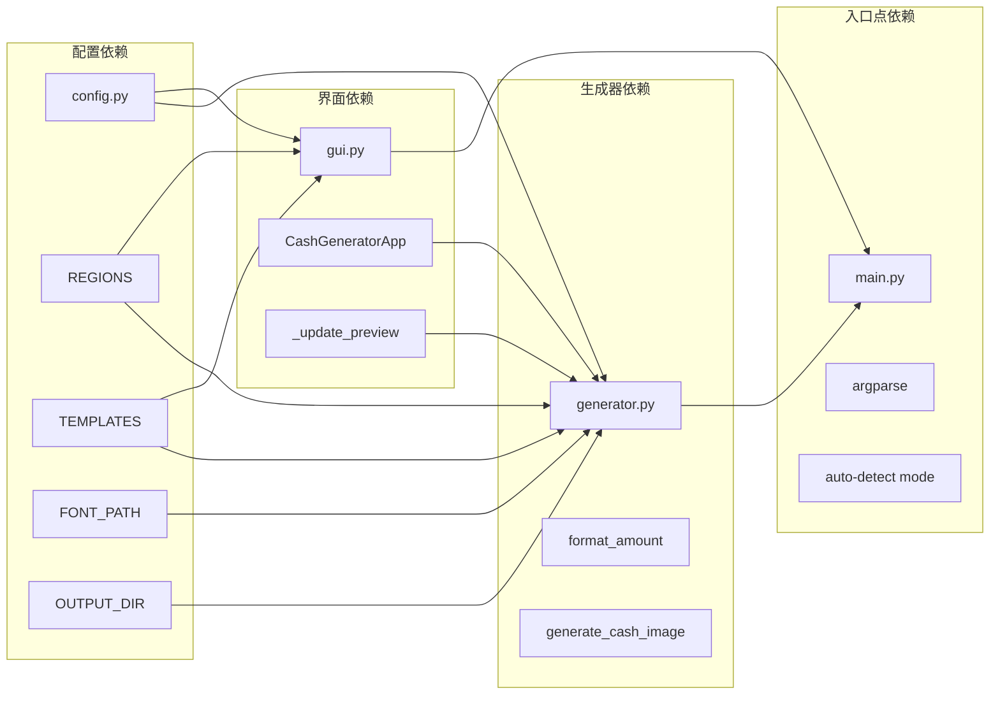

**图表来源**
- [generator.py:9-11](file://generator.py#L9-L11)
- [gui.py:13-14](file://gui.py#L13-L14)
- [main.py:14-15](file://main.py#L14-L15)

**章节来源**
- [generator.py:1-360](file://generator.py#L1-L360)
- [gui.py:1-499](file://gui.py#L1-L499)
- [main.py:1-131](file://main.py#L1-L131)

## 性能考虑

### 配置缓存策略

配置系统实现了智能缓存机制以提升性能：

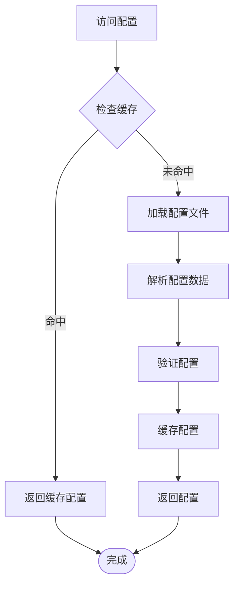

### 字体加载优化

字体加载采用延迟加载策略，减少启动时间：

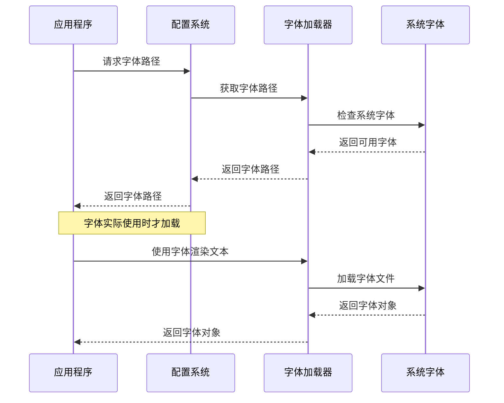

**图表来源**
- [config.py:154-169](file://config.py#L154-L169)
- [generator.py:91-115](file://generator.py#L91-L115)

## 故障排除指南

### 常见配置问题

| 问题类型 | 症状 | 解决方案 |
|----------|------|----------|
| 字体缺失 | 字体加载失败，使用默认字体 | 检查系统字体安装，确认字体路径正确 |
| 输出目录权限 | 文件保存失败 | 检查输出目录权限，确保有写入权限 |
| 区域配置错误 | 货币格式显示异常 | 验证区域配置的货币符号和位置设置 |
| 模板配置无效 | 图像渲染错误 | 检查模板配置的数值范围和颜色格式 |

### 调试配置问题

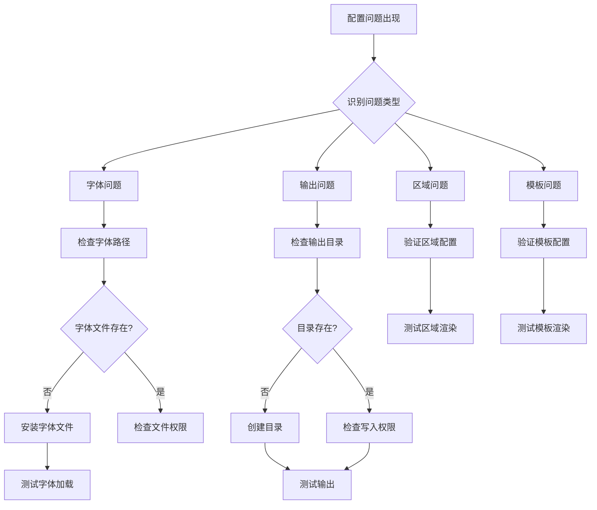

**图表来源**
- [config.py:13](file://config.py#L13)
- [generator.py:335-341](file://generator.py#L335-L341)

**章节来源**
- [config.py:13-14](file://config.py#L13-L14)
- [generator.py:411-421](file://generator.py#L411-L421)

## 结论

Cash Generator 的配置系统展现了优秀的架构设计，通过模块化的配置管理、灵活的扩展机制和完善的错误处理，为多区域电商券生成提供了强大的基础设施。系统的关键优势包括：

1. **统一配置管理**：集中式的配置文件简化了维护工作
2. **跨平台兼容**：智能的字体解析和路径处理确保了良好的跨平台体验
3. **可扩展性**：清晰的配置结构便于添加新的区域和模板
4. **健壮性**：多层次的验证和错误处理提升了系统的稳定性

## 附录

### 配置扩展指南

#### 添加新区域支持

1. 在 `REGIONS` 字典中添加新的区域配置
2. 确保包含必需字段：`name`、`currency`、`currency_position`、`locale`
3. 验证颜色值使用十六进制格式
4. 测试货币格式化功能

#### 自定义模板样式

1. 在 `TEMPLATES` 字典中添加新的模板配置
2. 定义模板的基本尺寸和视觉参数
3. 确保颜色值使用十六进制格式
4. 测试模板渲染效果

#### 字体资源管理

1. 将字体文件放置在 `assets/fonts/` 目录
2. 更新字体解析逻辑以支持新字体
3. 测试字体渲染效果
4. 考虑字体文件的许可证要求

### 最佳实践

1. **配置验证**：始终验证配置的有效性
2. **错误处理**：实现优雅的降级策略
3. **性能优化**：使用缓存和延迟加载
4. **文档维护**：保持配置文档的更新
5. **测试覆盖**：为新配置添加自动化测试