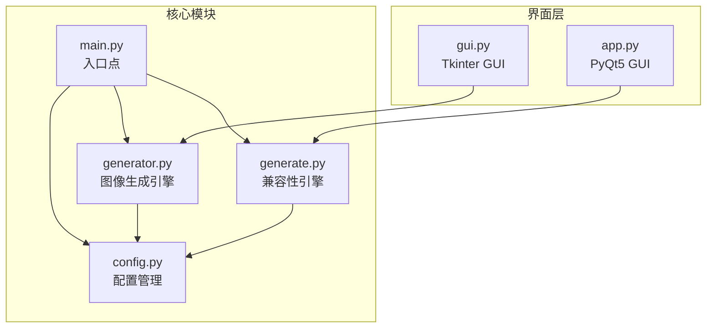

# 快速开始

<cite>
**本文引用的文件**
- [main.py](file://src/main.py)
- [config.py](file://src/config.py)
- [generator.py](file://src/generator.py)
- [generate.py](file://src/generate.py)
- [gui.py](file://src/gui.py)
- [app.py](file://src/app.py)
</cite>

## 目录
1. [简介](#简介)
2. [项目结构](#项目结构)
3. [环境要求](#环境要求)
4. [安装步骤](#安装步骤)
5. [快速上手](#快速上手)
6. [使用方式](#使用方式)
7. [常见场景示例](#常见场景示例)
8. [故障排除](#故障排除)
9. [常见问题解答](#常见问题解答)
10. [结语](#结语)

## 简介

这是一个多地区促销券生成器，支持多个电商平台的优惠券模板。该工具可以快速生成符合不同地区货币格式和设计风格的促销券图片，适用于电商营销活动。

主要特性：
- 支持马来西亚(MY)、泰国(TH)、印度尼西亚(ID)、菲律宾(PH)、新加坡(SG)、越南(VN)等多个地区
- 提供LazCash、Shopee Coins、Tokopedia Deals等多种模板风格
- 支持命令行和图形界面两种使用方式
- 自动适配不同地区的货币格式和显示位置

## 项目结构



**图表来源**
- [main.py:1-131](file://src/main.py#L1-L131)
- [config.py:1-178](file://src/config.py#L1-L178)
- [generator.py:1-360](file://src/generator.py#L1-L360)
- [generate.py:1-429](file://src/generate.py#L1-L429)
- [gui.py:1-499](file://src/gui.py#L1-L499)
- [app.py:1-269](file://src/app.py#L1-L269)

**章节来源**
- [main.py:1-131](file://src/main.py#L1-L131)
- [config.py:1-178](file://src/config.py#L1-L178)

## 环境要求

### 系统要求
- Python 3.6 或更高版本
- macOS、Windows 或 Linux 系统
- 至少 512MB 内存

### 依赖包
项目需要以下Python包：

```bash
pip install Pillow
pip install PyQt5  # 仅用于PyQt5 GUI版本
```

### 文件系统要求
- 可写入的下载目录 (`~/Downloads/Lazada_Coupons/output`)
- 可写入的桌面目录 (`~/Desktop`)

## 安装步骤

### 步骤1：克隆项目
```bash
git clone <repository-url>
cd cash-generator
```

### 步骤2：安装依赖
```bash
pip install Pillow
pip install PyQt5  # 如果需要PyQt5 GUI版本
```

### 步骤3：验证安装
```bash
python src/main.py --help
```

### 步骤4：首次运行测试
```bash
python src/main.py --amount 15 --region SG
```

**章节来源**
- [main.py:18-106](file://src/main.py#L18-L106)

## 快速上手

### 方法一：命令行快速生成（推荐新手）

1. **生成默认优惠券**
```bash
python src/main.py --amount 15 --region SG
```

2. **生成自定义金额优惠券**
```bash
python src/main.py --amount 50 --region MY
```

3. **指定输出路径**
```bash
python src/main.py --amount 100 --region ID --output ~/Desktop/my_voucher.png
```

4. **添加优惠码和有效期**
```bash
python src/main.py --amount 25 --region TH --code WELCOME2024 --expiry 2024-12-31
```

### 方法二：图形界面操作

1. **启动GUI应用**
```bash
python src/main.py
```

2. **在界面中进行操作**
   - 选择地区和模板
   - 输入金额
   - 可选：输入优惠码和有效期
   - 点击"Export"保存图片

### 方法三：PyQt5 GUI版本

```bash
python src/app.py
```

**章节来源**
- [main.py:18-106](file://src/main.py#L18-L106)
- [gui.py:491-499](file://src/gui.py#L491-L499)
- [app.py:244-269](file://src/app.py#L244-L269)

## 使用方式

### 命令行模式

#### 基本语法
```bash
python src/main.py --amount <数值> [--region <地区代码>] [--template <模板名>] [--code <优惠码>] [--expiry <有效期>] [--output <输出路径>] [--preview] [--list-regions] [--list-templates]
```

#### 参数说明
- `--amount/-a`: 优惠券面额（必需）
- `--region/-r`: 地区代码，默认"SG"
- `--template/-t`: 模板名称，默认"lazcash"
- `--code/-c`: 优惠码（可选）
- `--expiry/-e`: 有效期（可选）
- `--output/-o`: 输出文件路径（可选）
- `--preview/-p`: 生成后显示预览
- `--list-regions`: 列出可用地区
- `--list-templates`: 列出可用模板

#### 常用示例
```bash
# 列出所有地区
python src/main.py --list-regions

# 列出所有模板
python src/main.py --list-templates

# 生成带优惠码的优惠券
python src/main.py -a 50 -r MY -c WELCOME2024 -e 2024-12-31

# 指定自定义输出路径
python src/main.py -a 100 -t shopee_coins -o ~/Desktop/custom_voucher.png
```

### 图形界面模式

#### 启动方式
```bash
python src/main.py
```

#### 界面元素说明
- **地区选择**: 下拉菜单选择目标市场
- **模板选择**: 选择不同的设计风格
- **金额输入**: 数字输入框
- **优惠码**: 可选的优惠码文本
- **有效期**: 可选的有效期文本
- **生成按钮**: 生成预览
- **导出按钮**: 保存到文件

#### 快捷操作
- 点击"Quick"按钮快速设置常用金额
- 实时预览功能自动更新
- 支持暗黑/亮色主题切换

### PyQt5 GUI版本

#### 特点
- 更现代化的界面设计
- 更好的跨平台兼容性
- 解决macOS Tkinter渲染问题

#### 启动方式
```bash
python src/app.py
```

**章节来源**
- [main.py:18-106](file://src/main.py#L18-L106)
- [gui.py:117-271](file://src/gui.py#L117-L271)
- [app.py:23-242](file://src/app.py#L23-L242)

## 常见场景示例

### 生成不同金额的优惠券

#### 新手快速示例
```bash
# 5元优惠券（适合小额促销）
python src/main.py -a 5 -r SG

# 25元优惠券（适合中等促销）
python src/main.py -a 25 -r MY

# 100元优惠券（适合大促活动）
python src/main.py -a 100 -r ID
```

#### 批量生成示例
```bash
# 生成多个金额的优惠券
for amount in [10, 25, 50, 100, 200]:
    python src/main.py -a $amount -r SG -o ~/Desktop/voucher_${amount}.png
```

### 选择不同地区模板

#### 东南亚市场示例
```bash
# 马来西亚 - RM 15
python src/main.py -a 15 -r MY -t lazcash

# 泰国 - ฿50
python src/main.py -a 50 -r TH -t shopee_coins

# 印度尼西亚 - Rp 15.000
python src/main.py -a 15000 -r ID -t tokopedia_deals

# 菲律宾 - ₱25
python src/main.py -a 25 -r PH

# 新加坡 - $5
python src/main.py -a 5 -r SG

# 越南 - 50.000₫
python src/main.py -a 50000 -r VN
```

### 高级功能示例

#### 添加优惠码和有效期
```bash
python src/main.py -a 75 -r MY -c WELCOME2024 -e 2024-12-31
```

#### 自定义输出格式
```bash
# 生成PNG格式（默认）
python src/main.py -a 100 -r SG -o ~/Desktop/voucher.png

# 生成JPG格式
python src/main.py -a 100 -r SG -o ~/Desktop/voucher.jpg
```

**章节来源**
- [config.py:19-80](file://src/config.py#L19-L80)
- [config.py:85-149](file://src/config.py#L85-L149)
- [main.py:18-106](file://src/main.py#L18-L106)

## 故障排除

### 常见问题及解决方案

#### 1. 依赖包缺失
**问题**: `ModuleNotFoundError: No module named 'Pillow'`
**解决**: 
```bash
pip install Pillow
```

#### 2. 字体显示问题
**问题**: 特殊货币符号显示为方块
**解决**: 
- 确保系统有相应的字体
- 使用系统字体回退机制
- 检查字体文件是否存在

#### 3. 图像生成失败
**问题**: `FileNotFoundError: Template not found`
**解决**: 
- 确认资源文件夹存在
- 检查模板文件完整性
- 验证工作目录权限

#### 4. GUI界面无法启动
**问题**: PyQt5相关错误
**解决**: 
```bash
pip install PyQt5
```

#### 5. 输出路径权限问题
**问题**: 无法保存到指定位置
**解决**: 
- 检查目标目录权限
- 使用相对路径或用户目录
- 确保目录存在

### 调试模式

启用详细日志输出：
```bash
python src/main.py --amount 15 --region SG --preview
```

查看可用选项：
```bash
python src/main.py --help
```

**章节来源**
- [generate.py:237-241](file://src/generate.py#L237-L241)
- [gui.py:457-489](file://src/gui.py#L457-L489)
- [app.py:228-241](file://src/app.py#L228-L241)

## 常见问题解答

### Q1: 支持哪些地区？
**A**: 支持马来西亚(MY)、泰国(TH)、印度尼西亚(ID)、菲律宾(PH)、新加坡(SG)、越南(VN)

### Q2: 如何查看所有可用模板？
```bash
python src/main.py --list-templates
```

### Q3: 能否自定义颜色方案？
**A**: 可以通过修改配置文件中的颜色设置来定制

### Q4: 输出文件格式有哪些？
**A**: PNG和JPG格式，可在生成时指定

### Q5: 如何批量生成优惠券？
**A**: 使用shell脚本循环调用命令行接口

### Q6: 跨平台兼容性如何？
**A**: 支持macOS、Windows和Linux系统

### Q7: 如何添加新的地区支持？
**A**: 在配置文件中添加新的地区配置项

### Q8: 预览功能如何使用？
**A**: 在命令行中使用`--preview`参数，或在GUI界面中实时预览

**章节来源**
- [config.py:19-80](file://src/config.py#L19-L80)
- [config.py:85-149](file://src/config.py#L85-L149)
- [main.py:82-92](file://src/main.py#L82-L92)

## 结语

恭喜你完成了促销券生成器的快速上手！现在你可以：

1. **立即生成第一张优惠券**：使用最简单的命令
2. **探索不同地区模板**：体验多地区货币格式
3. **尝试多种使用方式**：命令行或图形界面任你选择
4. **扩展功能**：添加优惠码、设置有效期等高级功能

**下一步建议**：
- 尝试生成不同金额和地区的优惠券
- 探索不同的模板风格
- 学习批量生成技巧
- 自定义你的专属优惠券模板

祝你使用愉快，营销活动大获成功！