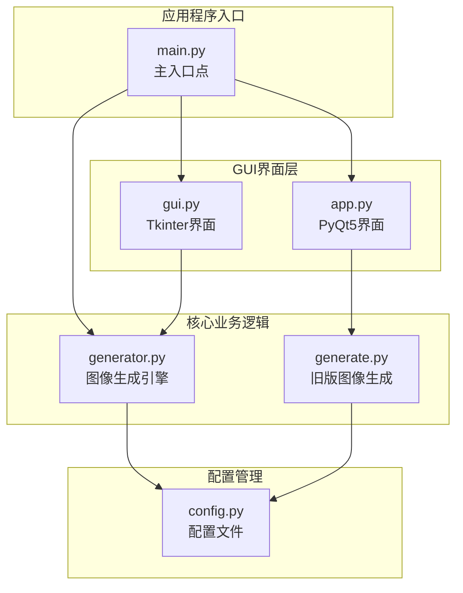
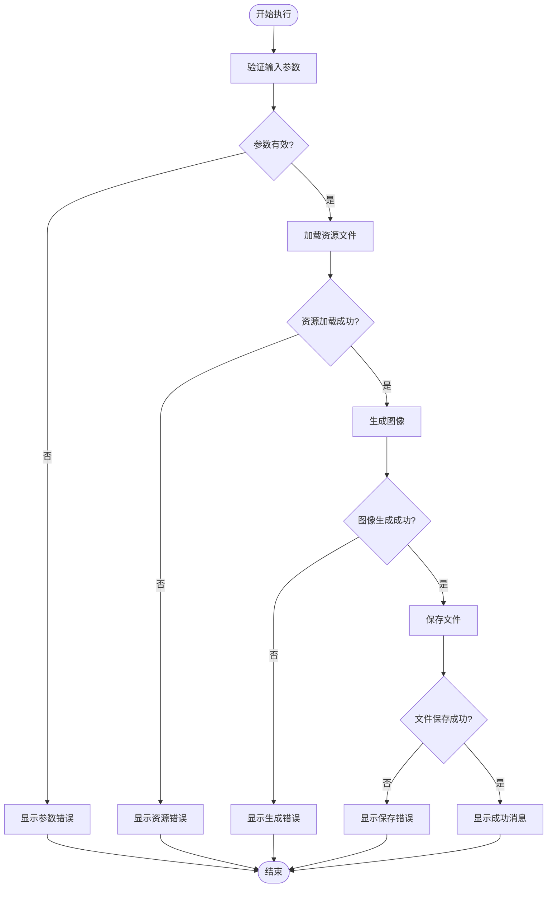
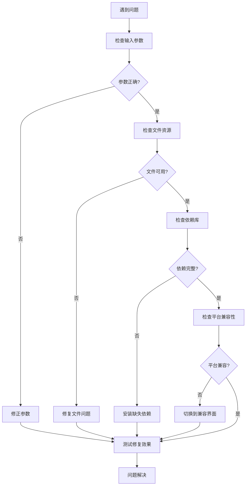

# 故障排除

<cite>
**本文档引用的文件**
- [app.py](file://src/app.py)
- [config.py](file://src/config.py)
- [generate.py](file://src/generate.py)
- [generator.py](file://src/generator.py)
- [gui.py](file://src/gui.py)
- [main.py](file://src/main.py)
</cite>

## 目录
1. [简介](#简介)
2. [项目结构](#项目结构)
3. [常见错误类型](#常见错误类型)
4. [参数错误排查](#参数错误排查)
5. [文件权限问题](#文件权限问题)
6. [依赖缺失问题](#依赖缺失问题)
7. [系统兼容性问题](#系统兼容性问题)
8. [日志查看与调试](#日志查看与调试)
9. [性能问题排查](#性能问题排查)
10. [操作系统特定问题](#操作系统特定问题)
11. [问题分类与快速查找](#问题分类与快速查找)
12. [结论](#结论)

## 简介

Cash Generator 是一个用于生成多地区促销券图片的Python应用程序。该工具支持多个东南亚地区的货币格式，并提供图形界面和命令行两种使用方式。本文档提供了全面的故障排除指南，帮助用户解决常见的使用问题和错误情况。

## 项目结构

项目采用模块化设计，主要包含以下核心组件：

**图表来源**
- [main.py:1-131](file://src/main.py#L1-L131)
- [app.py:1-269](file://src/app.py#L1-L269)
- [gui.py:1-499](file://src/gui.py#L1-L499)
- [generator.py:1-360](file://src/generator.py#L1-L360)
- [generate.py:1-429](file://src/generate.py#L1-L429)
- [config.py:1-178](file://src/config.py#L1-L178)

**章节来源**
- [main.py:1-131](file://src/main.py#L1-L131)
- [app.py:1-269](file://src/app.py#L1-L269)
- [gui.py:1-499](file://src/gui.py#L1-L499)
- [generator.py:1-360](file://src/generator.py#L1-L360)
- [generate.py:1-429](file://src/generate.py#L1-L429)
- [config.py:1-178](file://src/config.py#L1-L178)

## 常见错误类型

根据代码分析，应用程序可能遇到以下类型的错误：

### 1. 参数验证错误
- 金额输入格式错误（非数字）
- 区域代码无效
- 模板名称不存在
- 输出路径权限不足

### 2. 文件资源错误
- 缺少模板图片文件
- 缺少图标文件
- 缺少字体文件
- 输出目录不存在

### 3. 依赖库错误
- Pillow库版本不兼容
- PyQt5/Tkinter库缺失
- 系统字体不可用

### 4. 平台兼容性问题
- macOS特定渲染问题
- Windows字体路径差异
- Linux字体配置问题

**章节来源**
- [app.py:228-241](file://src/app.py#L228-L241)
- [generate.py:238-251](file://src/generate.py#L238-L251)
- [gui.py:453-455](file://src/gui.py#L453-L455)

## 参数错误排查

### 金额输入错误

**症状**: 点击生成按钮后出现"请输入有效的金额数字"错误提示

**原因分析**: 
- 用户输入非数字字符
- 输入为空值
- 数值超出有效范围

**解决方案**:
1. 确保金额字段只输入数字
2. 检查小数点使用是否正确
3. 验证金额是否在合理范围内

**章节来源**
- [app.py:228-234](file://src/app.py#L228-L234)

### 区域代码错误

**症状**: 图像生成失败，提示区域配置错误

**原因分析**:
- 使用了不存在的区域代码
- 区域配置数据损坏

**解决方案**:
1. 使用内置的区域列表功能查看可用选项
2. 确认区域代码拼写正确
3. 检查配置文件完整性

**章节来源**
- [main.py:82-86](file://src/main.py#L82-L86)
- [config.py:19-80](file://src/config.py#L19-L80)

### 模板选择错误

**症状**: 模板加载失败或显示空白

**原因分析**:
- 模板键名不存在
- 模板配置数据缺失

**解决方案**:
1. 使用模板列表功能确认可用模板
2. 检查模板配置文件
3. 确认模板文件存在

**章节来源**
- [main.py:88-92](file://src/main.py#L88-L92)
- [config.py:85-149](file://src/config.py#L85-L149)

## 文件权限问题

### 输出目录权限错误

**症状**: 无法保存生成的图片文件

**原因分析**:
- 输出目录不存在
- 用户没有写入权限
- 磁盘空间不足

**解决方案**:
1. 检查输出目录是否存在
2. 确认用户具有写入权限
3. 验证磁盘空间充足
4. 更改为有权限的目录

**章节来源**
- [generate.py:411-412](file://src/generate.py#L411-L412)
- [generator.py:335-341](file://src/generator.py#L335-L341)

### 资源文件访问错误

**症状**: 图片或字体加载失败

**原因分析**:
- 资源文件路径错误
- 文件被移动或删除
- 权限不足访问系统字体

**解决方案**:
1. 验证资源文件路径
2. 检查文件完整性
3. 确认文件权限
4. 重新安装应用程序

**章节来源**
- [generate.py:237-251](file://src/generate.py#L237-L251)
- [generator.py:91-114](file://src/generator.py#L91-L114)

## 依赖缺失问题

### Pillow库问题

**症状**: 图像处理功能异常

**原因分析**:
- Pillow库未安装
- 版本过低或过高
- 编译环境问题

**解决方案**:
1. 安装Pillow库：`pip install Pillow`
2. 更新到最新稳定版本
3. 检查编译依赖

**章节来源**
- [generator.py:8](file://src/generator.py#L8)
- [generate.py:9](file://src/generate.py#L9)

### GUI框架问题

**症状**: 界面无法正常显示或响应

**原因分析**:
- PyQt5或Tkinter未安装
- 版本不兼容
- 平台特定问题

**解决方案**:
1. 安装GUI框架：`pip install PyQt5`
2. 或者安装Tkinter：`pip install tk`
3. 检查平台兼容性

**章节来源**
- [app.py:13-18](file://src/app.py#L13-L18)
- [gui.py:9](file://src/gui.py#L9)

### 字体加载问题

**症状**: 文字显示异常或乱码

**原因分析**:
- 字体文件缺失
- 系统字体不可用
- 字符编码问题

**解决方案**:
1. 检查字体文件存在性
2. 验证字体文件完整性
3. 确认系统字体可用
4. 使用备用字体方案

**章节来源**
- [generate.py:73-88](file://src/generate.py#L73-L88)
- [generator.py:91-114](file://src/generator.py#L91-L114)

## 系统兼容性问题

### macOS特定问题

**症状**: 界面渲染异常或字体显示问题

**原因分析**:
- Tkinter 8.5.9渲染问题
- 系统主题切换影响
- 字体路径差异

**解决方案**:
1. 使用PyQt5界面替代
2. 检查系统字体配置
3. 验证Dark/Light模式兼容性

**章节来源**
- [app.py:4](file://src/app.py#L4)
- [gui.py:17-28](file://src/gui.py#L17-L28)

### Windows兼容性问题

**症状**: 文件路径分隔符错误或权限问题

**原因分析**:
- 路径分隔符使用不当
- 权限模型差异
- 字体路径配置

**解决方案**:
1. 使用os.path.join构建路径
2. 检查用户权限
3. 验证字体安装

**章节来源**
- [config.py:9-14](file://src/config.py#L9-L14)
- [generate.py:44-53](file://src/generate.py#L44-L53)

### Linux兼容性问题

**症状**: 字体加载失败或显示异常

**原因分析**:
- 字体包缺失
- 字体权限问题
- 显示环境配置

**解决方案**:
1. 安装系统字体包
2. 检查字体权限
3. 配置显示环境

**章节来源**
- [config.py:154-170](file://src/config.py#L154-L170)
- [generate.py:92-98](file://src/generate.py#L92-L98)

## 日志查看与调试

### 启用调试模式

**症状**: 需要更详细的错误信息

**解决方案**:
1. 在命令行模式下运行，查看详细输出
2. 检查控制台错误信息
3. 使用调试参数查看更多细节

**章节来源**
- [main.py:18-106](file://src/main.py#L18-L106)

### 错误信息分析

应用程序提供了多种错误提示机制：

**图表来源**
- [app.py:205-241](file://src/app.py#L205-L241)
- [gui.py:418-456](file://src/gui.py#L418-L456)

**章节来源**
- [app.py:205-241](file://src/app.py#L205-L241)
- [gui.py:418-456](file://src/gui.py#L418-L456)

## 性能问题排查

### 图像生成性能优化

**症状**: 图像生成速度慢或内存占用高

**原因分析**:
- 大尺寸图像处理
- 字体渲染开销
- 预览更新过于频繁

**优化建议**:
1. 减少预览更新频率
2. 优化字体加载策略
3. 调整图像尺寸
4. 使用缓存机制

**章节来源**
- [gui.py:390-398](file://src/gui.py#L390-L398)
- [generate.py:281-324](file://src/generate.py#L281-L324)

### 内存使用监控

**症状**: 应用程序占用内存过高

**解决方案**:
1. 定期清理临时文件
2. 优化图像处理流程
3. 实现内存使用监控

**章节来源**
- [gui.py:422-431](file://src/gui.py#L422-L431)
- [generate.py:411-412](file://src/generate.py#L411-L412)

## 操作系统特定问题

### macOS问题解决

**症状**: 界面显示异常或功能受限

**解决方案**:
1. 使用PyQt5界面版本
2. 检查系统版本兼容性
3. 验证字体配置

**章节来源**
- [app.py:4](file://src/app.py#L4)
- [generate.py:47](file://src/generate.py#L47)

### Windows问题解决

**症状**: 文件路径问题或权限错误

**解决方案**:
1. 使用正斜杠路径分隔符
2. 检查用户权限
3. 验证字体安装状态

**章节来源**
- [config.py:9-14](file://src/config.py#L9-L14)
- [generate.py:44-53](file://src/generate.py#L44-L53)

### Linux问题解决

**症状**: 字体加载失败或显示异常

**解决方案**:
1. 安装系统字体包
2. 配置字体搜索路径
3. 检查显示环境

**章节来源**
- [config.py:154-170](file://src/config.py#L154-L170)
- [generate.py:92-98](file://src/generate.py#L92-L98)

## 问题分类与快速查找

### 问题分类体系

| 问题类别 | 症状描述 | 快速解决步骤 |
|---------|---------|-------------|
| 参数错误 | 输入格式不正确 | 检查输入格式，使用示例值 |
| 资源缺失 | 文件找不到或加载失败 | 验证文件路径，检查权限 |
| 依赖问题 | 库导入失败 | 安装缺失的依赖库 |
| 平台问题 | 跨平台兼容性问题 | 使用对应平台的界面版本 |
| 性能问题 | 速度慢或内存占用高 | 优化设置，减少预览更新 |

### 快速诊断流程

### 常见问题快速参考

**启动问题**:
- 确保Python 3.6+版本
- 检查依赖库安装
- 验证文件权限

**生成问题**:
- 检查输出目录权限
- 验证模板文件完整性
- 确认字体可用性

**界面问题**:
- 选择合适的GUI框架
- 检查系统字体配置
- 验证显示环境

**章节来源**
- [main.py:18-106](file://src/main.py#L18-L106)
- [app.py:205-241](file://src/app.py#L205-L241)
- [gui.py:418-456](file://src/gui.py#L418-L456)

## 结论

通过以上全面的故障排除指南，用户可以系统地识别和解决Cash Generator应用中的各种问题。建议按照问题分类体系逐步排查，优先解决参数和资源相关问题，然后处理依赖和平台兼容性问题。如果问题仍然存在，可以启用调试模式获取更多详细信息，或联系技术支持团队。

记住定期备份重要文件，确保有足够的磁盘空间，并保持依赖库的更新。对于生产环境使用，建议制定标准的操作流程和故障处理预案。