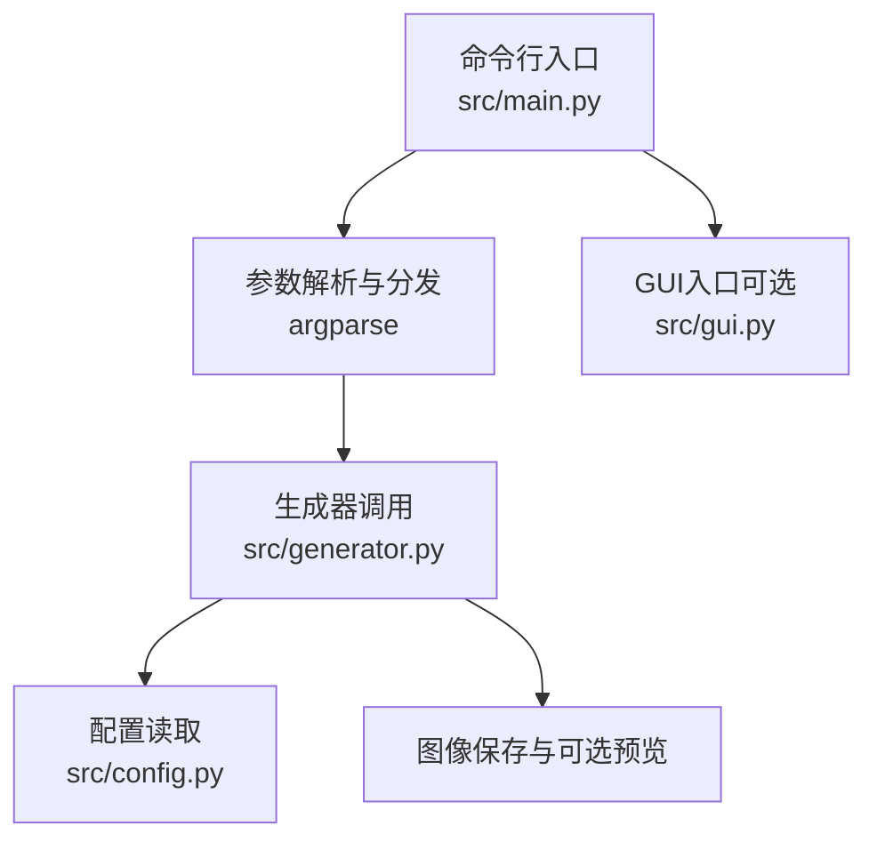
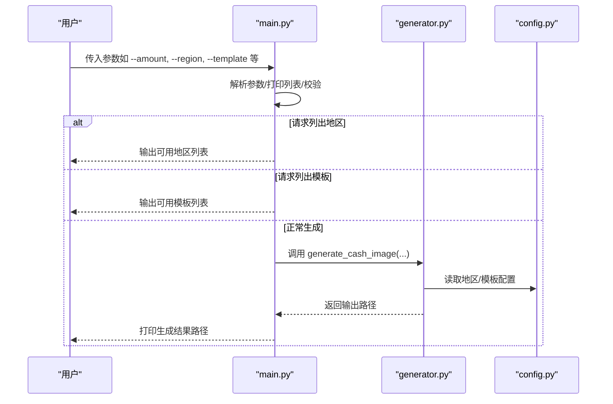
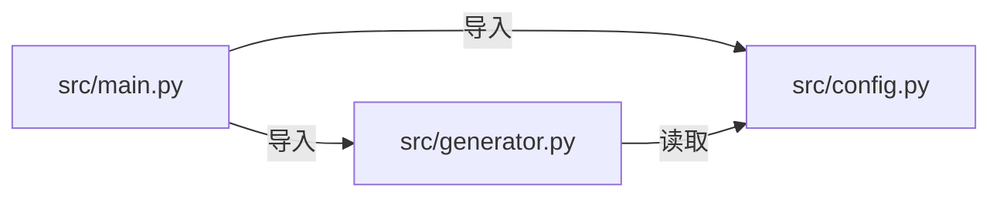

# 命令行界面

<cite>
**本文引用的文件**
- [main.py](file://src/main.py)
- [config.py](file://src/config.py)
- [generator.py](file://src/generator.py)
- [gui.py](file://src/gui.py)
</cite>

## 目录
1. [简介](#简介)
2. [项目结构](#项目结构)
3. [核心组件](#核心组件)
4. [架构总览](#架构总览)
5. [详细组件分析](#详细组件分析)
6. [依赖分析](#依赖分析)
7. [性能考虑](#性能考虑)
8. [故障排查指南](#故障排查指南)
9. [结论](#结论)
10. [附录](#附录)

## 简介
本指南面向命令行用户，系统性介绍 cash 生成器的命令行参数与使用方法。内容涵盖：
- 所有命令行参数的含义、默认值、取值范围与约束
- 参数组合示例与不同地区/模板的使用方法
- 列表查询参数的使用方式
- 参数校验规则与错误处理机制
- 批量处理与自动化脚本最佳实践

## 项目结构
该工具采用“入口分发 + 配置 + 图像生成引擎”的分层设计：
- 入口分发：根据是否传入 CLI 参数自动选择 CLI 或 GUI 模式
- 配置层：集中管理地区与模板配置、输出目录与字体路径
- 图像生成引擎：负责渲染、排版、保存与可选预览

图表来源
- [main.py:18-127](file://src/main.py#L18-L127)
- [generator.py:145-346](file://src/generator.py#L145-L346)
- [config.py:19-178](file://src/config.py#L19-L178)

章节来源
- [main.py:18-127](file://src/main.py#L18-L127)
- [config.py:19-178](file://src/config.py#L19-L178)
- [generator.py:145-346](file://src/generator.py#L145-L346)

## 核心组件
- 命令行入口与参数解析：负责解析参数、打印可用地区/模板、调用生成器并输出结果路径
- 配置中心：维护地区与模板的元数据（名称、货币、布局、配色等），以及输出目录与字体路径
- 图像生成引擎：按模板与地区配置进行排版、渲染、保存，并支持可选预览

章节来源
- [main.py:18-127](file://src/main.py#L18-L127)
- [config.py:19-178](file://src/config.py#L19-L178)
- [generator.py:145-346](file://src/generator.py#L145-L346)

## 架构总览
命令行模式的典型调用流程如下：

图表来源
- [main.py:18-105](file://src/main.py#L18-L105)
- [generator.py:145-346](file://src/generator.py#L145-L346)
- [config.py:19-178](file://src/config.py#L19-L178)

## 详细组件分析

### 命令行参数详解
以下参数均来自入口解析逻辑，具备明确的默认值、取值范围与行为说明。

- --amount, -a
  - 类型：整数
  - 必填：是
  - 说明：折扣金额（数值）
  - 示例：--amount 50
  - 章节来源
    - [main.py:31-36](file://src/main.py#L31-L36)

- --region, -r
  - 类型：字符串
  - 取值：必须为配置中可用地区代码之一
  - 默认值：SG
  - 说明：地区代码，决定货币符号、位置与本地化属性
  - 示例：--region MY
  - 章节来源
    - [main.py:37-42](file://src/main.py#L37-L42)
    - [config.py:19-80](file://src/config.py#L19-L80)

- --template, -t
  - 类型：字符串
  - 取值：必须为配置中可用模板键之一
  - 默认值：lazcash
  - 说明：模板风格（如 LazCash、Shopee Coins、Tokopedia Deals）
  - 示例：--template shopee_coins
  - 章节来源
    - [main.py:43-48](file://src/main.py#L43-L48)
    - [config.py:85-149](file://src/config.py#L85-L149)

- --code, -c
  - 类型：字符串
  - 默认值：None
  - 说明：可选的优惠券代码文本；若提供则会绘制在券图下方
  - 示例：--code WELCOME2024
  - 章节来源
    - [main.py:49-53](file://src/main.py#L49-L53)
    - [generator.py:312-321](file://src/generator.py#L312-L321)

- --expiry, -e
  - 类型：字符串
  - 默认值：None
  - 说明：可选的过期日期文本；若提供则绘制在券图底部
  - 示例：--expiry 2024-12-31
  - 章节来源
    - [main.py:54-58](file://src/main.py#L54-L58)
    - [generator.py:322-333](file://src/generator.py#L322-L333)

- --output, -o
  - 类型：字符串
  - 默认值：None
  - 说明：输出文件路径。若未指定，将使用默认输出目录与命名规则生成文件名
  - 示例：--output ~/Desktop/voucher.png
  - 章节来源
    - [main.py:59-63](file://src/main.py#L59-L63)
    - [generator.py:335-341](file://src/generator.py#L335-L341)

- --preview, -p
  - 类型：布尔标志
  - 默认值：False
  - 说明：生成完成后显示预览窗口（依赖系统图片查看器）
  - 示例：--preview
  - 章节来源
    - [main.py:64-68](file://src/main.py#L64-L68)
    - [generator.py:343-344](file://src/generator.py#L343-L344)

- --list-regions
  - 类型：布尔标志
  - 默认值：False
  - 说明：打印可用地区列表后退出
  - 示例：python main.py --list-regions
  - 章节来源
    - [main.py:69-78](file://src/main.py#L69-L78)
    - [config.py:19-80](file://src/config.py#L19-L80)

- --list-templates
  - 类型：布尔标志
  - 默认值：False
  - 说明：打印可用模板列表后退出
  - 示例：python main.py --list-templates
  - 章节来源
    - [main.py:74-78](file://src/main.py#L74-L78)
    - [config.py:85-149](file://src/config.py#L85-L149)

### 参数组合示例
以下示例基于入口解析与生成器实现，展示常见组合与效果预期。

- 基础生成（新加坡地区，LazCash 模板）
  - 命令：python main.py --amount 15 --region SG --template lazcash
  - 预期：生成一张符合 SG 区域与 lazcash 模板的券图，输出路径打印到控制台
  - 章节来源
    - [main.py:24-28](file://src/main.py#L24-L28)
    - [main.py:94-105](file://src/main.py#L94-L105)

- 带优惠码与过期日期（马来西亚地区）
  - 命令：python main.py --amount 50 --region MY --code WELCOME2024 --expiry 2024-12-31
  - 预期：生成券图并在下方绘制“Code:”与“Valid until:”文本
  - 章节来源
    - [main.py:26-27](file://src/main.py#L26-L27)
    - [generator.py:312-333](file://src/generator.py#L312-L333)

- 自定义输出路径（印尼地区，Shopee Coins 模板）
  - 命令：python main.py --amount 100 --region ID --template shopee_coins --output ~/Desktop/voucher.png
  - 预期：生成券图并保存到指定路径
  - 章节来源
    - [main.py:27-27](file://src/main.py#L27-L27)
    - [generator.py:335-341](file://src/generator.py#L335-L341)

- 列出可用地区
  - 命令：python main.py --list-regions
  - 预期：打印地区代码、名称与货币信息
  - 章节来源
    - [main.py:82-86](file://src/main.py#L82-L86)
    - [config.py:19-80](file://src/config.py#L19-L80)

- 列出可用模板
  - 命令：python main.py --list-templates
  - 预期：打印模板键与名称
  - 章节来源
    - [main.py:88-92](file://src/main.py#L88-L92)
    - [config.py:85-149](file://src/config.py#L85-L149)

### 参数验证规则与错误处理
- 参数类型与取值范围
  - --amount：整数，必填
  - --region：必须为配置中可用地区代码之一
  - --template：必须为配置中可用模板键之一
  - --code/--expiry：字符串，可选
  - --output：字符串，可选
  - --preview：布尔标志
  - --list-regions/--list-templates：布尔标志，互斥于正常生成
- 错误处理机制
  - 列表查询：直接打印列表并立即退出
  - 正常生成：调用生成器，返回输出路径；若发生异常，由调用方捕获并打印错误
  - GUI 模式：当未检测到有效 CLI 参数时，默认进入图形界面
- 章节来源
  - [main.py:18-105](file://src/main.py#L18-L105)
  - [generator.py:145-346](file://src/generator.py#L145-L346)

### 批量处理与自动化脚本最佳实践
- 批量生成多地区/模板组合
  - 使用循环遍历地区与模板键，逐个调用命令行入口
  - 建议固定输出目录，便于后续归档与上传
- 自动化脚本建议
  - 在脚本开头检查依赖（Python、Pillow 等）与资源文件存在性
  - 对 --output 提供绝对路径，避免相对路径导致的歧义
  - 使用 --preview 仅在调试阶段开启，生产环境建议关闭
  - 对 --code 与 --expiry 的格式进行统一规范，确保渲染一致性
- 章节来源
  - [main.py:115-127](file://src/main.py#L115-L127)
  - [generator.py:335-341](file://src/generator.py#L335-L341)

## 依赖分析
命令行入口与生成器之间的依赖关系如下：

图表来源
- [main.py:14-15](file://src/main.py#L14-L15)
- [generator.py:9-11](file://src/generator.py#L9-L11)
- [config.py:19-178](file://src/config.py#L19-L178)

章节来源
- [main.py:14-15](file://src/main.py#L14-L15)
- [generator.py:9-11](file://src/generator.py#L9-L11)
- [config.py:19-178](file://src/config.py#L19-L178)

## 性能考虑
- 字体加载与回退：优先使用内置字体，无法渲染特殊字符时回退至系统字体，避免渲染失败
- 渲染适配：根据模板尺寸动态调整字体大小，保证文本在画布内自适应
- 输出质量：PNG 保存质量可调，建议在需要透明背景或高质量时使用 PNG
- 章节来源
  - [generator.py:91-114](file://src/generator.py#L91-L114)
  - [generator.py:287-301](file://src/generator.py#L287-L301)
  - [config.py:175-178](file://src/config.py#L175-L178)

## 故障排查指南
- 无法找到模板或资源
  - 现象：生成失败并抛出“资源不存在”类错误
  - 处理：确认资源目录与字体文件存在；在打包环境中检查资源路径
  - 章节来源
    - [generator.py:145-346](file://src/generator.py#L145-L346)

- 参数不合法
  - 现象：参数解析失败或运行时报错
  - 处理：核对 --region 与 --template 是否在可用集合中；--amount 必须为整数
  - 章节来源
    - [main.py:37-48](file://src/main.py#L37-L48)
    - [main.py:31-36](file://src/main.py#L31-L36)

- 输出路径无效
  - 现象：保存失败或权限不足
  - 处理：确保目标目录存在且具有写权限；必要时使用绝对路径
  - 章节来源
    - [generator.py:335-341](file://src/generator.py#L335-L341)

- 预览无法显示
  - 现象：启用 --preview 后无响应
  - 处理：检查系统图片查看器是否可用；在服务器或无桌面环境下禁用该选项
  - 章节来源
    - [generator.py:343-344](file://src/generator.py#L343-L344)

## 结论
命令行模式提供了简洁高效的批量与自动化能力。通过合理使用参数与模板组合，可在多地区、多平台场景下稳定生成高质量的现金券图像。建议在脚本中统一参数格式、固定输出路径，并结合列表查询功能快速定位可用配置。

## 附录
- 常用命令速查
  - 列出可用地区：python main.py --list-regions
  - 列出可用模板：python main.py --list-templates
  - 基础生成：python main.py --amount 50 --region SG --template lazcash
  - 带优惠码与过期日期：python main.py --amount 50 --region MY --code WELCOME2024 --expiry 2024-12-31
  - 自定义输出路径：python main.py --amount 100 --region ID --template shopee_coins --output ~/Desktop/voucher.png
  - 章节来源
    - [main.py:24-28](file://src/main.py#L24-L28)