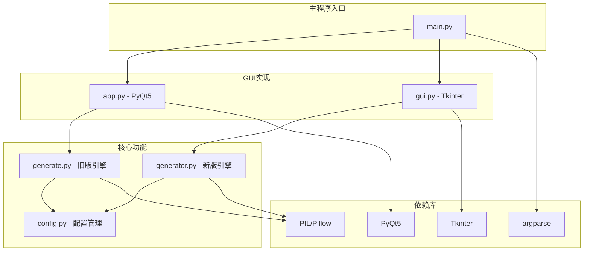
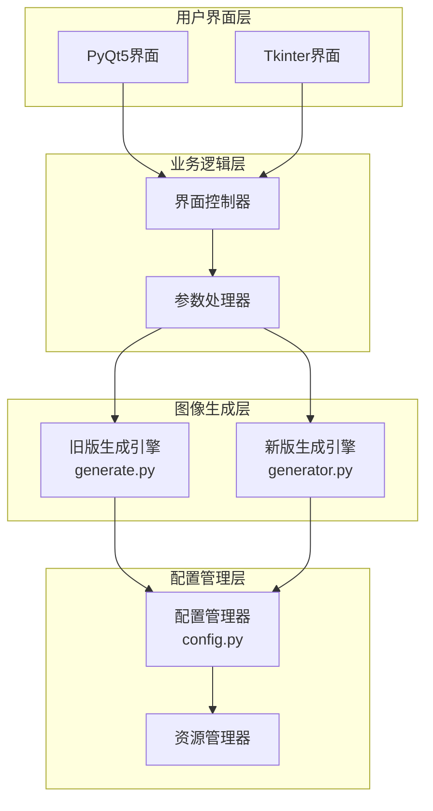
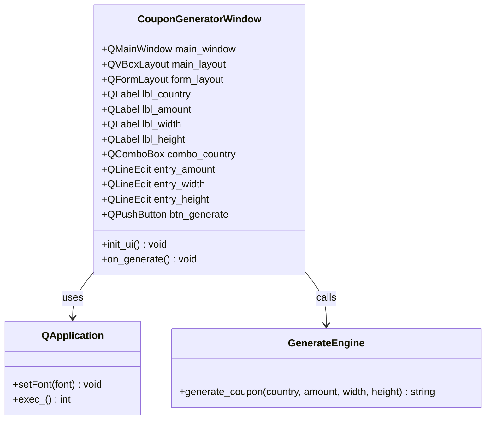
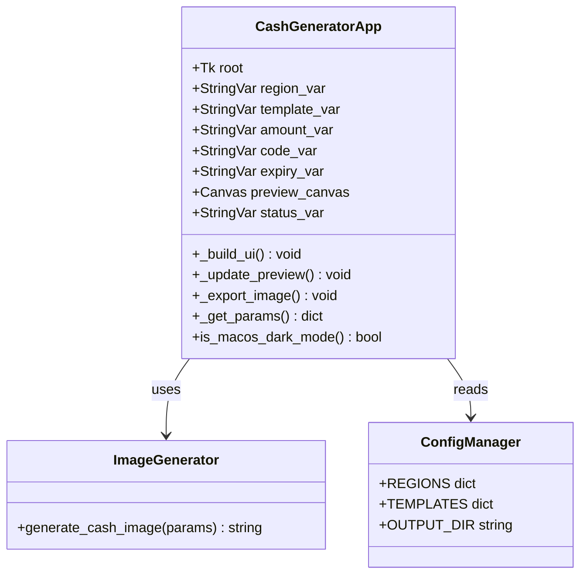
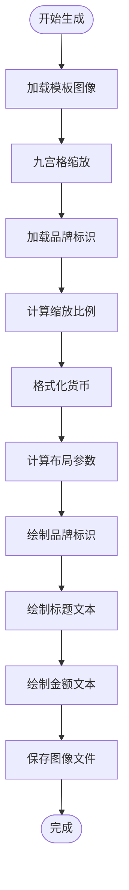
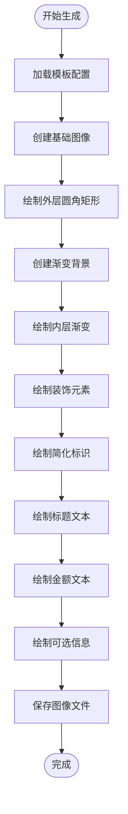
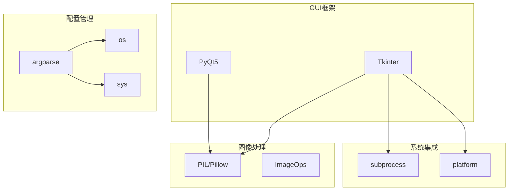
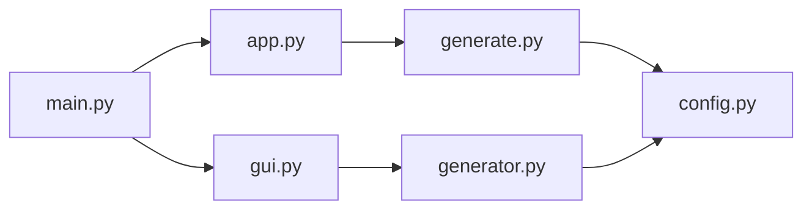
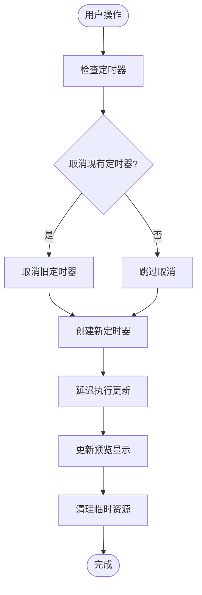
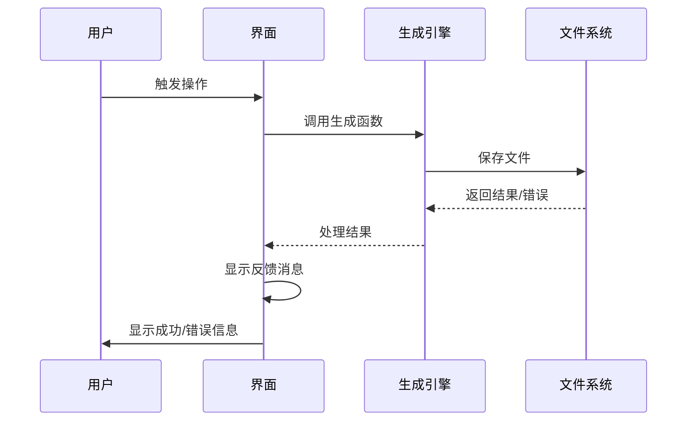

# 图形用户界面操作指南

<cite>
**本文档引用的文件**
- [app.py](file://src/app.py)
- [gui.py](file://src/gui.py)
- [main.py](file://src/main.py)
- [generate.py](file://src/generate.py)
- [generator.py](file://src/generator.py)
- [config.py](file://src/config.py)
</cite>

## 目录
1. [简介](#简介)
2. [项目结构](#项目结构)
3. [核心组件](#核心组件)
4. [架构概览](#架构概览)
5. [详细组件分析](#详细组件分析)
6. [依赖关系分析](#依赖关系分析)
7. [性能考虑](#性能考虑)
8. [故障排除指南](#故障排除指南)
9. [结论](#结论)

## 简介

本项目提供了两个版本的图形用户界面：基于Tkinter的跨平台版本和基于PyQt5的原生macOS版本。这两个GUI实现都用于生成多地区现金券图像，但采用了不同的技术栈和设计理念。

**章节来源**
- [app.py:1-269](file://src/app.py#L1-L269)
- [gui.py:1-499](file://src/gui.py#L1-L499)

## 项目结构

项目采用模块化设计，主要包含以下核心文件：

**图表来源**
- [main.py:1-131](file://src/main.py#L1-L131)
- [app.py:13-269](file://src/app.py#L13-L269)
- [gui.py:9-15](file://src/gui.py#L9-L15)

**章节来源**
- [main.py:1-131](file://src/main.py#L1-L131)
- [config.py:1-178](file://src/config.py#L1-L178)

## 核心组件

### PyQt5 GUI组件 (app.py)

PyQt5版本提供了简洁而专业的界面设计：

- **窗口管理**：固定尺寸420x320像素，防止用户调整
- **表单布局**：使用QFormLayout实现标签-输入框对齐
- **样式系统**：完全自定义的QSS样式表，支持深色/浅色主题
- **交互控制**：按钮事件绑定和错误处理机制

### Tkinter GUI组件 (gui.py)

Tkinter版本提供了更丰富的功能集：

- **动态预览**：实时更新的Canvas预览区域
- **快速按钮**：一键设置常用金额值
- **暗黑模式**：自动检测系统主题并应用相应配色
- **延迟更新**：防抖机制优化用户体验

**章节来源**
- [app.py:23-269](file://src/app.py#L23-L269)
- [gui.py:69-499](file://src/gui.py#L69-L499)

## 架构概览

两个GUI实现采用了相同的分层架构，但底层渲染引擎不同：

**图表来源**
- [app.py:205-242](file://src/app.py#L205-L242)
- [gui.py:418-456](file://src/gui.py#L418-L456)
- [generate.py:223-421](file://src/generate.py#L223-L421)
- [generator.py:145-346](file://src/generator.py#L145-L346)

## 详细组件分析

### PyQt5界面组件分析

#### 主窗口类结构

**图表来源**
- [app.py:23-269](file://src/app.py#L23-L269)
- [app.py:205-242](file://src/app.py#L205-L242)

#### 界面布局设计

PyQt5版本采用线性布局设计：

- **主布局**：垂直布局管理所有控件
- **表单布局**：QFormLayout实现标签对齐
- **间距控制**：统一的边距和间距设置
- **控件样式**：QSS样式表统一视觉风格

**章节来源**
- [app.py:30-204](file://src/app.py#L30-L204)

### Tkinter界面组件分析

#### 应用程序类结构

**图表来源**
- [gui.py:69-499](file://src/gui.py#L69-L499)
- [gui.py:400-417](file://src/gui.py#L400-L417)

#### 功能特性对比

| 特性 | PyQt5版本 | Tkinter版本 |
|------|-----------|-------------|
| **界面复杂度** | 简洁基础 | 功能丰富 |
| **实时预览** | ❌ | ✅ |
| **暗黑模式** | ❌ | ✅ |
| **快速按钮** | ❌ | ✅ |
| **延迟更新** | ❌ | ✅ |
| **Canvas预览** | ❌ | ✅ |
| **状态栏** | ❌ | ✅ |

**章节来源**
- [gui.py:161-271](file://src/gui.py#L161-L271)

### 图像生成引擎对比

#### 旧版生成引擎 (generate.py)

**图表来源**
- [generate.py:223-421](file://src/generate.py#L223-L421)

#### 新版生成引擎 (generator.py)

**图表来源**
- [generator.py:145-346](file://src/generator.py#L145-L346)

**章节来源**
- [generate.py:223-421](file://src/generate.py#L223-L421)
- [generator.py:145-346](file://src/generator.py#L145-L346)

## 依赖关系分析

### 外部依赖关系

**图表来源**
- [app.py:13-18](file://src/app.py#L13-L18)
- [gui.py:9-11](file://src/gui.py#L9-L11)
- [main.py:9-12](file://src/main.py#L9-L12)

### 内部模块依赖

**图表来源**
- [main.py:108-113](file://src/main.py#L108-L113)
- [app.py:20](file://src/app.py#L20)

**章节来源**
- [main.py:108-113](file://src/main.py#L108-L113)
- [app.py:20](file://src/app.py#L20)

## 性能考虑

### 渲染性能优化

两个GUI版本都实现了相应的性能优化策略：

#### PyQt5版本优化
- **固定窗口尺寸**：避免重排计算开销
- **直接样式设置**：减少样式继承查找
- **一次性布局**：避免动态布局重计算

#### Tkinter版本优化
- **防抖机制**：300ms延迟更新预览
- **Canvas缓存**：避免重复图像解码
- **智能缩放**：按需调整预览尺寸

### 内存管理

**图表来源**
- [gui.py:390-398](file://src/gui.py#L390-L398)

**章节来源**
- [gui.py:390-398](file://src/gui.py#L390-L398)

## 故障排除指南

### 常见问题及解决方案

#### PyQt5版本问题

| 问题类型 | 症状描述 | 解决方案 |
|----------|----------|----------|
| **字体渲染问题** | 文本显示异常或缺失 | 检查字体文件路径和权限 |
| **窗口显示问题** | 界面元素重叠或溢出 | 调整布局参数或窗口尺寸 |
| **按钮响应问题** | 点击无反应 | 检查信号槽连接和事件绑定 |

#### Tkinter版本问题

| 问题类型 | 症状描述 | 解决方案 |
|----------|----------|----------|
| **预览不更新** | 输入更改后预览不变 | 检查KeyRelease绑定和防抖机制 |
| **暗黑模式检测失败** | 颜色显示异常 | 验证系统偏好设置和子进程调用 |
| **图像导出失败** | 保存对话框异常 | 检查文件路径权限和输出目录 |

### 错误处理机制

**图表来源**
- [app.py:205-242](file://src/app.py#L205-L242)
- [gui.py:457-488](file://src/gui.py#L457-L488)

**章节来源**
- [app.py:205-242](file://src/app.py#L205-L242)
- [gui.py:457-488](file://src/gui.py#L457-L488)

## 结论

本项目提供了两个成熟的GUI实现，各有特色：

### PyQt5版本优势
- **简洁稳定**：代码结构清晰，维护成本低
- **跨平台兼容**：基于Qt框架，平台一致性好
- **原生外观**：在macOS上表现最佳

### Tkinter版本优势
- **功能丰富**：实时预览、暗黑模式等高级功能
- **用户体验**：更直观的交互和反馈机制
- **系统集成**：深度集成macOS系统特性

### 技术选型建议

- **选择PyQt5如果**：需要简单稳定的界面，快速部署
- **选择Tkinter如果**：需要丰富的用户交互功能，良好的用户体验

两个版本都基于相同的底层图像生成引擎，确保了功能的一致性和质量的可靠性。