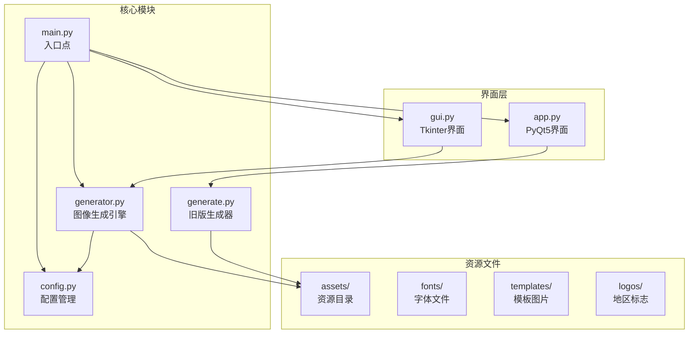
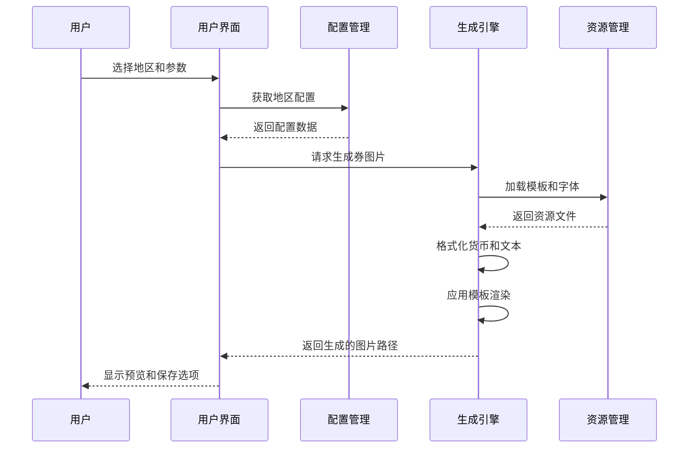
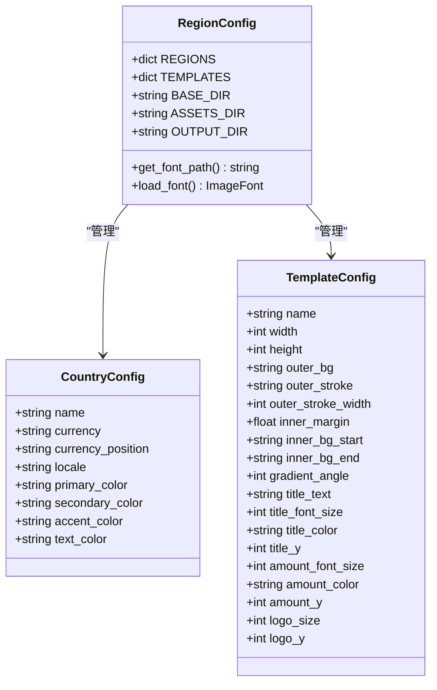
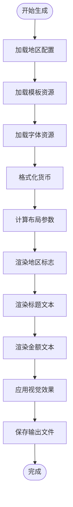
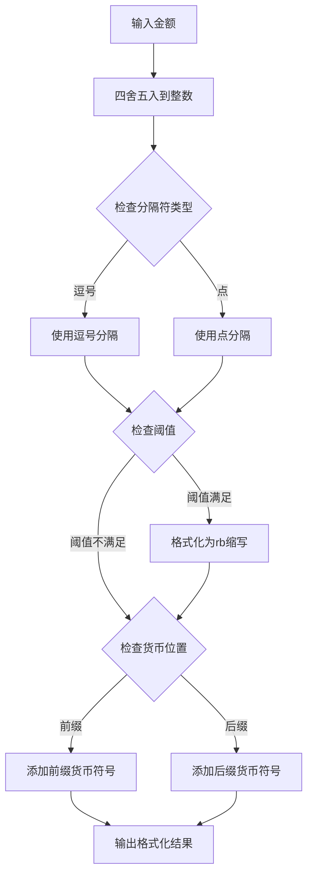
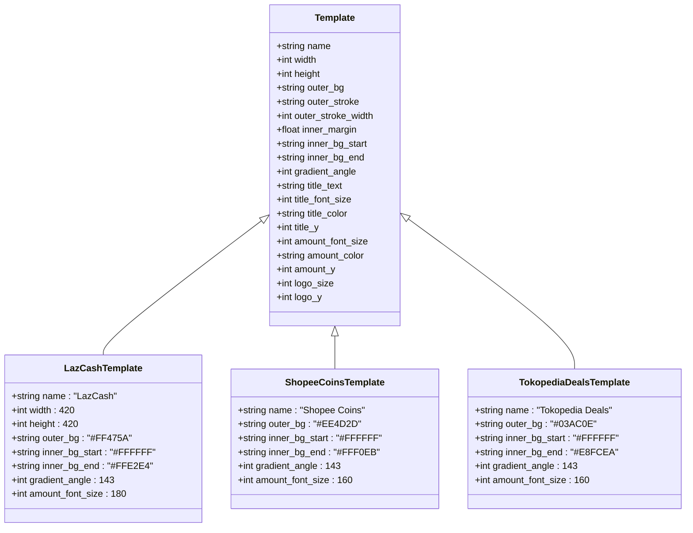

# 多区域支持

<cite>
**本文档引用的文件**
- [app.py](file://src/app.py)
- [config.py](file://src/config.py)
- [generate.py](file://src/generate.py)
- [generator.py](file://src/generator.py)
- [gui.py](file://src/gui.py)
- [main.py](file://src/main.py)
</cite>

## 目录
1. [简介](#简介)
2. [项目结构](#项目结构)
3. [核心组件](#核心组件)
4. [架构概览](#架构概览)
5. [详细组件分析](#详细组件分析)
6. [多区域支持详解](#多区域支持详解)
7. [货币格式化规则](#货币格式化规则)
8. [模板系统](#模板系统)
9. [批量生成技巧](#批量生成技巧)
10. [故障排除指南](#故障排除指南)
11. [结论](#结论)

## 简介

本项目是一个多区域支持的现金券生成器，专门针对东南亚市场设计。系统支持马来西亚(MY)、泰国(TH)、印度尼西亚(ID)、菲律宾(PH)、新加坡(SG)和越南(VN)六个东南亚国家和地区，提供本地化的货币格式、颜色主题和模板样式。

该工具通过图形界面和命令行两种方式提供服务，能够根据不同的地区配置自动生成符合当地规范的促销券图片。每个地区都有独特的货币符号、数字分隔符和颜色方案，确保生成的券符合当地用户的视觉习惯。

## 项目结构

项目采用模块化设计，主要包含以下核心文件：



**图表来源**
- [main.py:1-131](file://src/main.py#L1-L131)
- [config.py:1-178](file://src/config.py#L1-L178)

**章节来源**
- [main.py:1-131](file://src/main.py#L1-L131)
- [config.py:1-178](file://src/config.py#L1-L178)

## 核心组件

### 配置管理系统

配置系统是整个多区域支持的核心，负责管理所有地区特定的设置：

- **地区配置**：包含货币符号、位置、本地化设置和颜色方案
- **模板配置**：定义不同风格的券模板参数
- **字体管理**：处理跨平台字体兼容性
- **导出设置**：控制输出格式和质量

### 图像生成引擎

图像生成引擎负责将配置应用到实际的券图片生成过程中：

- **货币格式化**：根据地区规则格式化金额显示
- **模板渲染**：应用模板参数生成最终图片
- **颜色处理**：使用地区特定的颜色方案
- **文本适配**：确保特殊字符正确显示

### 用户界面系统

提供两种用户界面选择：

- **PyQt5界面**：现代化的桌面应用界面
- **Tkinter界面**：跨平台的GUI界面，支持暗黑模式

**章节来源**
- [config.py:16-178](file://src/config.py#L16-L178)
- [generator.py:126-346](file://src/generator.py#L126-L346)
- [app.py:23-269](file://src/app.py#L23-L269)

## 架构概览

系统采用分层架构设计，确保各组件职责清晰且相互独立：



**图表来源**
- [main.py:18-106](file://src/main.py#L18-L106)
- [generator.py:145-346](file://src/generator.py#L145-L346)

## 详细组件分析

### 配置管理器

配置管理器是多区域支持的基础，提供了完整的地区信息管理：



**图表来源**
- [config.py:19-80](file://src/config.py#L19-L80)
- [config.py:85-149](file://src/config.py#L85-L149)

### 图像生成引擎

图像生成引擎负责将配置转换为可视化的券图片：



**图表来源**
- [generator.py:145-346](file://src/generator.py#L145-L346)
- [generate.py:223-421](file://src/generate.py#L223-L421)

**章节来源**
- [config.py:1-178](file://src/config.py#L1-L178)
- [generator.py:1-360](file://src/generator.py#L1-L360)

## 多区域支持详解

### 支持的地区列表

系统当前支持以下6个东南亚国家和地区：

| 地区代码 | 国家名称 | 货币符号 | 货币位置 | 本地化语言 |
|---------|----------|----------|----------|------------|
| MY | Malaysia | RM | 前缀 | en_MY |
| TH | Thailand | ฿ | 前缀 | th_TH |
| ID | Indonesia | Rp | 前缀 | id_ID |
| PH | Philippines | ₱ | 前缀 | en_PH |
| SG | Singapore | $ | 前缀 | en_SG |
| VN | Vietnam | ₫ | 后缀 | vi_VN |

### 地区特色分析

#### 马来西亚 (MY)
- **货币特点**：使用RM前缀，数字分隔符为逗号
- **颜色方案**：采用红色系主题，体现活力和热情
- **适用场景**：适合促销活动和节日营销

#### 泰国 (TH)
- **货币特点**：使用泰铢符号，前缀显示
- **颜色方案**：与马来西亚相似的红色主题
- **适用场景**：适合旅游相关和文化活动推广

#### 印度尼西亚 (ID)
- **货币特点**：使用Rp前缀，数字分隔符为点
- **特殊功能**：支持"rb"缩写格式（例如15rb表示15,000）
- **适用场景**：适合大规模促销和日常消费场景

#### 菲律宾 (PH)
- **货币特点**：使用比索符号，前缀显示
- **颜色方案**：标准红色主题
- **适用场景**：适合电商和零售促销

#### 新加坡 (SG)
- **货币特点**：使用美元符号，前缀显示
- **颜色方案**：标准红色主题
- **适用场景**：适合国际化品牌推广

#### 越南 (VN)
- **货币特点**：使用越南盾符号，后缀显示
- **颜色方案**：标准红色主题
- **适用场景**：适合新兴市场推广

**章节来源**
- [config.py:19-80](file://src/config.py#L19-L80)
- [generate.py:15-22](file://src/generate.py#L15-L22)

## 货币格式化规则

### 格式化算法

货币格式化遵循严格的地区规则，主要通过以下步骤实现：



**图表来源**
- [generate.py:123-153](file://src/generate.py#L123-L153)

### 特殊格式化规则

#### 印度尼西亚 (ID) 的 "rb" 缩写格式

印尼特有的货币格式化功能，用于简化大额数字显示：

- **阈值设置**：当金额达到10,000时启用
- **格式转换**：15,000 → 15rb
- **小数处理**：15,200 → 15.2rb

#### 数字分隔符差异

不同地区使用不同的数字分隔符：

- **逗号分隔**：MY, TH, PH, SG
- **点分隔**：ID, VN

#### 货币符号位置

货币符号的位置因地区而异：

- **前缀位置**：MY, TH, ID, PH, SG
- **后缀位置**：VN

**章节来源**
- [generate.py:123-153](file://src/generate.py#L123-L153)

## 模板系统

### 模板类型

系统提供三种不同的券模板风格：



**图表来源**
- [config.py:85-149](file://src/config.py#L85-L149)

### 模板视觉差异

#### LazCash 模板
- **主色调**：鲜艳的粉红色(#FF475A)
- **渐变效果**：从白色到浅粉色的柔和渐变
- **金额字体**：较大的180号字体突出显示
- **适用场景**：通用促销活动

#### Shopee Coins 模板
- **主色调**：橙红色(#EE4D2D)
- **渐变效果**：从白色到浅橙色的渐变
- **金额字体**：160号字体
- **适用场景**：电商平台积分活动

#### Tokopedia Deals 模板
- **主色调**：绿色(#03AC0E)
- **渐变效果**：从白色到浅绿色的渐变
- **金额字体**：160号字体
- **适用场景**：印尼本土电商平台

**章节来源**
- [config.py:85-149](file://src/config.py#L85-L149)

## 批量生成技巧

### 命令行批量处理

系统提供强大的命令行接口，支持批量生成多个地区的券：

```bash
# 生成所有支持地区的默认金额券
for region in MY TH ID PH SG VN; do
    python main.py --amount 15 --region $region --template lazcash
done

# 批量生成不同金额的券
for amount in 5 10 15 20 50 100; do
    python main.py --amount $amount --region SG --template lazcash
done

# 生成指定模板的批量券
for template in lazcash shopee_coins tokopedia_deals; do
    python main.py --amount 15 --region SG --template $template
done
```

### 自动化脚本示例

```python
# Python自动化脚本示例
from src.generator import generate_cash_image
import os

def batch_generate():
    regions = ["MY", "TH", "ID", "PH", "SG", "VN"]
    amounts = [5, 10, 15, 20, 50, 100]
    templates = ["lazcash", "shopee_coins", "tokopedia_deals"]
    
    for region in regions:
        for amount in amounts:
            for template in templates:
                try:
                    path = generate_cash_image(
                        amount=amount,
                        region_code=region,
                        template_key=template,
                        output_path=f"output/cash_{region}_{amount}_{template}.png"
                    )
                    print(f"Generated: {path}")
                except Exception as e:
                    print(f"Error generating {region}-{amount}-{template}: {e}")

batch_generate()
```

### 性能优化建议

- **缓存机制**：重复使用的模板和字体可以缓存以提高性能
- **并发处理**：使用多进程技术同时处理多个生成任务
- **内存管理**：及时释放不再使用的图像资源
- **批量输出**：合理安排输出文件命名避免冲突

**章节来源**
- [main.py:18-106](file://src/main.py#L18-L106)
- [generator.py:349-360](file://src/generator.py#L349-L360)

## 故障排除指南

### 常见问题及解决方案

#### 字体显示问题

**问题描述**：特殊货币符号无法正确显示
**解决方案**：
- 系统会自动检测并使用系统字体
- 确保系统安装了相应的字体文件
- 检查字体路径配置是否正确

#### 资源文件缺失

**问题描述**：模板或图标文件找不到
**解决方案**：
- 确认assets目录结构完整
- 检查资源文件的相对路径
- 验证打包后的资源文件完整性

#### 颜色显示异常

**问题描述**：颜色在不同平台上显示不一致
**解决方案**：
- 使用RGB值而非十六进制值
- 测试不同操作系统下的显示效果
- 提供颜色方案的降级选项

#### 性能问题

**问题描述**：大量生成时响应缓慢
**解决方案**：
- 实现进度条和状态反馈
- 优化图像处理算法
- 考虑使用硬件加速

**章节来源**
- [generate.py:112-121](file://src/generate.py#L112-L121)
- [generator.py:91-114](file://src/generator.py#L91-L114)

## 结论

本多区域支持系统为东南亚市场提供了完整的本地化解决方案。通过精心设计的配置管理和灵活的模板系统，系统能够根据不同地区的特点生成符合当地用户习惯的促销券图片。

### 主要优势

1. **全面的地区覆盖**：支持6个主要东南亚国家和地区
2. **准确的本地化**：货币格式、颜色方案和视觉元素都经过精心设计
3. **灵活的模板系统**：提供多种风格选择适应不同营销需求
4. **多平台支持**：同时支持PyQt5和Tkinter界面
5. **强大的批量处理能力**：支持命令行和自动化脚本

### 最佳实践建议

1. **选择合适的模板**：根据目标市场的品牌调性选择最匹配的模板
2. **注意货币格式**：严格遵循各地区的货币显示规范
3. **测试多平台兼容性**：确保在不同操作系统上的显示效果
4. **优化生成流程**：对于大批量需求，考虑使用命令行接口
5. **持续更新配置**：随着业务发展定期更新地区配置和模板

该系统为电商和营销团队提供了一个强大而易用的工具，能够帮助他们快速创建专业级的促销券图片，提升营销效果和用户体验。