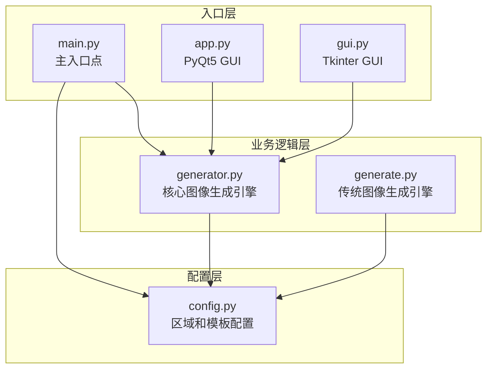
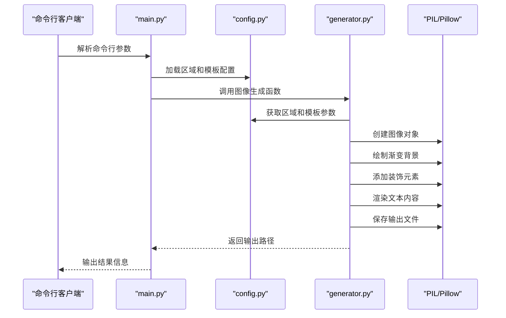
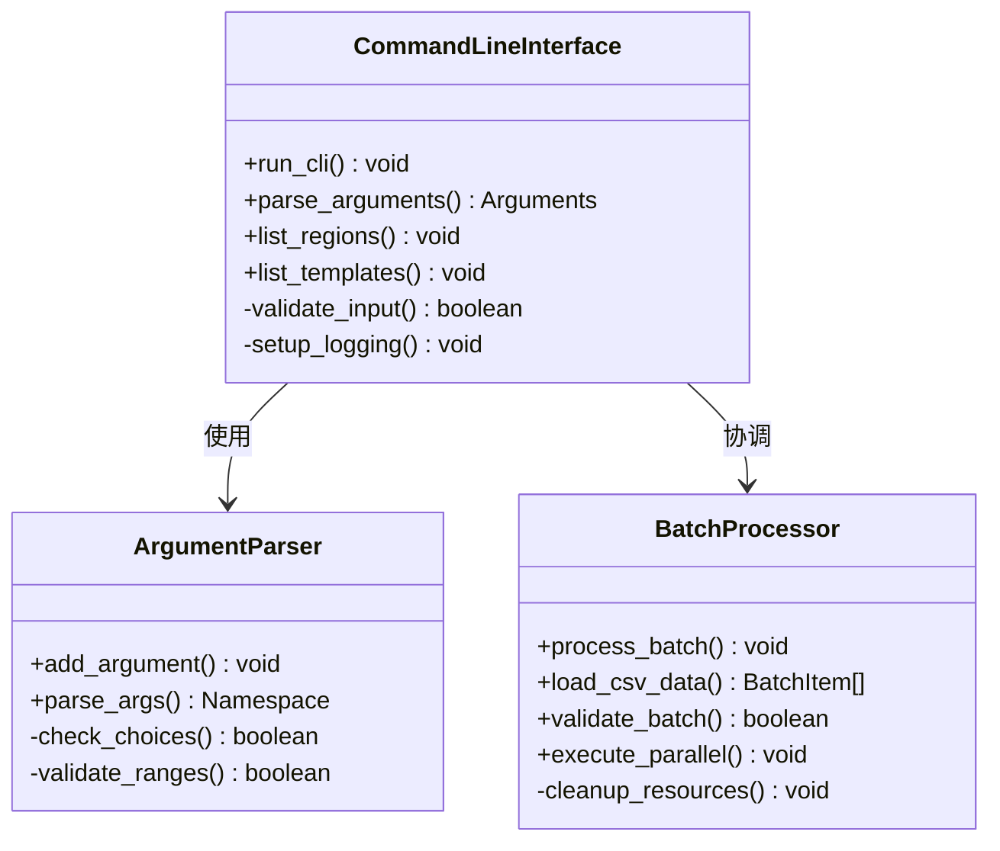
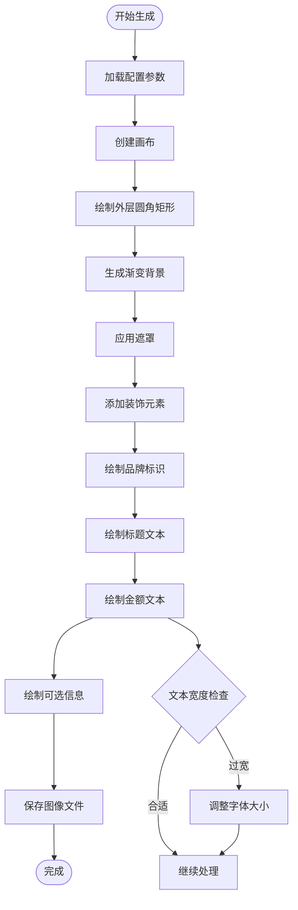
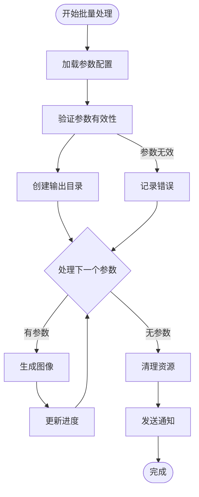
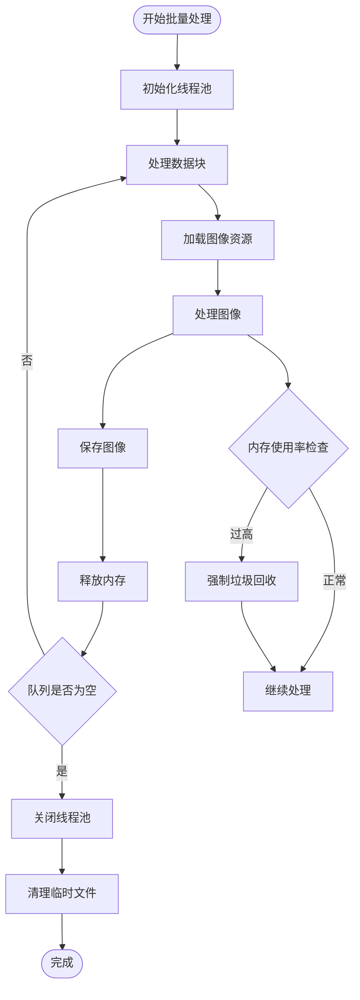
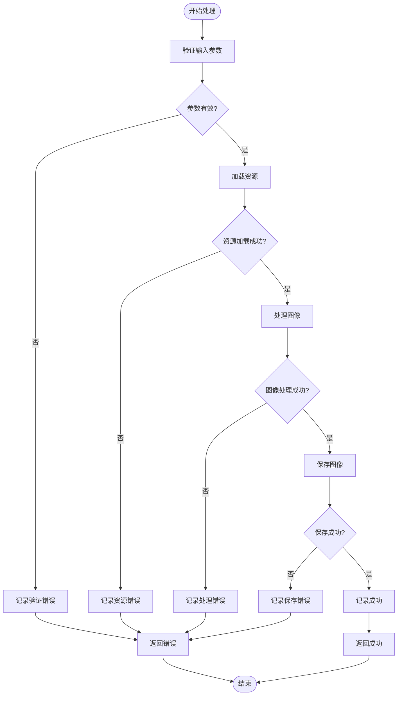
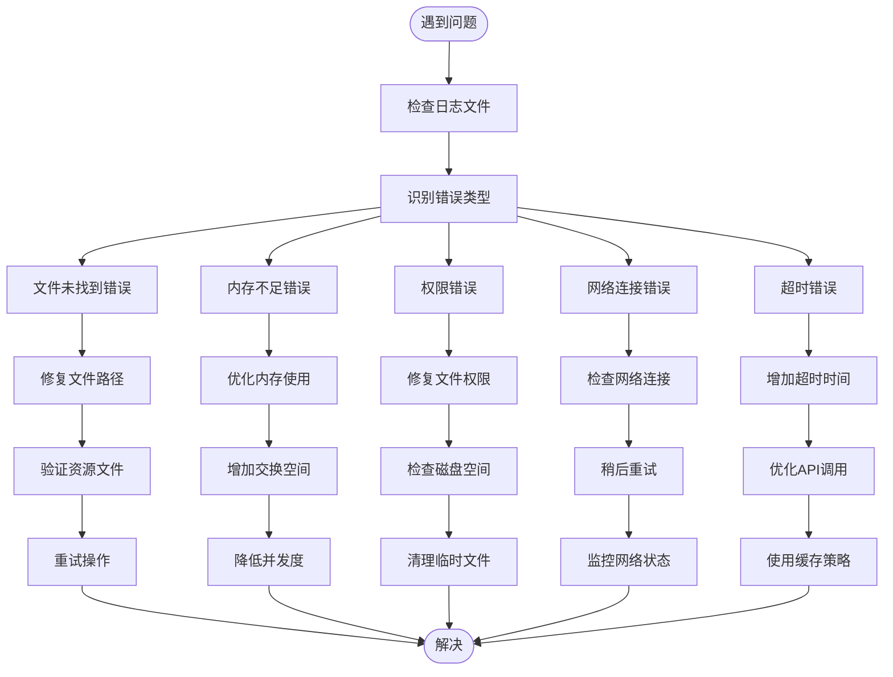

# 批量处理

<cite>
**本文引用的文件**
- [main.py](file://src/main.py)
- [config.py](file://src/config.py)
- [generator.py](file://src/generator.py)
- [generate.py](file://src/generate.py)
- [gui.py](file://src/gui.py)
- [app.py](file://src/app.py)
</cite>

## 目录
1. [简介](#简介)
2. [项目结构](#项目结构)
3. [核心组件](#核心组件)
4. [架构概览](#架构概览)
5. [详细组件分析](#详细组件分析)
6. [批量处理实现方案](#批量处理实现方案)
7. [性能优化与内存管理](#性能优化与内存管理)
8. [错误处理与日志记录](#错误处理与日志记录)
9. [大规模生成任务执行建议](#大规模生成任务执行建议)
10. [与外部系统集成方案](#与外部系统集成方案)
11. [故障排除指南](#故障排除指南)
12. [结论](#结论)

## 简介

本项目是一个多地区促销券生成器，支持批量处理大量促销券的生成。该系统提供了多种接口方式，包括命令行界面、图形用户界面以及底层图像生成引擎。本文档专注于批量处理功能的详细操作指南，涵盖命令行批量生成、批量脚本编写、参数文件导入、CSV数据处理、性能优化、内存管理、错误处理和日志记录最佳实践，以及大规模生成任务的执行建议和监控方法。

## 项目结构

项目采用模块化设计，主要包含以下核心模块：



**图表来源**
- [main.py:1-131](file://src/main.py#L1-L131)
- [config.py:1-178](file://src/config.py#L1-L178)
- [generator.py:1-360](file://src/generator.py#L1-L360)

**章节来源**
- [main.py:1-131](file://src/main.py#L1-L131)
- [config.py:1-178](file://src/config.py#L1-L178)

## 核心组件

### 配置管理系统

系统通过配置文件管理多地区设置和模板参数：

- **区域配置**：支持马来西亚(MY)、泰国(TH)、印度尼西亚(ID)、菲律宾(PH)、新加坡(SG)、越南(VN)
- **模板配置**：提供LazCash、Shopee Coins、Tokopedia Deals三种模板风格
- **字体管理**：自动检测和加载合适的字体文件
- **导出设置**：支持PNG和JPG格式，可配置质量参数

### 图像生成引擎

核心图像生成引擎提供以下功能：

- **渐变背景生成**：支持角度渐变的背景创建
- **圆角矩形绘制**：高质量的圆角矩形渲染
- **文本布局算法**：智能的文本适配和居中对齐
- **装饰元素**：半透明装饰圆形和品牌标识
- **多语言支持**：针对特殊货币符号的字体回退机制

**章节来源**
- [config.py:15-178](file://src/config.py#L15-L178)
- [generator.py:14-360](file://src/generator.py#L14-L360)

## 架构概览

系统采用分层架构设计，确保功能模块的清晰分离和可扩展性：



**图表来源**
- [main.py:18-106](file://src/main.py#L18-L106)
- [generator.py:145-346](file://src/generator.py#L145-L346)

## 详细组件分析

### 命令行接口分析

命令行接口提供了完整的批量处理能力：



**图表来源**
- [main.py:18-106](file://src/main.py#L18-L106)

### 图像生成引擎分析

图像生成引擎是批量处理的核心组件：



**图表来源**
- [generator.py:145-346](file://src/generator.py#L145-L346)

**章节来源**
- [main.py:18-106](file://src/main.py#L18-L106)
- [generator.py:145-346](file://src/generator.py#L145-L346)

## 批量处理实现方案

### 命令行批量生成

系统支持通过命令行进行批量生成，提供灵活的参数组合：

#### 基础批量命令模式

```bash
# 生成多个地区的相同金额券
for region in MY TH ID PH SG VN; do
    python main.py --amount 50 --region $region --template lazcash
done

# 生成不同金额的券
for amount in 10 25 50 100 200; do
    python main.py --amount $amount --region SG --template lazcash
done
```

#### 参数文件导入方案

创建CSV文件存储批量参数：

```csv
amount,region,template,code,expiry,output
50,SG,lazcash,WELCOME2024,2024-12-31,cash_sg_50_lazcash.png
100,MY,shopee_coins,SAVEBIG2024,2024-12-31,cash_my_100_shopee_coins.png
150,ID,tokopedia_deals,DISCOUNT2024,2024-12-31,cash_id_150_tokopedia_deals.png
```

对应的批量处理脚本：

```python
import csv
import subprocess
import os

def batch_process_from_csv(csv_file):
    """从CSV文件批量处理促销券生成"""
    with open(csv_file, 'r', encoding='utf-8') as file:
        reader = csv.DictReader(file)
        
        for row in reader:
            cmd = [
                'python', 'main.py',
                '--amount', row['amount'],
                '--region', row['region'],
                '--template', row['template']
            ]
            
            if row['code']:
                cmd.extend(['--code', row['code']])
            if row['expiry']:
                cmd.extend(['--expiry', row['expiry']])
            if row['output']:
                cmd.extend(['--output', row['output']])
                
            try:
                result = subprocess.run(cmd, capture_output=True, text=True, check=True)
                print(f"成功: {result.stdout.strip()}")
            except subprocess.CalledProcessError as e:
                print(f"失败: {row['amount']} - {e.stderr}")

# 执行批量处理
batch_process_from_csv('batch_parameters.csv')
```

#### 自动化工作流程



**图表来源**
- [main.py:18-106](file://src/main.py#L18-L106)

### 批量脚本编写示例

#### Python批量处理脚本

```python
import os
import time
import concurrent.futures
from typing import List, Dict
import logging

class BatchCouponGenerator:
    def __init__(self, max_workers: int = 4):
        self.max_workers = max_workers
        self.setup_logging()
        
    def setup_logging(self):
        """设置批量处理日志"""
        logging.basicConfig(
            level=logging.INFO,
            format='%(asctime)s - %(levelname)s - %(message)s',
            handlers=[
                logging.FileHandler('batch_generation.log'),
                logging.StreamHandler()
            ]
        )
        self.logger = logging.getLogger(__name__)
    
    def generate_single(self, params: Dict) -> str:
        """生成单个促销券"""
        try:
            # 构建命令行参数
            cmd = ['python', 'main.py']
            cmd.extend(['--amount', str(params['amount'])])
            cmd.extend(['--region', params['region']])
            cmd.extend(['--template', params['template']])
            
            if params.get('code'):
                cmd.extend(['--code', params['code']])
            if params.get('expiry'):
                cmd.extend(['--expiry', params['expiry']])
            if params.get('output'):
                cmd.extend(['--output', params['output']])
                
            # 执行命令
            result = subprocess.run(cmd, capture_output=True, text=True, check=True)
            self.logger.info(f"成功生成: {params['amount']} {params['region']}")
            return result.stdout.strip()
            
        except subprocess.CalledProcessError as e:
            self.logger.error(f"生成失败 {params}: {e.stderr}")
            raise
    
    def generate_batch_sequential(self, batch_params: List[Dict]) -> List[str]:
        """顺序批量生成"""
        results = []
        start_time = time.time()
        
        for i, params in enumerate(batch_params):
            try:
                result = self.generate_single(params)
                results.append(result)
                
                # 进度报告
                if (i + 1) % 10 == 0:
                    elapsed = time.time() - start_time
                    self.logger.info(f"进度: {i+1}/{len(batch_params)}, 耗时: {elapsed:.2f}s")
                    
            except Exception as e:
                self.logger.error(f"批次处理中断: {e}")
                break
                
        return results
    
    def generate_batch_parallel(self, batch_params: List[Dict]) -> List[str]:
        """并行批量生成"""
        results = []
        start_time = time.time()
        
        with concurrent.futures.ThreadPoolExecutor(max_workers=self.max_workers) as executor:
            # 提交所有任务
            future_to_params = {
                executor.submit(self.generate_single, params): params 
                for params in batch_params
            }
            
            # 收集结果
            for future in concurrent.futures.as_completed(future_to_params):
                params = future_to_params[future]
                try:
                    result = future.result()
                    results.append(result)
                    
                    # 实时进度
                    elapsed = time.time() - start_time
                    self.logger.info(f"完成: {len(results)}/{len(batch_params)}, 耗时: {elapsed:.2f}s")
                    
                except Exception as e:
                    self.logger.error(f"任务失败 {params}: {e}")
                    results.append(None)
                    
        return results

# 使用示例
if __name__ == "__main__":
    # 批量参数配置
    batch_params = [
        {'amount': 50, 'region': 'SG', 'template': 'lazcash', 'code': 'WELCOME2024'},
        {'amount': 100, 'region': 'MY', 'template': 'shopee_coins', 'expiry': '2024-12-31'},
        {'amount': 150, 'region': 'ID', 'template': 'tokopedia_deals'},
        # ... 更多参数
    ]
    
    # 创建批量生成器
    generator = BatchCouponGenerator(max_workers=4)
    
    # 顺序生成
    results = generator.generate_batch_sequential(batch_params)
    
    # 或并行生成
    # results = generator.generate_batch_parallel(batch_params)
```

#### Shell脚本批量处理

```bash
#!/bin/bash

# 批量生成脚本
BATCH_FILE="batch_config.txt"
LOG_FILE="batch_log.txt"
ERROR_COUNT=0
SUCCESS_COUNT=0

echo "开始批量生成促销券" >> $LOG_FILE
echo "时间: $(date)" >> $LOG_FILE
echo "========================" >> $LOG_FILE

# 读取批处理配置
while IFS=',' read -r amount region template code expiry output; do
    # 跳过注释行和空行
    [[ -z "$amount" || "$amount" =~ ^#.*$ ]] && continue
    
    echo "处理: 金额=$amount, 区域=$region, 模板=$template" >> $LOG_FILE
    
    # 构建命令
    CMD="python main.py --amount $amount --region $region --template $template"
    
    if [[ -n "$code" ]]; then
        CMD="$CMD --code $code"
    fi
    
    if [[ -n "$expiry" ]]; then
        CMD="$CMD --expiry $expiry"
    fi
    
    if [[ -n "$output" ]]; then
        CMD="$CMD --output $output"
    fi
    
    # 执行命令
    eval $CMD >> $LOG_FILE 2>&1
    EXIT_CODE=$?
    
    if [ $EXIT_CODE -eq 0 ]; then
        SUCCESS_COUNT=$((SUCCESS_COUNT + 1))
        echo "✓ 成功: $amount $region" >> $LOG_FILE
    else
        ERROR_COUNT=$((ERROR_COUNT + 1))
        echo "✗ 失败: $amount $region" >> $LOG_FILE
    fi
    
    # 显示进度
    TOTAL=$((SUCCESS_COUNT + ERROR_COUNT))
    echo "进度: $SUCCESS_COUNT 成功, $ERROR_COUNT 失败, 总计: $TOTAL" >&2
    
done < $BATCH_FILE

# 生成统计报告
echo "========================" >> $LOG_FILE
echo "批量处理完成" >> $LOG_FILE
echo "成功: $SUCCESS_COUNT" >> $LOG_FILE
echo "失败: $ERROR_COUNT" >> $LOG_FILE
echo "总计: $((SUCCESS_COUNT + ERROR_COUNT))" >> $LOG_FILE
echo "结束时间: $(date)" >> $LOG_FILE

echo "批量处理完成 - 成功: $SUCCESS_COUNT, 失败: $ERROR_COUNT"
```

**章节来源**
- [main.py:18-106](file://src/main.py#L18-L106)

## 性能优化与内存管理

### 内存管理策略

批量处理过程中需要特别注意内存使用：



### 并行处理优化

系统支持多线程并行处理以提高吞吐量：

#### 线程池配置

```python
import concurrent.futures
import threading
from queue import Queue

class OptimizedBatchProcessor:
    def __init__(self, max_workers: int = None):
        # 根据CPU核心数动态配置线程数
        if max_workers is None:
            self.max_workers = min(32, (threading.active_count() or 1) + 4)
        else:
            self.max_workers = max_workers
            
        self.executor = None
        self.process_queue = Queue()
        
    def process_with_memory_control(self, items):
        """带内存控制的批量处理"""
        results = []
        
        with concurrent.futures.ThreadPoolExecutor(
            max_workers=self.max_workers
        ) as executor:
            futures = []
            
            for item in items:
                # 控制并发数量
                if len(futures) >= self.max_workers:
                    # 等待一个任务完成
                    done, not_done = concurrent.futures.wait(
                        futures, 
                        return_when=concurrent.futures.FIRST_COMPLETED
                    )
                    futures = list(not_done)
                
                # 提交新任务
                future = executor.submit(self.process_item, item)
                futures.append(future)
                
                # 检查内存使用情况
                if self.check_memory_usage():
                    self.force_gc()
                    
            # 收集剩余结果
            for future in concurrent.futures.as_completed(futures):
                results.append(future.result())
                
        return results
    
    def check_memory_usage(self):
        """检查内存使用情况"""
        import psutil
        import os
        
        process = psutil.Process(os.getpid())
        memory_percent = process.memory_info().percent
        
        return memory_percent > 80  # 阈值80%
    
    def force_gc(self):
        """强制垃圾回收"""
        import gc
        gc.collect()
```

### 缓存策略

```python
import functools
import hashlib
from PIL import Image

class CachedImageGenerator:
    def __init__(self, cache_dir: str = "./cache"):
        self.cache_dir = cache_dir
        os.makedirs(cache_dir, exist_ok=True)
        
    @functools.lru_cache(maxsize=128)
    def cached_generate(self, amount: int, region: str, template: str):
        """带LRU缓存的图像生成"""
        # 生成缓存键
        cache_key = f"{amount}_{region}_{template}"
        cache_path = os.path.join(self.cache_dir, f"{cache_key}.png")
        
        # 检查缓存
        if os.path.exists(cache_path):
            return cache_path
            
        # 生成新图像
        result_path = self.generate_image(amount, region, template)
        
        # 缓存结果
        if result_path:
            shutil.copy(result_path, cache_path)
            
        return result_path
    
    def generate_image(self, amount: int, region: str, template: str):
        """实际的图像生成逻辑"""
        # ... 图像生成代码 ...
        pass
```

**章节来源**
- [generator.py:145-346](file://src/generator.py#L145-L346)

## 错误处理与日志记录

### 错误处理框架

系统实现了多层次的错误处理机制：



### 日志记录最佳实践

```python
import logging
import logging.handlers
from datetime import datetime

class BatchLogger:
    def __init__(self, log_file: str = "batch_processing.log"):
        self.setup_logger(log_file)
        
    def setup_logger(self, log_file: str):
        """配置批量处理日志系统"""
        # 创建logger
        self.logger = logging.getLogger('BatchProcessor')
        self.logger.setLevel(logging.DEBUG)
        
        # 创建文件处理器
        file_handler = logging.handlers.RotatingFileHandler(
            log_file, 
            maxBytes=10*1024*1024,  # 10MB
            backupCount=5
        )
        
        # 创建控制台处理器
        console_handler = logging.StreamHandler()
        
        # 创建格式器
        formatter = logging.Formatter(
            '%(asctime)s - %(name)s - %(levelname)s - %(message)s'
        )
        
        file_handler.setFormatter(formatter)
        console_handler.setFormatter(formatter)
        
        # 添加处理器
        self.logger.addHandler(file_handler)
        self.logger.addHandler(console_handler)
        
    def log_batch_start(self, batch_size: int, batch_id: str):
        """记录批量处理开始"""
        self.logger.info(f"开始批量处理 - 批次ID: {batch_id}, 数量: {batch_size}")
        
    def log_progress(self, processed: int, total: int, elapsed_time: float):
        """记录处理进度"""
        progress = (processed / total) * 100
        rate = processed / elapsed_time if elapsed_time > 0 else 0
        self.logger.info(f"进度: {progress:.1f}% ({processed}/{total}), "
                       f"速率: {rate:.2f}张/秒, 耗时: {elapsed_time:.2f}s")
        
    def log_error(self, item: dict, error: Exception):
        """记录错误信息"""
        self.logger.error(f"处理失败 - 参数: {item}, 错误: {str(error)}")
        
    def log_batch_complete(self, batch_id: str, success_count: int, 
                          error_count: int, elapsed_time: float):
        """记录批量处理完成"""
        self.logger.info(f"批量处理完成 - 批次ID: {batch_id}, "
                       f"成功: {success_count}, 失败: {error_count}, "
                       f"总耗时: {elapsed_time:.2f}s, 平均耗时: {elapsed_time/(success_count or 1):.2f}s")
```

### 异常处理策略

```python
import traceback
from typing import Tuple

class RobustBatchProcessor:
    def __init__(self):
        self.error_log = []
        
    def safe_execute_with_retry(self, func, *args, max_retries: int = 3, 
                              delay: float = 1.0) -> Tuple[bool, any]:
        """带重试机制的安全执行"""
        for attempt in range(max_retries):
            try:
                result = func(*args)
                return True, result
            except Exception as e:
                error_msg = {
                    'attempt': attempt + 1,
                    'error': str(e),
                    'traceback': traceback.format_exc(),
                    'args': args
                }
                self.error_log.append(error_msg)
                
                if attempt < max_retries - 1:
                    time.sleep(delay * (2 ** attempt))  # 指数退避
                    continue
                    
            return False, None
            
    def process_with_robustness(self, items: List[dict]) -> List[Tuple[bool, any]]:
        """健壮的批量处理"""
        results = []
        
        for i, item in enumerate(items):
            success, result = self.safe_execute_with_retry(
                self.process_item, item, max_retries=2
            )
            
            results.append((success, result))
            
            # 记录进度
            if (i + 1) % 10 == 0:
                self.log_progress(i + 1, len(items))
                
        return results
```

**章节来源**
- [main.py:18-106](file://src/main.py#L18-L106)
- [generator.py:145-346](file://src/generator.py#L145-L346)

## 大规模生成任务执行建议

### 执行环境配置

对于大规模生成任务，建议采用以下配置：

#### 系统资源规划

```bash
# CPU配置
export OMP_NUM_THREADS=8
export MKL_NUM_THREADS=8

# 内存配置
ulimit -s 65536  # 增加栈大小
ulimit -n 65536  # 增加文件描述符限制

# Python配置
export PYTHONPATH="./src:$PYTHONPATH"
export PYTHONDONTWRITEBYTECODE=1
```

#### 批处理策略

```python
import multiprocessing as mp
from concurrent.futures import ProcessPoolExecutor
import signal
import sys

class ScalableBatchProcessor:
    def __init__(self, max_workers: int = None):
        if max_workers is None:
            # 基于CPU核心数的自适应配置
            self.max_workers = min(32, mp.cpu_count())
        else:
            self.max_workers = max_workers
            
        self.shutdown_flag = mp.Event()
        
    def signal_handler(self, signum, frame):
        """处理终止信号"""
        print("收到终止信号，正在优雅关闭...")
        self.shutdown_flag.set()
        
    def setup_signal_handlers(self):
        """设置信号处理器"""
        signal.signal(signal.SIGINT, self.signal_handler)
        signal.signal(signal.SIGTERM, self.signal_handler)
        
    def process_in_chunks(self, items: List[dict], chunk_size: int = 1000):
        """分块处理大数据集"""
        total_items = len(items)
        results = []
        
        for i in range(0, total_items, chunk_size):
            if self.shutdown_flag.is_set():
                break
                
            chunk = items[i:i + chunk_size]
            print(f"处理第 {i//chunk_size + 1} 块: {len(chunk)} 个项目")
            
            chunk_results = self.process_chunk(chunk)
            results.extend(chunk_results)
            
            # 定期清理内存
            if (i//chunk_size + 1) % 10 == 0:
                self.cleanup_memory()
                
        return results
    
    def cleanup_memory(self):
        """定期内存清理"""
        import gc
        gc.collect()
        
        # 检查内存使用
        import psutil
        process = psutil.Process()
        memory_mb = process.memory_info().rss / 1024 / 1024
        
        if memory_mb > 1000:  # 超过1GB
            print(f"内存使用过高: {memory_mb:.1f} MB")
            # 触发强制垃圾回收
            gc.collect()
```

### 监控和指标收集

```python
import time
import psutil
import json
from datetime import datetime

class BatchMonitor:
    def __init__(self):
        self.metrics = {
            'start_time': None,
            'end_time': None,
            'processed_count': 0,
            'success_count': 0,
            'error_count': 0,
            'total_time': 0,
            'peak_memory': 0,
            'average_rate': 0
        }
        
    def start_monitoring(self):
        """开始监控"""
        self.metrics['start_time'] = datetime.now()
        self.metrics['processed_count'] = 0
        self.metrics['success_count'] = 0
        self.metrics['error_count'] = 0
        self.metrics['peak_memory'] = 0
        
    def update_metrics(self, success: bool, item: dict):
        """更新监控指标"""
        self.metrics['processed_count'] += 1
        
        if success:
            self.metrics['success_count'] += 1
        else:
            self.metrics['error_count'] += 1
            
        # 更新峰值内存
        process = psutil.Process()
        memory_mb = process.memory_info().rss / 1024 / 1024
        self.metrics['peak_memory'] = max(self.metrics['peak_memory'], memory_mb)
        
    def get_current_rate(self) -> float:
        """获取当前处理速率"""
        elapsed = (datetime.now() - self.metrics['start_time']).total_seconds()
        return self.metrics['processed_count'] / elapsed if elapsed > 0 else 0
        
    def get_status_report(self) -> dict:
        """获取状态报告"""
        elapsed = (datetime.now() - self.metrics['start_time']).total_seconds()
        
        return {
            'timestamp': datetime.now().isoformat(),
            'processed': self.metrics['processed_count'],
            'success': self.metrics['success_count'],
            'errors': self.metrics['error_count'],
            'success_rate': self.metrics['success_count'] / self.metrics['processed_count'] if self.metrics['processed_count'] > 0 else 0,
            'processing_rate': self.get_current_rate(),
            'peak_memory_mb': self.metrics['peak_memory'],
            'elapsed_seconds': elapsed,
            'estimated_remaining': (self.metrics['processed_count'] / (self.get_current_rate() or 1)) - elapsed
        }
        
    def save_metrics(self, filename: str = "batch_metrics.json"):
        """保存指标到文件"""
        metrics_copy = self.metrics.copy()
        metrics_copy['end_time'] = datetime.now().isoformat()
        metrics_copy['average_rate'] = metrics_copy['processed_count'] / metrics_copy['total_time'] if metrics_copy['total_time'] > 0 else 0
        
        with open(filename, 'w') as f:
            json.dump(metrics_copy, f, indent=2)
```

**章节来源**
- [main.py:18-106](file://src/main.py#L18-L106)

## 与外部系统集成方案

### 数据库集成

```python
import sqlite3
import pandas as pd
from typing import List, Dict

class DatabaseBatchProcessor:
    def __init__(self, db_path: str = "batch_orders.db"):
        self.db_path = db_path
        self.init_database()
        
    def init_database(self):
        """初始化数据库结构"""
        conn = sqlite3.connect(self.db_path)
        cursor = conn.cursor()
        
        cursor.execute('''
            CREATE TABLE IF NOT EXISTS batch_orders (
                id INTEGER PRIMARY KEY AUTOINCREMENT,
                amount INTEGER NOT NULL,
                region TEXT NOT NULL,
                template TEXT NOT NULL,
                code TEXT,
                expiry TEXT,
                output_path TEXT,
                status TEXT DEFAULT 'pending',
                created_at TIMESTAMP DEFAULT CURRENT_TIMESTAMP,
                updated_at TIMESTAMP DEFAULT CURRENT_TIMESTAMP
            )
        ''')
        
        conn.commit()
        conn.close()
        
    def add_batch_orders(self, orders: List[Dict]):
        """批量添加订单到数据库"""
        conn = sqlite3.connect(self.db_path)
        cursor = conn.cursor()
        
        for order in orders:
            cursor.execute('''
                INSERT INTO batch_orders (amount, region, template, code, expiry)
                VALUES (?, ?, ?, ?, ?)
            ''', (order['amount'], order['region'], order['template'], 
                  order['code'], order['expiry']))
            
        conn.commit()
        conn.close()
        
    def get_pending_orders(self, limit: int = 100) -> List[Dict]:
        """获取待处理的订单"""
        conn = sqlite3.connect(self.db_path)
        cursor = conn.cursor()
        
        cursor.execute('''
            SELECT id, amount, region, template, code, expiry, output_path
            FROM batch_orders 
            WHERE status = 'pending'
            ORDER BY created_at ASC
            LIMIT ?
        ''', (limit,))
        
        rows = cursor.fetchall()
        conn.close()
        
        return [
            {
                'id': row[0],
                'amount': row[1],
                'region': row[2],
                'template': row[3],
                'code': row[4],
                'expiry': row[5],
                'output_path': row[6]
            }
            for row in rows
        ]
        
    def update_order_status(self, order_id: int, status: str, output_path: str = None):
        """更新订单状态"""
        conn = sqlite3.connect(self.db_path)
        cursor = conn.cursor()
        
        if output_path:
            cursor.execute('''
                UPDATE batch_orders 
                SET status = ?, output_path = ?, updated_at = CURRENT_TIMESTAMP
                WHERE id = ?
            ''', (status, output_path, order_id))
        else:
            cursor.execute('''
                UPDATE batch_orders 
                SET status = ?, updated_at = CURRENT_TIMESTAMP
                WHERE id = ?
            ''', (status, order_id))
            
        conn.commit()
        conn.close()
```

### 文件系统集成

```python
import os
import shutil
from pathlib import Path

class FileSystemBatchProcessor:
    def __init__(self, base_dir: str = "./batch_output"):
        self.base_dir = Path(base_dir)
        self.setup_directories()
        
    def setup_directories(self):
        """设置输出目录结构"""
        directories = [
            self.base_dir,
            self.base_dir / "success",
            self.base.dir / "failed",
            self.base_dir / "processing",
            self.base_dir / "logs"
        ]
        
        for directory in directories:
            directory.mkdir(exist_ok=True)
            
    def move_to_success(self, file_path: str, output_name: str):
        """移动到成功目录"""
        return self.move_file(file_path, output_name, "success")
        
    def move_to_failed(self, file_path: str, output_name: str):
        """移动到失败目录"""
        return self.move_file(file_path, output_name, "failed")
        
    def move_to_processing(self, file_path: str, output_name: str):
        """移动到处理中目录"""
        return self.move_file(file_path, output_name, "processing")
        
    def move_file(self, file_path: str, output_name: str, target_dir: str) -> str:
        """移动文件到指定目录"""
        source = Path(file_path)
        target_dir = self.base_dir / target_dir
        target_path = target_dir / output_name
        
        # 确保目标目录存在
        target_dir.mkdir(exist_ok=True)
        
        # 移动文件
        shutil.move(str(source), str(target_path))
        
        return str(target_path)
        
    def get_batch_summary(self) -> Dict:
        """获取批量处理摘要"""
        return {
            'success_count': len(list((self.base_dir / "success").glob("*"))),
            'failed_count': len(list((self.base_dir / "failed").glob("*"))),
            'processing_count': len(list((self.base_dir / "processing").glob("*"))),
            'total_count': len(list(self.base_dir.glob("**/*"))),
            'success_percentage': 0,
            'failed_percentage': 0
        }
```

### API集成

```python
import requests
import json
from typing import Dict, Any

class APIServiceBatchProcessor:
    def __init__(self, api_url: str, api_key: str):
        self.api_url = api_url.rstrip('/')
        self.headers = {
            'Authorization': f'Bearer {api_key}',
            'Content-Type': 'application/json'
        }
        
    def notify_batch_start(self, batch_id: str, total_items: int):
        """通知批量处理开始"""
        payload = {
            'batch_id': batch_id,
            'status': 'started',
            'total_items': total_items,
            'timestamp': datetime.now().isoformat()
        }
        
        return self.post_notification('batch/start', payload)
        
    def notify_progress(self, batch_id: str, processed: int, success: int, errors: int):
        """通知处理进度"""
        payload = {
            'batch_id': batch_id,
            'status': 'progress',
            'processed': processed,
            'success': success,
            'errors': errors,
            'timestamp': datetime.now().isoformat()
        }
        
        return self.post_notification('batch/progress', payload)
        
    def notify_batch_complete(self, batch_id: str, success_count: int, error_count: int):
        """通知批量处理完成"""
        payload = {
            'batch_id': batch_id,
            'status': 'completed',
            'success_count': success_count,
            'error_count': error_count,
            'timestamp': datetime.now().isoformat()
        }
        
        return self.post_notification('batch/complete', payload)
        
    def post_notification(self, endpoint: str, payload: Dict[Any, Any]):
        """发送通知到API"""
        try:
            response = requests.post(
                f'{self.api_url}/{endpoint}',
                headers=self.headers,
                json=payload,
                timeout=30
            )
            response.raise_for_status()
            return response.json()
        except requests.exceptions.RequestException as e:
            print(f"API通知失败: {e}")
            return None
```

**章节来源**
- [main.py:18-106](file://src/main.py#L18-L106)

## 故障排除指南

### 常见问题诊断



### 调试工具

```python
import cProfile
import pstats
from io import StringIO

class DebugBatchProcessor:
    def __init__(self):
        self.profiler = None
        
    def profile_execution(self, func, *args, **kwargs):
        """性能分析执行"""
        self.profiler = cProfile.Profile()
        self.profiler.enable()
        
        try:
            result = func(*args, **kwargs)
            return result
        finally:
            self.profiler.disable()
            
    def get_profile_stats(self) -> str:
        """获取性能分析结果"""
        s = StringIO()
        ps = pstats.Stats(self.profiler, stream=s)
        ps.sort_stats('cumulative')
        ps.print_stats(20)  # 显示前20个最耗时的函数
        return s.getvalue()
        
    def debug_batch_process(self, items: List[Dict]) -> List[Tuple[bool, any]]:
        """调试模式批量处理"""
        results = []
        
        # 启用详细日志
        logging.getLogger().setLevel(logging.DEBUG)
        
        # 分析单个项目的性能
        if items:
            self.analyze_single_item(items[0])
            
        # 执行批量处理
        for i, item in enumerate(items):
            print(f"Processing item {i+1}: {item}")
            success, result = self.safe_execute_with_retry(
                self.process_item, item, max_retries=1
            )
            results.append((success, result))
            
        return results
        
    def analyze_single_item(self, item: Dict):
        """分析单个项目处理性能"""
        profiler = cProfile.Profile()
        profiler.enable()
        
        try:
            self.process_item(item)
        except Exception as e:
            print(f"Item processing failed: {e}")
        finally:
            profiler.disable()
            
        stats = pstats.Stats(profiler)
        stats.sort_stats('cumulative')
        print("Top 10 slowest operations:")
        stats.print_stats(10)
```

### 性能基准测试

```python
import time
import statistics
from typing import List

class PerformanceBenchmark:
    def __init__(self):
        self.execution_times = []
        
    def benchmark_single_operation(self, operation_func, *args, **kwargs) -> float:
        """基准测试单个操作"""
        start_time = time.perf_counter()
        
        try:
            result = operation_func(*args, **kwargs)
            execution_time = time.perf_counter() - start_time
            self.execution_times.append(execution_time)
            return execution_time
        except Exception as e:
            print(f"Operation failed: {e}")
            return float('inf')
            
    def benchmark_batch_operations(self, items: List[Dict], 
                                operation_func) -> Dict[str, float]:
        """基准测试批量操作"""
        self.execution_times.clear()
        
        start_time = time.perf_counter()
        
        for item in items:
            self.benchmark_single_operation(operation_func, item)
            
        total_time = time.perf_counter() - start_time
        
        if not self.execution_times:
            return {}
            
        return {
            'total_time': total_time,
            'avg_time': statistics.mean(self.execution_times),
            'min_time': min(self.execution_times),
            'max_time': max(self.execution_times),
            'std_dev': statistics.stdev(self.execution_times) if len(self.execution_times) > 1 else 0,
            'throughput': len(items) / total_time
        }
        
    def print_benchmark_report(self, items: List[Dict], operation_func):
        """打印基准测试报告"""
        metrics = self.benchmark_batch_operations(items, operation_func)
        
        if not metrics:
            print("No benchmark data available")
            return
            
        print("=== Performance Benchmark Report ===")
        print(f"Total Items: {len(items)}")
        print(f"Total Time: {metrics['total_time']:.2f} seconds")
        print(f"Average Time: {metrics['avg_time']:.4f} seconds")
        print(f"Min Time: {metrics['min_time']:.4f} seconds")
        print(f"Max Time: {metrics['max_time']:.4f} seconds")
        print(f"Throughput: {metrics['throughput']:.2f} items/second")
        print(f"Standard Deviation: {metrics['std_dev']:.4f}")
```

**章节来源**
- [main.py:18-106](file://src/main.py#L18-L106)

## 结论

本项目提供了完整的批量处理解决方案，支持多种接口方式和强大的扩展能力。通过合理的架构设计、性能优化策略、完善的错误处理机制和监控体系，可以高效地处理大规模促销券生成任务。

关键优势包括：

1. **多接口支持**：命令行、GUI、Python API等多种使用方式
2. **高性能处理**：支持并行处理、内存管理和缓存策略
3. **健壮性保障**：多层次错误处理、重试机制和监控告警
4. **可扩展性**：模块化设计便于功能扩展和定制
5. **生产就绪**：完整的日志记录、性能监控和故障排除工具

建议在生产环境中结合具体的业务需求，选择合适的批量处理策略，并建立完善的监控和告警机制，确保系统的稳定性和可靠性。