# 模板系统

<cite>
**本文档引用的文件**
- [app.py](file://src/app.py)
- [config.py](file://src/config.py)
- [generate.py](file://src/generate.py)
- [generator.py](file://src/generator.py)
- [gui.py](file://src/gui.py)
- [main.py](file://src/main.py)
</cite>

## 目录
1. [简介](#简介)
2. [项目结构](#项目结构)
3. [核心组件](#核心组件)
4. [架构概览](#架构概览)
5. [详细组件分析](#详细组件分析)
6. [模板系统详解](#模板系统详解)
7. [模板参数配置](#模板参数配置)
8. [颜色方案与字体设置](#颜色方案与字体设置)
9. [模板选择指南](#模板选择指南)
10. [模板预览功能](#模板预览功能)
11. [渲染原理与自适应布局](#渲染原理与自适应布局)
12. [性能考虑](#性能考虑)
13. [故障排除指南](#故障排除指南)
14. [结论](#结论)

## 简介

Cash Coupon Generator 是一个专为东南亚电商平台设计的多模板优惠券生成系统。该系统支持 LazCash、Shopee Coins 和 Tokopedia Deals 三种不同的模板风格，每种模板都针对特定的电商平台和市场特点进行了优化设计。

系统采用 Python 编写，基于 Pillow 图像处理库实现高质量的图像生成，并提供了多种用户界面模式：命令行界面、图形用户界面和 PyQt5 界面。该系统能够根据地区配置自动调整货币格式、颜色方案和视觉风格，确保生成的优惠券符合当地用户的审美习惯和文化偏好。

## 项目结构

项目采用模块化设计，主要分为以下几个核心模块：

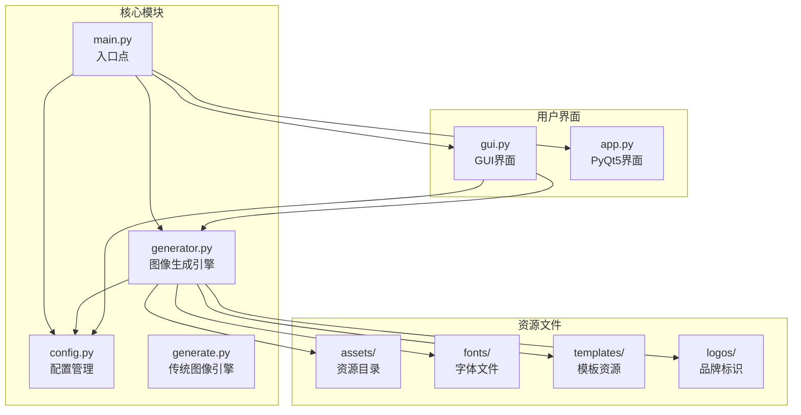

**图表来源**
- [main.py:1-131](file://src/main.py#L1-L131)
- [config.py:1-178](file://src/config.py#L1-L178)

**章节来源**
- [main.py:1-131](file://src/main.py#L1-L131)
- [config.py:1-178](file://src/config.py#L1-L178)

## 核心组件

### 主要功能模块

系统的核心功能由以下主要组件构成：

1. **配置管理系统** - 管理地区配置、模板配置和导出设置
2. **图像生成引擎** - 核心的图像合成和渲染逻辑
3. **用户界面层** - 提供多种交互方式的用户界面
4. **资源管理系统** - 处理字体、模板和品牌标识资源

### 技术架构

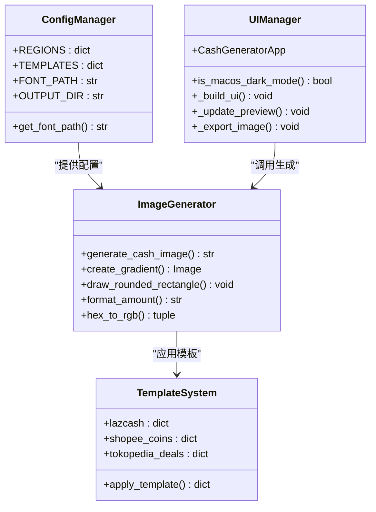

**图表来源**
- [config.py:85-149](file://src/config.py#L85-L149)
- [generator.py:145-346](file://src/generator.py#L145-L346)
- [gui.py:69-499](file://src/gui.py#L69-L499)

**章节来源**
- [config.py:1-178](file://src/config.py#L1-L178)
- [generator.py:1-360](file://src/generator.py#L1-L360)
- [gui.py:1-499](file://src/gui.py#L1-L499)

## 架构概览

系统采用分层架构设计，确保了良好的可维护性和扩展性：

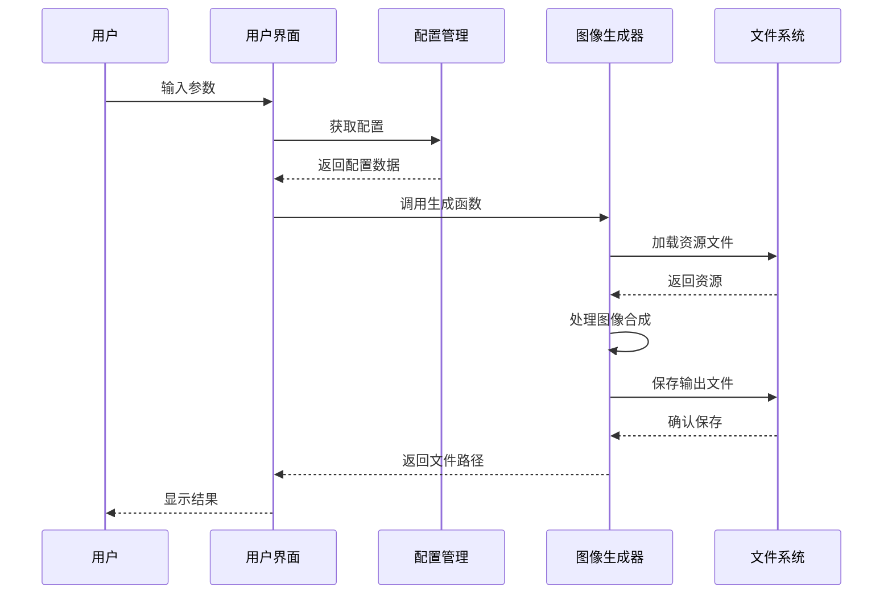

**图表来源**
- [main.py:18-106](file://src/main.py#L18-L106)
- [generator.py:145-346](file://src/generator.py#L145-L346)

系统支持三种运行模式：
- **命令行模式**：通过参数直接生成图像
- **GUI模式**：提供图形界面进行交互操作
- **PyQt5模式**：使用 PyQt5 构建的现代化界面

## 详细组件分析

### 配置管理系统

配置管理系统是整个模板系统的核心，负责管理所有静态配置信息。

#### 地区配置 (REGIONS)

系统支持六个东南亚国家和地区，每个地区都有独特的货币格式和视觉偏好：

| 国家代码 | 名称 | 货币符号 | 货币位置 | 本地化设置 |
|---------|------|----------|----------|------------|
| MY | Malaysia | RM | 前缀 | en_MY |
| TH | Thailand | ฿ | 前缀 | th_TH |
| ID | Indonesia | Rp | 前缀 | id_ID |
| PH | Philippines | ₱ | 前缀 | en_PH |
| SG | Singapore | $ | 前缀 | en_SG |
| VN | Vietnam | ₫ | 后缀 | vi_VN |

#### 模板配置 (TEMPLATES)

三种模板都基于相同的几何结构，但采用了不同的色彩方案：

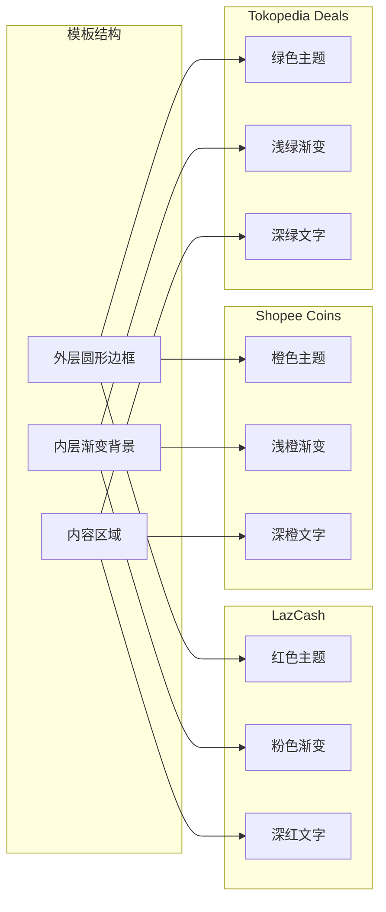

**图表来源**
- [config.py:85-149](file://src/config.py#L85-L149)

**章节来源**
- [config.py:19-80](file://src/config.py#L19-L80)
- [config.py:85-149](file://src/config.py#L85-L149)

### 图像生成引擎

图像生成引擎是系统的核心，负责将模板、配置和用户输入转换为最终的图像文件。

#### 渐变背景生成

系统使用线性渐变技术创建平滑的颜色过渡效果：

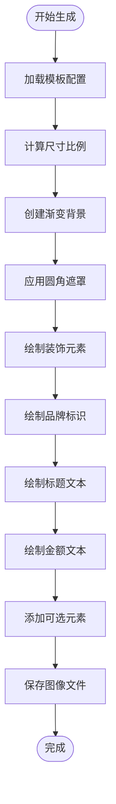

**图表来源**
- [generator.py:28-61](file://src/generator.py#L28-L61)
- [generator.py:145-346](file://src/generator.py#L145-L346)

#### 自适应布局算法

系统实现了复杂的自适应布局算法，确保在不同尺寸下都能保持最佳的视觉效果：

**章节来源**
- [generator.py:1-360](file://src/generator.py#L1-L360)

### 用户界面组件

系统提供了三种不同的用户界面模式，满足不同用户的需求。

#### GUI 界面 (Tkinter)

GUI 界面提供了丰富的交互功能和实时预览能力：

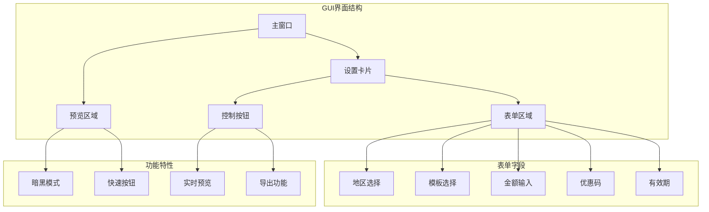

**图表来源**
- [gui.py:117-271](file://src/gui.py#L117-L271)

**章节来源**
- [gui.py:1-499](file://src/gui.py#L1-L499)

## 模板系统详解

### LazCash 模板

LazCash 模板代表了 Lazada 平台的品牌形象，采用了经典的红色主题设计。

#### 视觉特征

- **主色调**：#FF475A (鲜艳的粉红色)
- **渐变背景**：#FFFFFF 到 #FFE2E4 的柔和粉色渐变
- **强调色**：#D32637 (深红色)
- **文字颜色**：#902531 (深红色)
- **尺寸**：420x420 像素

#### 设计理念

LazCash 模板的设计重点在于突出品牌识别度和视觉冲击力。红色在中国和东南亚文化中都象征着好运和繁荣，非常适合促销活动的氛围。

#### 关键参数

| 参数名称 | 数值 | 用途 |
|---------|------|------|
| title_font_size | 50 | 标题字体大小 |
| amount_font_size | 180 | 金额字体大小 |
| logo_size | 80 | 品牌标识尺寸 |
| inner_margin | 25.51 | 内边距 |
| gradient_angle | 143 | 渐变角度 |

### Shopee Coins 模板

Shopee Coins 模板体现了 Shopee 平台的活力和创新精神。

#### 视觉特征

- **主色调**：#EE4D2D (温暖的橙色)
- **渐变背景**：#FFFFFF 到 #FFF0EB 的浅橙色渐变
- **强调色**：#D0011B (深橙色)
- **文字颜色**：#B7311F (深橙色)
- **尺寸**：420x420 像素

#### 设计理念

Shopee Coins 模板采用了更加现代和活力四射的设计风格，橙色代表着热情和创新，符合 Shopee 平台年轻化的品牌形象。

#### 关键参数

| 参数名称 | 数值 | 用途 |
|---------|------|------|
| title_font_size | 42 | 标题字体大小 |
| amount_font_size | 160 | 金额字体大小 |
| logo_size | 80 | 品牌标识尺寸 |
| inner_margin | 25.51 | 内边距 |
| gradient_angle | 143 | 渐变角度 |

### Tokopedia Deals 模板

Tokopedia Deals 模板展现了 Tokopedia 平台的专业和可靠形象。

#### 视觉特征

- **主色调**：#03AC0E (清新的绿色)
- **渐变背景**：#FFFFFF 到 #E8FCEA 的浅绿色渐变
- **强调色**：#03AC0E (绿色)
- **文字颜色**：#026A09 (深绿色)
- **尺寸**：420x420 像素

#### 设计理念

Tokopedia Deals 模板采用了更加稳重和专业的设计风格，绿色象征着成长和可持续发展，体现了 Tokopedia 对长期发展的承诺。

#### 关键参数

| 参数名称 | 数值 | 用途 |
|---------|------|------|
| title_font_size | 46 | 标题字体大小 |
| amount_font_size | 160 | 金额字体大小 |
| logo_size | 80 | 品牌标识尺寸 |
| inner_margin | 25.51 | 内边距 |
| gradient_angle | 143 | 渐变角度 |

## 模板参数配置

### 基础参数结构

每个模板都包含一组标准化的基础参数，确保三者之间的一致性和互换性：

```mermaid
erDiagram
TEMPLATE {
string name
int width
int height
string outer_bg
string outer_stroke
int outer_stroke_width
int inner_margin
string inner_bg_start
string inner_bg_end
int gradient_angle
}
LAZCASH {
string title_text "LazCash"
int title_font_size 50
string title_color "#902531"
int title_y 60
int amount_font_size 180
string amount_color "#D32637"
int amount_y 136
int logo_size 80
int logo_y 0
}
SHOPEE_COINS {
string title_text "Shopee Coins"
int title_font_size 42
string title_color "#B7311F"
int title_y 60
int amount_font_size 160
string amount_color "#D0011B"
int amount_y 136
int logo_size 80
int logo_y 0
}
TOKOPEDIA_DEALS {
string title_text "Tokopedia"
int title_font_size 46
string title_color "#026A09"
int title_y 60
int amount_font_size 160
string amount_color "#03AC0E"
int amount_y 136
int logo_size 80
int logo_y 0
}
TEMPLATE ||--|| LAZCASH : "extends"
TEMPLATE ||--|| SHOPEE_COINS : "extends"
TEMPLATE ||--|| TOKOPEDIA_DEALS : "extends"
```

**图表来源**
- [config.py:85-149](file://src/config.py#L85-L149)

### 颜色方案配置

每种模板都有一套完整的颜色方案，包括主色、辅色和强调色：

| 颜色类型 | LazCash | Shopee Coins | Tokopedia Deals |
|---------|---------|--------------|-----------------|
| 主背景色 | #FF475A | #EE4D2D | #03AC0E |
| 外框颜色 | #FFE8E9 | #FFD5C5 | #D4F5D6 |
| 内部渐变起始色 | #FFFFFF | #FFFFFF | #FFFFFF |
| 内部渐变结束色 | #FFE2E4 | #FFF0EB | #E8FCEA |
| 标题文字颜色 | #902531 | #B7311F | #026A09 |
| 金额文字颜色 | #D32637 | #D0011B | #03AC0E |

### 字体设置配置

系统支持多种字体配置，确保在不同平台上都能正确显示：

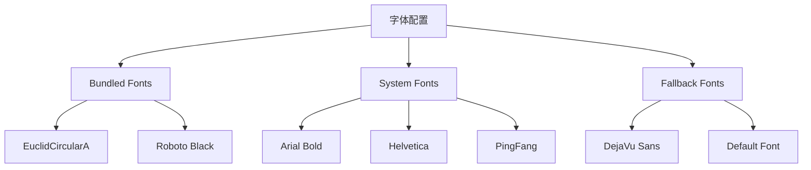

**图表来源**
- [config.py:154-170](file://src/config.py#L154-L170)
- [generate.py:73-121](file://src/generate.py#L73-L121)

**章节来源**
- [config.py:85-178](file://src/config.py#L85-L178)
- [generate.py:154-170](file://src/generate.py#L154-L170)

## 颜色方案与字体设置

### 颜色系统架构

系统采用统一的颜色管理机制，确保所有模板保持一致的视觉体验：

#### 颜色转换机制

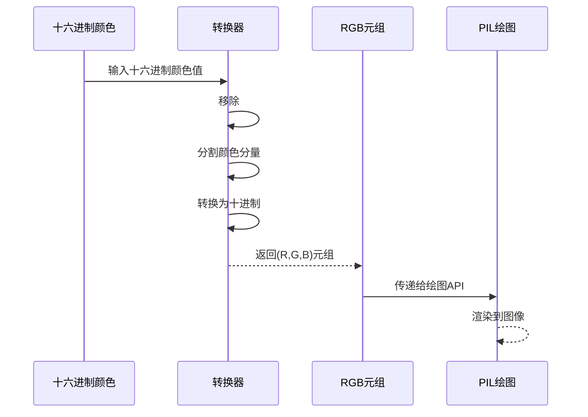

**图表来源**
- [generator.py:14-26](file://src/generator.py#L14-L26)

#### 插值算法

系统使用线性插值算法创建平滑的颜色过渡效果：

**章节来源**
- [generator.py:20-26](file://src/generator.py#L20-L26)

### 字体管理系统

字体系统具有多层次的容错机制，确保在各种环境下都能正常工作：

#### 字体加载流程

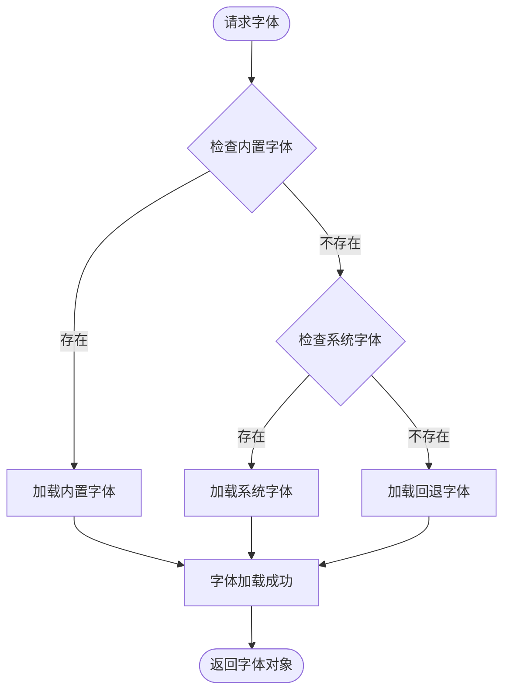

**图表来源**
- [generate.py:73-121](file://src/generate.py#L73-L121)

#### 字体适配策略

系统针对特殊字符提供了专门的字体适配策略：

**章节来源**
- [generate.py:112-121](file://src/generate.py#L112-L121)

## 模板选择指南

### 适用场景分析

#### LazCash 模板适用场景

- **Lazada 平台促销活动**
- **需要强烈品牌识别度的营销活动**
- **面向中国和东南亚市场的推广**
- **追求视觉冲击力的广告投放**

#### Shopee Coins 模板适用场景

- **Shopee 平台的日常促销**
- **年轻用户群体的营销活动**
- **需要体现活力和创新的品牌推广**
- **社交媒体平台的互动营销**

#### Tokopedia Deals 模板适用场景

- **Tokopedia 平台的常规优惠**
- **专业和可靠的商业推广**
- **注重品质和服务的品牌展示**
- **B2B 业务的促销活动**

### 选择决策矩阵

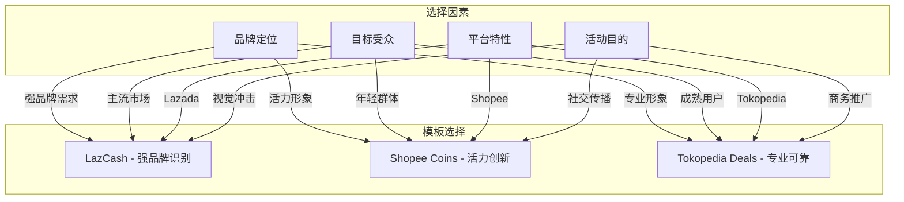

### 使用建议

1. **新用户优先选择 LazCash** - 提供最完整的功能和最清晰的示例
2. **年轻用户群体选择 Shopee Coins** - 更符合年轻人的审美偏好
3. **B2B 业务选择 Tokopedia Deals** - 体现专业和可靠性
4. **跨平台推广选择 LazCash** - 最具通用性的品牌识别

## 模板预览功能

### 实时预览机制

系统提供了强大的实时预览功能，允许用户在修改参数后立即看到效果变化：

#### 预览更新流程

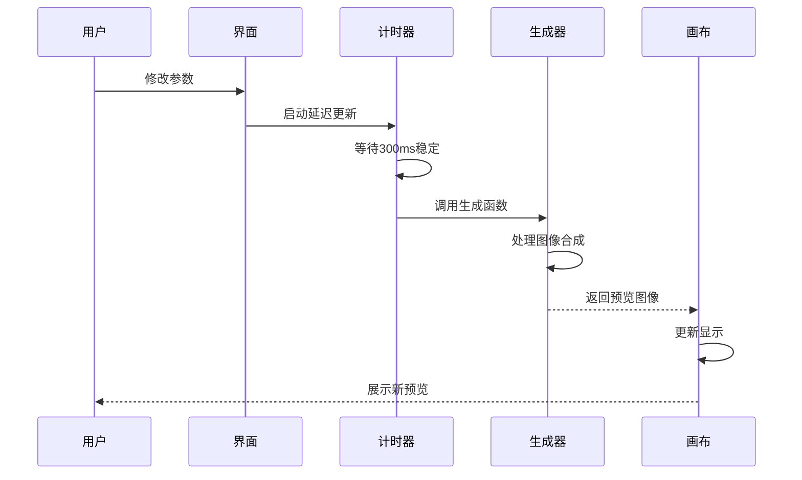

**图表来源**
- [gui.py:390-456](file://src/gui.py#L390-L456)

#### 预览优化策略

系统采用了多项优化措施来提升预览性能：

1. **延迟更新机制** - 防止频繁的重复生成
2. **缩放适配** - 自动调整图像尺寸以适应预览区域
3. **缓存机制** - 避免重复计算相同参数的图像
4. **异步处理** - 不阻塞用户界面响应

### 预览功能特性

#### 动态参数更新

- **实时金额变化** - 金额输入框变化立即反映在预览中
- **模板切换预览** - 切换模板时即时显示新样式
- **地区配置预览** - 改变地区影响货币格式和颜色
- **可选元素预览** - 优惠码和有效期的动态显示

#### 预览质量保证

- **高质量缩放** - 使用 Lanczos 算法确保缩放质量
- **自适应尺寸** - 根据预览区域自动调整图像大小
- **状态反馈** - 显示当前预览参数和状态信息

**章节来源**
- [gui.py:418-456](file://src/gui.py#L418-L456)

## 渲染原理与自适应布局

### 自适应布局算法

系统实现了复杂的自适应布局算法，确保在不同尺寸和分辨率下都能保持最佳的视觉效果：

#### 尺寸缩放机制

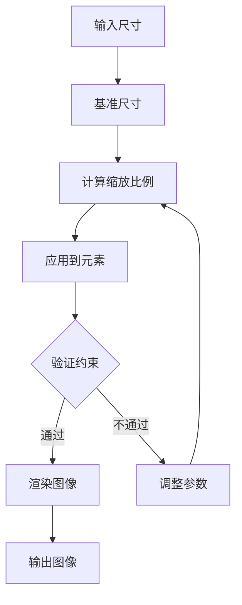

**图表来源**
- [generate.py:255-257](file://src/generate.py#L255-L257)

#### 文本自适应算法

系统使用二分搜索算法优化文本显示效果：

**章节来源**
- [generate.py:281-324](file://src/generate.py#L281-L324)

### 渐变渲染技术

系统采用线性渐变技术创建平滑的颜色过渡效果：

#### 渐变计算公式

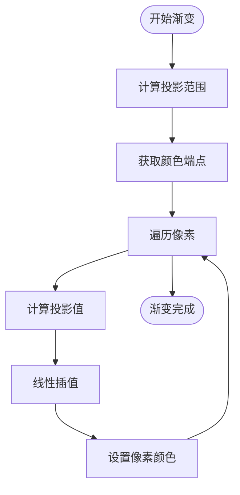

**图表来源**
- [generator.py:28-61](file://src/generator.py#L28-L61)

### 圆角矩形绘制

系统实现了高效的圆角矩形绘制算法：

#### 圆角绘制策略

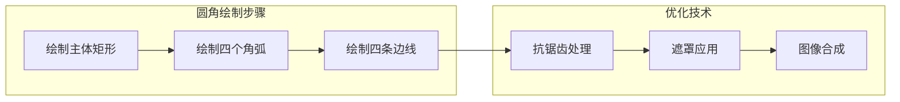

**图表来源**
- [generator.py:63-89](file://src/generator.py#L63-L89)

**章节来源**
- [generator.py:28-89](file://src/generator.py#L28-L89)

## 性能考虑

### 性能优化策略

系统在多个层面实施了性能优化措施：

#### 内存管理

- **资源复用** - 重复使用的图像和字体对象进行缓存
- **及时释放** - 大图像对象使用后及时释放内存
- **批量处理** - 支持批量生成以提高效率

#### 计算优化

- **早期退出** - 在不可能产生更好结果时提前停止计算
- **近似算法** - 使用快速算法获得足够接近的结果
- **并行处理** - 利用多核处理器加速计算

#### I/O 优化

- **异步文件操作** - 避免阻塞主线程
- **缓冲写入** - 减少磁盘访问次数
- **路径缓存** - 缓存常用资源路径

### 性能监控

系统提供了基本的性能监控功能：

- **生成时间统计** - 记录每次生成的耗时
- **内存使用监控** - 跟踪内存占用情况
- **错误日志记录** - 记录性能相关的问题

## 故障排除指南

### 常见问题诊断

#### 字体显示问题

**症状**：特殊字符显示为方块或问号

**可能原因**：
- 系统缺少支持相应字符集的字体
- 字体文件损坏或缺失
- 字符编码问题

**解决方案**：
1. 检查系统字体安装情况
2. 验证字体文件完整性
3. 使用系统字体回退机制

#### 颜色显示异常

**症状**：颜色显示与预期不符

**可能原因**：
- 颜色值格式错误
- 显示设备色彩校准问题
- 颜色空间转换问题

**解决方案**：
1. 验证十六进制颜色值格式
2. 检查显示器色彩设置
3. 使用 RGB 值进行精确控制

#### 图像质量下降

**症状**：生成的图像模糊或失真

**可能原因**：
- 缩放算法选择不当
- 输出质量设置过低
- 资源文件损坏

**解决方案**：
1. 使用高质量缩放算法
2. 调整输出质量参数
3. 重新生成或替换资源文件

### 错误处理机制

系统实现了完善的错误处理机制：

#### 异常分类

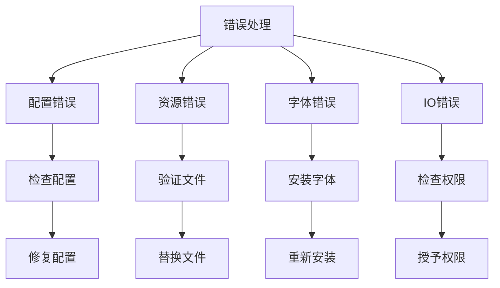

**图表来源**
- [generate.py:236-241](file://src/generate.py#L236-L241)

#### 日志记录

系统会记录详细的错误信息用于调试：

- **错误类型** - 区分不同类型的错误
- **发生时间** - 记录错误发生的具体时间
- **上下文信息** - 保存相关的环境信息
- **解决建议** - 提供可能的解决方案

**章节来源**
- [generate.py:223-241](file://src/generate.py#L223-L241)

## 结论

Cash Coupon Generator 模板系统是一个功能完整、设计精良的多模板优惠券生成解决方案。系统通过精心设计的三种模板风格，满足了东南亚主要电商平台的多样化需求。

### 系统优势

1. **多平台兼容** - 支持 macOS、Windows 和 Linux 系统
2. **灵活的配置** - 提供丰富的自定义选项
3. **高质量输出** - 基于专业图像处理技术
4. **用户友好** - 提供直观的图形界面和实时预览
5. **易于扩展** - 模块化设计便于功能扩展

### 技术特色

- **自适应布局** - 智能的尺寸适配和文本优化
- **色彩管理** - 统一的颜色系统和渐变效果
- **字体适配** - 多层次的字体加载和回退机制
- **性能优化** - 多层面的性能优化策略

### 发展前景

该系统为未来的功能扩展奠定了坚实的基础，可以轻松地添加新的模板风格、支持更多的地区配置，以及集成更高级的图像处理功能。随着电商行业的不断发展，这个模板系统将继续演进以满足新的需求。

通过本文档提供的详细指南，用户可以充分利用系统的所有功能，创建出既美观又实用的优惠券图像，有效提升营销活动的效果和用户体验。