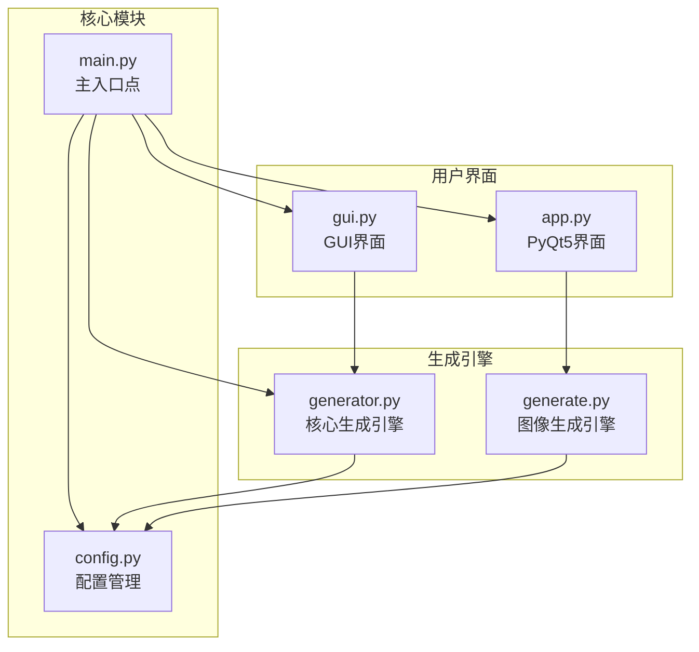
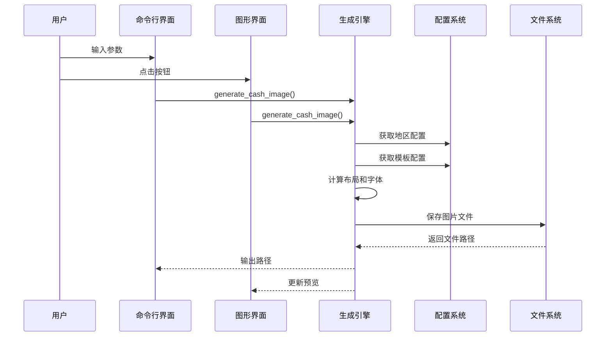
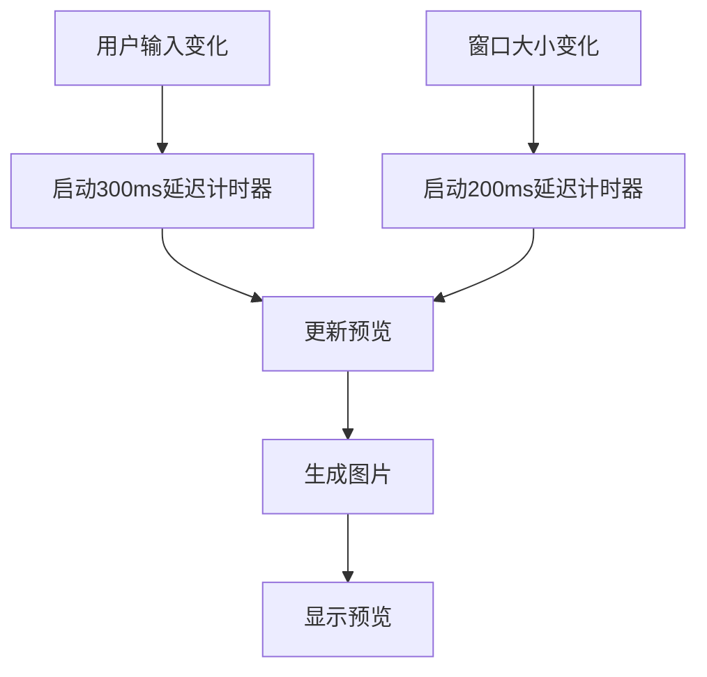
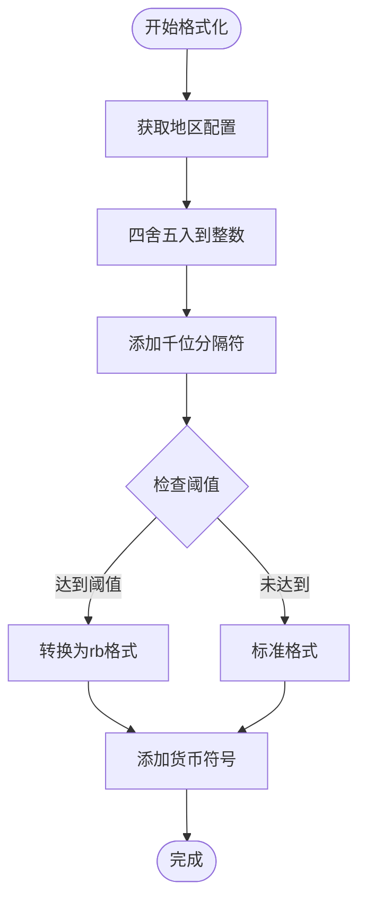
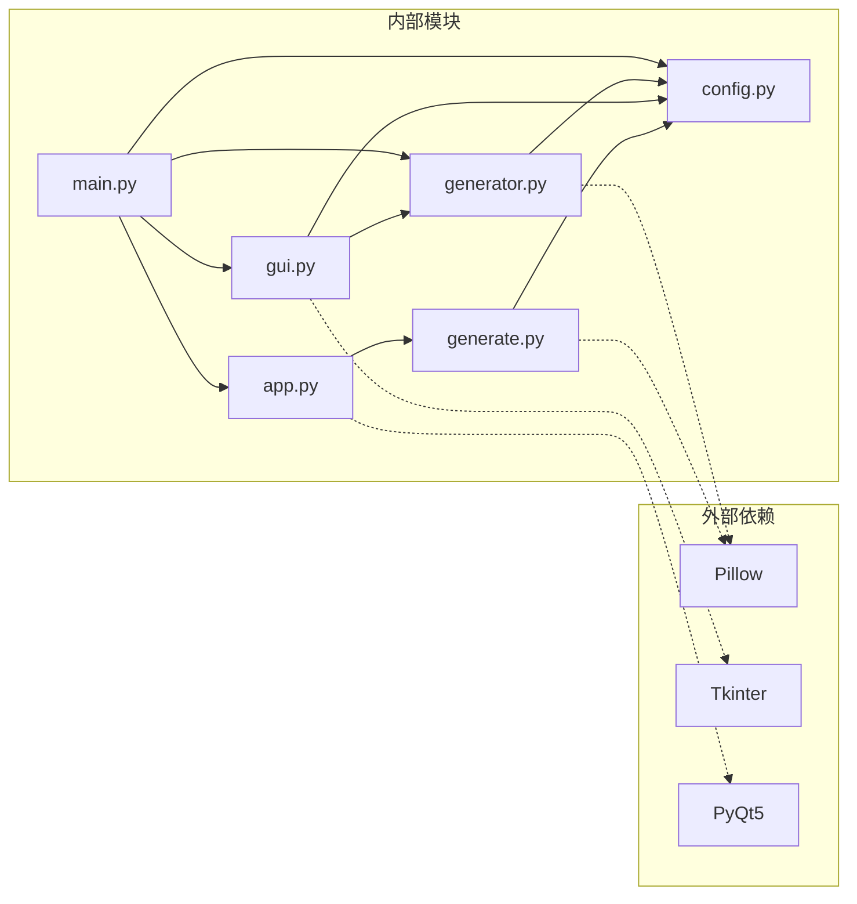
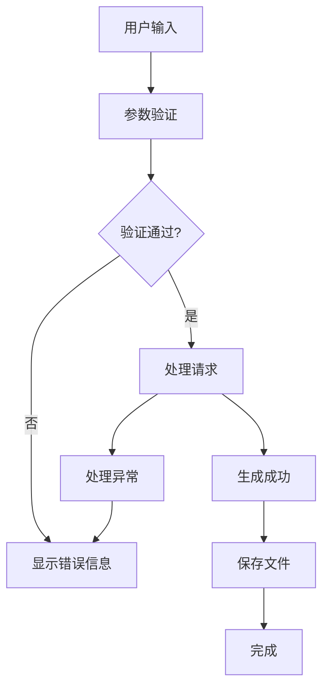

# 用户指南

<cite>
**本文档引用的文件**
- [app.py](file://src/app.py)
- [config.py](file://src/config.py)
- [generate.py](file://src/generate.py)
- [generator.py](file://src/generator.py)
- [gui.py](file://src/gui.py)
- [main.py](file://src/main.py)
</cite>

## 目录
1. [简介](#简介)
2. [项目结构](#项目结构)
3. [核心组件](#核心组件)
4. [架构概览](#架构概览)
5. [详细组件分析](#详细组件分析)
6. [依赖关系分析](#依赖关系分析)
7. [性能考虑](#性能考虑)
8. [故障排除指南](#故障排除指南)
9. [结论](#结论)
10. [附录](#附录)

## 简介

Cash Coupon Generator 是一个功能强大的多地区促销券生成工具，支持多种东南亚电商平台的优惠券模板。该工具提供了两种使用模式：命令行界面（CLI）和图形用户界面（GUI），能够根据不同的地区设置生成符合当地货币格式的优惠券图片。

主要特性包括：
- 支持马来西亚、泰国、印度尼西亚、菲律宾、新加坡、越南等多个地区
- 多种优惠券模板风格（LazCash、Shopee Coins、Tokopedia Deals）
- 自动货币格式化和本地化支持
- 实时预览功能
- 批量处理能力
- 自定义模板支持

## 项目结构

该项目采用模块化设计，每个功能模块都有明确的职责分工：



**图表来源**
- [main.py:1-131](file://src/main.py#L1-L131)
- [config.py:1-178](file://src/config.py#L1-L178)
- [generator.py:1-360](file://src/generator.py#L1-L360)
- [generate.py:1-429](file://src/generate.py#L1-L429)
- [gui.py:1-499](file://src/gui.py#L1-L499)
- [app.py:1-269](file://src/app.py#L1-L269)

**章节来源**
- [main.py:1-131](file://src/main.py#L1-L131)
- [config.py:1-178](file://src/config.py#L1-L178)

## 核心组件

### 配置系统

配置系统是整个应用的核心，负责管理多地区设置、模板配置和导出设置。

**地区配置**（REGIONS）
- 支持6个东南亚地区：MY（马来西亚）、TH（泰国）、ID（印度尼西亚）、PH（菲律宾）、SG（新加坡）、VN（越南）
- 每个地区包含货币符号、货币位置、本地化设置和品牌色彩
- 货币位置支持前缀（RM 15）和后缀（50.000 ₫）两种格式

**模板配置**（TEMPLATES）
- 提供3种不同的优惠券模板风格
- 每个模板包含尺寸、颜色方案、字体设置等详细参数
- 支持自定义模板扩展

**章节来源**
- [config.py:19-80](file://src/config.py#L19-L80)
- [config.py:85-149](file://src/config.py#L85-L149)

### 图像生成引擎

图像生成引擎负责创建高质量的优惠券图片，支持复杂的布局计算和字体渲染。

**核心功能**
- 九宫格缩放（9-patch）技术确保背景图片按比例缩放
- 自适应字体大小计算，确保文本在指定区域内完美显示
- 渐变背景和圆角矩形绘制
- 多语言字体支持和回退机制

**章节来源**
- [generator.py:28-61](file://src/generator.py#L28-L61)
- [generator.py:145-346](file://src/generator.py#L145-L346)

## 架构概览

系统采用分层架构设计，清晰分离了用户界面、业务逻辑和数据存储：



**图表来源**
- [main.py:18-106](file://src/main.py#L18-L106)
- [gui.py:418-456](file://src/gui.py#L418-L456)
- [generator.py:145-346](file://src/generator.py#L145-L346)

## 详细组件分析

### 命令行界面（CLI）

命令行界面提供了完整的功能访问方式，适合自动化脚本和批量处理。

#### 参数选项详解

**基本参数**
- `--amount` `-a`: 必需参数，指定折扣金额（数值类型）
- `--region` `-r`: 区域代码，默认SG，可选MY/TH/ID/PH/SG/VN
- `--template` `-t`: 模板风格，默认lazcash，可选lazcash/shopee_coins/tokopedia_deals

**高级参数**
- `--code` `-c`: 可选优惠券代码
- `--expiry` `-e`: 可选过期日期
- `--output` `-o`: 输出文件路径，默认自动生成
- `--preview` `-p`: 生成后显示预览
- `--list-regions`: 列出可用地区并退出
- `--list-templates`: 列出可用模板并退出

**使用示例**
```bash
# 基础使用
python main.py --amount 15 --region SG --template lazcash

# 带优惠券代码和过期日期
python main.py --amount 50 --region MY --code WELCOME2024 --expiry 2024-12-31

# 指定输出路径
python main.py --amount 100 --region ID --template shopee_coins --output ~/Desktop/voucher.png

# 列出可用选项
python main.py --list-regions
python main.py --list-templates
```

**章节来源**
- [main.py:18-106](file://src/main.py#L18-L106)

### 图形用户界面（GUI）

图形用户界面提供了直观的可视化操作体验，支持实时预览和导出功能。

#### 界面布局设计

**主界面结构**
- 标题区域：显示应用名称和副标题
- 表单卡片：包含所有配置参数的输入控件
- 快速按钮：预设金额快速选择
- 操作按钮：生成和导出功能
- 预览区域：实时显示生成结果
- 状态栏：显示当前状态和错误信息

**主题适配**
- 自动检测macOS深色/浅色模式
- 动态颜色方案适配
- 一致的视觉设计语言

#### 实时预览功能

预览功能通过延迟更新机制实现，避免频繁的重新生成：



**图表来源**
- [gui.py:390-456](file://src/gui.py#L390-L456)

**章节来源**
- [gui.py:69-499](file://src/gui.py#L69-L499)

### PyQt5 界面版本

除了tkinter版本外，还提供了基于PyQt5的界面实现。

#### 界面特色
- 更现代化的UI设计
- 原生macOS外观适配
- 增强的错误处理和用户反馈
- 固定窗口尺寸和布局约束

**章节来源**
- [app.py:23-269](file://src/app.py#L23-L269)

### 多区域货币格式化

系统支持6个不同地区的货币格式化，每种格式都有其特定的规则：

#### 货币格式特点

| 地区 | 货币符号 | 货币位置 | 千位分隔符 | 特殊规则 |
|------|----------|----------|------------|----------|
| 马来西亚 (MY) | RM | 前缀 | , | 标准前缀格式 |
| 泰国 (TH) | ฿ | 前缀 | , | 泰铢符号 |
| 印度尼西亚 (ID) | Rp | 前缀 | . | 千位分隔符为点 |
| 菲律宾 (PH) | ₱ | 前缀 | , | 比索符号 |
| 新加坡 (SG) | $ | 前缀 | , | 美元符号 |
| 越南 (VN) | ₫ | 后缀 | . | 后缀格式，千位分隔符为点 |

#### 格式化算法



**图表来源**
- [generate.py:123-153](file://src/generate.py#L123-L153)

**章节来源**
- [generate.py:15-22](file://src/generate.py#L15-L22)
- [generate.py:123-153](file://src/generate.py#L123-L153)

### 高级使用技巧

#### 批量处理策略

**自动化脚本示例**
```bash
#!/bin/bash
# 批量生成不同地区的优惠券
regions=("MY" "TH" "ID" "PH" "SG" "VN")
amounts=(10 25 50 100)

for region in "${regions[@]}"; do
    for amount in "${amounts[@]}"; do
        python main.py \
            --amount $amount \
            --region $region \
            --template lazcash \
            --output "./batch/coupon_${region}_${amount}.png"
    done
done
```

#### 自定义模板开发

**模板参数说明**
- `width`/`height`: 模板尺寸
- `outer_bg`: 外层背景色
- `outer_stroke`: 外层描边色
- `inner_bg_start`/`inner_bg_end`: 内层渐变色
- `gradient_angle`: 渐变角度
- `title_text`: 标题文本
- `title_font_size`: 标题字体大小
- `amount_font_size`: 金额字体大小
- `logo_size`: 标志尺寸

**章节来源**
- [config.py:85-149](file://src/config.py#L85-L149)

## 依赖关系分析

系统采用松耦合的设计，模块间依赖关系清晰：



**图表来源**
- [main.py:14-15](file://src/main.py#L14-L15)
- [generator.py:8-11](file://src/generator.py#L8-L11)
- [gui.py:9-14](file://src/gui.py#L9-L14)
- [app.py:13-20](file://src/app.py#L13-L20)
- [generate.py:9](file://src/generate.py#L9)

**章节来源**
- [main.py:14-15](file://src/main.py#L14-L15)
- [generator.py:8-11](file://src/generator.py#L8-L11)
- [gui.py:9-14](file://src/gui.py#L9-L14)
- [app.py:13-20](file://src/app.py#L13-L20)
- [generate.py:9](file://src/generate.py#L9)

## 性能考虑

### 图像生成优化

**字体渲染优化**
- 使用二分搜索算法确定最佳字体大小
- 缓存字体对象避免重复加载
- 系统字体回退机制减少渲染失败

**内存管理**
- 及时释放图像资源
- 控制预览图像的尺寸避免内存溢出
- 批量处理时合理控制并发数量

### 用户体验优化

**响应性保证**
- 输入变更的延迟更新机制（300ms）
- 窗口大小变化的防抖处理（200ms）
- 异步预览更新避免界面冻结

## 故障排除指南

### 常见问题及解决方案

**字体显示问题**
- 症状：特殊货币符号显示为方块
- 解决方案：系统会自动使用系统字体回退

**路径问题**
- 症状：找不到模板或资源文件
- 解决方案：检查资源文件是否正确打包

**权限问题**
- 症状：无法保存到指定目录
- 解决方案：检查目标目录的写入权限

**章节来源**
- [generate.py:112-121](file://src/generate.py#L112-L121)
- [gui.py:457-488](file://src/gui.py#L457-L488)

### 错误处理机制

系统实现了多层次的错误处理：



**图表来源**
- [gui.py:418-456](file://src/gui.py#L418-L456)
- [app.py:205-241](file://src/app.py#L205-L241)

## 结论

Cash Coupon Generator 提供了一个功能完整、易于使用的多地区优惠券生成解决方案。通过命令行和图形界面两种模式，用户可以根据自己的需求选择最适合的使用方式。

**主要优势**
- 支持6个东南亚地区，满足多市场运营需求
- 提供3种不同的模板风格，适应不同品牌需求
- 自动化的货币格式化和本地化支持
- 实时预览功能提升用户体验
- 开源免费，可定制性强

**适用场景**
- 电商促销活动
- 社交媒体营销
- 邮件营销素材
- 批量内容生成

## 附录

### 快速开始指南

**安装要求**
- Python 3.6+
- Pillow 库
- Tkinter（GUI模式）
- PyQt5（PyQt5界面）

**基本使用步骤**
1. 运行 `python main.py` 启动GUI模式
2. 在界面中选择地区和模板
3. 输入金额和其他可选参数
4. 查看实时预览效果
5. 导出到指定位置

### 最佳实践建议

**参数优化**
- 根据目标平台调整模板尺寸
- 合理设置字体大小确保可读性
- 使用合适的颜色搭配提升视觉效果

**批量处理**
- 使用命令行模式进行自动化处理
- 合理安排生成队列避免系统过载
- 定期清理临时文件释放磁盘空间

**质量保证**
- 在不同设备上测试预览效果
- 验证最终输出的清晰度
- 确保货币格式符合当地法规要求