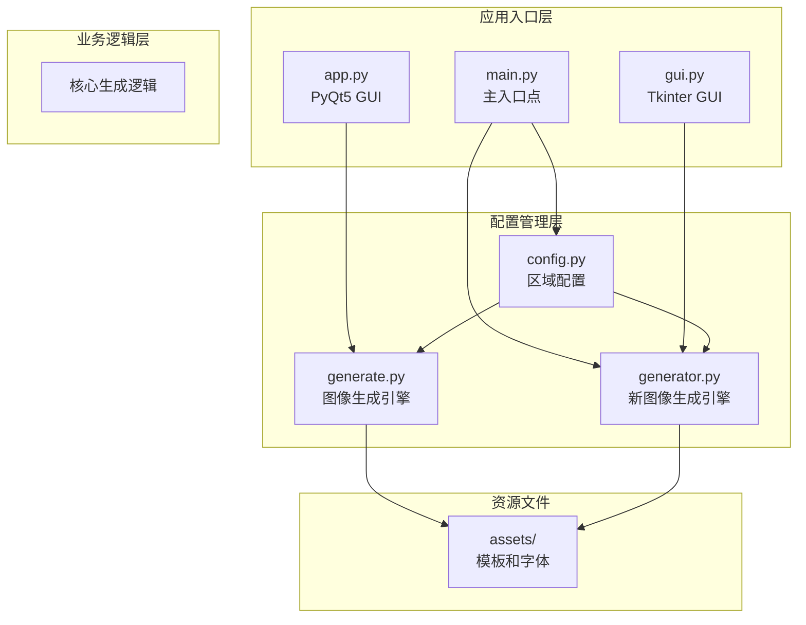
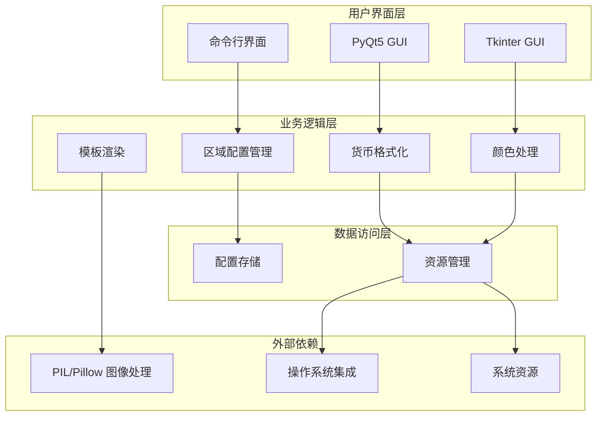
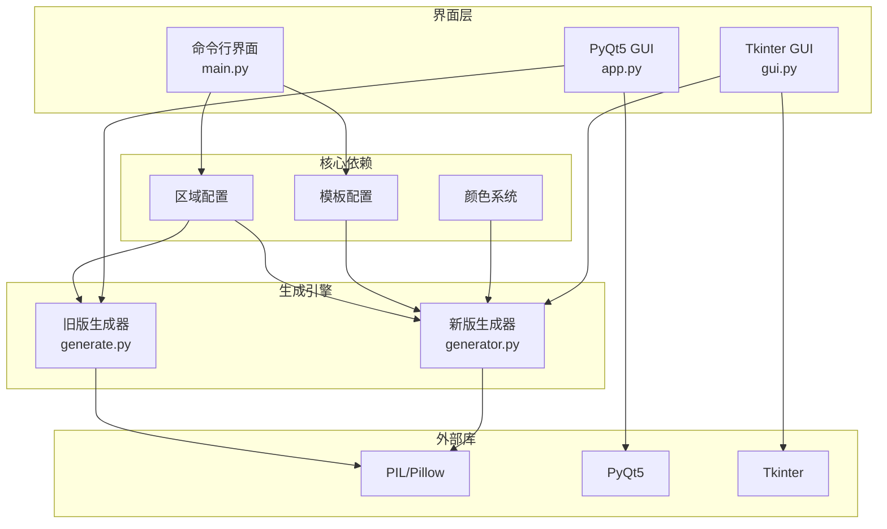

# 区域配置

<cite>
**本文档引用的文件**
- [config.py](file://src/config.py)
- [generate.py](file://src/generate.py)
- [generator.py](file://src/generator.py)
- [gui.py](file://src/gui.py)
- [main.py](file://src/main.py)
- [app.py](file://src/app.py)
</cite>

## 目录
1. [简介](#简介)
2. [项目结构](#项目结构)
3. [核心组件](#核心组件)
4. [架构概览](#架构概览)
5. [详细组件分析](#详细组件分析)
6. [依赖关系分析](#依赖关系分析)
7. [性能考虑](#性能考虑)
8. [故障排除指南](#故障排除指南)
9. [结论](#结论)

## 简介

本项目是一个多地区现金券生成器，专门针对东南亚市场设计。该系统支持马来西亚(MY)、泰国(TH)、印度尼西亚(ID)、菲律宾(PH)、新加坡(SG)和越南(VN)六个国家的区域配置。每个区域都有独特的货币格式、本地化设置和品牌色彩方案。

该工具提供了两种用户界面：命令行界面(CLI)和图形用户界面(GUI)，支持多种导出格式，并具有自动预览功能。

## 项目结构

项目采用模块化设计，主要包含以下核心模块：



**图表来源**
- [main.py:1-131](file://src/main.py#L1-L131)
- [config.py:1-178](file://src/config.py#L1-L178)
- [generate.py:1-429](file://src/generate.py#L1-L429)
- [generator.py:1-360](file://src/generator.py#L1-L360)

**章节来源**
- [main.py:1-131](file://src/main.py#L1-L131)
- [config.py:1-178](file://src/config.py#L1-L178)

## 核心组件

### 区域配置系统

系统的核心是区域配置模块，它定义了每个支持地区的完整配置信息：

| 组件 | 描述 | 关键属性 |
|------|------|----------|
| **区域代码** | ISO 3166-1 alpha-2 代码 | MY, TH, ID, PH, SG, VN |
| **名称** | 英文国家名称 | Malaysia, Thailand, Indonesia, Philippines, Singapore, Vietnam |
| **货币符号** | 本地货币符号 | RM, ฿, Rp, ₱, $, ₫ |
| **货币位置** | 符号位置 (前缀/后缀) | prefix, suffix |
| **本地化设置** | ICU 本地化标识符 | en_MY, th_TH, id_ID, en_PH, en_SG, vi_VN |
| **主色调** | 品牌主色 | #FF475A |
| **辅色调** | 次要品牌色 | #FFE8E9 |
| **强调色** | 强调/按钮色 | #D32637 |
| **文字颜色** | 文本配色 | #902531 |

### 货币格式化规则

每个区域都有特定的货币格式化规则：

```mermaid
flowchart TD
START[开始格式化] --> GETCONFIG[获取区域配置]
GETCONFIG --> CHECKREGION{检查区域类型}
CHECKREGION --> |ID/VN| THRESHOLD{检查阈值}
CHECKREGION --> |其他| FORMATNUM[格式化数字]
THRESHOLD --> |≥1000| RBFORMAT[转换为"rb"格式]
THRESHOLD --> |<1000| FORMATNUM
RBFORMAT --> SEPARATOR[应用千分位分隔符]
FORMATNUM --> SEPARATOR
SEPARATOR --> POSITION{检查货币位置}
POSITION --> |前缀| PREFIX[添加货币符号前缀]
POSITION --> |后缀| SUFFIX[添加货币符号后缀]
PREFIX --> END[返回格式化结果]
SUFFIX --> END
```

**图表来源**
- [generate.py:123-153](file://src/generate.py#L123-L153)

**章节来源**
- [config.py:19-80](file://src/config.py#L19-L80)
- [generate.py:15-22](file://src/generate.py#L15-L22)

## 架构概览

系统采用分层架构设计，确保区域配置的可扩展性和维护性：



**图表来源**
- [main.py:18-105](file://src/main.py#L18-L105)
- [config.py:16-178](file://src/config.py#L16-L178)

## 详细组件分析

### 区域配置详解

#### 马来西亚 (MY)
- **名称**: Malaysia
- **货币**: RM (马来西亚林吉特)
- **货币位置**: 前缀
- **本地化**: en_MY
- **主色调**: #FF475A (品牌红)
- **辅色调**: #FFE8E9 (浅红)
- **强调色**: #D32637 (深红)
- **文字颜色**: #902531 (酒红色)

#### 泰国 (TH)
- **名称**: Thailand
- **货币**: ฿ (泰铢)
- **货币位置**: 前缀
- **本地化**: th_TH
- **主色调**: #FF475A (品牌红)
- **辅色调**: #FFE8E9 (浅红)
- **强调色**: #D32637 (深红)
- **文字颜色**: #902531 (酒红色)

#### 印度尼西亚 (ID)
- **名称**: Indonesia
- **货币**: Rp (印尼盾)
- **货币位置**: 前缀
- **本地化**: id_ID
- **主色调**: #FF475A (品牌红)
- **辅色调**: #FFE8E9 (浅红)
- **强调色**: #D32637 (深红)
- **文字颜色**: #902531 (酒红色)
- **特殊规则**: ≥1000 使用 "rb" 缩写格式

#### 菲律宾 (PH)
- **名称**: Philippines
- **货币**: ₱ (菲律宾比索)
- **货币位置**: 前缀
- **本地化**: en_PH
- **主色调**: #FF475A (品牌红)
- **辅色调**: #FFE8E9 (浅红)
- **强调色**: #D32637 (深红)
- **文字颜色**: #902531 (酒红色)

#### 新加坡 (SG)
- **名称**: Singapore
- **货币**: $ (新加坡元)
- **货币位置**: 前缀
- **本地化**: en_SG
- **主色调**: #FF475A (品牌红)
- **辅色调**: #FFE8E9 (浅红)
- **强调色**: #D32637 (深红)
- **文字颜色**: #902531 (酒红色)

#### 越南 (VN)
- **名称**: Vietnam
- **货币**: ₫ (越南盾)
- **货币位置**: 后缀
- **本地化**: vi_VN
- **主色调**: #FF475A (品牌红)
- **辅色调**: #FFE8E9 (浅红)
- **强调色**: #D32637 (深红)
- **文字颜色**: #902531 (酒红色)
- **特殊规则**: 千分位分隔符使用点号

### 货币格式化算法

```mermaid
flowchart TD
INPUT[输入: 金额, 区域代码] --> ROUND[四舍五入到整数]
ROUND --> LOADCFG[加载区域配置]
LOADCFG --> CHECKTHRESHOLD{检查阈值规则}
CHECKTHRESHOLD --> |ID/VN≥1000| RBFORMAT[转换为"rb"格式]
CHECKTHRESHOLD --> |其他| APPLYSEP[应用千分位分隔符]
RBFORMAT --> APPLYSEP
APPLYSEP --> CHECKPOS{检查货币位置}
CHECKPOS --> |前缀| PREFIX[添加货币符号前缀]
CHECKPOS --> |后缀| SUFFIX[添加货币符号后缀]
PREFIX --> RESULT[返回格式化结果]
SUFFIX --> RESULT
```

**图表来源**
- [generate.py:123-153](file://src/generate.py#L123-L153)

### 颜色配置系统

颜色配置采用统一的品牌色彩体系：

| 颜色类型 | HEX值 | RGB值 | 用途 |
|----------|-------|-------|------|
| **主色调** | #FF475A | (255, 71, 90) | 品牌主色，用于主要装饰元素 |
| **辅色调** | #FFE8E9 | (255, 232, 233) | 次要装饰色，用于背景和边框 |
| **强调色** | #D32637 | (211, 38, 55) | 按钮和交互元素 |
| **文字颜色** | #902531 | (144, 37, 49) | 主要文本颜色 |

### 模板配置系统

系统支持三种不同的模板风格：

| 模板名称 | 宽度 | 高度 | 主要特点 |
|----------|------|------|----------|
| **LazCash** | 420px | 420px | 标准圆形设计，品牌红主色调 |
| **Shopee Coins** | 420px | 420px | 橙色主题，适合Shopee平台 |
| **Tokopedia Deals** | 420px | 420px | 绿色主题，适合Tokopedia平台 |

**章节来源**
- [config.py:19-149](file://src/config.py#L19-L149)
- [generate.py:15-22](file://src/generate.py#L15-L22)

## 依赖关系分析



**图表来源**
- [main.py:14-15](file://src/main.py#L14-L15)
- [app.py:20](file://src/app.py#L20)
- [gui.py:13-14](file://src/gui.py#L13-L14)

**章节来源**
- [main.py:14-15](file://src/main.py#L14-L15)
- [app.py:20](file://src/app.py#L20)
- [gui.py:13-14](file://src/gui.py#L13-L14)

## 性能考虑

### 图像生成优化

1. **字体加载策略**
   - 优先使用嵌入字体文件
   - 支持系统字体回退机制
   - 特殊货币符号自动切换到系统字体

2. **内存管理**
   - 使用九宫格缩放避免重复计算
   - 图像处理后及时释放内存
   - 预览和导出分离内存占用

3. **渲染优化**
   - 二分搜索优化字体大小计算
   - 动态调整渲染质量以平衡速度和效果

### 区域配置扩展

新增区域配置的步骤：

1. 在 `config.py` 的 `REGIONS` 字典中添加新区域
2. 更新 `generate.py` 的 `COUNTRY_CONFIG` 字典
3. 准备对应区域的徽标文件
4. 测试货币格式化规则
5. 验证GUI界面显示

**章节来源**
- [config.py:19-80](file://src/config.py#L19-L80)
- [generate.py:15-22](file://src/generate.py#L15-L22)

## 故障排除指南

### 常见问题及解决方案

| 问题类型 | 症状 | 解决方案 |
|----------|------|----------|
| **字体显示问题** | 特殊货币符号显示为方块 | 系统会自动切换到支持的系统字体 |
| **区域配置缺失** | 新增区域无法识别 | 检查 `config.py` 和 `generate.py` 中的配置一致性 |
| **图像生成失败** | 报告找不到模板文件 | 确认 `assets/templates/template_base.png` 存在 |
| **GUI界面显示异常** | 控件颜色不正确 | 检查 macOS 深色/浅色模式检测 |
| **货币格式错误** | 数字格式不符合当地习惯 | 验证 `COUNTRY_CONFIG` 中的分隔符设置 |

### 调试建议

1. **启用详细日志**：在生成函数中添加调试信息
2. **验证资源配置**：使用 `--list-regions` 和 `--list-templates` 参数
3. **测试不同区域**：逐一测试所有支持的区域配置
4. **检查资源文件**：确认所有必需的字体和模板文件存在

**章节来源**
- [gui.py:17-28](file://src/gui.py#L17-L28)
- [main.py:82-92](file://src/main.py#L82-L92)

## 结论

本项目提供了一个完整且灵活的多区域现金券生成解决方案。通过标准化的区域配置系统，可以轻松支持东南亚市场的多样化需求。

### 主要优势

1. **完整的区域支持**：覆盖东南亚主要市场
2. **灵活的配置系统**：易于扩展新的区域和模板
3. **双界面支持**：满足不同用户需求
4. **高质量输出**：专业的图像生成和渲染技术

### 扩展建议

1. **国际化支持**：增加更多语言的本地化支持
2. **模板定制**：允许用户自定义模板样式
3. **批量生成**：支持批量处理多个区域的优惠券
4. **云端集成**：提供云存储和分享功能

该系统为东南亚电商市场提供了一个强大而易用的现金券生成工具，能够有效提升营销活动的专业性和用户体验。