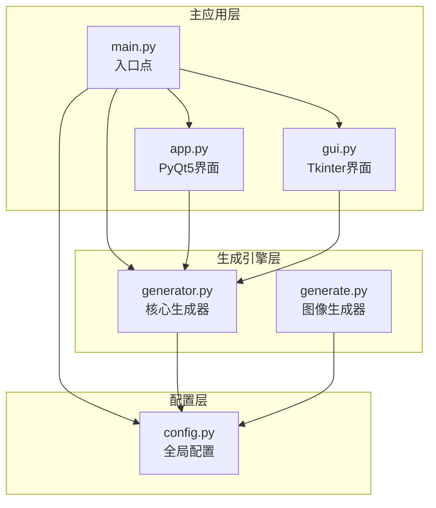
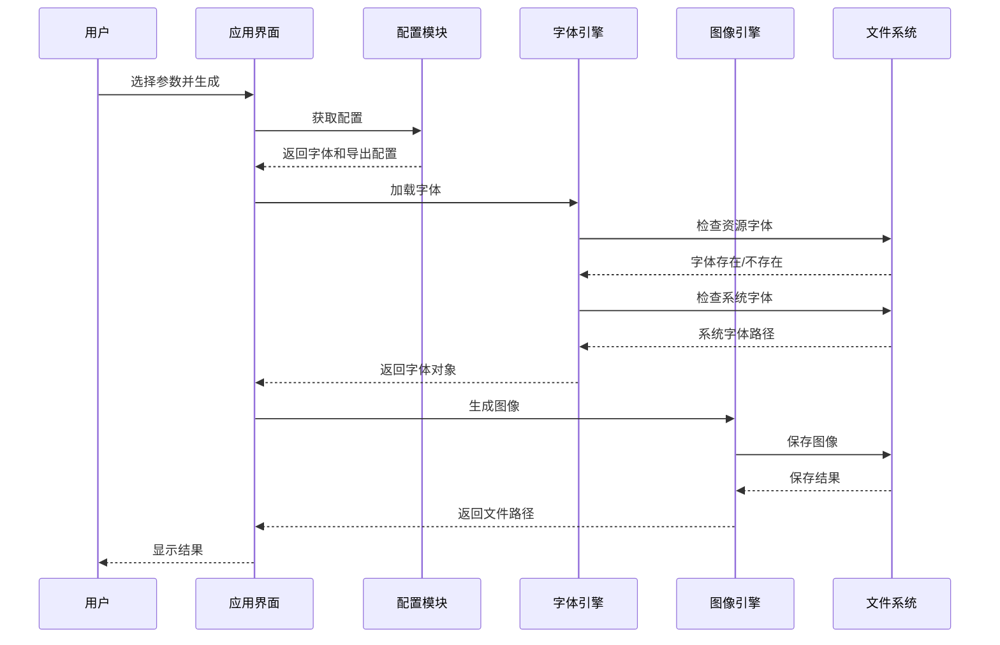
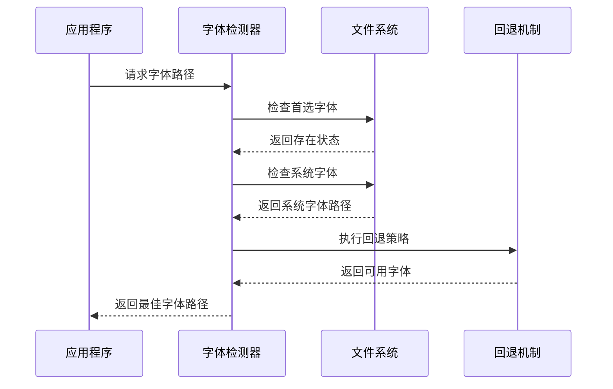
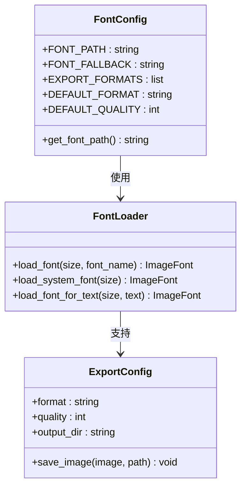
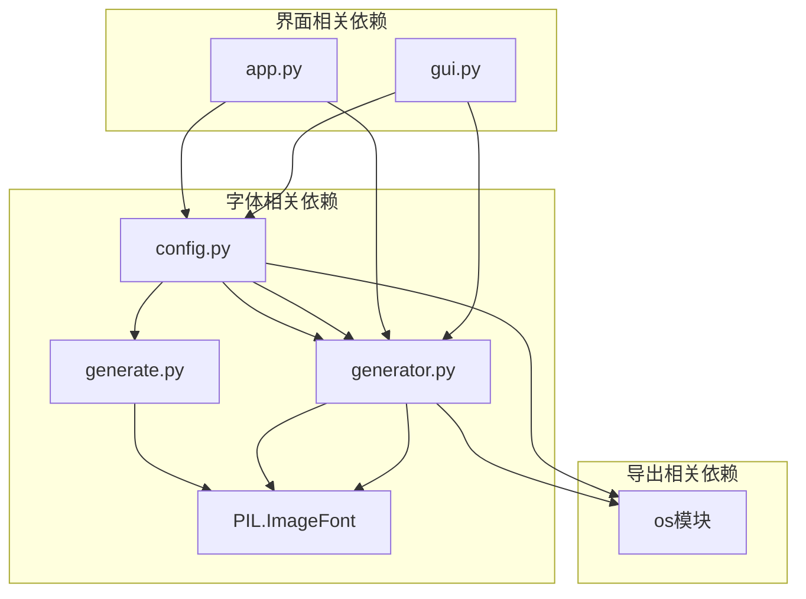

# 字体与导出配置

<cite>
**本文档引用的文件**
- [app.py](file://src/app.py)
- [config.py](file://src/config.py)
- [generate.py](file://src/generate.py)
- [generator.py](file://src/generator.py)
- [gui.py](file://src/gui.py)
- [main.py](file://src/main.py)
</cite>

## 目录
1. [简介](#简介)
2. [项目结构](#项目结构)
3. [核心组件](#核心组件)
4. [架构概览](#架构概览)
5. [详细组件分析](#详细组件分析)
6. [依赖关系分析](#依赖关系分析)
7. [性能考虑](#性能考虑)
8. [故障排除指南](#故障排除指南)
9. [结论](#结论)

## 简介

本项目是一个多地区促销券生成器，支持多种导出格式和字体管理。本文档详细说明了字体管理系统和图像导出设置，包括跨平台字体支持、字体回退策略、默认字体候选列表以及导出格式配置。

## 项目结构

该项目采用模块化设计，主要包含以下核心模块：



**图表来源**
- [main.py:1-131](file://src/main.py#L1-L131)
- [app.py:1-269](file://src/app.py#L1-L269)
- [gui.py:1-499](file://src/gui.py#L1-L499)
- [config.py:1-178](file://src/config.py#L1-L178)
- [generator.py:1-360](file://src/generator.py#L1-L360)
- [generate.py:1-429](file://src/generate.py#L1-L429)

**章节来源**
- [main.py:1-131](file://src/main.py#L1-L131)
- [config.py:1-178](file://src/config.py#L1-L178)

## 核心组件

### 字体管理系统

项目实现了多层次的字体加载和回退机制：

1. **资源字体优先级**：优先使用打包在应用内的字体文件
2. **系统字体回退**：当资源字体不可用时，自动切换到系统字体
3. **特殊字符处理**：针对特定货币符号的字体回退机制

### 导出配置系统

支持多种导出格式和质量设置：

1. **格式支持**：PNG和JPG格式
2. **质量设置**：可配置的压缩质量
3. **文件命名**：基于参数的智能文件命名规则

**章节来源**
- [config.py:151-178](file://src/config.py#L151-L178)
- [generator.py:91-115](file://src/generator.py#L91-L115)
- [generate.py:73-89](file://src/generate.py#L73-L89)

## 架构概览



**图表来源**
- [app.py:205-242](file://src/app.py#L205-L242)
- [config.py:154-178](file://src/config.py#L154-L178)
- [generator.py:91-115](file://src/generator.py#L91-L115)
- [generate.py:73-89](file://src/generate.py#L73-L89)

## 详细组件分析

### 字体路径查找机制

#### 资源字体加载流程


**图表来源**
- [generate.py:73-89](file://src/generate.py#L73-L89)
- [generator.py:91-115](file://src/generator.py#L91-L115)

#### 跨平台字体支持

项目实现了完整的跨平台字体支持：

**macOS平台**：
- 系统字体路径：`/System/Library/Fonts/`
- 补充字体：`/Library/Fonts/`
- 支持PingFang字体用于中文显示

**Windows平台**：
- 系统字体目录：`C:\Windows\Fonts\`
- 支持Arial Bold等常用字体

**Linux平台**：
- 系统字体目录：`/usr/share/fonts/`
- DejaVu Sans Bold字体支持

**章节来源**
- [config.py:154-170](file://src/config.py#L154-L170)
- [generate.py:92-98](file://src/generate.py#L92-L98)
- [generator.py:99-111](file://src/generator.py#L99-L111)

### 字体回退策略

#### 特殊字符字体回退


**图表来源**
- [generate.py:112-121](file://src/generate.py#L112-L121)

#### 默认字体候选列表

系统提供了多层级的字体候选列表：

**第一层级（首选）**：
- EuclidCircularA-Bold.otf
- EuclidCircularA-Medium.otf
- Roboto-Black.ttf

**第二层级（系统字体）**：
- macOS: Helvetica.ttc, PingFang.ttc
- Windows: Arial Bold.ttf
- Linux: DejaVuSans-Bold.ttf

**第三层级（回退）**：
- arial.ttf
- 默认字体

**章节来源**
- [generate.py:26-28](file://src/generate.py#L26-L28)
- [config.py:156-167](file://src/config.py#L156-L167)

### 自动检测流程

#### 字体自动检测实现



**图表来源**
- [config.py:154-167](file://src/config.py#L154-L167)
- [generate.py:101-109](file://src/generate.py#L101-L109)

**章节来源**
- [config.py:154-170](file://src/config.py#L154-L170)
- [generate.py:101-121](file://src/generate.py#L101-L121)

### 导出格式设置

#### 支持的导出格式

项目支持以下导出格式：

**PNG格式**：
- 无损压缩
- 支持透明度
- 默认质量：95%
- 文件扩展名：.png

**JPG格式**：
- 有损压缩
- 不支持透明度
- 默认质量：95%
- 文件扩展名：.jpg

#### 文件命名规则

导出文件采用智能命名规则：

**PNG格式命名**：
```
coupon_[国家代码]_[金额].png
示例：coupon_MY_50.png
```

**JPG格式命名**：
```
cash_[国家代码]_[金额]_[模板].jpg
示例：cash_MY_50_lazcash.jpg
```

**章节来源**
- [config.py:175-178](file://src/config.py#L175-L178)
- [generate.py:411-421](file://src/generate.py#L411-L421)
- [gui.py:461-469](file://src/gui.py#L461-L469)

### GUI界面集成

#### 字体配置在GUI中的应用



**图表来源**
- [config.py:154-178](file://src/config.py#L154-L178)
- [generate.py:73-121](file://src/generate.py#L73-L121)
- [generator.py:335-346](file://src/generator.py#L335-L346)

**章节来源**
- [app.py:255-256](file://src/app.py#L255-L256)
- [gui.py:457-489](file://src/gui.py#L457-L489)

## 依赖关系分析



**图表来源**
- [config.py:1-178](file://src/config.py#L1-178)
- [generate.py:1-429](file://src/generate.py#L1-429)
- [generator.py:1-360](file://src/generator.py#L1-360)
- [app.py:13-20](file://src/app.py#L13-L20)
- [gui.py:13-14](file://src/gui.py#L13-L14)

**章节来源**
- [config.py:1-178](file://src/config.py#L1-178)
- [generate.py:1-429](file://src/generate.py#L1-429)
- [generator.py:1-360](file://src/generator.py#L1-360)

## 性能考虑

### 字体加载优化

1. **缓存机制**：字体对象会被缓存以避免重复加载
2. **异步加载**：在GUI应用中采用延迟加载策略
3. **内存管理**：及时释放不再使用的字体资源

### 导出性能优化

1. **质量平衡**：默认质量设置在文件大小和视觉效果间取得平衡
2. **格式选择**：根据用途选择合适的导出格式
3. **批量处理**：支持批量生成多个优惠券

## 故障排除指南

### 字体缺失问题

**问题症状**：
- 文本显示为方块或问号
- 字体加载失败异常
- 显示乱码

**解决方案**：

1. **验证字体文件**：
   ```bash
   # 检查字体文件是否存在
   ls -la assets/fonts/
   ```

2. **手动指定字体路径**：
   ```python
   # 在config.py中修改字体路径
   FONT_PATH = "/path/to/your/font.ttf"
   ```

3. **安装系统字体**：
   - macOS: 安装字体到 `/Library/Fonts/`
   - Windows: 安装到 `C:\Windows\Fonts\`
   - Linux: 安装到 `/usr/share/fonts/`

**章节来源**
- [config.py:154-170](file://src/config.py#L154-L170)
- [generate.py:73-89](file://src/generate.py#L73-L89)

### 路径错误问题

**问题症状**：
- FileNotFoundError: 模板或字体文件未找到
- 资源路径解析失败

**解决方案**：

1. **检查工作目录**：
   ```python
   import os
   print("当前工作目录:", os.getcwd())
   print("脚本所在目录:", os.path.dirname(os.path.abspath(__file__)))
   ```

2. **验证资源路径**：
   ```python
   # 检查资源路径构建逻辑
   from src.generate import resource_path
   print("资源路径:", resource_path("fonts", "EuclidCircularA-Bold.otf"))
   ```

3. **环境变量配置**：
   ```bash
   # 设置PYTHONPATH
   export PYTHONPATH="${PYTHONPATH}:$(pwd)"
   ```

**章节来源**
- [generate.py:56-71](file://src/generate.py#L56-L71)

### 显示异常问题

**问题症状**：
- 文本截断或重叠
- 字体渲染不正确
- 字符显示异常

**解决方案**：

1. **调整字体大小**：
   ```python
   # 在生成器中调整字体大小
   font_size = min(max_font_size, calculated_size)
   ```

2. **启用特殊字符回退**：
   ```python
   # 对包含特殊字符的文本使用系统字体
   font = load_font_for_text(size, text)
   ```

3. **检查字符编码**：
   ```python
   # 确保文本编码正确
   text.encode('utf-8')
   ```

**章节来源**
- [generate.py:112-121](file://src/generate.py#L112-L121)
- [generate.py:282-324](file://src/generate.py#L282-L324)

### 导出问题

**问题症状**：
- 导出文件损坏
- 格式不支持
- 质量异常

**解决方案**：

1. **验证导出格式**：
   ```python
   # 检查支持的格式
   SUPPORTED_FORMATS = ["PNG", "JPG"]
   ```

2. **调整导出质量**：
   ```python
   # PNG质量设置
   img.save(path, "PNG", quality=95)
   
   # JPG质量设置  
   img.save(path, "JPEG", quality=95)
   ```

3. **检查输出目录权限**：
   ```bash
   import os
   os.makedirs(output_dir, exist_ok=True)
   ```

**章节来源**
- [config.py:175-178](file://src/config.py#L175-L178)
- [generator.py:335-346](file://src/generator.py#L335-L346)

## 结论

本项目的字体和导出配置系统提供了完整的跨平台支持和灵活的自定义选项。通过多层次的字体加载机制和智能的回退策略，确保了在不同操作系统和环境下的一致性表现。同时，清晰的导出配置和文件命名规则使得用户可以轻松地生成符合需求的优惠券图像。

主要优势包括：
- 完善的跨平台字体支持
- 智能的字体回退机制
- 灵活的导出格式配置
- 用户友好的界面集成
- 完善的故障排除指南

建议在实际部署时：
1. 确保字体文件完整性和可访问性
2. 根据目标平台调整字体配置
3. 测试不同导出格式的效果
4. 验证文件命名规则是否符合预期