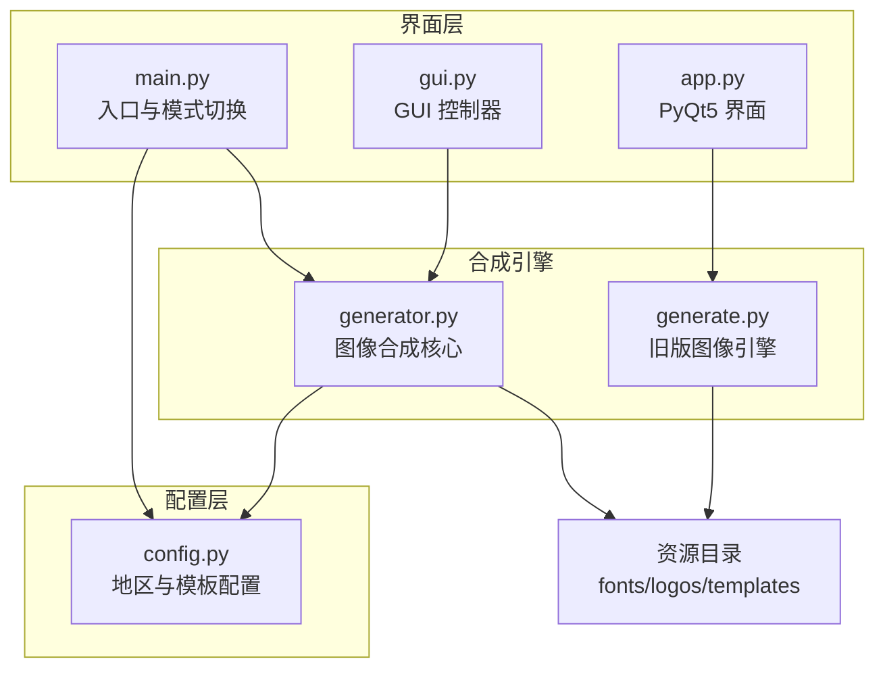
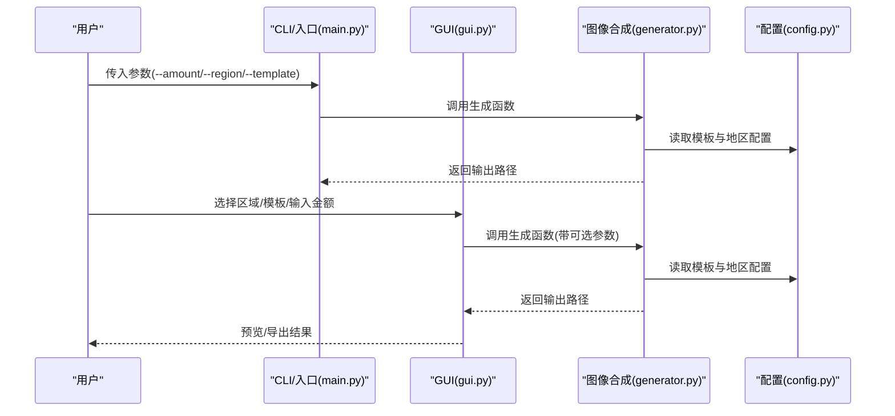
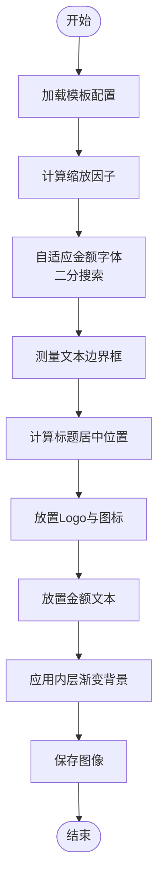
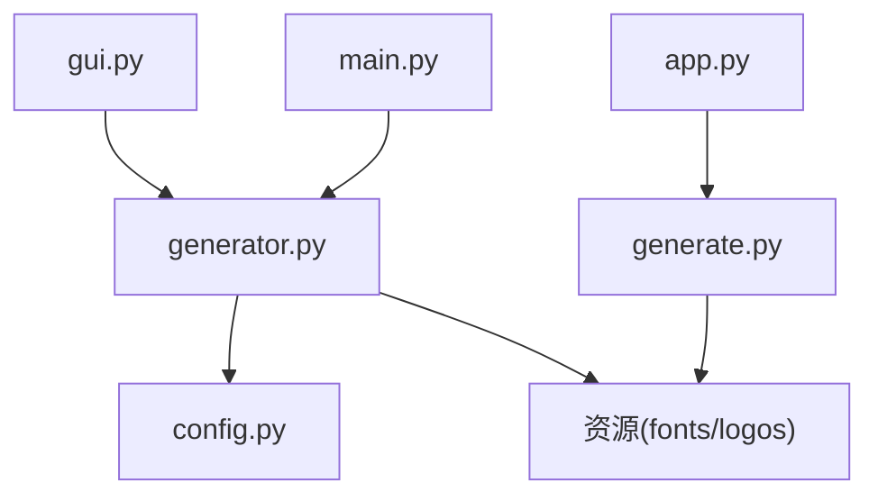

# 模板配置

<cite>
**本文引用的文件**
- [config.py](file://src/config.py)
- [generator.py](file://src/generator.py)
- [gui.py](file://src/gui.py)
- [main.py](file://src/main.py)
- [app.py](file://src/app.py)
- [generate.py](file://src/generate.py)
</cite>

## 目录
1. [简介](#简介)
2. [项目结构](#项目结构)
3. [核心组件](#核心组件)
4. [架构总览](#架构总览)
5. [详细组件分析](#详细组件分析)
6. [依赖关系分析](#依赖关系分析)
7. [性能考虑](#性能考虑)
8. [故障排除指南](#故障排除指南)
9. [结论](#结论)
10. [附录](#附录)

## 简介
本文件面向需要创建和管理促销券模板的开发者与运营人员，系统性说明三种促销券模板的设计参数与实现机制。文档聚焦以下目标：
- 详细解释 LazCash、Shopee Coins、Tokopedia Deals 三种模板的配置参数
- 说明尺寸规格、外层背景色、描边设置、内边距、渐变背景参数、标题文本与字体配置、金额字体设置、Logo 配置等
- 提供每个模板的视觉效果说明与适用场景
- 解释模板参数之间的关系、布局计算、比例缩放与自适应调整
- 指导如何创建自定义模板与扩展现有模板配置

## 项目结构
该工程采用“配置驱动 + 图像合成引擎”的分层设计：
- 配置层：集中管理地区与模板参数，以及字体与导出设置
- 合成引擎：负责根据模板参数生成最终图像
- 界面层：提供命令行与图形界面两种使用方式
- 资源层：包含字体、图标等静态资源

图表来源
- [config.py:1-178](file://src/config.py#L1-L178)
- [generator.py:1-360](file://src/generator.py#L1-L360)
- [main.py:1-131](file://src/main.py#L1-L131)
- [gui.py:1-499](file://src/gui.py#L1-L499)
- [app.py:1-269](file://src/app.py#L1-L269)
- [generate.py:1-429](file://src/generate.py#L1-L429)

章节来源
- [config.py:1-178](file://src/config.py#L1-L178)
- [generator.py:1-360](file://src/generator.py#L1-L360)
- [main.py:1-131](file://src/main.py#L1-L131)
- [gui.py:1-499](file://src/gui.py#L1-L499)
- [app.py:1-269](file://src/app.py#L1-L269)
- [generate.py:1-429](file://src/generate.py#L1-L429)

## 核心组件
- 模板配置中心：定义三款模板的尺寸、色彩、排版参数与渐变角度
- 图像合成引擎：基于模板参数绘制外层圆角矩形、内层渐变背景、Logo、标题与金额文本，并进行自适应缩放
- 界面与入口：提供 CLI 与 GUI 两种调用方式，支持预览与导出

章节来源
- [config.py:82-149](file://src/config.py#L82-L149)
- [generator.py:145-346](file://src/generator.py#L145-L346)
- [main.py:18-106](file://src/main.py#L18-L106)
- [gui.py:418-489](file://src/gui.py#L418-L489)

## 架构总览
模板参数通过配置层传递给合成引擎，引擎按参数绘制图像并保存到指定位置。GUI 与 CLI 分别提供不同的交互入口，但共享同一套合成逻辑。

图表来源
- [main.py:94-105](file://src/main.py#L94-L105)
- [gui.py:422-431](file://src/gui.py#L422-L431)
- [generator.py:145-170](file://src/generator.py#L145-L170)
- [config.py:19-80](file://src/config.py#L19-L80)
- [config.py:85-149](file://src/config.py#L85-L149)

## 详细组件分析

### 模板参数总览与适用场景
- LazCash 模板
  - 尺寸：宽高均为 420 像素
  - 外层背景色：品牌主色，用于外层圆角矩形容器
  - 渐变背景：内层圆角矩形区域使用线性渐变，起止色与角度由模板参数定义
  - 标题文本：LazCash，字号与颜色由模板参数定义
  - 金额字体：字号较大，颜色突出，支持自适应宽度以适配不同金额长度
  - Logo：圆形徽标背景，内部白色圆与中心彩色圆点构成简化图标
  - 适用场景：Lazada 生态内的通用促销券，强调品牌识别与金额突出
- Shopee Coins 模板
  - 尺寸：宽高均为 420 像素
  - 外层背景色：品牌主色，用于外层圆角矩形容器
  - 渐变背景：内层圆角矩形区域使用线性渐变，起止色与角度由模板参数定义
  - 标题文本：Shopee Coins，字号与颜色由模板参数定义
  - 金额字体：字号较大，颜色突出，支持自适应宽度以适配不同金额长度
  - Logo：圆形徽标背景，内部白色圆与中心彩色圆点构成简化图标
  - 适用场景：Shopee 平台的虚拟币抵扣券，强调平台属性与金额展示
- Tokopedia Deals 模板
  - 尺寸：宽高均为 420 像素
  - 外层背景色：品牌主色，用于外层圆角矩形容器
  - 渐变背景：内层圆角矩形区域使用线性渐变，起止色与角度由模板参数定义
  - 标题文本：Tokopedia，字号与颜色由模板参数定义
  - 金额字体：字号较大，颜色突出，支持自适应宽度以适配不同金额长度
  - Logo：圆形徽标背景，内部白色圆与中心彩色圆点构成简化图标
  - 适用场景：Tokopedia 平台的限时优惠券，强调平台品牌与活动氛围

章节来源
- [config.py:85-149](file://src/config.py#L85-L149)

### 参数详解与相互关系
- 尺寸规格
  - 模板宽高：决定外层圆角矩形的整体尺寸，直接影响内边距与内容区域的可用空间
  - 内边距：决定内层渐变背景的尺寸与圆角半径，确保内容不贴边
- 外层背景与描边
  - 外层背景色：用于外层圆角矩形填充
  - 描边宽度与颜色：通过多层圆角矩形叠加形成描边效果，保证视觉层次
- 渐变背景参数
  - 起始色与终止色：定义线性渐变的两端颜色
  - 角度：以度数表示，控制渐变方向
  - 内层尺寸：由外层尺寸与内边距共同决定
- 标题文本与字体配置
  - 标题文本：模板名称字符串
  - 字号与颜色：影响标题在画布中的视觉权重
  - 居中定位：基于画布宽度与文本边界框计算水平居中
- 金额字体设置
  - 金额字符串：根据地区规则格式化货币符号与千分位分隔符
  - 字号：初始字号由模板参数设定，若文本过宽则逐步减小字号直至满足宽度约束
  - 自适应宽度：最大宽度通常为内边距范围内的可用宽度
- Logo 配置
  - Logo 尺寸：决定圆形背景与图标元素的相对比例
  - Logo 位置：通常位于内边距区域的左上角附近
  - 图标元素：圆形背景、白色内圆与中心彩色圆点构成简化标识

章节来源
- [generator.py:172-218](file://src/generator.py#L172-L218)
- [generator.py:266-310](file://src/generator.py#L266-L310)
- [generator.py:241-265](file://src/generator.py#L241-L265)

### 布局计算、比例缩放与自适应调整
- 比例缩放
  - 合成引擎会根据模板的基准尺寸与目标尺寸计算缩放因子，用于统一缩放 Logo、标题、金额等元素
  - 缩放因子通常取宽度与高度的最小值，确保内容在目标尺寸内完整显示
- 自适应金额字体
  - 初始尝试使用模板设定的字号，若总宽度超过可用宽度，则通过二分搜索逐步降低字号
  - 货币符号与数字分别加载字体并测量边界，确保对齐与间距合理
- 文本边界框与居中
  - 使用文本边界框计算文本宽度与高度，结合画布宽度实现水平居中
  - 垂直居中通过内容区域的高度与文本高度差的一半实现
- 渐变与遮罩
  - 渐变图像尺寸由内边距计算得出，使用遮罩确保仅在圆角区域内显示
  - 圆角半径统一应用于外层描边与内层背景

图表来源
- [generator.py:255-321](file://src/generator.py#L255-L321)
- [generator.py:202-218](file://src/generator.py#L202-L218)

章节来源
- [generator.py:255-321](file://src/generator.py#L255-L321)
- [generator.py:202-218](file://src/generator.py#L202-L218)

### 视觉效果说明与适用场景
- LazCash
  - 视觉特点：品牌主色外层 + 内层渐变背景，Logo 与标题在左上角，金额居中突出
  - 适用场景：Lazada 生态内通用促销券，适合强调品牌与金额的视觉传达
- Shopee Coins
  - 视觉特点：品牌主色外层 + 内层渐变背景，Logo 与标题在左上角，金额居中突出
  - 适用场景：Shopee 平台虚拟币抵扣券，适合平台属性与金额展示
- Tokopedia Deals
  - 视觉特点：品牌主色外层 + 内层渐变背景，Logo 与标题在左上角，金额居中突出
  - 适用场景：Tokopedia 平台限时优惠券，适合营造活动氛围与品牌识别

章节来源
- [config.py:85-149](file://src/config.py#L85-L149)

### 如何创建自定义模板与扩展现有模板配置
- 新增模板键值
  - 在模板配置中添加新的键值对，包含名称、尺寸、外层背景色、描边、内边距、渐变参数、标题与金额字体配置、Logo 尺寸与位置等
- 扩展地区配置
  - 若需要新增地区货币格式或语言环境，可在地区配置中添加新键值
- 修改合成逻辑
  - 若需要新增装饰元素或调整布局策略，可在合成引擎中扩展相应绘制逻辑
- 更新界面层
  - 若需要在 GUI 或 CLI 中暴露新参数，需在对应界面层增加输入项与参数传递

章节来源
- [config.py:85-149](file://src/config.py#L85-L149)
- [generator.py:145-346](file://src/generator.py#L145-L346)
- [gui.py:325-356](file://src/gui.py#L325-L356)
- [main.py:18-79](file://src/main.py#L18-L79)

## 依赖关系分析
- 配置依赖
  - 合成引擎依赖模板配置与地区配置，确保渲染参数正确
- 资源依赖
  - 合成引擎依赖字体与图标资源，若资源缺失则回退到系统字体
- 界面依赖
  - GUI 与 CLI 通过统一的生成函数调用合成引擎，参数映射由界面层完成

图表来源
- [generator.py:9-11](file://src/generator.py#L9-L11)
- [config.py:1-12](file://src/config.py#L1-L12)
- [gui.py:13-14](file://src/gui.py#L13-L14)
- [main.py:14-15](file://src/main.py#L14-L15)
- [app.py:20](file://src/app.py#L20)
- [generate.py:6-9](file://src/generate.py#L6-L9)

章节来源
- [generator.py:9-11](file://src/generator.py#L9-L11)
- [config.py:1-12](file://src/config.py#L1-L12)
- [gui.py:13-14](file://src/gui.py#L13-L14)
- [main.py:14-15](file://src/main.py#L14-L15)
- [app.py:20](file://src/app.py#L20)
- [generate.py:6-9](file://src/generate.py#L6-L9)

## 性能考虑
- 字体加载与回退
  - 合成引擎优先加载内置字体，若不可用则回退到系统字体，避免运行时异常
- 自适应字体的二分搜索
  - 金额字体的自适应通过二分搜索优化，减少不必要的多次测量
- 渐变与遮罩
  - 渐变图像一次性生成并应用遮罩，避免重复计算
- 预览与导出
  - GUI 提供预览功能，延迟更新以减少频繁重绘

章节来源
- [generator.py:91-114](file://src/generator.py#L91-L114)
- [generator.py:293-302](file://src/generator.py#L293-L302)
- [generator.py:202-218](file://src/generator.py#L202-L218)
- [gui.py:390-399](file://src/gui.py#L390-L399)

## 故障排除指南
- 模板或资源缺失
  - 若模板或图标资源不存在，合成引擎会抛出异常；请检查资源路径与打包情况
- 字体无法渲染特殊字符
  - 对于包含特殊货币符号的文本，引擎会自动切换到系统字体以避免占位符问题
- GUI 预览不刷新
  - 预览具有防抖机制，输入变化后会延迟更新；请稍候查看最新结果
- CLI 参数无效
  - 确认参数类型与取值范围，例如金额必须为整数，地区与模板需在允许范围内

章节来源
- [generate.py:237-251](file://src/generate.py#L237-L251)
- [generator.py:112-121](file://src/generator.py#L112-L121)
- [gui.py:390-399](file://src/gui.py#L390-L399)
- [main.py:31-79](file://src/main.py#L31-L79)

## 结论
本模板配置体系通过清晰的参数定义与稳健的合成流程，实现了跨平台、跨地区的促销券图像生成。LazCash、Shopee Coins、Tokopedia Deals 三款模板在视觉风格与参数设置上保持一致性，便于统一管理与扩展。通过合理的布局计算、比例缩放与自适应调整，能够在不同尺寸下稳定输出高质量图像。建议在新增模板时遵循现有参数命名规范与布局原则，确保视觉一致性与可维护性。

## 附录
- 模板参数速查
  - 尺寸：width、height
  - 外层：outer_bg、outer_stroke、outer_stroke_width
  - 内层：inner_margin、inner_bg_start、inner_bg_end、gradient_angle
  - 标题：title_text、title_font_size、title_color、title_y
  - 金额：amount_font_size、amount_color、amount_y
  - Logo：logo_size、logo_y
- 地区配置速查
  - currency、currency_position、locale、primary_color、secondary_color、accent_color、text_color

章节来源
- [config.py:85-149](file://src/config.py#L85-L149)
- [config.py:19-80](file://src/config.py#L19-L80)