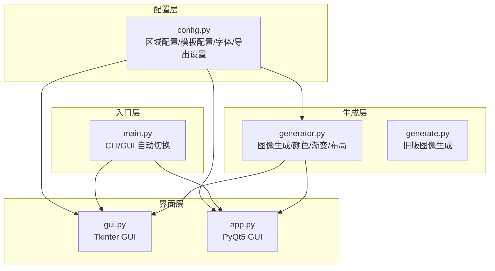
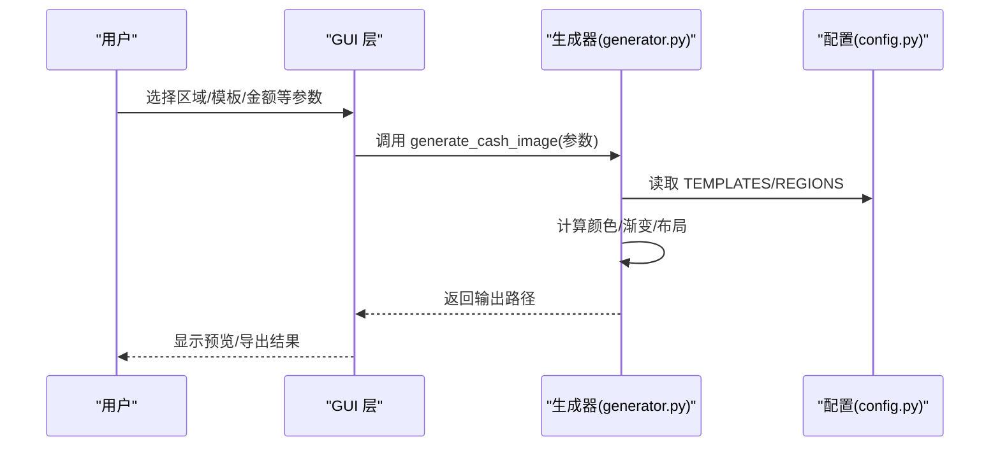
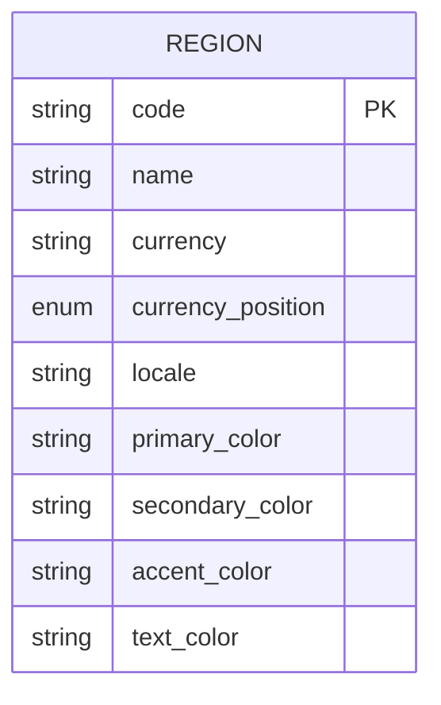
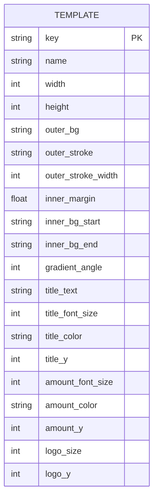
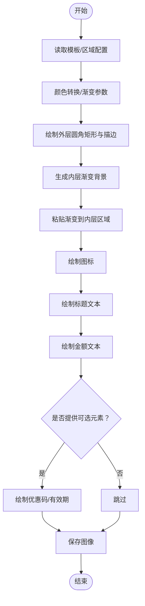
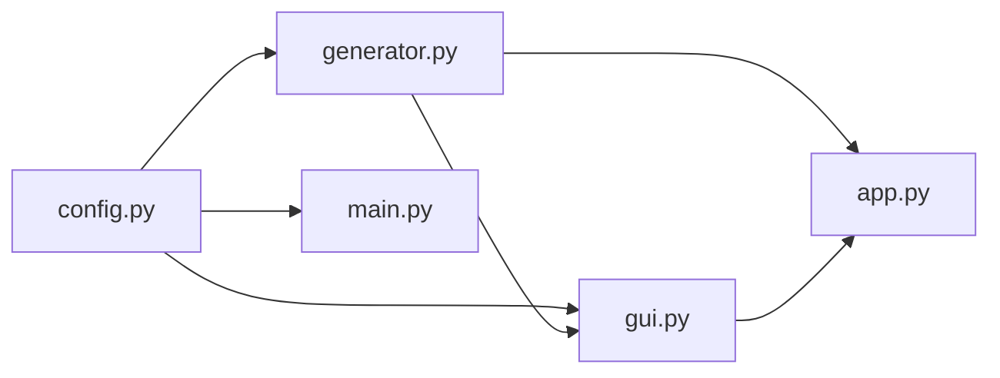

# 配置参考

<cite>
**本文引用的文件**
- [config.py](file://src/config.py)
- [generator.py](file://src/generator.py)
- [generate.py](file://src/generate.py)
- [gui.py](file://src/gui.py)
- [app.py](file://src/app.py)
- [main.py](file://src/main.py)
</cite>

## 目录
1. [简介](#简介)
2. [项目结构](#项目结构)
3. [核心组件](#核心组件)
4. [架构总览](#架构总览)
5. [详细组件分析](#详细组件分析)
6. [依赖关系分析](#依赖关系分析)
7. [性能考虑](#性能考虑)
8. [故障排除指南](#故障排除指南)
9. [结论](#结论)
10. [附录](#附录)

## 简介
本文件提供 Cash 生成器项目的配置系统参考文档，全面说明多区域、多模板的配置管理机制。文档涵盖区域配置的结构与参数（货币符号、位置、本地化设置、颜色方案等）、模板配置的各项参数（尺寸规格、渐变色设置、字体配置、布局参数等），以及配置的优先级、继承关系和覆盖规则。同时包含配置验证、错误处理与调试方法，以及自定义配置的最佳实践和扩展指南。

## 项目结构
该项目采用模块化设计，配置集中在独立模块中，其他模块通过导入共享配置进行渲染与生成。主要文件职责如下：
- config.py：集中定义区域配置与模板配置、字体与导出设置
- generator.py：基于配置生成最终图像，负责颜色转换、渐变、布局与文本渲染
- generate.py：早期版本的图像生成逻辑（兼容性保留）
- gui.py：GUI 界面层，读取配置并驱动生成流程
- app.py：PyQt5 版本的 GUI（macOS 原生渲染问题修复）
- main.py：命令行入口，支持 CLI 与 GUI 自动切换

图表来源
- [config.py:1-178](file://src/config.py#L1-L178)
- [generator.py:1-360](file://src/generator.py#L1-L360)
- [generate.py:1-429](file://src/generate.py#L1-L429)
- [gui.py:1-499](file://src/gui.py#L1-L499)
- [app.py:1-269](file://src/app.py#L1-L269)
- [main.py:1-131](file://src/main.py#L1-L131)

章节来源
- [config.py:1-178](file://src/config.py#L1-L178)
- [generator.py:1-360](file://src/generator.py#L1-L360)
- [generate.py:1-429](file://src/generate.py#L1-L429)
- [gui.py:1-499](file://src/gui.py#L1-L499)
- [app.py:1-269](file://src/app.py#L1-L269)
- [main.py:1-131](file://src/main.py#L1-L131)

## 核心组件
本节概述配置系统的核心组件及其职责：
- 区域配置（REGIONS）：定义多国家/地区的货币符号、货币位置、本地化标识、主色/辅色/强调色/文本色等
- 模板配置（TEMPLATES）：定义模板的尺寸、内外背景、渐变角度、标题/金额/图标等布局参数
- 字体与导出设置：字体路径检测、回退字体、导出格式与质量
- 生成器（generator.py）：根据配置计算颜色、生成渐变、绘制元素、保存图像
- GUI 层：读取配置并驱动生成，提供预览与导出功能

章节来源
- [config.py:16-178](file://src/config.py#L16-L178)
- [generator.py:14-360](file://src/generator.py#L14-L360)
- [gui.py:13-15](file://src/gui.py#L13-L15)

## 架构总览
配置系统遵循“配置即数据”的原则，所有区域与模板参数以字典形式存储于 config.py 中，生成器通过键访问这些参数，并在运行时进行必要的类型转换与校验。GUI 层负责收集用户输入并与配置进行组合，最终调用生成器完成图像生成。

图表来源
- [gui.py:420-430](file://src/gui.py#L420-L430)
- [generator.py:145-346](file://src/generator.py#L145-L346)
- [config.py:16-178](file://src/config.py#L16-L178)

## 详细组件分析

### 区域配置（REGIONS）
区域配置用于定义不同国家/地区的关键属性，包括货币符号、货币位置、本地化标识以及品牌色彩方案。每个区域条目包含以下字段：
- name：地区名称
- currency：货币符号
- currency_position：货币位置（前缀或后缀）
- locale：本地化标识
- primary_color：主色调
- secondary_color：辅色调
- accent_color：强调色
- text_color：文本色

图表来源
- [config.py:19-80](file://src/config.py#L19-L80)

章节来源
- [config.py:19-80](file://src/config.py#L19-L80)

### 模板配置（TEMPLATES）
模板配置定义了券面的整体视觉风格与布局参数，支持多模板风格。每个模板条目包含以下字段：
- name：模板名称
- width/height：模板画布尺寸（像素）
- outer_bg：外层背景色
- outer_stroke/outer_stroke_width：外层描边颜色与宽度
- inner_margin：内边距（像素）
- inner_bg_start/inner_bg_end：内层渐变起止色
- gradient_angle：渐变角度（度）
- title_text/title_font_size/title_color/title_y：标题文本、字号、颜色与纵向位置
- amount_font_size/amount_color/amount_y：金额字号、颜色与纵向位置
- logo_size/logo_y：图标尺寸与纵向位置

图表来源
- [config.py:85-149](file://src/config.py#L85-L149)

章节来源
- [config.py:85-149](file://src/config.py#L85-L149)

### 字体与导出设置
- 字体路径检测：优先使用配置中指定的字体路径，若不存在则回退到常见系统字体
- 导出设置：支持 PNG/JPG 格式，默认 PNG，质量默认 95

章节来源
- [config.py:154-177](file://src/config.py#L154-L177)

### 生成器（generator.py）中的配置使用
生成器通过以下方式使用配置：
- 颜色转换：将十六进制颜色转换为 RGB 元组
- 渐变生成：根据模板的渐变角度与起止色生成线性渐变
- 布局计算：根据模板尺寸与内边距计算内层区域，绘制圆角矩形与描边
- 文本渲染：加载字体，按最大宽度约束调整字号，绘制标题与金额文本
- 可选元素：绘制优惠码与有效期文本（若提供）

图表来源
- [generator.py:145-346](file://src/generator.py#L145-L346)

章节来源
- [generator.py:14-61](file://src/generator.py#L14-L61)
- [generator.py:145-346](file://src/generator.py#L145-L346)

### GUI 层（gui.py）中的配置使用
GUI 层通过以下方式使用配置：
- 颜色方案：根据 macOS 深色/浅色模式动态选择颜色映射
- 下拉菜单：使用 REGIONS 与 TEMPLATES 动态填充选项
- 参数传递：将用户输入与配置组合，调用生成器生成预览与导出图像

章节来源
- [gui.py:17-66](file://src/gui.py#L17-L66)
- [gui.py:291-356](file://src/gui.py#L291-L356)
- [gui.py:420-430](file://src/gui.py#L420-L430)

### 早期版本生成器（generate.py）中的配置使用
早期版本生成器包含区域货币格式化逻辑与资源路径解析，但当前主流程由 generator.py 承担。该模块仍可用于兼容性或特定场景。

章节来源
- [generate.py:15-22](file://src/generate.py#L15-L22)
- [generate.py:223-421](file://src/generate.py#L223-L421)

## 依赖关系分析
配置系统的核心依赖关系如下：
- config.py 提供 REGIONS 与 TEMPLATES 的全局常量
- generator.py 依赖 config.py 的 REGIONS/TEMPLATES/FONT_PATH/OUTPUT_DIR
- gui.py 依赖 config.py 的 REGIONS/TEMPLATES/OUTPUT_DIR
- main.py 依赖 config.py 的 REGIONS/TEMPLATES/OUTPUT_DIR，并根据 CLI 参数决定运行模式

图表来源
- [config.py:16-178](file://src/config.py#L16-L178)
- [generator.py:9-11](file://src/generator.py#L9-L11)
- [gui.py:13-14](file://src/gui.py#L13-L14)
- [main.py:14-15](file://src/main.py#L14-L15)

章节来源
- [config.py:16-178](file://src/config.py#L16-L178)
- [generator.py:9-11](file://src/generator.py#L9-L11)
- [gui.py:13-14](file://src/gui.py#L13-L14)
- [main.py:14-15](file://src/main.py#L14-L15)

## 性能考虑
- 字体加载：优先使用配置字体路径，若不可用则回退到系统字体，避免重复尝试导致的性能损耗
- 渐变生成：线性渐变按像素逐点计算，建议控制模板尺寸与渐变角度范围，避免过大画布
- 文本渲染：按最大宽度约束调整字号，减少多次测量开销
- 预览更新：GUI 层对输入变更采用延迟更新策略，降低频繁重绘带来的性能压力

## 故障排除指南
- 颜色格式错误：确保配置中的颜色值为合法的十六进制格式
- 字体缺失：检查 FONT_PATH 是否存在；若不存在，确认系统字体路径可用
- 输出目录权限：确保 OUTPUT_DIR 可写
- GUI 预览异常：检查 macOS 深色/浅色模式检测逻辑与颜色映射
- CLI 参数错误：使用 --list-regions/--list-templates 查看可用选项

章节来源
- [config.py:154-177](file://src/config.py#L154-L177)
- [gui.py:17-66](file://src/gui.py#L17-L66)
- [main.py:82-92](file://src/main.py#L82-L92)

## 结论
本配置系统以简洁的数据结构为核心，通过明确的键名约定与模块化的生成流程，实现了多区域、多模板的灵活配置与渲染。区域配置与模板配置相互解耦，既保证了可维护性，又便于扩展新的区域与模板。建议在新增配置时遵循现有键名规范，并在 GUI 层同步更新选项展示。

## 附录

### 配置文件格式说明与示例
- 区域配置（REGIONS）示例字段：name、currency、currency_position、locale、primary_color、secondary_color、accent_color、text_color
- 模板配置（TEMPLATES）示例字段：name、width、height、outer_bg、outer_stroke、outer_stroke_width、inner_margin、inner_bg_start、inner_bg_end、gradient_angle、title_text、title_font_size、title_color、title_y、amount_font_size、amount_color、amount_y、logo_size、logo_y
- 字体与导出设置：FONT_PATH、FONT_FALLBACK、EXPORT_FORMATS、DEFAULT_FORMAT、DEFAULT_QUALITY

章节来源
- [config.py:19-80](file://src/config.py#L19-L80)
- [config.py:85-149](file://src/config.py#L85-L149)
- [config.py:154-177](file://src/config.py#L154-L177)

### 配置优先级、继承与覆盖规则
- 模板优先级：当传入的模板键不存在时，生成器会回退到默认模板（例如 lazecash）
- 区域优先级：当传入的区域键不存在时，生成器会回退到默认区域（例如 SG）
- 覆盖规则：GUI 层与 CLI 层传入的参数会直接覆盖默认值；若未提供，则使用配置中的默认值

章节来源
- [generator.py:126-143](file://src/generator.py#L126-L143)
- [generator.py:169-170](file://src/generator.py#L169-L170)
- [main.py:38-48](file://src/main.py#L38-L48)

### 配置验证与调试方法
- 使用 CLI 列出可用区域与模板：python main.py --list-regions/--list-templates
- 在 GUI 中实时预览：修改参数后自动触发预览更新
- 检查输出目录：确认生成的图像保存路径正确且可写
- 错误提示：GUI 与 CLI 均提供错误弹窗与状态栏提示

章节来源
- [main.py:82-92](file://src/main.py#L82-L92)
- [gui.py:453-455](file://src/gui.py#L453-L455)
- [gui.py:486-488](file://src/gui.py#L486-L488)

### 自定义配置最佳实践与扩展指南
- 新增区域：在 REGIONS 中添加新键值对，确保 currency_position、locale、颜色方案完整
- 新增模板：在 TEMPLATES 中添加新键值对，确保尺寸、渐变、字体与布局参数齐全
- 字体管理：优先提供配置字体路径，确保跨平台一致性；必要时提供系统字体回退
- 布局适配：根据模板尺寸调整内边距与字号，确保文本在不同分辨率下清晰可读
- 性能优化：避免在循环中重复加载字体与生成渐变；合理设置预览刷新频率

章节来源
- [config.py:19-80](file://src/config.py#L19-L80)
- [config.py:85-149](file://src/config.py#L85-L149)
- [config.py:154-177](file://src/config.py#L154-L177)
- [generator.py:28-61](file://src/generator.py#L28-L61)