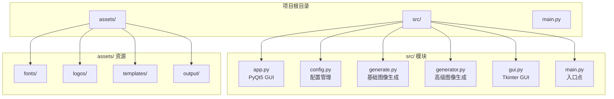
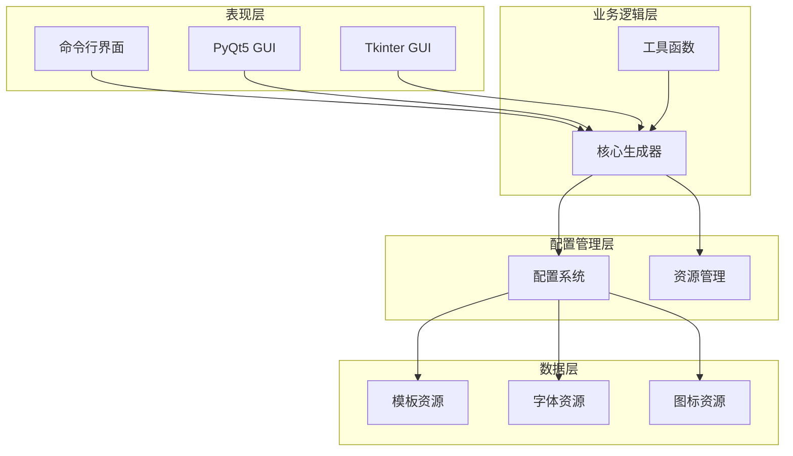
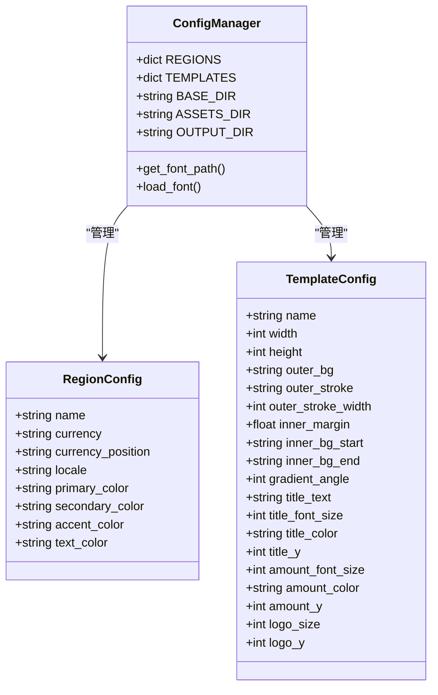
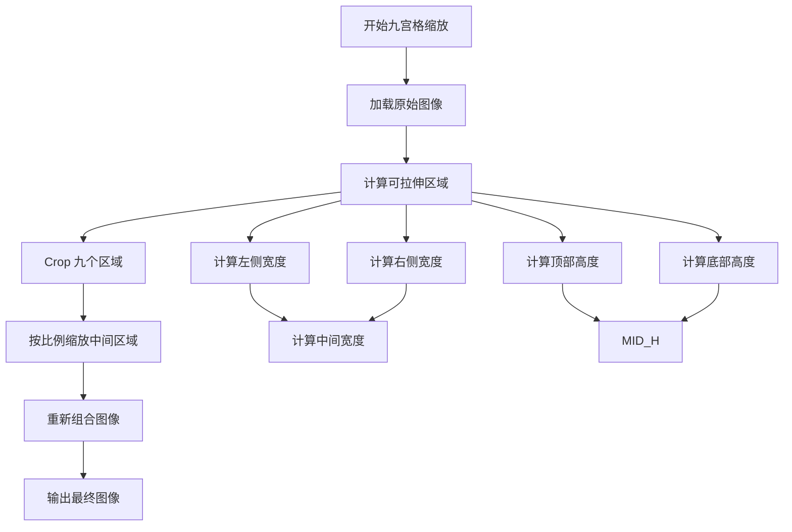
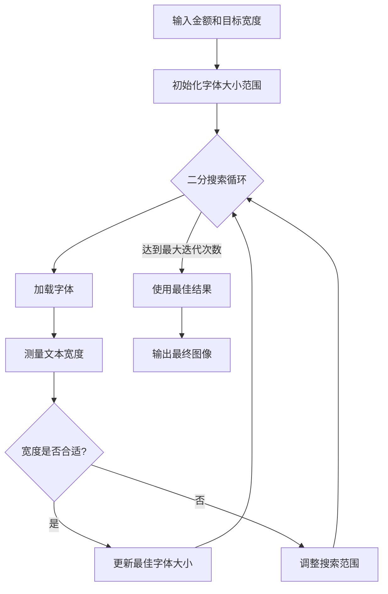
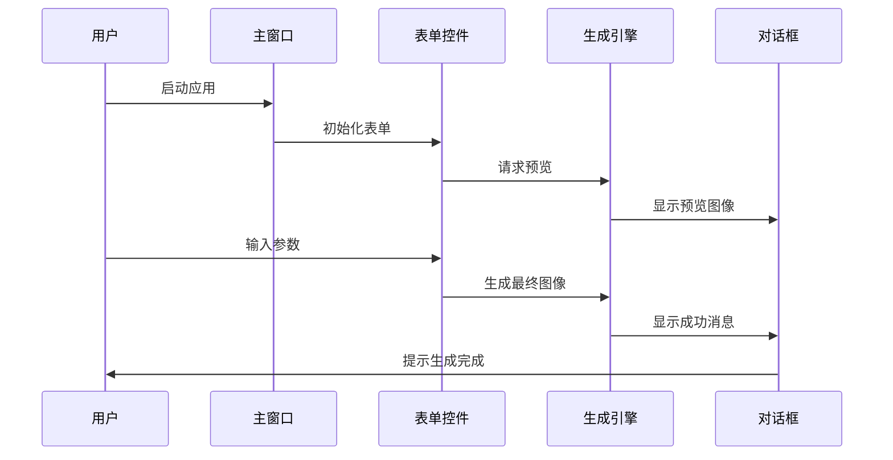
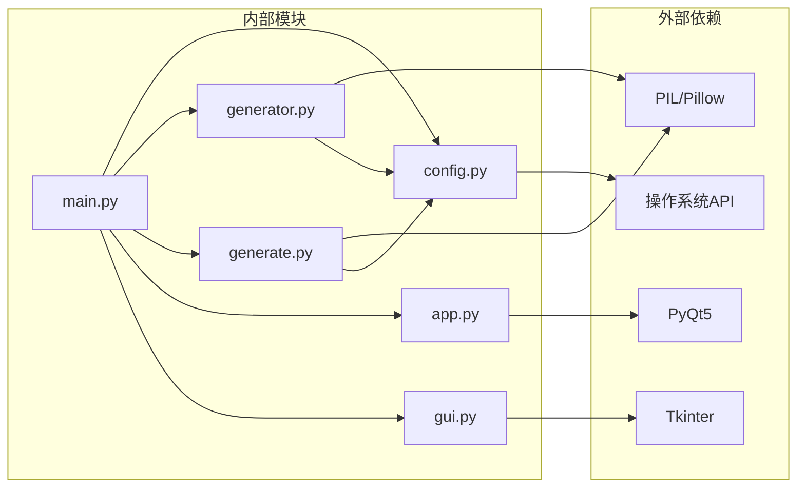

# 项目概述

<cite>
**本文档引用的文件**
- [app.py](file://src/app.py)
- [config.py](file://src/config.py)
- [generate.py](file://src/generate.py)
- [generator.py](file://src/generator.py)
- [gui.py](file://src/gui.py)
- [main.py](file://src/main.py)
</cite>

## 目录
1. [项目简介](#项目简介)
2. [项目结构](#项目结构)
3. [核心组件](#核心组件)
4. [架构概览](#架构概览)
5. [详细组件分析](#详细组件分析)
6. [依赖关系分析](#依赖关系分析)
7. [性能考虑](#性能考虑)
8. [故障排除指南](#故障排除指南)
9. [结论](#结论)

## 项目简介

东南亚电商平台促销券生成器是一个专为马来西亚、泰国、印度尼西亚、菲律宾、新加坡、越南等东南亚国家电商平台设计的促销券自动化生成工具。该项目旨在解决电商平台上多样化的货币格式、地区化设计需求以及多平台兼容性挑战，为东南亚地区的电商业务提供专业、美观且符合当地文化审美的促销券解决方案。

### 核心目标
- **多区域支持**：支持6个东南亚主要国家的货币格式和本地化需求
- **多模板系统**：提供多种电商品牌风格的促销券模板
- **跨平台兼容**：同时支持命令行界面和图形用户界面
- **高质量图像生成**：基于PIL/Pillow的高性能图像处理能力
- **配置驱动**：灵活的配置系统，便于扩展和定制

### 主要应用场景
- 电商平台促销活动批量生成
- 跨境电商业务本地化营销
- 多平台同步发布促销内容
- 自动化营销内容生成流程

## 项目结构

该项目采用模块化设计，将不同功能职责分离到独立的模块中：

**图表来源**
- [config.py:8-178](file://src/config.py#L8-L178)
- [main.py:1-131](file://src/main.py#L1-L131)

**章节来源**
- [config.py:8-178](file://src/config.py#L8-L178)
- [main.py:1-131](file://src/main.py#L1-L131)

## 核心组件

### 配置管理系统
配置系统是整个项目的基础，负责管理多区域设置、模板配置和资源路径。

**关键特性**：
- **多区域配置**：支持6个东南亚国家的货币、语言和地区设置
- **模板配置**：定义不同电商品牌的视觉风格参数
- **资源管理**：统一管理字体、图标和模板资源路径
- **导出设置**：配置输出格式和质量参数

**章节来源**
- [config.py:19-80](file://src/config.py#L19-L80)
- [config.py:85-149](file://src/config.py#L85-L149)
- [config.py:154-178](file://src/config.py#L154-L178)

### 图像生成引擎

#### 基础图像生成器 (generate.py)
专门处理Lazada风格的促销券生成，具备以下核心功能：

**技术特点**：
- **自适应布局**：根据目标尺寸自动调整元素位置和大小
- **九宫格缩放**：保持边框和角落完整性的同时进行中心拉伸
- **动态字体适配**：通过二分搜索算法优化文本显示效果
- **系统字体回退**：确保特殊字符的正确渲染

**章节来源**
- [generate.py:15-429](file://src/generate.py#L15-L429)

#### 高级图像生成器 (generator.py)
提供更丰富的功能和更好的用户体验：

**核心功能**：
- **渐变背景生成**：支持任意角度的线性渐变背景
- **圆角矩形绘制**：精确控制边框和填充效果
- **装饰元素**：添加半透明装饰圆形提升视觉效果
- **多模板支持**：支持LazCash、Shopee Coins、Tokopedia Deals三种风格

**章节来源**
- [generator.py:14-360](file://src/generator.py#L14-L360)

### 用户界面系统

#### PyQt5 GUI (app.py)
为macOS用户提供了原生风格的现代化界面：

**设计特色**：
- **原生外观**：针对macOS系统进行专门优化
- **响应式布局**：固定窗口尺寸，确保元素正确对齐
- **实时预览**：输入变化时即时更新预览效果
- **错误处理**：完善的异常捕获和用户友好的错误提示

**章节来源**
- [app.py:23-269](file://src/app.py#L23-L269)

#### Tkinter GUI (gui.py)
提供跨平台的桌面应用体验：

**功能特性**：
- **暗黑模式支持**：自动检测系统主题并调整配色方案
- **快速金额按钮**：提供常用金额的快捷输入选项
- **实时预览**：Canvas组件实时显示生成的图像
- **导出功能**：支持自定义保存路径和文件名

**章节来源**
- [gui.py:69-499](file://src/gui.py#L69-L499)

### 命令行接口 (main.py)
提供灵活的批处理和自动化集成能力：

**CLI特性**：
- **参数解析**：完整的命令行参数支持
- **区域列表**：可列出所有支持的地区选项
- **模板列表**：可查看可用的模板样式
- **智能入口点**：自动检测运行模式（CLI/GUI）

**章节来源**
- [main.py:18-131](file://src/main.py#L18-L131)

## 架构概览

项目采用分层架构设计，实现了清晰的关注点分离：

**图表来源**
- [main.py:108-131](file://src/main.py#L108-L131)
- [config.py:8-178](file://src/config.py#L8-L178)

### 技术架构设计原则

1. **模块化设计**：每个功能模块都有明确的职责边界
2. **配置驱动**：通过配置文件实现功能扩展和定制
3. **资源隔离**：将静态资源与代码逻辑分离
4. **平台适配**：针对不同操作系统提供优化的用户体验

## 详细组件分析

### 配置系统深度分析

#### 多区域配置架构
配置系统采用嵌套字典结构，为每个支持的地区提供完整的本地化设置：

**图表来源**
- [config.py:19-80](file://src/config.py#L19-L80)
- [config.py:85-149](file://src/config.py#L85-L149)
- [config.py:154-178](file://src/config.py#L154-L178)

#### 货币格式化机制
系统实现了复杂的货币格式化逻辑，以适应不同地区的习惯：

**章节来源**
- [generate.py:123-153](file://src/generate.py#L123-L153)
- [generator.py:126-143](file://src/generator.py#L126-L143)

### 图像生成引擎分析

#### 九宫格缩放算法
这是图像生成的核心技术之一，确保在缩放过程中保持视觉完整性：

**图表来源**
- [generate.py:155-215](file://src/generate.py#L155-L215)

#### 动态字体适配算法
系统通过二分搜索算法自动调整字体大小以适应不同的显示需求：

**图表来源**
- [generate.py:281-324](file://src/generate.py#L281-L324)

**章节来源**
- [generate.py:223-422](file://src/generate.py#L223-L422)

### 用户界面系统分析

#### PyQt5 GUI 设计模式
PyQt5版本采用了MVC设计模式，实现了清晰的界面逻辑分离：

**图表来源**
- [app.py:205-242](file://src/app.py#L205-L242)

#### Tkinter GUI 交互流程
Tkinter版本提供了更加灵活的用户交互体验：

**章节来源**
- [gui.py:418-456](file://src/gui.py#L418-L456)

## 依赖关系分析

项目采用松耦合的设计，通过清晰的接口定义实现模块间的通信：

**图表来源**
- [main.py:14-15](file://src/main.py#L14-L15)
- [generator.py:8-11](file://src/generator.py#L8-L11)
- [generate.py:9-9](file://src/generate.py#L9-L9)

### 依赖管理策略

1. **最小依赖原则**：只引入必要的第三方库
2. **平台特定依赖**：GUI版本根据选择的框架而定
3. **资源依赖**：字体和图像资源通过配置系统管理
4. **运行时依赖**：支持PyInstaller打包和原生Python运行

**章节来源**
- [main.py:1-131](file://src/main.py#L1-L131)
- [config.py:1-178](file://src/config.py#L1-L178)

## 性能考虑

### 图像处理优化
系统在图像处理方面采用了多项优化策略：

1. **内存管理**：及时释放不再使用的图像对象
2. **缓存机制**：预加载常用字体和资源
3. **算法优化**：使用高效的九宫格缩放算法
4. **延迟加载**：仅在需要时才加载额外资源

### 用户体验优化
- **实时预览**：通过防抖机制平衡响应速度和CPU使用
- **进度反馈**：提供状态栏和对话框反馈
- **错误恢复**：优雅处理各种异常情况
- **平台适配**：针对不同操作系统优化性能

## 故障排除指南

### 常见问题及解决方案

#### 字体渲染问题
**症状**：特殊字符显示为方框或问号
**解决方案**：
- 确保系统安装了相应的字体文件
- 检查字体回退机制是否正常工作
- 验证资源路径配置是否正确

#### 图像生成失败
**症状**：生成过程抛出异常
**排查步骤**：
1. 检查模板文件是否存在
2. 验证资源目录权限
3. 确认磁盘空间充足
4. 查看详细的错误日志

#### GUI界面显示异常
**症状**：界面元素错位或颜色不正确
**解决方案**：
- 检查系统主题设置
- 验证颜色配置是否正确
- 确认窗口尺寸设置合理

**章节来源**
- [app.py:228-241](file://src/app.py#L228-L241)
- [gui.py:453-456](file://src/gui.py#L453-L456)

## 结论

东南亚电商平台促销券生成器项目展现了优秀的软件工程实践，通过模块化设计、配置驱动和多平台支持实现了高度的灵活性和可维护性。

### 项目优势总结

1. **技术先进性**：基于PIL/Pillow的高性能图像处理，支持复杂的图形操作
2. **用户体验优秀**：提供直观的GUI界面和流畅的交互体验
3. **扩展性强**：配置驱动的设计使得功能扩展变得简单
4. **国际化支持**：完整的多语言和多货币支持
5. **跨平台兼容**：同时支持Windows、macOS和Linux系统

### 创新点分析

1. **自适应布局系统**：通过算法自动调整元素位置，确保在不同尺寸下的最佳显示效果
2. **智能字体适配**：动态字体大小调整算法，提升文本可读性
3. **九宫格缩放技术**：保持图像视觉完整性的核心技术
4. **配置驱动架构**：通过配置文件实现功能定制，无需修改代码

### 发展建议

1. **性能监控**：添加性能指标收集和分析功能
2. **批量处理**：扩展批量生成和导出功能
3. **云端集成**：考虑添加云存储和分享功能
4. **模板市场**：建立模板共享和下载机制

该项目为东南亚电商行业提供了一个专业、可靠的促销券生成解决方案，具有良好的商业价值和技术推广前景。