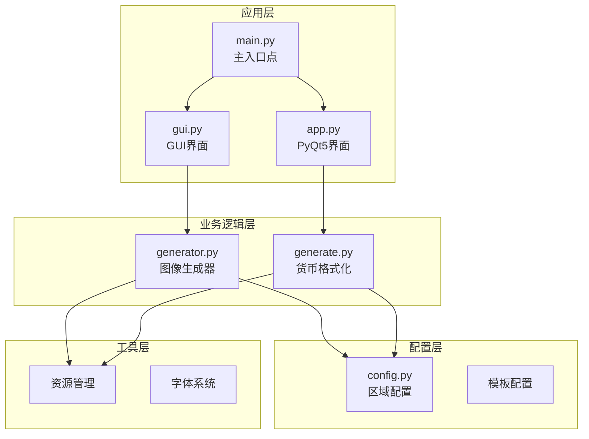
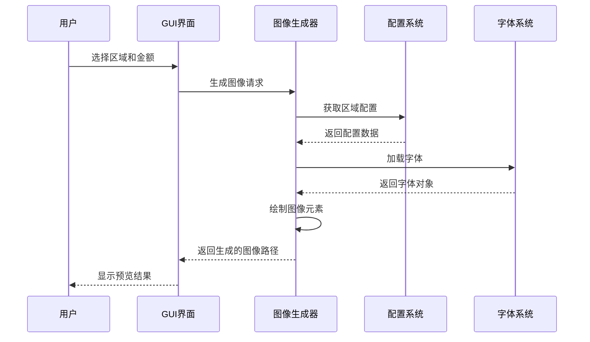
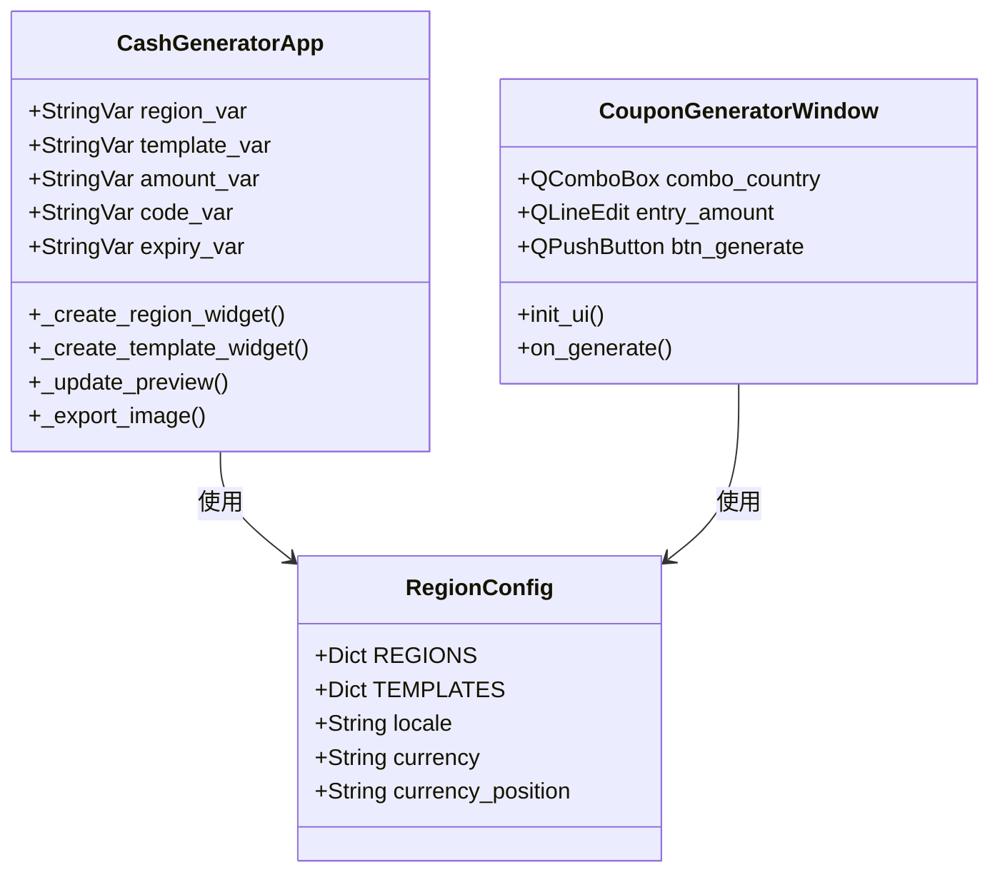
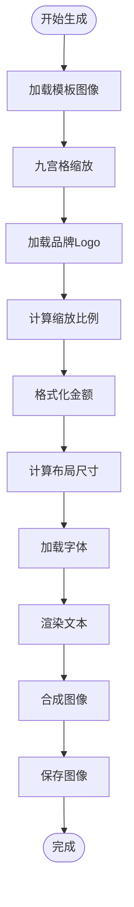
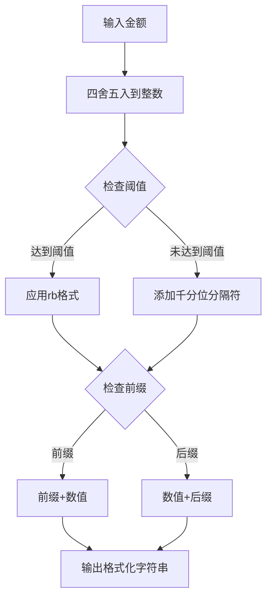
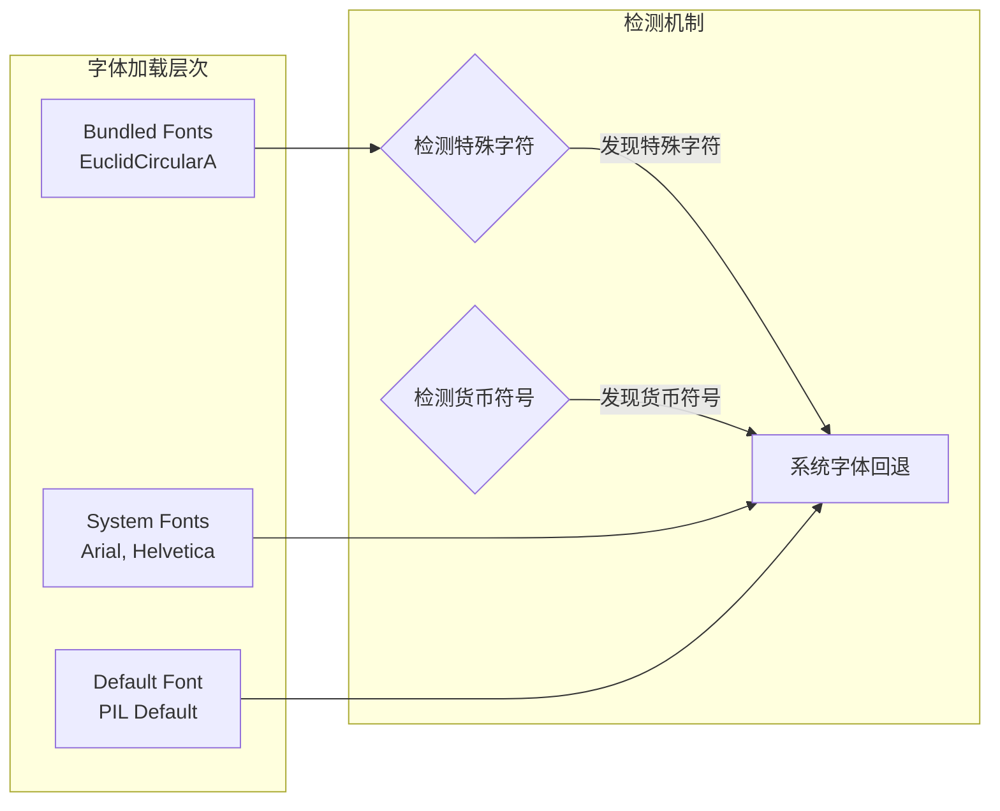

# 多区域扩展指南

<cite>
**本文档引用的文件**
- [app.py](file://src/app.py)
- [config.py](file://src/config.py)
- [generate.py](file://src/generate.py)
- [generator.py](file://src/generator.py)
- [gui.py](file://src/gui.py)
- [main.py](file://src/main.py)
</cite>

## 目录
1. [简介](#简介)
2. [项目结构](#项目结构)
3. [核心组件](#核心组件)
4. [架构概览](#架构概览)
5. [详细组件分析](#详细组件分析)
6. [区域配置详解](#区域配置详解)
7. [货币格式化实现](#货币格式化实现)
8. [字体与国际化支持](#字体与国际化支持)
9. [扩展示例：添加新国家](#扩展示例添加新国家)
10. [测试与验证](#测试与验证)
11. [性能考虑](#性能考虑)
12. [故障排除](#故障排除)
13. [结论](#结论)

## 简介

本指南详细说明了如何为Cash Generator项目添加新的国家和地区支持。该项目是一个多区域促销券生成器，支持东南亚多个市场，包括马来西亚、泰国、印度尼西亚、菲律宾、新加坡和越南。文档涵盖了区域配置的数据结构、货币格式化原理、字体国际化支持以及完整的扩展示例。

## 项目结构

Cash Generator采用模块化架构设计，主要由以下核心模块组成：



**图表来源**
- [main.py:1-131](file://src/main.py#L1-L131)
- [config.py:1-178](file://src/config.py#L1-L178)
- [generator.py:1-360](file://src/generator.py#L1-L360)
- [generate.py:1-429](file://src/generate.py#L1-L429)

**章节来源**
- [main.py:1-131](file://src/main.py#L1-L131)
- [config.py:1-178](file://src/config.py#L1-L178)

## 核心组件

### 区域配置系统

项目的核心是区域配置系统，它定义了每个支持市场的特定属性：

| 配置项 | 类型 | 描述 | 示例 |
|--------|------|------|------|
| `name` | 字符串 | 国家/地区名称 | "Malaysia" |
| `currency` | 字符串 | 货币符号 | "RM", "฿", "Rp" |
| `currency_position` | 字符串 | 货币符号位置 | "prefix", "suffix" |
| `locale` | 字符串 | 本地化标识符 | "en_MY", "th_TH" |
| `primary_color` | 十六进制色值 | 主色调 | "#FF475A" |
| `secondary_color` | 十六进制色值 | 次色调 | "#FFE8E9" |
| `accent_color` | 十六进制色值 | 强调色 | "#D32637" |
| `text_color` | 十六进制色值 | 文本色 | "#902531" |

### 模板配置系统

模板系统提供了多种视觉风格供不同平台使用：

| 模板键 | 名称 | 宽度(px) | 高度(px) | 主要特点 |
|--------|------|----------|----------|----------|
| `lazcash` | LazCash | 420 | 420 | 标准券设计 |
| `shopee_coins` | Shopee Coins | 420 | 420 | Shopee风格 |
| `tokopedia_deals` | Tokopedia Deals | 420 | 420 | Tokopedia风格 |

**章节来源**
- [config.py:19-149](file://src/config.py#L19-L149)

## 架构概览

项目采用分层架构，清晰分离了配置、业务逻辑和用户界面：



**图表来源**
- [gui.py:418-456](file://src/gui.py#L418-L456)
- [generator.py:145-346](file://src/generator.py#L145-L346)

## 详细组件分析

### GUI界面组件

项目提供了两种用户界面模式：

#### PyQt5界面 (app.py)
- 使用PyQt5构建原生macOS界面
- 支持实时预览功能
- 提供现代化的UI设计

#### Tkinter界面 (gui.py)
- 跨平台兼容性更好
- 支持暗黑/亮色主题自动切换
- 更丰富的交互功能



**图表来源**
- [gui.py:69-499](file://src/gui.py#L69-L499)
- [app.py:23-269](file://src/app.py#L23-L269)
- [config.py:19-149](file://src/config.py#L19-L149)

**章节来源**
- [gui.py:69-499](file://src/gui.py#L69-L499)
- [app.py:23-269](file://src/app.py#L23-L269)

### 图像生成引擎

图像生成器负责创建最终的促销券图像，包含复杂的布局计算和字体渲染：



**图表来源**
- [generator.py:145-346](file://src/generator.py#L145-L346)
- [generate.py:223-421](file://src/generate.py#L223-L421)

**章节来源**
- [generator.py:145-346](file://src/generator.py#L145-L346)
- [generate.py:223-421](file://src/generate.py#L223-L421)

## 区域配置详解

### 数据结构定义

每个区域配置包含以下关键字段：

```python
REGION_CONFIG = {
    "CODE": {
        "name": "Country Name",
        "currency": "Currency Symbol",
        "currency_position": "prefix|suffix",
        "locale": "language_REGION",
        "primary_color": "#HEX_COLOR",
        "secondary_color": "#HEX_COLOR", 
        "accent_color": "#HEX_COLOR",
        "text_color": "#HEX_COLOR"
    }
}
```

### 货币配置映射

货币配置系统支持不同地区的特殊格式需求：

| 国家代码 | 货币符号 | 前缀/后缀 | 千分位分隔符 | 特殊格式 |
|----------|----------|-----------|--------------|----------|
| MY | RM | 前缀 | 逗号 | 标准格式 |
| TH | ฿ | 前缀 | 逗号 | 泰铢符号 |
| ID | Rp | 前缀 | 点号 | 印尼千分位 |
| PH | ₱ | 前缀 | 逗号 | 菲律宾比索 |
| SG | $ | 前缀 | 逗号 | 新加坡元 |
| VN | ₫ | 后缀 | 点号 | 越南盾 |

**章节来源**
- [config.py:19-80](file://src/config.py#L19-L80)
- [generate.py:15-22](file://src/generate.py#L15-L22)

## 货币格式化实现

### 格式化算法原理

货币格式化系统实现了复杂的区域特定格式化逻辑：



**图表来源**
- [generate.py:123-153](file://src/generate.py#L123-L153)

### 特殊格式处理

不同地区采用不同的货币格式化策略：

#### 印尼语格式 (ID)
- 使用点号作为千分位分隔符
- 支持特殊的"rb"格式（例如：15rb表示15,000）

#### 越南语格式 (VN)  
- 货币符号位于数值末尾
- 使用点号作为千分位分隔符

**章节来源**
- [generate.py:123-153](file://src/generate.py#L123-L153)

## 字体与国际化支持

### 字体系统架构

项目实现了多层次的字体加载机制：



**图表来源**
- [generate.py:73-121](file://src/generate.py#L73-L121)
- [generator.py:91-114](file://src/generator.py#L91-L114)

### 字符集支持

项目特别关注了东南亚地区特有的货币符号：

| 货币符号 | Unicode | 字体支持 | 备注 |
|----------|---------|----------|------|
| RM | U+0052U+004DU+004D | 楷体 | 马来西亚令吉 |
| ฿ | U+0E3F | 泰文字体 | 泰铢 |
| Rp | U+0052U+0070 | Latin字体 | 印尼卢比 |
| ₱ | U+20B1 | 拉丁字体 | 菲律宾比索 |
| $ | U+0024 | 标准ASCII | 美元符号 |
| ₫ | U+20AB | Latin字体 | 越南盾 |

**章节来源**
- [generate.py:112-121](file://src/generate.py#L112-L121)
- [config.py:154-170](file://src/config.py#L154-L170)

## 扩展示例：添加新国家

### 步骤1：更新区域配置

在`config.py`中添加新的国家配置：

```python
# 在REGIONS字典中添加新国家
"IN": {
    "name": "India",
    "currency": "₹",
    "currency_position": "prefix",  # ₹1500
    "locale": "en_IN",
    "primary_color": "#FF6B35",
    "secondary_color": "#FFE5D9",
    "accent_color": "#E76F51",
    "text_color": "#D65F32",
},
```

### 步骤2：更新货币配置

在`generate.py`中添加货币格式化规则：

```python
# 在COUNTRY_CONFIG中添加新国家
"IN": {"currency": "₹", "prefix": "₹", "suffix": "", "separator": ",", "threshold_rb": None},
```

### 步骤3：添加品牌Logo

创建对应国家的Logo文件：`assets/logos/logo_IN.png`

### 步骤4：测试配置

运行测试脚本验证新配置：

```bash
python main.py --region IN --amount 1500
```

### 完整配置模板

以下是添加新国家的完整配置模板：

```python
# 区域配置模板
"NEW_CODE": {
    "name": "New Country",
    "currency": "NEW_SYMBOL",
    "currency_position": "prefix|suffix",
    "locale": "language_REGION",
    "primary_color": "#HEX_COLOR",
    "secondary_color": "#HEX_COLOR",
    "accent_color": "#HEX_COLOR", 
    "text_color": "#HEX_COLOR",
},

# 货币配置模板
"NEW_CODE": {
    "currency": "NEW_SYMBOL",
    "prefix": "NEW_SYMBOL|''",
    "suffix": "''|NEW_SYMBOL",
    "separator": ",|.|''",
    "threshold_rb": None|int
},
```

**章节来源**
- [config.py:19-80](file://src/config.py#L19-L80)
- [generate.py:15-22](file://src/generate.py#L15-L22)

## 测试与验证

### 自动化测试流程

项目提供了多种测试方法：

#### 命令行测试
```bash
# 列出所有支持的区域
python main.py --list-regions

# 生成测试图像
python main.py --amount 50 --region MY --template lazcash
```

#### GUI测试
通过图形界面选择不同区域和模板进行实时预览测试。

#### 字体测试
验证特殊字符在不同字体下的渲染效果。

### 验证清单

添加新区域后的验证步骤：

1. ✅ 区域配置正确添加到`config.py`
2. ✅ 货币格式化规则添加到`generate.py`
3. ✅ 对应Logo文件存在
4. ✅ 字体支持验证通过
5. ✅ 生成的图像显示正确
6. ✅ 性能测试通过

**章节来源**
- [main.py:18-106](file://src/main.py#L18-L106)
- [gui.py:457-489](file://src/gui.py#L457-L489)

## 性能考虑

### 优化策略

1. **字体缓存**：避免重复加载相同字体
2. **图像缓存**：重用已生成的图像元素
3. **异步处理**：预览功能使用延迟更新
4. **内存管理**：及时释放图像资源

### 性能监控

- 预览更新延迟：300ms
- 图像缩放算法：LANCZOS插值
- 字体加载优先级：捆绑字体 > 系统字体 > 默认字体

## 故障排除

### 常见问题及解决方案

#### 问题1：特殊字符显示为方块
**原因**：字体不支持该字符
**解决**：使用系统字体回退机制

#### 问题2：货币格式错误
**原因**：货币配置不正确
**解决**：检查`COUNTRY_CONFIG`中的格式设置

#### 问题3：图像渲染模糊
**原因**：缩放算法不当
**解决**：使用LANCZOS插值算法

#### 问题4：颜色显示异常
**原因**：十六进制颜色值格式错误
**解决**：确保颜色值以#开头的6位十六进制格式

**章节来源**
- [generate.py:112-121](file://src/generate.py#L112-L121)
- [generator.py:91-114](file://src/generator.py#L91-L114)

## 结论

Cash Generator项目提供了一个完整的多区域扩展框架，支持东南亚主要市场的本地化需求。通过标准化的配置系统、灵活的货币格式化机制和强大的字体国际化支持，开发者可以轻松地为新市场添加支持。

关键优势：
- 模块化设计便于维护和扩展
- 完善的区域配置系统
- 灵活的货币格式化逻辑
- 健壮的字体国际化支持
- 丰富的测试和验证机制

未来扩展建议：
- 支持更多东南亚市场
- 增强模板系统的可定制性
- 添加批量生成功能
- 实现更精细的本地化规则