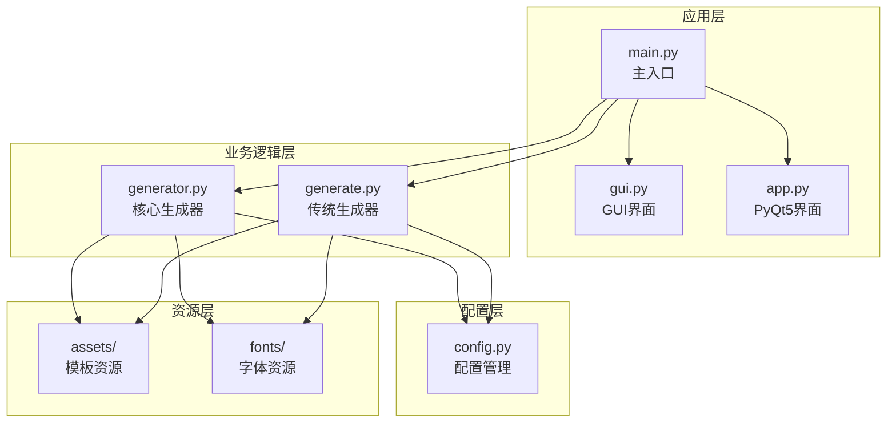
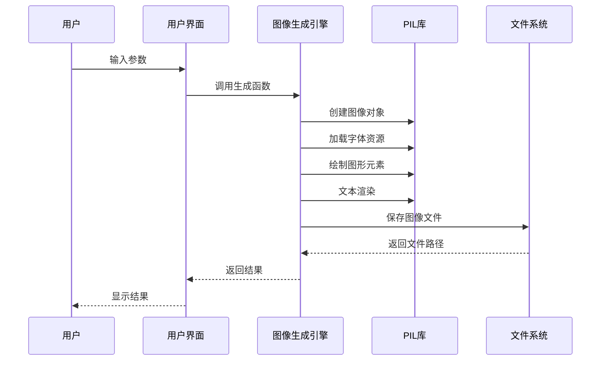
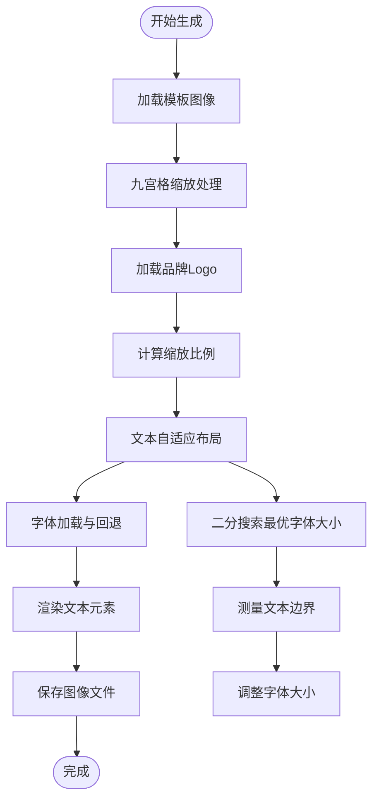
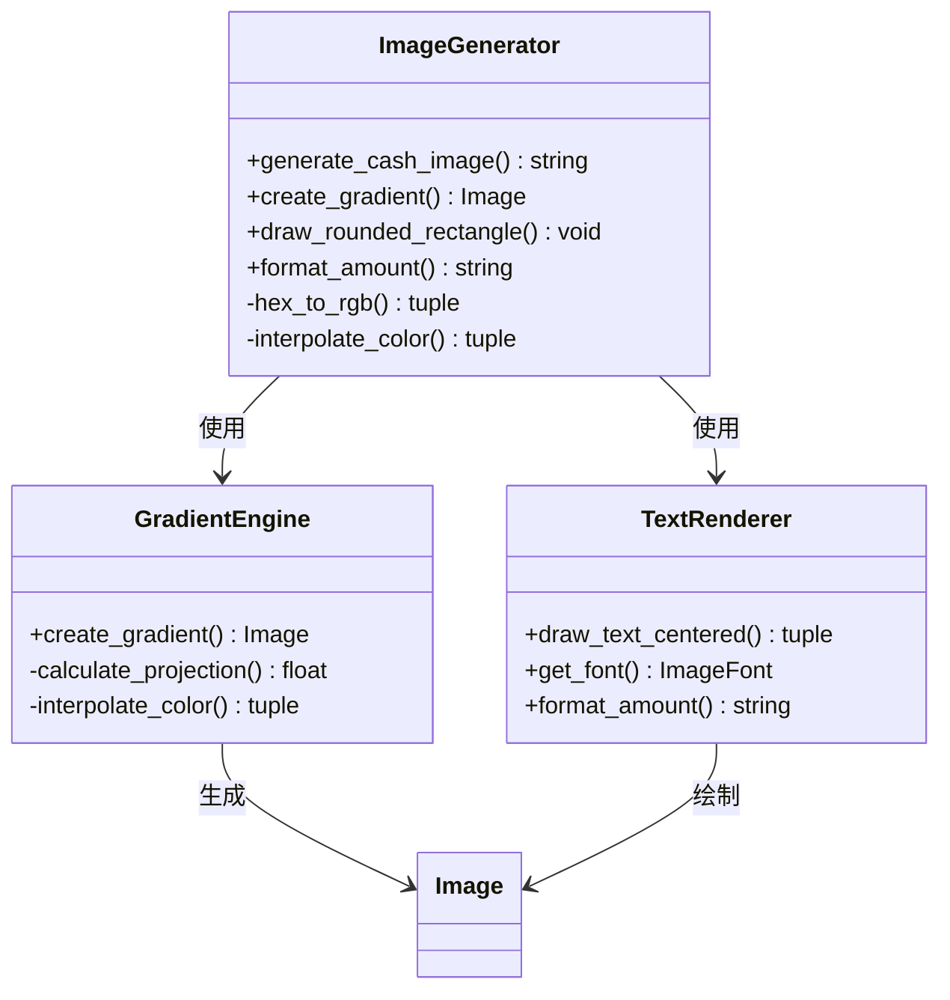
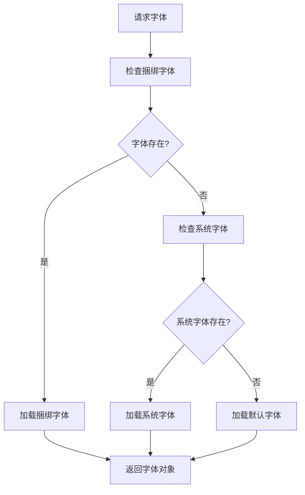
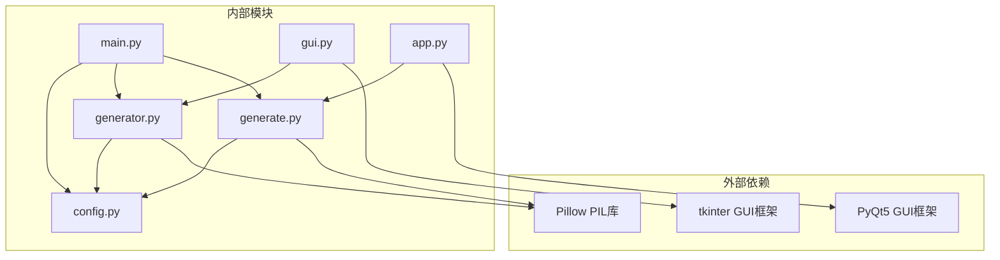
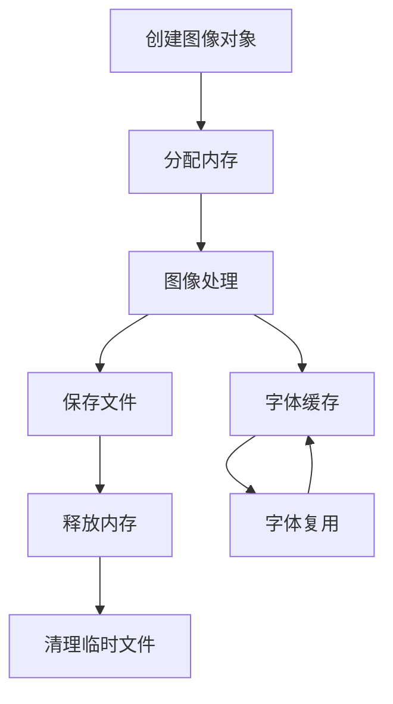
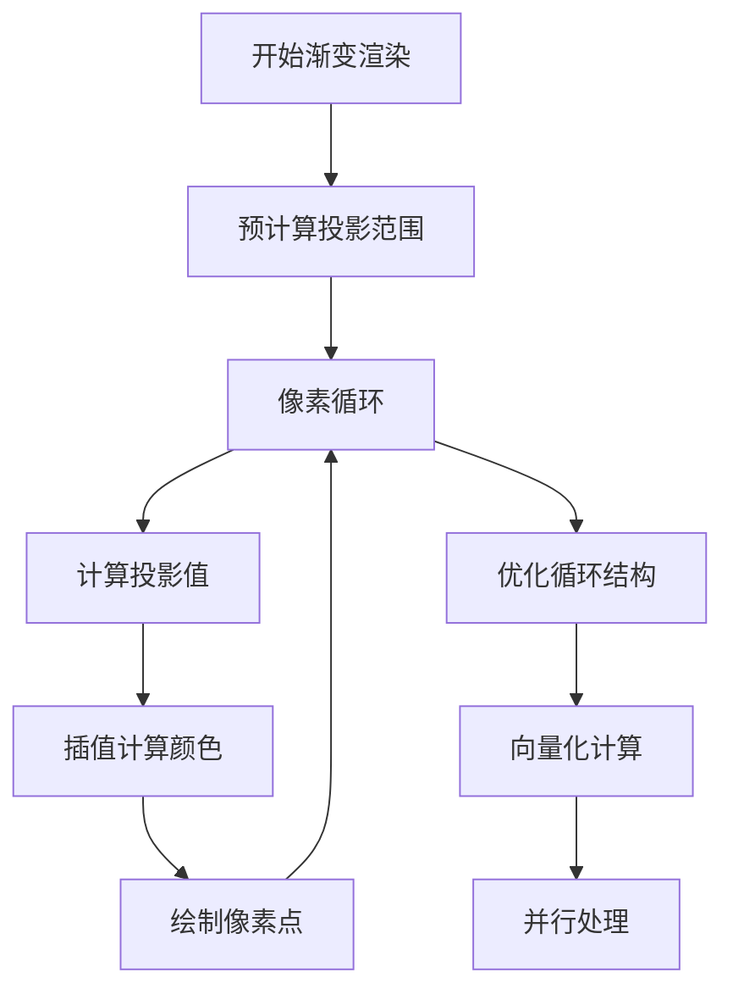
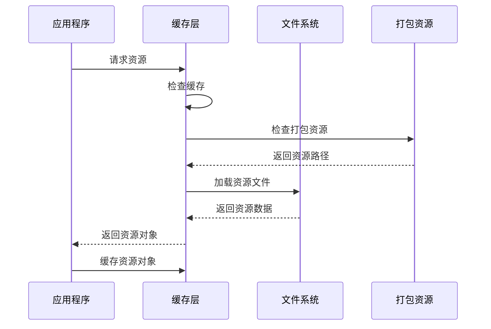

# 性能优化策略

<cite>
**本文引用的文件**
- [app.py](file://src/app.py)
- [config.py](file://src/config.py)
- [generate.py](file://src/generate.py)
- [generator.py](file://src/generator.py)
- [gui.py](file://src/gui.py)
- [main.py](file://src/main.py)
</cite>

## 目录
1. [简介](#简介)
2. [项目结构](#项目结构)
3. [核心组件](#核心组件)
4. [架构概览](#架构概览)
5. [详细组件分析](#详细组件分析)
6. [依赖分析](#依赖分析)
7. [性能考虑因素](#性能考虑因素)
8. [故障排除指南](#故障排除指南)
9. [结论](#结论)
10. [附录](#附录)

## 简介

本项目是一个多地区现金券生成器，支持多个电商平台的优惠券模板生成。项目采用Python + PIL进行图像处理，提供了命令行界面和GUI两种使用方式。本文档专注于图像生成过程中的性能优化策略，包括内存使用、CPU占用、I/O操作等方面的优化技巧，以及批量处理、并发处理、缓存机制等高级优化技术。

## 项目结构

项目采用模块化设计，主要包含以下核心模块：

**图表来源**
- [main.py:1-131](file://src/main.py#L1-L131)
- [gui.py:1-499](file://src/gui.py#L1-L499)
- [app.py:1-269](file://src/app.py#L1-L269)
- [generator.py:1-360](file://src/generator.py#L1-L360)
- [generate.py:1-429](file://src/generate.py#L1-L429)
- [config.py:1-178](file://src/config.py#L1-L178)

**章节来源**
- [main.py:1-131](file://src/main.py#L1-L131)
- [config.py:1-178](file://src/config.py#L1-L178)

## 核心组件

### 图像生成引擎

项目包含两个主要的图像生成引擎：

1. **传统生成器** (`generate.py`): 基于PIL的直接图像操作
2. **现代生成器** (`generator.py`): 更高效的渐变和图形绘制引擎

### 配置管理系统

配置系统负责管理多地区设置、模板参数和字体资源：

- 多地区货币格式化规则
- 模板尺寸和颜色配置
- 字体路径解析和回退机制

### 用户界面层

提供两种用户界面：
- **GUI版本** (`gui.py`): 基于tkinter的跨平台界面
- **PyQt5版本** (`app.py`): macOS原生外观的桌面应用

**章节来源**
- [generate.py:1-429](file://src/generate.py#L1-L429)
- [generator.py:1-360](file://src/generator.py#L1-L360)
- [config.py:1-178](file://src/config.py#L1-L178)

## 架构概览

**图表来源**
- [main.py:94-105](file://src/main.py#L94-L105)
- [generator.py:145-346](file://src/generator.py#L145-L346)
- [generate.py:223-421](file://src/generate.py#L223-L421)

## 详细组件分析

### 图像生成引擎性能分析

#### 传统生成器 (`generate.py`) 性能特征

该生成器实现了复杂的文本适配和九宫格缩放功能：

**图表来源**
- [generate.py:223-421](file://src/generate.py#L223-L421)
- [generate.py:281-324](file://src/generate.py#L281-L324)

#### 现代生成器 (`generator.py`) 性能优势

现代生成器通过优化的图形绘制算法实现更好的性能：

**图表来源**
- [generator.py:145-346](file://src/generator.py#L145-L346)
- [generator.py:28-60](file://src/generator.py#L28-L60)
- [generator.py:117-123](file://src/generator.py#L117-L123)

**章节来源**
- [generate.py:223-421](file://src/generate.py#L223-L421)
- [generator.py:145-346](file://src/generator.py#L145-L346)

### 字体管理系统性能优化

字体系统实现了智能的字体回退机制：

**图表来源**
- [generate.py:73-89](file://src/generate.py#L73-L89)
- [generate.py:101-109](file://src/generate.py#L101-L109)
- [generator.py:91-114](file://src/generator.py#L91-L114)

**章节来源**
- [generate.py:73-121](file://src/generate.py#L73-L121)
- [generator.py:91-114](file://src/generator.py#L91-L114)

### 缓存机制设计

项目中可以实施多种缓存策略：

1. **字体缓存**: 避免重复加载相同大小的字体
2. **图像缓存**: 缓存常用模板和元素
3. **渲染结果缓存**: 缓存最终生成的图像

**章节来源**
- [generate.py:73-89](file://src/generate.py#L73-L89)
- [generator.py:91-114](file://src/generator.py#L91-L114)

## 依赖分析

**图表来源**
- [main.py:14-15](file://src/main.py#L14-L15)
- [generator.py:8](file://src/generator.py#L8)
- [generate.py:9](file://src/generate.py#L9)
- [gui.py:13](file://src/gui.py#L13)
- [app.py:20](file://src/app.py#L20)

**章节来源**
- [main.py:14-15](file://src/main.py#L14-L15)
- [generator.py:8](file://src/generator.py#L8)
- [generate.py:9](file://src/generate.py#L9)

## 性能考虑因素

### 内存使用优化

#### 图像内存管理

当前实现中存在潜在的内存泄漏风险：

1. **图像对象生命周期**: 确保生成的图像对象及时释放
2. **字体对象管理**: 避免重复创建相同大小的字体对象
3. **临时文件清理**: 及时清理预览和中间文件

#### 内存使用模式

**图表来源**
- [generator.py:340-346](file://src/generator.py#L340-L346)
- [generate.py:411-421](file://src/generate.py#L411-L421)

### CPU占用优化

#### 文本渲染优化

当前文本渲染过程存在多次字体测量和重绘：

1. **字体测量缓存**: 缓存文本边界测量结果
2. **二分搜索优化**: 优化字体大小搜索算法
3. **批量字体加载**: 批量加载常用字体

#### 渐变渲染优化

现代生成器的渐变渲染算法需要进一步优化：

**图表来源**
- [generator.py:28-60](file://src/generator.py#L28-L60)
- [generator.py:52-58](file://src/generator.py#L52-L58)

### I/O操作优化

#### 文件系统访问优化

1. **批量文件操作**: 减少文件系统调用次数
2. **异步文件操作**: 使用异步I/O提高效率
3. **文件缓存**: 缓存常用资源文件

#### 资源加载优化

**图表来源**
- [generate.py:56-70](file://src/generate.py#L56-L70)

**章节来源**
- [generate.py:56-70](file://src/generate.py#L56-L70)
- [generator.py:340-346](file://src/generator.py#L340-L346)

## 故障排除指南

### 常见性能问题诊断

#### 内存泄漏检测

1. **监控内存使用**: 使用系统监控工具观察内存使用情况
2. **图像对象跟踪**: 确保所有图像对象正确释放
3. **字体对象管理**: 避免字体对象累积

#### 性能瓶颈识别

1. **CPU使用率监控**: 识别CPU密集型操作
2. **I/O等待时间**: 分析文件系统操作延迟
3. **GPU加速**: 考虑使用GPU进行图像处理

### 优化实施步骤

#### 短期优化措施

1. **字体缓存实现**: 在现有基础上添加字体对象缓存
2. **图像对象复用**: 优化图像对象的创建和销毁
3. **批量操作**: 合并相似的操作以减少开销

#### 长期优化规划

1. **并行处理架构**: 实现多线程/多进程图像生成
2. **GPU加速**: 利用GPU进行图像处理计算
3. **内存池管理**: 实现专用的内存池管理

**章节来源**
- [generate.py:73-89](file://src/generate.py#L73-L89)
- [generator.py:91-114](file://src/generator.py#L91-L114)

## 结论

本项目在图像生成方面具有良好的架构基础，但仍存在多个性能优化机会。通过实施本文提出的优化策略，特别是字体缓存、图像对象管理和并行处理等技术，可以显著提升图像生成的性能表现。

关键优化方向包括：
- 实现智能缓存机制
- 优化文本渲染流程
- 改进内存管理策略
- 考虑并行处理架构
- 实施性能监控体系

这些优化措施将在保证图像质量的前提下，有效提升处理速度并改善用户体验。

## 附录

### 性能基准测试建议

建议实施以下性能测试来评估优化效果：

1. **单图像生成测试**: 测量不同尺寸和复杂度下的生成时间
2. **批量处理测试**: 评估多图像同时生成的性能
3. **内存使用测试**: 监控长时间运行的内存占用情况
4. **并发性能测试**: 评估多线程环境下的性能表现

### 最佳实践总结

1. **资源管理**: 始终确保资源的正确释放
2. **缓存策略**: 实施多层次的缓存机制
3. **算法优化**: 选择最适合的算法和数据结构
4. **监控体系**: 建立完善的性能监控和日志记录
5. **测试验证**: 定期进行性能回归测试