# 插件系统扩展

<cite>
**本文档引用的文件**
- [app.py](file://src/app.py)
- [config.py](file://src/config.py)
- [generate.py](file://src/generate.py)
- [generator.py](file://src/generator.py)
- [gui.py](file://src/gui.py)
- [main.py](file://src/main.py)
</cite>

## 目录
1. [简介](#简介)
2. [项目结构](#项目结构)
3. [核心组件](#核心组件)
4. [架构概览](#架构概览)
5. [详细组件分析](#详细组件分析)
6. [插件系统设计](#插件系统设计)
7. [插件开发规范](#插件开发规范)
8. [插件开发流程](#插件开发流程)
9. [插件类型详解](#插件类型详解)
10. [插件注册与加载机制](#插件注册与加载机制)
11. [性能考虑](#性能考虑)
12. [故障排除指南](#故障排除指南)
13. [结论](#结论)

## 简介

这是一个多地区促销券生成器项目，提供了多种插件扩展机制。项目采用配置驱动的扩展方式，通过模块化加载机制实现灵活的功能扩展。当前系统支持区域配置、模板配置、图像处理等功能的扩展。

## 项目结构

项目采用清晰的分层架构，每个模块都有明确的职责分工：

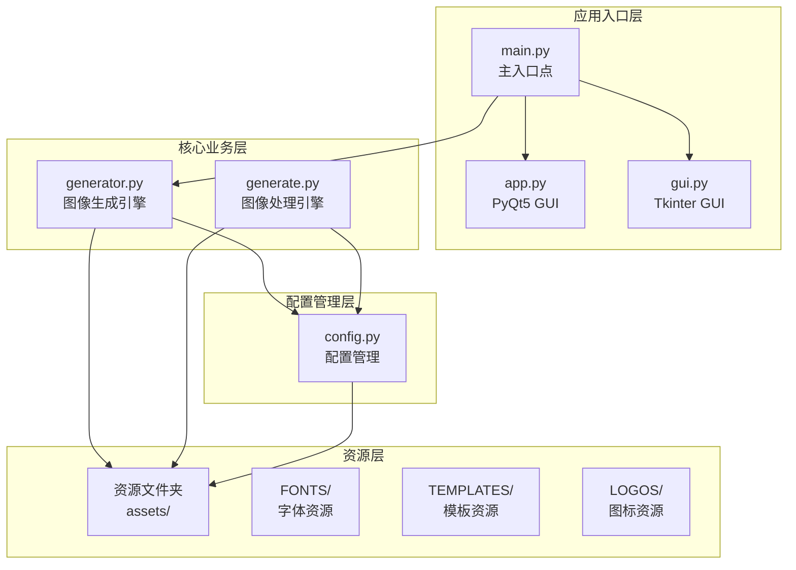

**图表来源**
- [main.py:1-131](file://src/main.py#L1-L131)
- [config.py:1-178](file://src/config.py#L1-L178)

**章节来源**
- [main.py:1-131](file://src/main.py#L1-L131)
- [config.py:1-178](file://src/config.py#L1-L178)

## 核心组件

### 配置管理系统

配置系统是插件扩展的核心基础设施，提供了区域配置、模板配置和导出设置的管理能力。

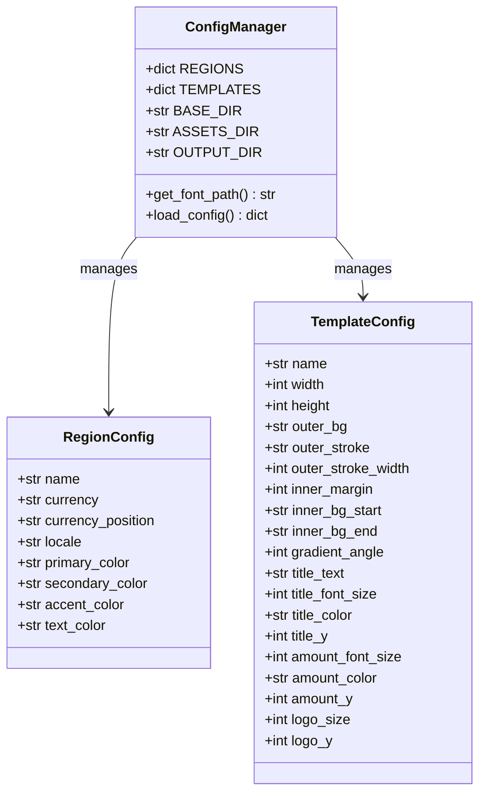

**图表来源**
- [config.py:16-178](file://src/config.py#L16-L178)

### 图像生成引擎

图像生成引擎负责处理各种图像生成任务，支持多种模板类型和区域配置。

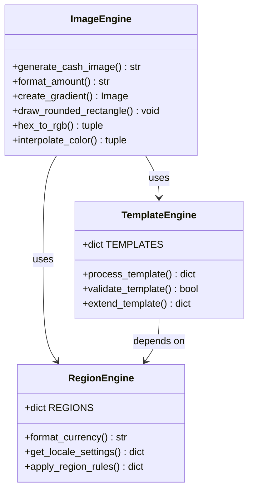

**图表来源**
- [generator.py:145-346](file://src/generator.py#L145-L346)

**章节来源**
- [config.py:16-178](file://src/config.py#L16-L178)
- [generator.py:145-346](file://src/generator.py#L145-L346)

## 架构概览

项目采用了模块化的插件架构，支持以下扩展机制：

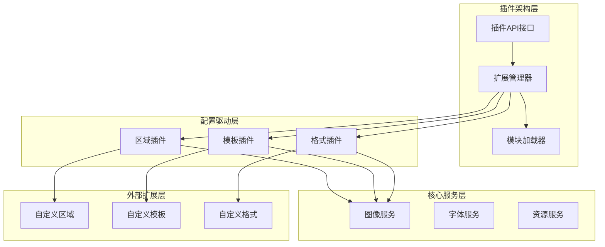

**图表来源**
- [config.py:16-178](file://src/config.py#L16-L178)
- [generator.py:145-346](file://src/generator.py#L145-L346)

## 详细组件分析

### GUI界面组件

项目提供了两种GUI界面实现，支持不同的用户体验：

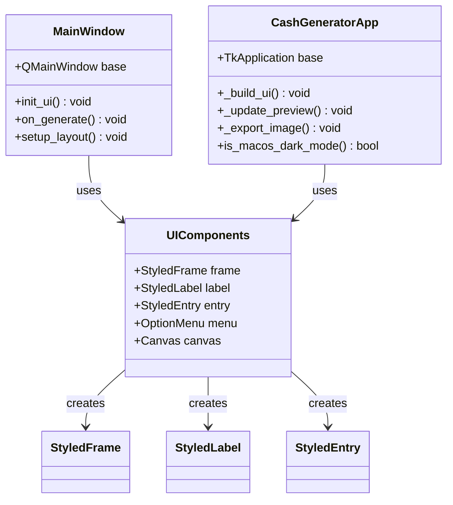

**图表来源**
- [app.py:23-269](file://src/app.py#L23-L269)
- [gui.py:69-499](file://src/gui.py#L69-L499)

### 命令行接口组件

命令行接口提供了脚本化的操作方式：

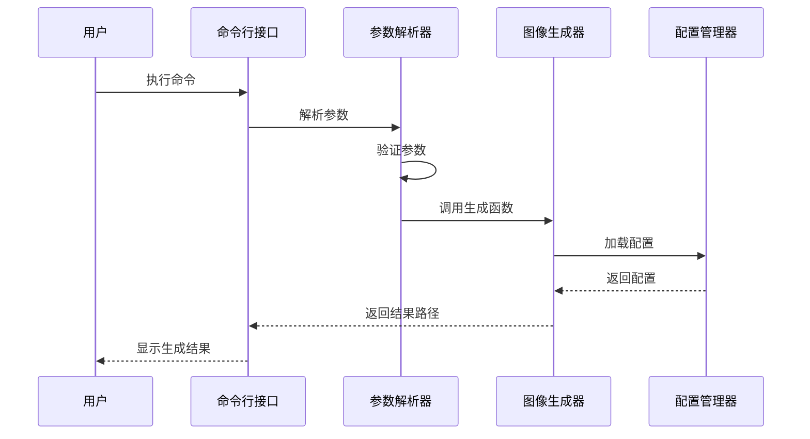

**图表来源**
- [main.py:18-106](file://src/main.py#L18-L106)
- [generator.py:145-346](file://src/generator.py#L145-L346)

**章节来源**
- [app.py:23-269](file://src/app.py#L23-L269)
- [gui.py:69-499](file://src/gui.py#L69-L499)
- [main.py:18-106](file://src/main.py#L18-L106)

## 插件系统设计

### 配置驱动的扩展机制

项目采用配置驱动的方式实现插件扩展，主要体现在以下几个方面：

1. **区域配置扩展**：通过修改`REGIONS`字典添加新的地区支持
2. **模板配置扩展**：通过修改`TEMPLATES`字典添加新的模板类型
3. **资源文件扩展**：通过添加新的字体、模板和图标文件支持

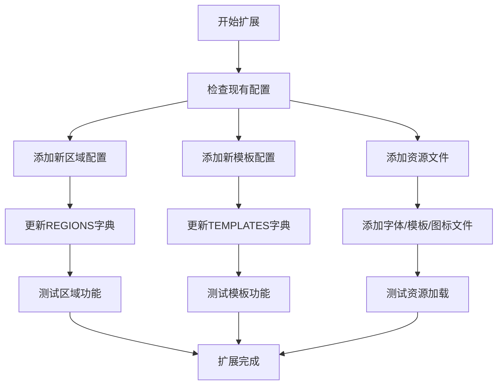

**图表来源**
- [config.py:19-149](file://src/config.py#L19-L149)

### 模块化加载机制

系统实现了模块化的加载机制，支持动态加载和配置：

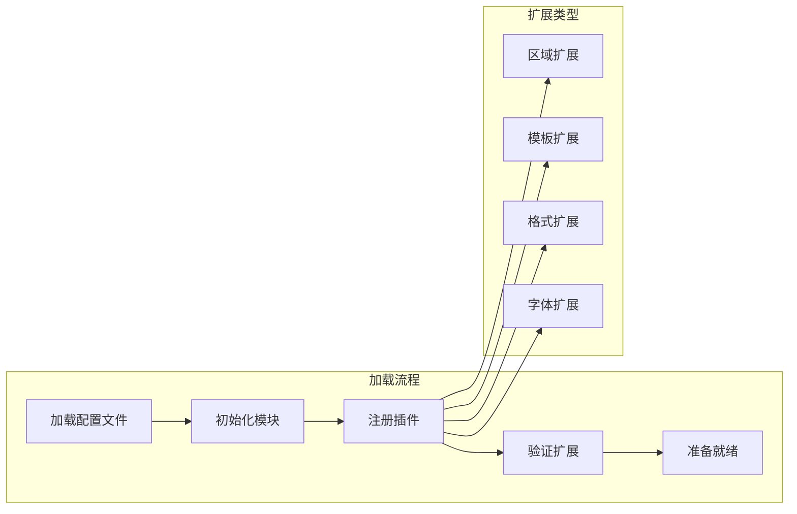

**图表来源**
- [config.py:16-178](file://src/config.py#L16-L178)
- [generator.py:9-11](file://src/generator.py#L9-L11)

**章节来源**
- [config.py:16-178](file://src/config.py#L16-L178)
- [generator.py:9-11](file://src/generator.py#L9-L11)

## 插件开发规范

### 接口定义规范

插件需要遵循统一的接口规范：

1. **配置接口**：实现标准的配置加载和验证接口
2. **处理接口**：实现图像处理的标准方法签名
3. **资源接口**：实现资源文件的加载和管理接口

### 配置文件扩展规范

配置文件需要遵循以下规范：

1. **键名规范**：使用小写字母和下划线命名
2. **值类型规范**：确保值类型与预期一致
3. **默认值规范**：为可选参数提供合理的默认值
4. **验证规范**：实现配置参数的验证逻辑

### 模块集成规范

模块集成需要满足：

1. **导入兼容性**：确保模块可以被正确导入
2. **依赖管理**：明确定义模块间的依赖关系
3. **错误处理**：实现完善的异常处理机制
4. **资源清理**：确保资源使用后的正确清理

## 插件开发流程

### 开发前准备

1. **需求分析**：明确插件的功能需求和目标用户
2. **技术评估**：评估现有架构的扩展能力和限制
3. **设计规划**：制定详细的插件设计方案
4. **环境搭建**：准备开发和测试环境

### 核心开发步骤

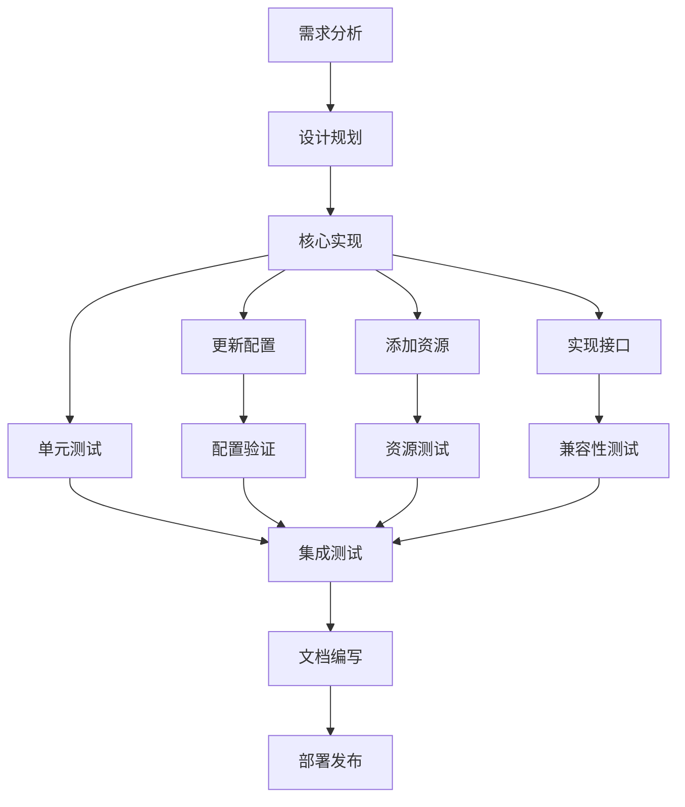

### 测试与验证

1. **单元测试**：对插件的核心功能进行测试
2. **集成测试**：测试插件与主系统的集成效果
3. **兼容性测试**：确保插件在不同环境下的兼容性
4. **性能测试**：验证插件的性能表现

## 插件类型详解

### 区域支持插件

区域支持插件用于扩展新的地区支持：

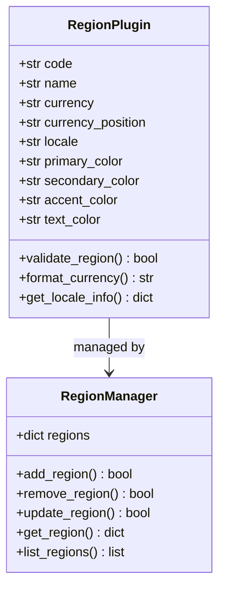

**图表来源**
- [config.py:19-80](file://src/config.py#L19-L80)

### 模板类型插件

模板类型插件用于扩展新的模板样式：

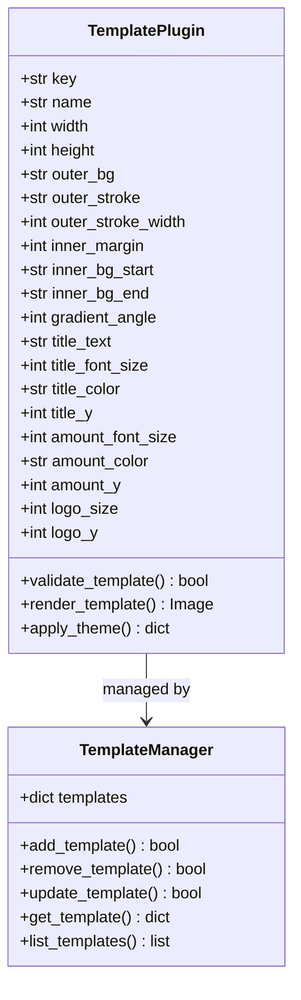

**图表来源**
- [config.py:85-149](file://src/config.py#L85-L149)

### 图像处理插件

图像处理插件用于扩展新的图像处理功能：

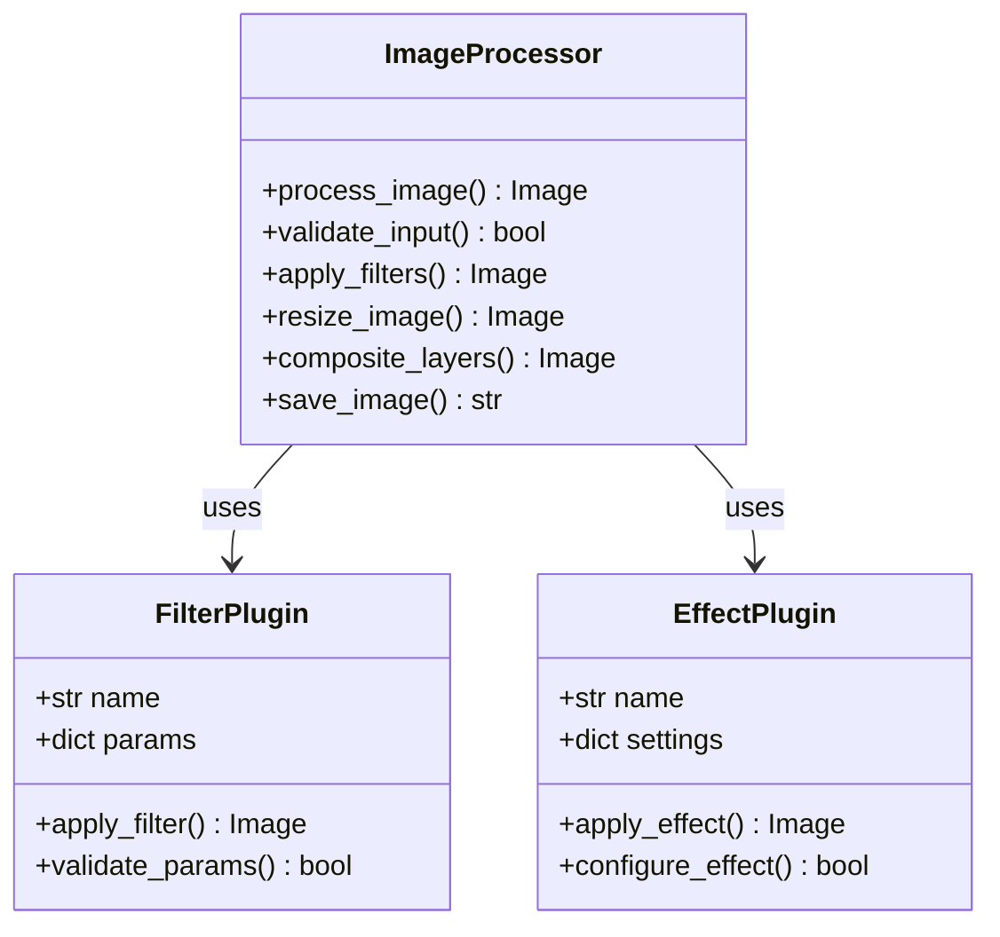

**图表来源**
- [generator.py:145-346](file://src/generator.py#L145-L346)

**章节来源**
- [config.py:19-149](file://src/config.py#L19-L149)
- [generator.py:145-346](file://src/generator.py#L145-L346)

## 插件注册与加载机制

### 注册机制

插件注册机制确保插件能够被系统正确识别和加载：

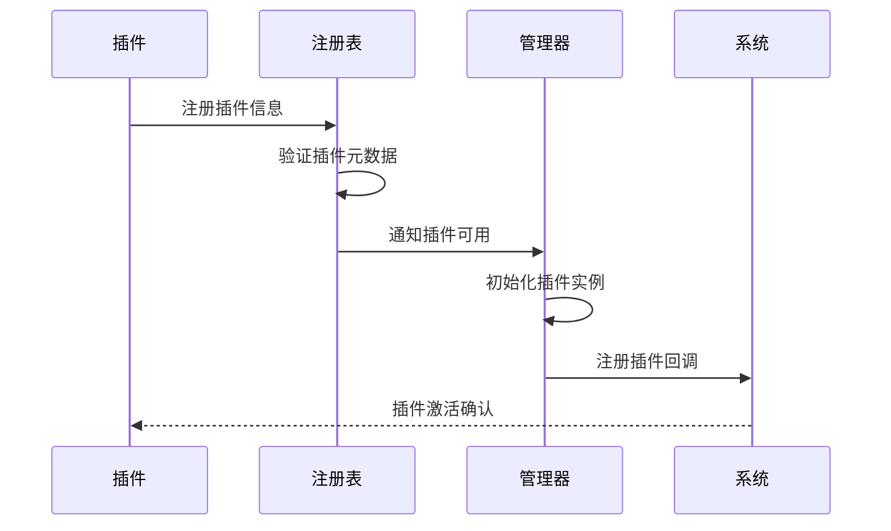

### 加载机制

插件加载机制支持动态加载和延迟加载：

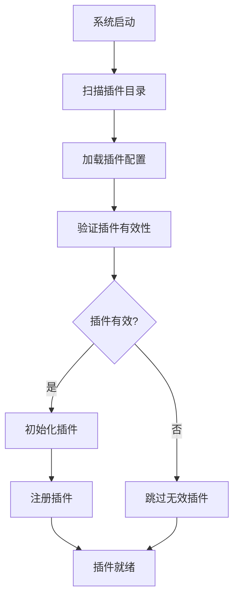

### 卸载机制

插件卸载机制确保插件能够安全地从系统中移除：

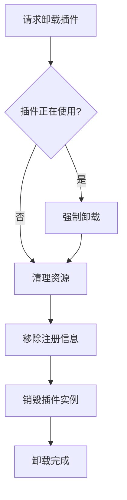

**章节来源**
- [config.py:16-178](file://src/config.py#L16-L178)
- [generator.py:145-346](file://src/generator.py#L145-L346)

## 性能考虑

### 内存管理

插件系统需要特别注意内存管理：

1. **资源池管理**：实现图像和字体资源的池化管理
2. **缓存策略**：合理使用缓存减少重复计算
3. **垃圾回收**：及时释放不再使用的资源

### 并发处理

插件系统可能需要处理并发请求：

1. **线程安全**：确保插件接口的线程安全性
2. **锁机制**：合理使用锁避免竞态条件
3. **异步处理**：支持异步操作提高响应性

### 优化建议

1. **懒加载**：只在需要时加载插件资源
2. **预编译**：对频繁使用的计算结果进行缓存
3. **批量处理**：支持批量操作提高效率

## 故障排除指南

### 常见问题

1. **插件加载失败**：检查插件配置文件的语法和完整性
2. **资源文件缺失**：确认字体、模板和图标文件的存在性
3. **配置冲突**：检查是否有重复的插件键名或配置项

### 调试方法

1. **日志记录**：启用详细的日志记录便于调试
2. **单元测试**：编写针对插件功能的单元测试
3. **性能监控**：监控插件的性能指标

### 错误处理

插件系统需要实现完善的错误处理机制：

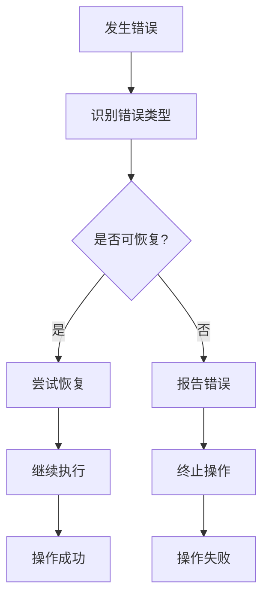

**章节来源**
- [config.py:16-178](file://src/config.py#L16-L178)
- [generator.py:145-346](file://src/generator.py#L145-L346)

## 结论

这个现金生成器项目展示了现代Python应用的插件系统设计最佳实践。通过配置驱动的扩展方式和模块化加载机制，系统实现了高度的灵活性和可扩展性。

### 主要优势

1. **配置驱动**：通过简单的配置文件扩展功能
2. **模块化设计**：清晰的模块边界和职责分离
3. **易于扩展**：标准化的接口和规范便于新功能开发
4. **资源管理**：完善的资源管理和缓存机制

### 发展方向

1. **插件市场**：建立官方插件市场促进生态发展
2. **热插拔支持**：实现运行时插件的动态加载和卸载
3. **插件版本管理**：支持插件版本控制和依赖管理
4. **插件安全**：增强插件沙箱和权限控制机制

这个插件系统为开发者提供了一个清晰的框架，使得扩展新功能变得简单而可靠。通过遵循既定的规范和最佳实践，开发者可以快速地为系统添加新的区域支持、模板类型和图像处理功能。