# 自定义模板开发

<cite>
**本文档引用的文件**
- [app.py](file://src/app.py)
- [config.py](file://src/config.py)
- [generate.py](file://src/generate.py)
- [generator.py](file://src/generator.py)
- [gui.py](file://src/gui.py)
- [main.py](file://src/main.py)
</cite>

## 目录
1. [简介](#简介)
2. [项目结构](#项目结构)
3. [核心组件](#核心组件)
4. [架构概览](#架构概览)
5. [详细组件分析](#详细组件分析)
6. [模板系统架构](#模板系统架构)
7. [模板参数定义](#模板参数定义)
8. [模板开发流程](#模板开发流程)
9. [模板配置示例](#模板配置示例)
10. [模板与区域配置关系](#模板与区域配置关系)
11. [跨区域模板适配](#跨区域模板适配)
12. [模板测试和验证](#模板测试和验证)
13. [性能考虑](#性能考虑)
14. [故障排除指南](#故障排除指南)
15. [结论](#结论)

## 简介

这是一个多地区现金券生成器系统，支持自定义模板开发。该系统提供了完整的UI界面、命令行接口和图像生成引擎，能够根据不同的地区配置生成符合当地货币格式和视觉风格的现金券。

系统的核心特性包括：
- 多地区支持（马来西亚、泰国、印度尼西亚、菲律宾、新加坡、越南）
- 多模板系统（LazCash、Shopee Coins、Tokopedia Deals）
- 渐变背景和圆角矩形设计
- 自适应字体和布局
- 跨平台兼容性（macOS原生外观）

## 项目结构

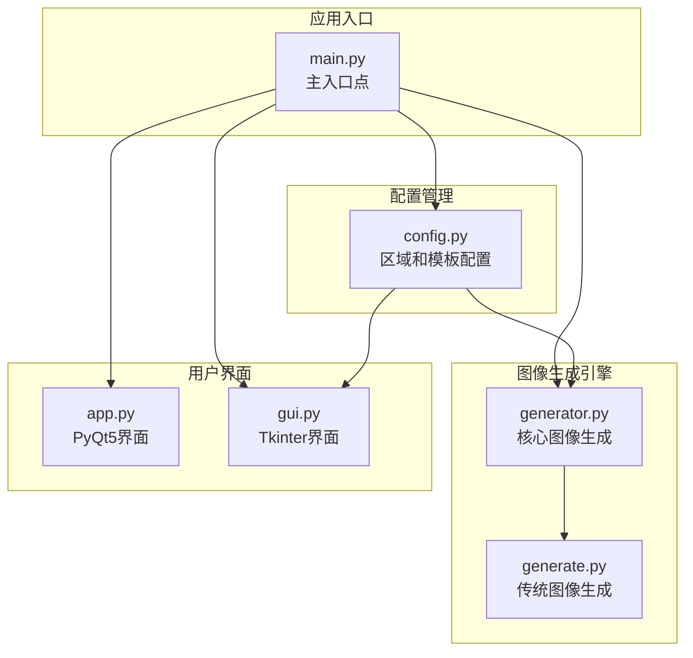

**图表来源**
- [main.py:1-131](file://src/main.py#L1-L131)
- [config.py:1-178](file://src/config.py#L1-L178)
- [generator.py:1-360](file://src/generator.py#L1-L360)
- [generate.py:1-429](file://src/generate.py#L1-L429)

**章节来源**
- [main.py:1-131](file://src/main.py#L1-L131)
- [config.py:1-178](file://src/config.py#L1-L178)

## 核心组件

### 区域配置系统

系统支持6个主要市场区域，每个区域都有特定的货币格式、颜色方案和本地化设置：

| 区域代码 | 名称 | 货币符号 | 货币位置 | 语言环境 |
|---------|------|----------|----------|----------|
| MY | 马来西亚 | RM | 前缀 | en_MY |
| TH | 泰国 | ฿ | 前缀 | th_TH |
| ID | 印度尼西亚 | Rp | 前缀 | id_ID |
| PH | 菲律宾 | ₱ | 前缀 | en_PH |
| SG | 新加坡 | $ | 前缀 | en_SG |
| VN | 越南 | ₫ | 后缀 | vi_VN |

### 模板配置系统

系统内置了3种预设模板，每种模板都包含完整的视觉参数配置：

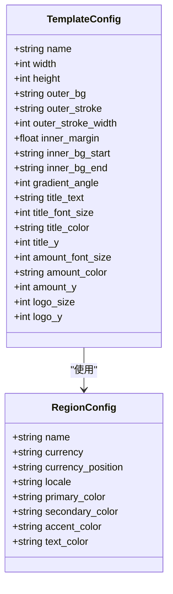

**图表来源**
- [config.py:85-149](file://src/config.py#L85-L149)
- [config.py:19-80](file://src/config.py#L19-L80)

**章节来源**
- [config.py:19-178](file://src/config.py#L19-L178)

## 架构概览

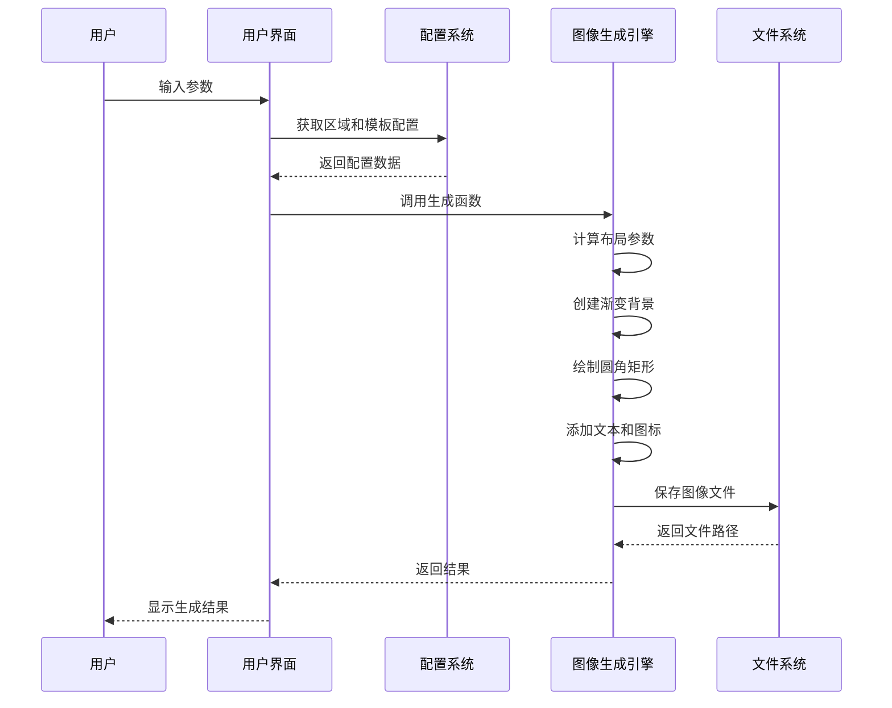

**图表来源**
- [gui.py:418-456](file://src/gui.py#L418-L456)
- [generator.py:145-346](file://src/generator.py#L145-L346)
- [config.py:19-178](file://src/config.py#L19-L178)

## 详细组件分析

### 图像生成引擎

图像生成引擎是系统的核心组件，负责创建最终的券图。它实现了以下关键功能：

#### 渐变背景生成
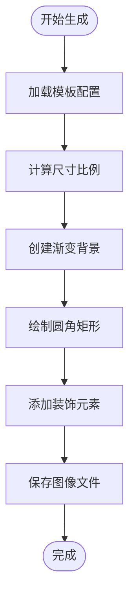

**图表来源**
- [generator.py:28-61](file://src/generator.py#L28-L61)
- [generator.py:185-218](file://src/generator.py#L185-L218)

#### 圆角矩形绘制算法
系统实现了精确的圆角矩形绘制算法，支持外层描边和内部填充：

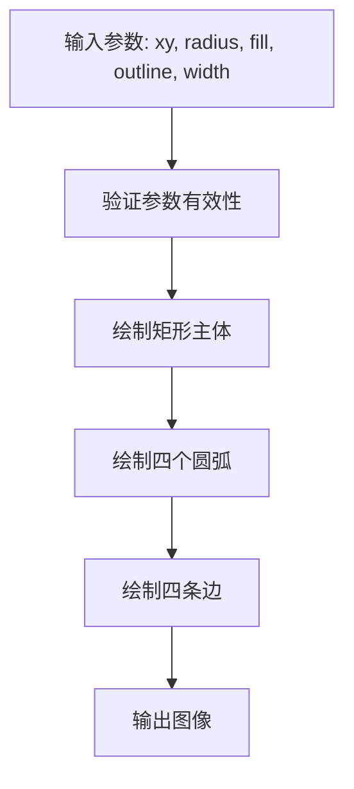

**图表来源**
- [generator.py:63-89](file://src/generator.py#L63-L89)

**章节来源**
- [generator.py:1-360](file://src/generator.py#L1-L360)

### 用户界面组件

系统提供了两种用户界面选项：

#### PyQt5界面
基于PyQt5的现代化界面，具有macOS原生外观：

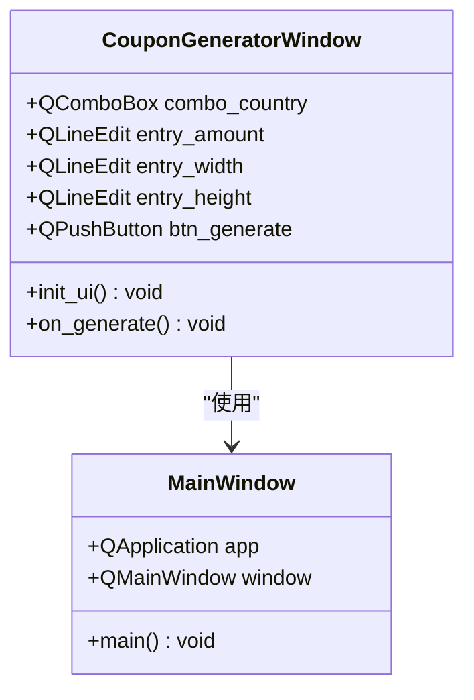

**图表来源**
- [app.py:23-269](file://src/app.py#L23-L269)

#### Tkinter界面
跨平台的桌面界面，支持暗黑/亮色模式自动切换：

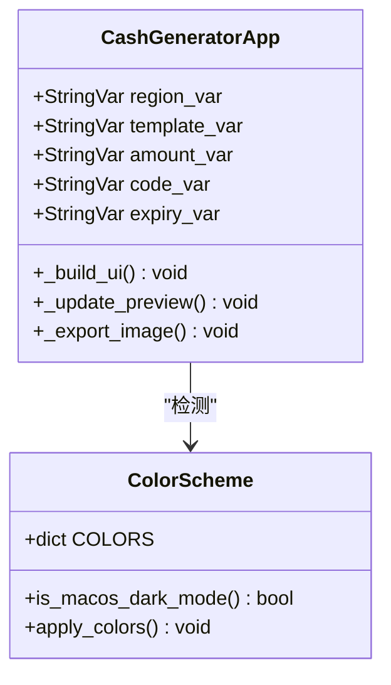

**图表来源**
- [gui.py:69-499](file://src/gui.py#L69-L499)

**章节来源**
- [app.py:1-269](file://src/app.py#L1-L269)
- [gui.py:1-499](file://src/gui.py#L1-L499)

## 模板系统架构

### 模板参数结构

每个模板都包含完整的视觉参数配置，确保生成的券图具有一致的外观：

#### 基础尺寸参数
- `width`: 模板宽度（像素）
- `height`: 模板高度（像素）
- `inner_margin`: 内边距（像素）

#### 颜色方案参数
- `outer_bg`: 外层背景色
- `outer_stroke`: 外层描边色
- `outer_stroke_width`: 外层描边宽度
- `inner_bg_start`: 内部渐变起始色
- `inner_bg_end`: 内部渐变结束色
- `accent_color`: 强调色

#### 文本配置参数
- `title_text`: 标题文本
- `title_font_size`: 标题字体大小
- `title_color`: 标题颜色
- `title_y`: 标题垂直位置
- `amount_font_size`: 金额字体大小
- `amount_color`: 金额颜色
- `amount_y`: 金额垂直位置

#### 图标和装饰参数
- `logo_size`: 标识图标大小
- `logo_y`: 标识图标垂直位置
- `gradient_angle`: 渐变角度

**章节来源**
- [config.py:85-149](file://src/config.py#L85-L149)

## 模板参数定义

### 创建新模板的完整参数清单

要创建一个自定义模板，需要定义以下参数组：

#### 1. 尺寸设置
```python
{
    "name": "自定义模板名称",
    "width": 420,      # 模板宽度
    "height": 420,     # 模板高度
    "inner_margin": 25.51  # 内边距
}
```

#### 2. 颜色方案
```python
{
    "outer_bg": "#FF475A",      # 外层背景色
    "outer_stroke": "#FFE8E9",  # 外层描边色
    "outer_stroke_width": 4,    # 描边宽度
    "inner_bg_start": "#FFFFFF", # 内部渐变起始色
    "inner_bg_end": "#FFE2E4",   # 内部渐变结束色
    "gradient_angle": 143,      # 渐变角度
    "accent_color": "#D32637",  # 强调色
    "text_color": "#902531"     # 文本颜色
}
```

#### 3. 字体配置
```python
{
    "title_text": "LazCash",        # 标题文本
    "title_font_size": 50,          # 标题字体大小
    "title_color": "#902531",       # 标题颜色
    "title_y": 60,                  # 标题垂直位置
    "amount_font_size": 180,        # 金额字体大小
    "amount_color": "#D32637",      # 金额颜色
    "amount_y": 136                 # 金额垂直位置
}
```

#### 4. 图标和装饰
```python
{
    "logo_size": 80,    # 标识图标大小
    "logo_y": 0,        # 标识图标垂直位置
    "logo_x": 15        # 标识图标水平位置（可选）
}
```

**章节来源**
- [config.py:85-149](file://src/config.py#L85-L149)

## 模板开发流程

### 步骤1：需求分析和设计

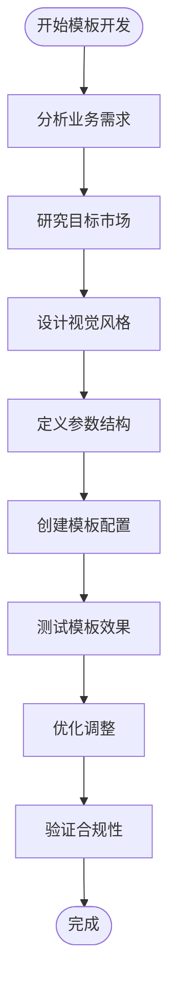

### 步骤2：模板参数配置

1. **确定基础尺寸**：根据目标平台和设备选择合适的宽高比
2. **设计颜色方案**：选择符合品牌识别的颜色组合
3. **配置字体参数**：确保在不同地区的字体渲染效果
4. **设置文本位置**：优化视觉层次和可读性

### 步骤3：渐变背景配置

渐变背景是现代券图设计的重要元素：

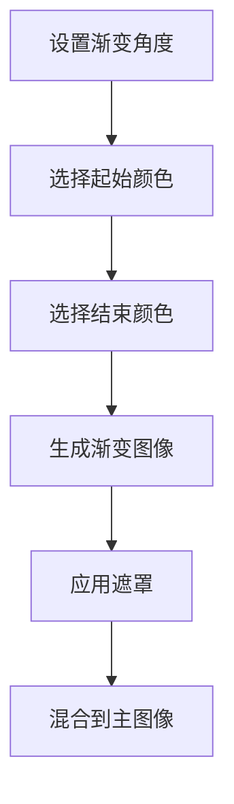

**图表来源**
- [generator.py:28-61](file://src/generator.py#L28-L61)
- [generator.py:205-218](file://src/generator.py#L205-L218)

### 步骤4：圆角矩形设计

圆角矩形提供了现代而友好的视觉效果：

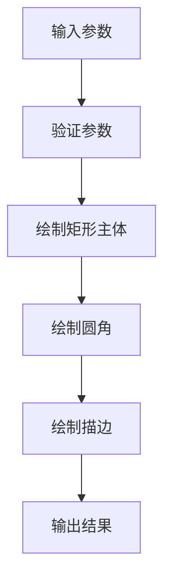

**图表来源**
- [generator.py:63-89](file://src/generator.py#L63-L89)

### 步骤5：文本和图标集成

1. **标题文本**：居中对齐，使用强调色
2. **金额显示**：自适应字体大小，确保可读性
3. **图标位置**：遵循网格系统，保持视觉平衡

**章节来源**
- [generator.py:266-333](file://src/generator.py#L266-L333)

## 模板配置示例

### 示例1：基础模板配置

```python
# 最简模板配置
BASIC_TEMPLATE = {
    "name": "基础模板",
    "width": 420,
    "height": 420,
    "outer_bg": "#FFFFFF",
    "outer_stroke": "#E0E0E0",
    "outer_stroke_width": 2,
    "inner_margin": 20,
    "inner_bg_start": "#F8F8F8",
    "inner_bg_end": "#FFFFFF",
    "gradient_angle": 90,
    "title_text": "优惠券",
    "title_font_size": 36,
    "title_color": "#333333",
    "title_y": 80,
    "amount_font_size": 120,
    "amount_color": "#FF475A",
    "amount_y": 160,
    "logo_size": 60,
    "logo_y": 20
}
```

### 示例2：品牌定制模板

```python
# 品牌定制模板
BRAND_TEMPLATE = {
    "name": "品牌定制",
    "width": 480,
    "height": 320,
    "outer_bg": "#1A1A2E",
    "outer_stroke": "#404060",
    "outer_stroke_width": 3,
    "inner_margin": 25,
    "inner_bg_start": "#16213E",
    "inner_bg_end": "#0F3460",
    "gradient_angle": 135,
    "title_text": "品牌名称",
    "title_font_size": 42,
    "title_color": "#E94560",
    "title_y": 60,
    "amount_font_size": 140,
    "amount_color": "#E94560",
    "amount_y": 120,
    "logo_size": 70,
    "logo_y": 15
}
```

### 示例3：响应式模板

```python
# 响应式模板配置
RESPONSIVE_TEMPLATE = {
    "name": "响应式模板",
    "width": 360,
    "height": 540,
    "outer_bg": "#FFFAFA",
    "outer_stroke": "#FFE8E8",
    "outer_stroke_width": 1,
    "inner_margin": 15,
    "inner_bg_start": "#FFFFFF",
    "inner_bg_end": "#F8F8F8",
    "gradient_angle": 45,
    "title_text": "移动优先",
    "title_font_size": 28,
    "title_color": "#666666",
    "title_y": 40,
    "amount_font_size": 100,
    "amount_color": "#FF475A",
    "amount_y": 100,
    "logo_size": 50,
    "logo_y": 10
}
```

**章节来源**
- [config.py:85-149](file://src/config.py#L85-L149)

## 模板与区域配置关系

### 区域适配策略

模板系统通过区域配置实现跨区域适配：

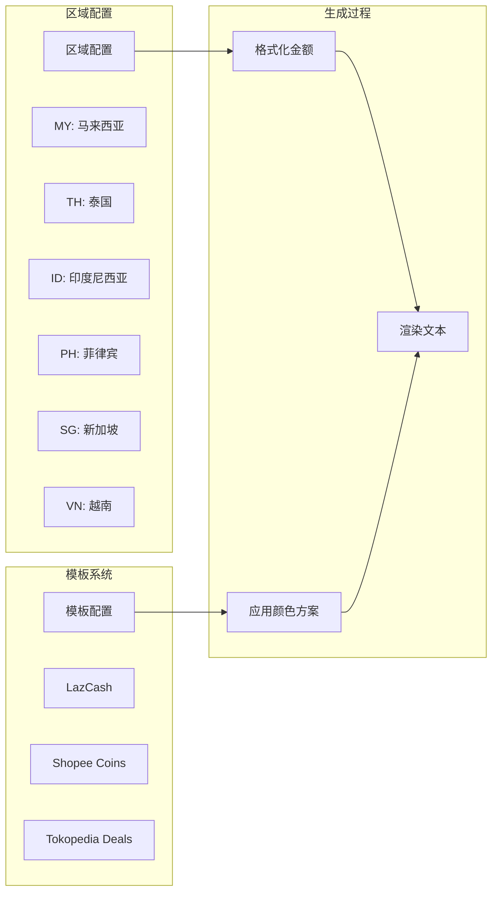

**图表来源**
- [config.py:19-80](file://src/config.py#L19-L80)
- [config.py:85-149](file://src/config.py#L85-L149)
- [generator.py:126-143](file://src/generator.py#L126-L143)

### 货币格式适配

不同地区有不同的货币格式要求：

| 区域 | 货币符号 | 格式规则 | 示例 |
|------|----------|----------|------|
| MY | RM | 前缀，无千位分隔符 | RM15 |
| TH | ฿ | 前缀，无千位分隔符 | ฿100 |
| ID | Rp | 前缀，使用点作为千位分隔符 | Rp 15.000 |
| PH | ₱ | 前缀，无千位分隔符 | ₱50 |
| SG | $ | 前缀，无千位分隔符 | $5 |
| VN | ₫ | 后缀，使用点作为千位分隔符 | 50.000 ₫ |

**章节来源**
- [config.py:19-80](file://src/config.py#L19-L80)
- [generator.py:126-143](file://src/generator.py#L126-L143)

## 跨区域模板适配

### 自适应布局策略

系统采用多种策略确保模板在不同区域的一致性和可用性：

#### 1. 字体自适应
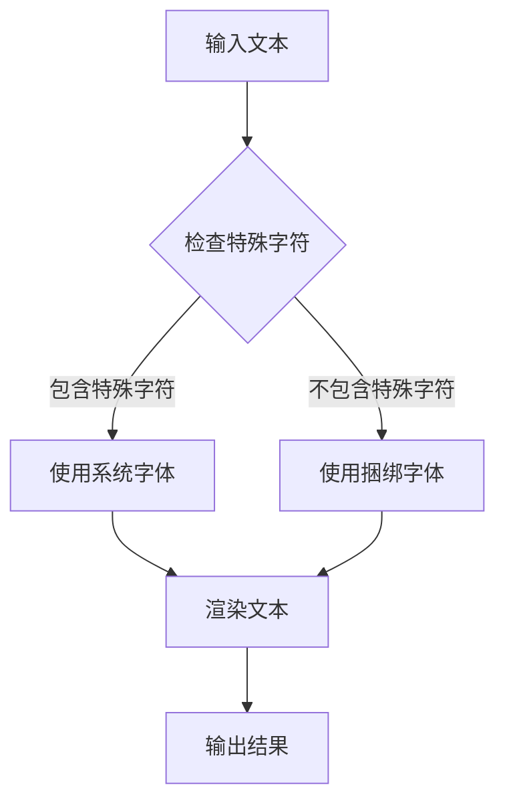

**图表来源**
- [generate.py:112-121](file://src/generate.py#L112-L121)

#### 2. 颜色方案适配
不同区域使用不同的颜色方案以符合当地用户的视觉偏好：

```python
REGION_COLOR_SCHEMES = {
    "MY": {"primary": "#FF475A", "secondary": "#FFE8E9", "accent": "#D32637"},
    "TH": {"primary": "#FF475A", "secondary": "#FFE8E9", "accent": "#D32637"},
    "ID": {"primary": "#FF475A", "secondary": "#FFE8E9", "accent": "#D32637"},
    "PH": {"primary": "#FF475A", "secondary": "#FFE8E9", "accent": "#D32637"},
    "SG": {"primary": "#FF475A", "secondary": "#FFE8E9", "accent": "#D32637"},
    "VN": {"primary": "#FF475A", "secondary": "#FFE8E9", "accent": "#D32637"}
}
```

#### 3. 布局比例调整
系统根据模板尺寸自动计算元素位置，确保在不同尺寸下的视觉平衡。

**章节来源**
- [generate.py:112-121](file://src/generate.py#L112-L121)
- [generator.py:126-143](file://src/generator.py#L126-L143)

## 模板测试和验证

### 测试策略

#### 1. 单元测试
```python
def test_template_generation():
    """测试模板生成功能"""
    # 测试不同区域的模板
    for region in REGIONS.keys():
        result = generate_cash_image(
            amount=15,
            region_code=region,
            template_key="lazcash"
        )
        assert os.path.exists(result)
        
    # 测试不同模板
    for template in TEMPLATES.keys():
        result = generate_cash_image(
            amount=15,
            region_code="SG",
            template_key=template
        )
        assert os.path.exists(result)
```

#### 2. 性能测试
```python
def test_performance():
    """测试生成性能"""
    import time
    
    start_time = time.time()
    for i in range(100):
        generate_cash_image(
            amount=15,
            region_code="SG",
            template_key="lazcash"
        )
    end_time = time.time()
    
    avg_time = (end_time - start_time) / 100
    assert avg_time < 1.0  # 平均每个图像生成时间应小于1秒
```

#### 3. 兼容性测试
```python
def test_cross_platform():
    """测试跨平台兼容性"""
    # 测试不同操作系统
    platforms = ["darwin", "linux", "win32"]
    for platform in platforms:
        # 检查资源路径解析
        result = resource_path("test.png")
        assert isinstance(result, str)
```

### 验证最佳实践

#### 1. 视觉验证
- 检查颜色对比度是否符合可访问性标准
- 验证文本在不同缩放比例下的可读性
- 确保图标和文本的视觉平衡

#### 2. 功能验证
- 验证所有区域配置都能正常工作
- 检查特殊字符的正确渲染
- 确认导出格式的完整性

#### 3. 性能验证
- 监控内存使用情况
- 检查生成时间的稳定性
- 验证批量处理的效率

**章节来源**
- [generator.py:349-360](file://src/generator.py#L349-L360)
- [generate.py:424-429](file://src/generate.py#L424-L429)

## 性能考虑

### 优化策略

#### 1. 图像处理优化
- 使用高效的图像缩放算法（LANCZOS）
- 实现渐变背景的缓存机制
- 优化圆角矩形绘制算法

#### 2. 内存管理
- 及时释放不再使用的图像对象
- 实现预览图像的延迟加载
- 优化字体资源的管理

#### 3. 并发处理
- 支持多线程图像生成
- 实现任务队列管理
- 提供进度反馈机制

## 故障排除指南

### 常见问题和解决方案

#### 1. 字体渲染问题
**问题**：特殊字符显示为方块
**解决方案**：使用系统字体回退机制

#### 2. 颜色显示异常
**问题**：颜色在不同平台上显示不一致
**解决方案**：使用RGB值而非十六进制字符串

#### 3. 图像质量下降
**问题**：生成的图像模糊
**解决方案**：检查缩放算法和分辨率设置

#### 4. 内存泄漏
**问题**：长时间运行后内存占用增加
**解决方案**：定期清理图像对象和字体缓存

**章节来源**
- [generate.py:112-121](file://src/generate.py#L112-L121)
- [generator.py:14-26](file://src/generator.py#L14-L26)

## 结论

自定义模板开发是一个涉及设计、技术实现和用户体验的综合过程。通过理解系统的架构和参数配置，开发者可以创建既美观又实用的模板。

### 关键要点

1. **参数完整性**：确保所有必要的模板参数都得到正确定义
2. **跨平台兼容性**：考虑不同操作系统和设备的差异
3. **性能优化**：平衡视觉效果和生成效率
4. **测试验证**：建立完善的测试和验证流程
5. **维护更新**：为未来的功能扩展预留空间

### 发展建议

- 实现模板版本控制系统
- 添加模板预览和实时编辑功能
- 支持动态模板参数调整
- 集成用户反馈收集机制
- 提供模板分享和社区功能

通过遵循这些指导原则和最佳实践，开发者可以创建高质量的自定义模板，满足不同市场和用户的需求。