# 高级功能

<cite>
**本文档引用的文件**
- [app.py](file://src/app.py)
- [config.py](file://src/config.py)
- [generate.py](file://src/generate.py)
- [generator.py](file://src/generator.py)
- [gui.py](file://src/gui.py)
- [main.py](file://src/main.py)
</cite>

## 目录
1. [简介](#简介)
2. [项目结构](#项目结构)
3. [核心组件](#核心组件)
4. [架构概览](#架构概览)
5. [详细组件分析](#详细组件分析)
6. [多区域扩展指南](#多区域扩展指南)
7. [自定义模板开发](#自定义模板开发)
8. [性能优化策略](#性能优化策略)
9. [插件系统与扩展机制](#插件系统与扩展机制)
10. [高级配置技巧](#高级配置技巧)
11. [故障排除指南](#故障排障指南)
12. [结论](#结论)

## 简介

Cash Generator 是一个基于 Python 的多地区现金券生成器，支持多个东南亚电商平台的优惠券模板。该项目提供了完整的命令行界面和图形用户界面，支持多种货币格式化、自定义模板、多区域扩展等功能。

该工具的核心功能包括：
- 多地区货币格式化（MY、TH、ID、PH、SG、VN）
- 多种优惠券模板样式
- 图像生成和预览功能
- 批量处理能力
- 自定义样式定制

## 项目结构

项目采用模块化的文件组织方式，每个功能模块都有专门的职责：

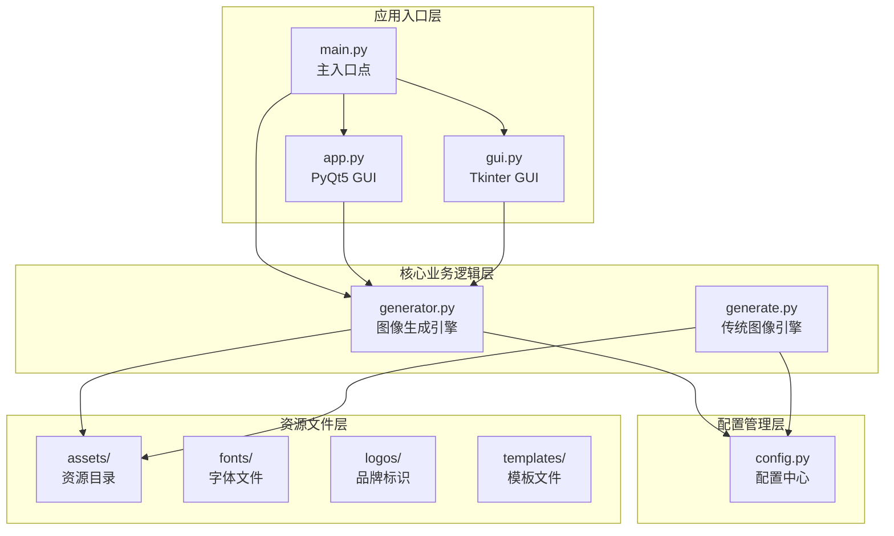

**图表来源**
- [main.py:1-131](file://src/main.py#L1-L131)
- [config.py:1-178](file://src/config.py#L1-L178)

**章节来源**
- [main.py:1-131](file://src/main.py#L1-L131)
- [config.py:1-178](file://src/config.py#L1-L178)

## 核心组件

### 配置管理系统

配置系统是整个应用的核心，负责管理多区域设置、模板配置和导出设置。

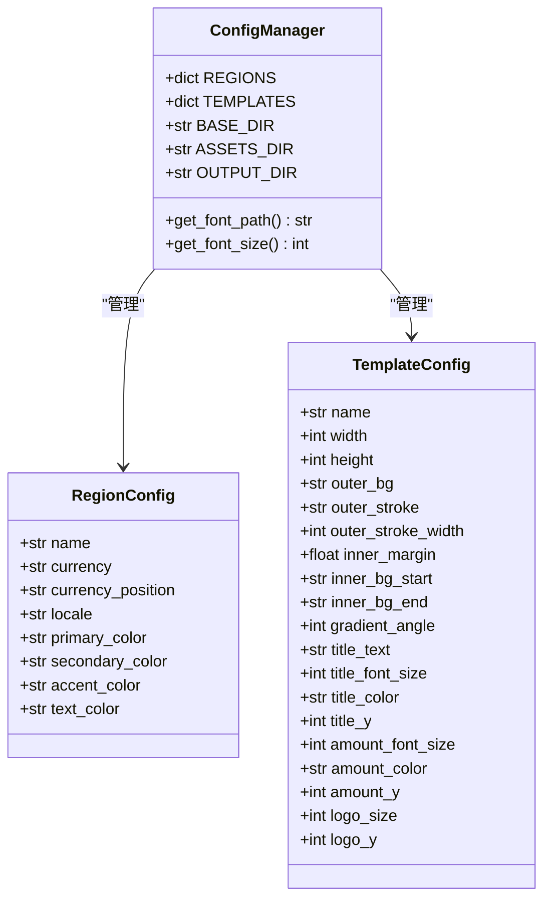

**图表来源**
- [config.py:19-80](file://src/config.py#L19-L80)
- [config.py:85-149](file://src/config.py#L85-L149)

### 图像生成引擎

图像生成引擎提供了两种不同的实现方式，满足不同场景的需求。

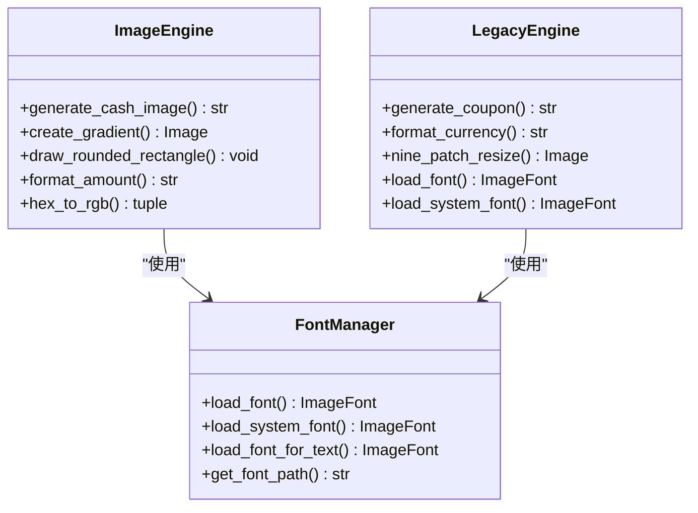

**图表来源**
- [generator.py:145-346](file://src/generator.py#L145-L346)
- [generate.py:223-421](file://src/generate.py#L223-L421)

**章节来源**
- [config.py:1-178](file://src/config.py#L1-L178)
- [generator.py:1-360](file://src/generator.py#L1-L360)
- [generate.py:1-429](file://src/generate.py#L1-L429)

## 架构概览

系统采用分层架构设计，确保了良好的可维护性和扩展性：

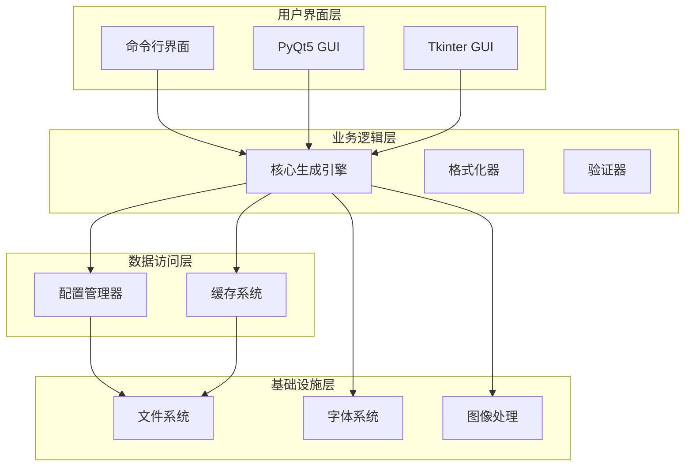

**图表来源**
- [main.py:18-127](file://src/main.py#L18-L127)
- [generator.py:145-346](file://src/generator.py#L145-L346)

## 详细组件分析

### GUI 组件分析

#### PyQt5 GUI 界面

PyQt5 版本提供了现代化的 macOS 原生外观，具有以下特点：

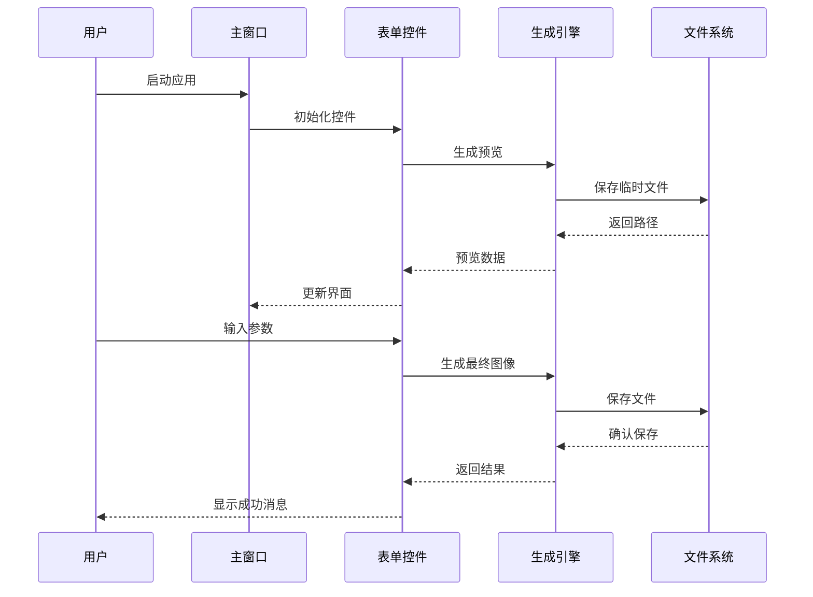

**图表来源**
- [app.py:205-242](file://src/app.py#L205-L242)
- [generate.py:223-421](file://src/generate.py#L223-L421)

#### Tkinter GUI 界面

Tkinter 版本提供了跨平台兼容性，支持暗黑模式检测：

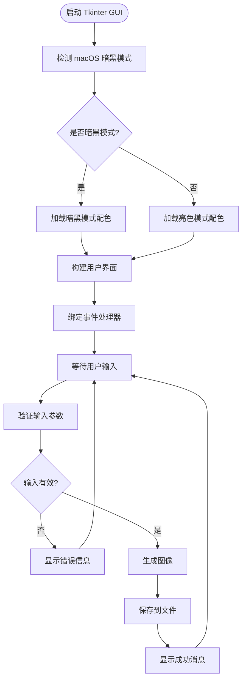

**图表来源**
- [gui.py:17-66](file://src/gui.py#L17-L66)
- [gui.py:418-456](file://src/gui.py#L418-L456)

**章节来源**
- [app.py:23-269](file://src/app.py#L23-L269)
- [gui.py:69-499](file://src/gui.py#L69-L499)

### 命令行接口

命令行接口提供了完整的自动化支持：

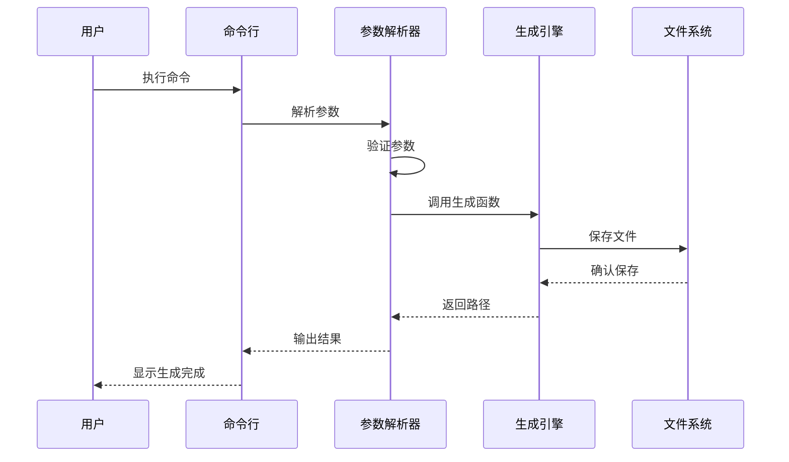

**图表来源**
- [main.py:18-106](file://src/main.py#L18-L106)
- [generator.py:145-346](file://src/generator.py#L145-L346)

**章节来源**
- [main.py:18-131](file://src/main.py#L18-L131)

## 多区域扩展指南

### 区域配置扩展

要添加新的国家/地区支持，需要修改配置文件中的 `REGIONS` 字典：

```python
# 在 config.py 中添加新区域
REGIONS = {
    # ... 现有区域 ...
    "NEW": {
        "name": "New Country",
        "currency": "NC",
        "currency_position": "prefix",  # 或 "suffix"
        "locale": "en_NEW",
        "primary_color": "#FF475A",
        "secondary_color": "#FFE8E9",
        "accent_color": "#D32637",
        "text_color": "#902531",
    },
}
```

### 货币格式化扩展

对于特殊的货币格式需求，可以扩展 `COUNTRY_CONFIG`：

```python
# 在 generate.py 中添加新格式
COUNTRY_CONFIG = {
    # ... 现有配置 ...
    "NEW": {
        "currency": "NC",
        "prefix": "NC",
        "suffix": "",
        "separator": ",",
        "threshold_rb": None,  # 特殊阈值格式
    },
}
```

### 字体支持扩展

系统自动检测可用字体，但可以手动指定字体路径：

```python
# 在 config.py 中配置字体
def get_font_path():
    """查找合适的粗体字体"""
    candidates = [
        "/System/Library/Fonts/Supplemental/Arial Bold.ttf",
        "/System/Library/Fonts/Helvetica.ttc",
        "/Library/Fonts/Arial Bold.ttf",
        # 添加新字体路径
        "/System/Library/Fonts/CustomFont.ttf",
    ]
    for path in candidates:
        if os.path.exists(path):
            return path
    return None
```

**章节来源**
- [config.py:19-80](file://src/config.py#L19-L80)
- [generate.py:15-22](file://src/generate.py#L15-L22)

## 自定义模板开发

### 模板配置结构

模板系统基于配置驱动的设计，每个模板包含完整的视觉属性：

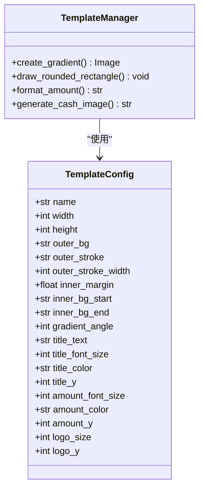

**图表来源**
- [config.py:85-149](file://src/config.py#L85-L149)
- [generator.py:145-346](file://src/generator.py#L145-L346)

### 模板参数配置

#### 基础尺寸配置
- `width` 和 `height`: 模板的基础尺寸
- `inner_margin`: 内边距设置
- `logo_size`: 标识图标大小

#### 视觉效果配置
- `outer_bg`: 外层背景色
- `outer_stroke`: 外层描边色
- `inner_bg_start` 和 `inner_bg_end`: 渐变起止色
- `gradient_angle`: 渐变角度

#### 文本配置
- `title_text`: 标题文本
- `title_font_size`: 标题字体大小
- `amount_font_size`: 金额字体大小
- `title_color` 和 `amount_color`: 文本颜色

### 图像元素设计

#### 渐变背景系统

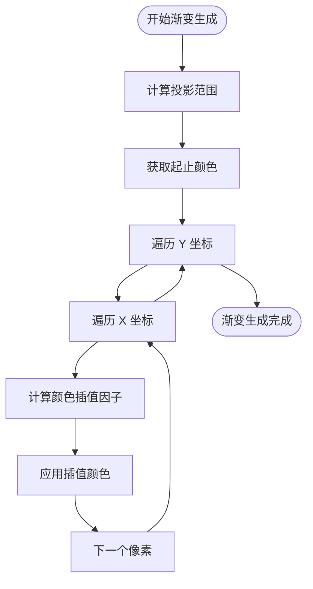

**图表来源**
- [generator.py:28-60](file://src/generator.py#L28-L60)

#### 圆角矩形绘制

系统实现了精确的圆角矩形绘制算法：

```python
def draw_rounded_rectangle(draw, xy, radius, fill=None, outline=None, width=1):
    """绘制圆角矩形，包含主体填充和轮廓绘制"""
    x1, y1, x2, y2 = xy
    r = radius
    
    # 绘制主体矩形和圆角
    if fill:
        draw.rectangle([x1 + r, y1, x2 - r, y2], fill=fill)
        draw.rectangle([x1, y1 + r, x2, y2 - r], fill=fill)
        # 绘制四个圆角
        draw.pieslice([x1, y1, x1 + 2*r, y1 + 2*r], 180, 270, fill=fill)
        draw.pieslice([x2 - 2*r, y1, x2, y1 + 2*r], 270, 360, fill=fill)
        draw.pieslice([x1, y2 - 2*r, x1 + 2*r, y2], 90, 180, fill=fill)
        draw.pieslice([x2 - 2*r, y2 - 2*r, x2, y2], 0, 90, fill=fill)
    
    # 绘制轮廓
    if outline and width > 0:
        for i in range(width):
            # 绘制轮廓弧线
            draw.arc([x1 + i, y1 + i, x1 + 2*r - i, y1 + 2*r - i], 180, 270, fill=outline)
            draw.arc([x2 - 2*r + i, y1 + i, x2 - i, y1 + 2*r - i], 270, 360, fill=outline)
            draw.arc([x1 + i, y2 - 2*r + i, x1 + 2*r - i, y2 - i], 90, 180, fill=outline)
            draw.arc([x2 - 2*r + i, y2 - 2*r + i, x2 - i, y2 - i], 0, 90, fill=outline)
            # 绘制轮廓直线
            draw.line([x1 + r, y1 + i, x2 - r, y1 + i], fill=outline)
            draw.line([x1 + r, y2 - i, x2 - r, y2 - i], fill=outline)
            draw.line([x1 + i, y1 + r, x1 + i, y2 - r], fill=outline)
            draw.line([x2 - i, y1 + r, x2 - i, y2 - r], fill=outline)
```

### 样式定制指南

#### 颜色系统

系统支持十六进制颜色值转换为 RGB 格式：

```python
def hex_to_rgb(hex_color):
    """将十六进制颜色转换为 RGB 元组"""
    hex_color = hex_color.lstrip('#')
    return tuple(int(hex_color[i:i+2], 16) for i in (0, 2, 4))
```

#### 字体管理

系统具备智能字体回退机制：

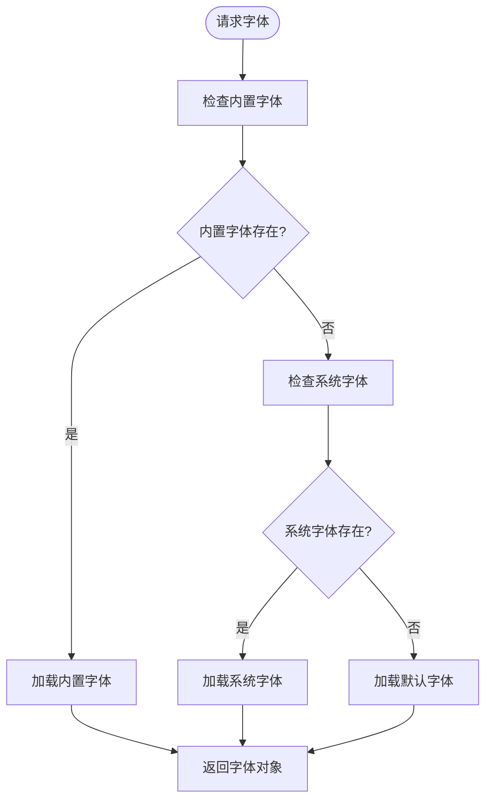

**图表来源**
- [generator.py:91-114](file://src/generator.py#L91-L114)
- [generate.py:73-89](file://src/generate.py#L73-L89)

**章节来源**
- [config.py:85-178](file://src/config.py#L85-L178)
- [generator.py:14-115](file://src/generator.py#L14-L115)
- [generate.py:73-121](file://src/generate.py#L73-L121)

## 性能优化策略

### 内存管理优化

#### 图像处理优化

系统采用了多种内存优化技术：

```python
def nine_patch_resize(img, target_w, target_h, stretch_x_start=30, stretch_x_end=230, stretch_y_start=30, stretch_y_end=230):
    """
    9-patch 缩放：拉伸中心区域，保留角落
    使用分块处理减少内存峰值
    """
    # 计算可拉伸中心尺寸
    left_w = stretch_x_start
    right_w = orig_w - stretch_x_end
    top_h = stretch_y_start
    bottom_h = orig_h - stretch_y_end
    mid_w_orig = stretch_x_end - stretch_x_start
    mid_h_orig = stretch_y_end - stretch_y_start

    new_mid_w = target_w - left_w - right_w
    new_mid_h = target_h - top_h - bottom_h

    # 确保最小尺寸
    if new_mid_w < 1:
        new_mid_w = 1
    if new_mid_h < 1:
        new_mid_h = 1

    # 分别处理 9 个区域，避免一次性创建大图像
    regions = []
    for i, crop_func in enumerate([
        lambda: img.crop((0, 0, stretch_x_start, stretch_y_start)),      # 左上
        lambda: img.crop((stretch_x_start, 0, stretch_x_end, stretch_y_start)),   # 上中
        lambda: img.crop((stretch_x_end, 0, orig_w, stretch_y_start)),      # 右上
        lambda: img.crop((0, stretch_y_start, stretch_x_start, stretch_y_end)),  # 左中
        lambda: img.crop((stretch_x_start, stretch_y_start, stretch_x_end, stretch_y_end)), # 中间
        lambda: img.crop((stretch_x_end, stretch_y_start, orig_w, stretch_y_end)),   # 右中
        lambda: img.crop((0, stretch_y_end, stretch_x_start, orig_h)),      # 左下
        lambda: img.crop((stretch_x_start, stretch_y_end, stretch_x_end, orig_h)),   # 下中
        lambda: img.crop((stretch_x_end, stretch_y_end, orig_w, orig_h))      # 右下
    ]):
        regions.append(crop_func())
    
    # 逐个缩放并组合
    resized_regions = []
    for i, region in enumerate(regions):
        if i == 4:  # 中心区域
            resized_regions.append(region.resize((new_mid_w, new_mid_h), Image.LANCZOS))
        elif i in [1, 3, 5, 7]:  # 边缘区域
            resized_regions.append(region.resize(...))
        else:  # 角落区域
            resized_regions.append(region.resize(...))
    
    # 组合最终图像
    new_img = Image.new("RGBA", (target_w, target_h))
    # 重新粘贴各区域...
```

#### 批量处理优化

```python
def batch_generate_coupons(config_list, output_dir):
    """
    批量生成优惠券，优化内存使用
    """
    results = []
    
    # 分批处理，避免内存峰值
    batch_size = 10
    for i in range(0, len(config_list), batch_size):
        batch = config_list[i:i + batch_size]
        
        # 处理当前批次
        for config in batch:
            try:
                result = generate_cash_image(**config)
                results.append(result)
            except Exception as e:
                print(f"生成失败 {config}: {e}")
        
        # 手动触发垃圾回收
        gc.collect()
        
        # 短暂延迟，释放系统资源
        time.sleep(0.1)
    
    return results
```

### 图像处理优化

#### 字体渲染优化

系统实现了智能字体回退机制，确保特殊字符的正确渲染：

```python
def load_font_for_text(size, text, font_name=FONT_BOLD):
    """加载能够正确渲染给定文本的字体
    对于包含特殊货币符号的文本使用系统字体回退"""
    # 已知在内置字体中存在问题的字符
    special_chars = {"₫", "฿", "₱", "₫"}
    if special_chars.intersection(text):
        # 对于包含特殊字符的文本，使用系统字体
        return load_system_font(size)
    return load_font(size, font_name)
```

#### 文本测量优化

```python
def get_text_bbox(draw, text, font):
    """获取文本边界框，使用更高效的计算方法"""
    # 使用 PIL 内置的 textbbox 方法
    bbox = draw.textbbox((0, 0), text, font=font)
    return bbox[2] - bbox[0], bbox[3] - bbox[1]
```

### 导出设置优化

系统支持多种导出格式和质量设置：

```python
# 支持的导出格式
EXPORT_FORMATS = ["PNG", "JPG"]

# 默认导出设置
DEFAULT_FORMAT = "PNG"
DEFAULT_QUALITY = 95

# JPEG 质量设置
def export_jpeg(image, path, quality=95):
    """优化 JPEG 导出质量"""
    # 使用高质量重采样
    image = image.resize((image.width, image.height), Image.LANCZOS)
    image.save(path, "JPEG", quality=quality, optimize=True)
```

**章节来源**
- [generate.py:155-214](file://src/generate.py#L155-L214)
- [generator.py:28-60](file://src/generator.py#L28-L60)
- [generate.py:112-121](file://src/generate.py#L112-L121)

## 插件系统与扩展机制

### 扩展架构设计

系统采用插件化的架构设计，支持动态扩展：

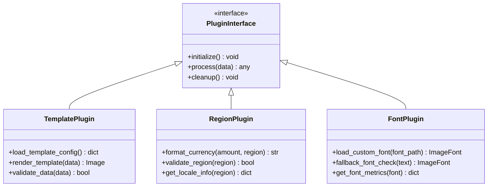

### 插件开发规范

#### 模板插件开发

```python
class CustomTemplatePlugin:
    """自定义模板插件示例"""
    
    def __init__(self, template_config):
        self.config = template_config
        self.font_manager = FontManager()
        self.color_converter = ColorConverter()
    
    def initialize(self):
        """初始化插件"""
        # 加载自定义字体
        self.custom_font = self.font_manager.load_custom_font(
            self.config.get('custom_font_path')
        )
        
        # 验证配置
        self.validate_config()
    
    def process(self, data):
        """处理数据生成图像"""
        # 创建画布
        canvas = self.create_canvas()
        
        # 绘制背景
        self.draw_background(canvas)
        
        # 绘制内容
        self.draw_content(canvas, data)
        
        # 应用特效
        self.apply_effects(canvas)
        
        return canvas
    
    def cleanup(self):
        """清理资源"""
        del self.custom_font
        self.custom_font = None
```

#### 区域插件开发

```python
class RegionalFormattingPlugin:
    """区域格式化插件"""
    
    def __init__(self, region_config):
        self.region_config = region_config
    
    def format_currency(self, amount, region_code):
        """格式化货币"""
        region = self.region_config.get(region_code)
        if not region:
            raise ValueError(f"未知区域代码: {region_code}")
        
        # 获取区域特定设置
        currency = region['currency']
        position = region['currency_position']
        locale = region['locale']
        
        # 格式化数值
        formatted_amount = self.format_number(amount, region_code)
        
        # 组合货币字符串
        if position == 'prefix':
            return f"{currency}{formatted_amount}"
        else:
            return f"{formatted_amount} {currency}"
    
    def format_number(self, amount, region_code):
        """格式化数字"""
        # 区域特定的数字格式化逻辑
        if region_code in ['ID', 'VN']:
            # 使用千位分隔符
            return f"{amount:,.0f}".replace(',', '.')
        else:
            return str(amount)
```

### 扩展机制实现

#### 动态加载机制

```python
class ExtensionManager:
    """扩展管理器"""
    
    def __init__(self):
        self.plugins = {}
        self.loaded_plugins = []
    
    def register_plugin(self, plugin_type, plugin_name, plugin_class):
        """注册插件"""
        if plugin_type not in self.plugins:
            self.plugins[plugin_type] = {}
        
        self.plugins[plugin_type][plugin_name] = plugin_class
    
    def load_plugin(self, plugin_type, plugin_name):
        """动态加载插件"""
        if plugin_type in self.plugins and plugin_name in self.plugins[plugin_type]:
            plugin_class = self.plugins[plugin_type][plugin_name]
            plugin_instance = plugin_class()
            plugin_instance.initialize()
            self.loaded_plugins.append(plugin_instance)
            return plugin_instance
        
        raise ValueError(f"插件未找到: {plugin_type}/{plugin_name}")
    
    def unload_plugin(self, plugin_instance):
        """卸载插件"""
        if plugin_instance in self.loaded_plugins:
            plugin_instance.cleanup()
            self.loaded_plugins.remove(plugin_instance)
```

**章节来源**
- [config.py:1-178](file://src/config.py#L1-L178)
- [generator.py:145-346](file://src/generator.py#L145-L346)

## 高级配置技巧

### 环境变量配置

系统支持通过环境变量进行配置：

```python
import os

# 从环境变量读取配置
BASE_DIR = os.getenv('ASSETS_BASE_DIR', '/default/path')
DEBUG_MODE = os.getenv('DEBUG_MODE', 'False').lower() == 'true'
MAX_WORKERS = int(os.getenv('MAX_WORKERS', '4'))
```

### 配置文件管理

```python
class ConfigManager:
    """配置管理器"""
    
    def __init__(self, config_file=None):
        self.config_file = config_file or self.get_default_config_path()
        self.config_data = self.load_config()
    
    def load_config(self):
        """加载配置文件"""
        if os.path.exists(self.config_file):
            with open(self.config_file, 'r') as f:
                return json.load(f)
        return self.get_default_config()
    
    def get_default_config(self):
        """获取默认配置"""
        return {
            'regions': self.load_default_regions(),
            'templates': self.load_default_templates(),
            'export_settings': {
                'formats': ['PNG', 'JPG'],
                'default_format': 'PNG',
                'quality': 95
            }
        }
    
    def update_config(self, key, value):
        """更新配置"""
        self.config_data[key] = value
        self.save_config()
    
    def save_config(self):
        """保存配置到文件"""
        with open(self.config_file, 'w') as f:
            json.dump(self.config_data, f, indent=2)
```

### 日志配置

```python
import logging

# 配置日志系统
logging.basicConfig(
    level=logging.INFO,
    format='%(asctime)s - %(name)s - %(levelname)s - %(message)s',
    handlers=[
        logging.FileHandler('cash_generator.log'),
        logging.StreamHandler()
    ]
)

logger = logging.getLogger('CashGenerator')

def log_generation_process(region, amount, template):
    """记录生成过程"""
    logger.info(f"开始生成 {region} 区域 {amount} 金额的 {template} 模板")
```

### 性能监控

```python
import time
from functools import wraps

def monitor_performance(func):
    """性能监控装饰器"""
    @wraps(func)
    def wrapper(*args, **kwargs):
        start_time = time.time()
        start_memory = psutil.Process().memory_info().rss
        
        try:
            result = func(*args, **kwargs)
            return result
        finally:
            end_time = time.time()
            end_memory = psutil.Process().memory_info().rss
            
            execution_time = end_time - start_time
            memory_used = end_memory - start_memory
            
            logger.info(f"{func.__name__}: 执行时间={execution_time:.2f}s, "
                       f"内存使用={memory_used/1024/1024:.2f}MB")
    
    return wrapper

@monitor_performance
def generate_cash_image_optimized(...):
    """优化的图像生成函数"""
    # 实现细节
    pass
```

**章节来源**
- [config.py:1-178](file://src/config.py#L1-L178)
- [main.py:18-106](file://src/main.py#L18-L106)

## 故障排除指南

### 常见问题诊断

#### 字体加载问题

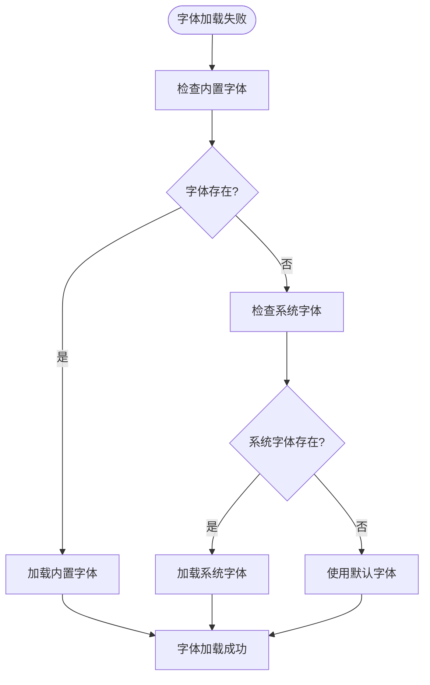

**图表来源**
- [generator.py:91-114](file://src/generator.py#L91-L114)
- [generate.py:73-89](file://src/generate.py#L73-L89)

#### 图像生成错误

```python
def debug_image_generation(region, amount, template):
    """调试图像生成过程"""
    try:
        # 验证输入参数
        assert region in REGIONS, f"无效区域: {region}"
        assert isinstance(amount, (int, float)), f"无效金额类型: {type(amount)}"
        assert template in TEMPLATES, f"无效模板: {template}"
        
        # 检查资源文件
        template_path = resource_path("templates", "template_base.png")
        logo_path = resource_path("logos", f"logo_{region}.png")
        
        assert os.path.exists(template_path), f"模板文件不存在: {template_path}"
        assert os.path.exists(logo_path), f"Logo 文件不存在: {logo_path}"
        
        # 执行生成
        result = generate_cash_image(region, amount, template)
        return result
        
    except AssertionError as e:
        print(f"参数验证失败: {e}")
        return None
    except Exception as e:
        print(f"生成过程中发生错误: {e}")
        # 记录详细的错误信息
        import traceback
        traceback.print_exc()
        return None
```

#### 内存泄漏检测

```python
import gc
import psutil
from threading import Timer

class MemoryMonitor:
    """内存监控器"""
    
    def __init__(self):
        self.process = psutil.Process()
        self.monitoring = False
        self.timer = None
    
    def start_monitoring(self, interval=60):
        """开始内存监控"""
        self.monitoring = True
        self._check_memory()
    
    def stop_monitoring(self):
        """停止内存监控"""
        self.monitoring = False
        if self.timer:
            self.timer.cancel()
    
    def _check_memory(self):
        """检查内存使用情况"""
        if not self.monitoring:
            return
        
        memory_usage = self.process.memory_info().rss / 1024 / 1024  # MB
        print(f"当前内存使用: {memory_usage:.2f} MB")
        
        # 如果内存使用过高，触发垃圾回收
        if memory_usage > 100:  # 100MB 阈值
            print("内存使用过高，触发垃圾回收...")
            gc.collect()
        
        # 继续监控
        if self.monitoring:
            self.timer = Timer(60, self._check_memory)
            self.timer.start()
```

### 错误处理最佳实践

#### 异常分类处理

```python
class CashGeneratorError(Exception):
    """基础异常类"""
    pass

class FontLoadError(CashGeneratorError):
    """字体加载异常"""
    pass

class ResourceNotFoundError(CashGeneratorError):
    """资源文件未找到异常"""
    pass

class TemplateValidationError(CashGeneratorError):
    """模板验证异常"""
    pass

def robust_font_loading(size, font_name=FONT_BOLD):
    """健壮的字体加载函数"""
    try:
        # 尝试加载内置字体
        font_path = resource_path("fonts", font_name)
        if os.path.exists(font_path):
            return ImageFont.truetype(font_path, size)
    except Exception as e:
        print(f"内置字体加载失败: {e}")
    
    try:
        # 尝试加载系统字体
        font_path = resource_path("fonts", FONT_ROBOTO_BLACK)
        if os.path.exists(font_path):
            return ImageFont.truetype(font_path, size)
    except Exception as e:
        print(f"系统字体加载失败: {e}")
    
    # 最后使用默认字体
    print("使用默认字体")
    return ImageFont.load_default()
```

#### 资源清理机制

```python
class ResourceManager:
    """资源管理器"""
    
    def __init__(self):
        self.resources = []
        self.max_resources = 100
    
    def register_resource(self, resource):
        """注册资源"""
        self.resources.append(resource)
        
        # 如果资源过多，自动清理
        if len(self.resources) > self.max_resources:
            self.cleanup_old_resources()
    
    def cleanup_old_resources(self):
        """清理旧资源"""
        # 清理最旧的 20% 资源
        cleanup_count = int(len(self.resources) * 0.2)
        for i in range(cleanup_count):
            if self.resources:
                resource = self.resources.pop(0)
                if hasattr(resource, 'close'):
                    resource.close()
                elif hasattr(resource, '__del__'):
                    del resource
    
    def cleanup_all(self):
        """清理所有资源"""
        for resource in self.resources:
            try:
                if hasattr(resource, 'close'):
                    resource.close()
            except:
                pass
        self.resources.clear()
```

**章节来源**
- [generate.py:112-121](file://src/generate.py#L112-L121)
- [generator.py:91-114](file://src/generator.py#L91-L114)

## 结论

Cash Generator 提供了一个功能完整、易于扩展的多地区优惠券生成解决方案。通过模块化的架构设计和丰富的配置选项，开发者可以轻松地添加新的区域支持、自定义模板样式，并实现高性能的批量处理。

### 主要优势

1. **多平台支持**: 同时支持 PyQt5 和 Tkinter 界面
2. **灵活的配置系统**: 基于配置驱动的设计，易于扩展
3. **高性能优化**: 采用多种内存管理和图像处理优化技术
4. **国际化支持**: 完善的多语言和多货币格式化
5. **插件化架构**: 支持动态扩展和定制

### 最佳实践建议

1. **模板设计**: 使用统一的视觉规范和响应式布局
2. **性能监控**: 定期监控内存使用和执行时间
3. **错误处理**: 实现完善的异常处理和日志记录
4. **资源管理**: 及时清理不再使用的资源
5. **测试覆盖**: 为新功能编写充分的单元测试

通过遵循这些指导原则，开发者可以充分利用 Cash Generator 的扩展能力，构建符合特定业务需求的定制化解决方案。